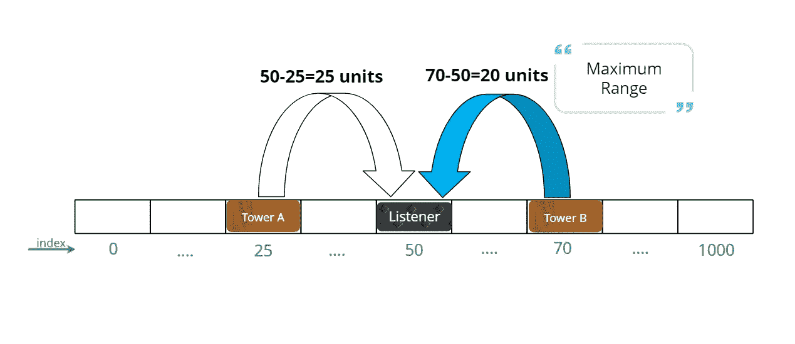
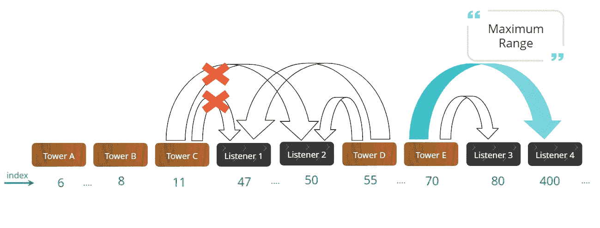

# 如何解决监听器和塔的问题:一个完整的算法与代码。

> 原文：<https://medium.com/analytics-vidhya/listeners-and-towers-problem-a-complete-algorithm-with-code-a1706f816d47?source=collection_archive---------5----------------------->

**问题陈述:**

你是 WSPT 电台的技术总监，为全国听众服务。为了简单起见，我们可以认为每个听众生活在一条从`0`(西方)延伸到`1000`(东方)的水平线上。

给定一个`N`听众列表和一个`M`无线电发射塔列表，每一个都放置在这条线上的不同位置，确定最小广播范围是多少，以便覆盖每个听众的家。

例如，假设`listeners = [1, 5, 11, 20]`，和`towers = [4, 8, 15]`。在这种情况下，最小范围将是`5`，因为位置`15`处的塔需要达到位置`20`处的收听者

**说明:**

1.  **考虑第一个简单的例子，其中只有一个听众，两边各有一座塔。**

示例 1

A)如上图所示，A 塔和 B 塔都可以覆盖听者。塔 A 在收听者的 25 个单位范围内，塔 B 在 20 个单位范围内。

b)这里要注意的一点是不需要塔 a。因为听众已经被最近的塔 b 覆盖。因此塔的最大范围需要 20 个单位。

**2。考虑另一个由几个监听器和塔组成的场景。**

示例 2

a)在上图中，收听者 1 被最近的塔 C 和 D 覆盖。但是，塔 D 和收听者 1 之间的距离是 8 个单位，小于塔 C 和收听者 1 之间的距离 36 个单位。因此，塔 D 可以覆盖收听者 1，并且收听者 1 不需要塔 C。

b)类似地，收听者 2 被 5 个单位之外的最近的塔 D 覆盖。

c)收听者 3 被 10 个单位之外的最近的塔 E 覆盖。

d)收听者 4 被 330 个单位之外的最近的塔 E 覆盖。

e)这里注意，塔 A、B、C 不需要覆盖任何收听者。只有塔 D 和 E 足以覆盖所有的听众。此外，在所有情况中，收听者 4 需要被最近的塔 E 覆盖，该塔 E 在 330 个单位之外，并且是塔所需的最大范围。

**3。因此，对于每个听众，我们应该找到最近的塔，要么在它的右边，要么在它的左边。**

**4。计算收听者和它最近的塔之间的距离。**

**5。最终找出所有这些距离中的最大值。**

**算法:**

**时间复杂度:O(m+n)**

其中 m 是收听者的数量，n 是塔的数量。

a)我们开始一次遍历侦听器和塔阵列，并在到达侦听器阵列的末尾时停止。

b)对于监听器数组中的每个值，我们比较它在左塔和右塔之间的距离。

c)我们取从上述步骤中获得的最小值，并将其与目前找到的最大值进行比较。如果当前值大于目前找到的最大值，则用当前值替换最大值。

d)为简单起见，我们从左边的塔开始作为整数。最小值和右塔作为塔数组中的第一个元素。

e)如果我们到达塔阵列的末尾，并且监听器阵列仍然具有元素，那么我们将左边的塔作为塔阵列中的最后一个元素，将右边的塔作为整数。MAX_VALUE。

**代码(JAVA)**

完全解