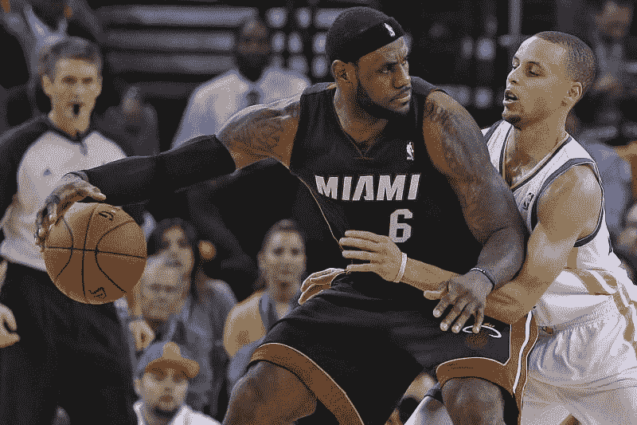

# 你不知道的鲜为人知的 NBA 冠军趋势

> 原文：<https://medium.com/analytics-vidhya/little-known-trends-in-nba-champions-you-didnt-know-about-5f0ebcb69106?source=collection_archive---------18----------------------->

## 深入探究 NBA 历史，发现新趋势

在冠状病毒疫情关闭联盟几个月后，NBA 已经全面回归季后赛。这些季后赛将是一个时代的赢家可能被称为“电晕冠军”(朗朗上口，不是吗？).说到赢家，这些季后赛是第一次没有一个明确的冠军热门。

在金州勇士队长达五年的统治性比赛之后，这些季后赛没有什么大热门。当然，洛杉矶湖人队和洛杉矶快船队是最大的竞争者。然而，在目前的情况下，其他球队如密尔沃基雄鹿队、波士顿凯尔特人队、休斯顿火箭队、迈阿密热火队和卫冕冠军多伦多猛龙队也有机会赢得这一切。

勒布朗·詹姆斯和科怀·伦纳德期待带领他们的球队赢得冠军

这让我思考——考虑到每个竞争者的不同阵容，历史上球队需要什么类型的球员来赢得总冠军？这些年来冠军球队有多强？一个明星球员需要打什么位置才能让球队有更大的胜算？这些是我在这里试图回答的一些问题。

# 入门指南

> “一个人可能是团队中至关重要的组成部分，但一个人无法组成一个团队”——卡里姆·阿布杜尔·贾巴尔

卡里姆说得很有道理，但是球队*需要超级明星来赢得冠军。我决定看看球员每个赛季获得的奖项，以了解一个球员是否是明星。*

*我选择跟踪的奖项有:*

*   ***MVP** —最有价值球员。*
*   *NBA 最佳球员名单 —那个赛季的 15 名最佳球员。*
*   *DPOY —年度最佳防守球员*
*   ***全防守** —那个赛季的十大最佳防守球员。*
*   ***全明星**——一般是每个赛季最好的 20-25 名球员。*
*   *6 moy——年度第六人。*
*   ***MIP** —进步最多的玩家。*
*   *ROTY——年度最佳新秀。*

*通过知道一个运动员是否赢得了一个奖项，我知道这个运动员是否是一个超级明星。我用这个公式创造了一个“ ***玩家得分*** ”:*

> ***球员得分=MVP +全明星+ DPOY +全明星+ 6MOY + MIP +ROTY***

*在收集了自 1980 年以来的每个冠军花名册后，我记录了一名球员在冠军赛季之前或期间赢得了哪些奖项。如果一个玩家赢得了一个奖项，我会把它算作“1”，否则就是“0”。*

*只在冠军赛季 之前或期间 ***统计奖项的原因很简单。我举个例子解释一下:****

*科比·布莱恩特在他的第四个赛季赢得了一个冠军。当时，他仍在成长为他后来成为的超级巨星。如果我们考虑他的整个职业生涯的成就，这将提供一个冠军的实力扭曲的图片。*

*将所有玩家的分数相加，我们得到了“***”***的冠军分数。这也让我们了解了一个团队是如何“堆叠”的。*

*分析这些数据后，我发现了一些有趣的东西。让我们看看他们，好吗？*

# *这些年来冠军的实力有怎样的变化？*

*80 年代和 90 年代的一些有趣的东西:*

**

*1980-1999 年冠军得分的变化*

*   *80 年代仍然是超级球队的巅峰。由拉里·伯德率领的凯尔特人队和魔术师约翰逊率领的湖人队都是 40 支总冠军球队中得分最高的。这两支球队也在 9 年内赢得了 8 个冠军，展示了超级巨星获得奖杯的影响力。*
*   *1986 年的波士顿凯尔特人队是这 40 年来赢得冠军最多的球队。*

**

*波士顿和洛杉矶在他们的超级巨星带领下，在整个 80 年代一直不和*

*   *NBA 球迷还记得一个叫迈克尔·乔丹的人是如何在 90 年代横行霸道的。有趣的是，他的球队并不像 80 年代的球队那样星光熠熠！！*

**

*有时候，你需要的只是一个男人。*

*在 2000 年代和 2010 年代，我们看到了一些有趣的东西:*

**

*2000 年至 2019 年冠军得分的变化*

*   *2000 年是冠军球队得分最低的一年。这是 2004 年的底特律活塞队，最出名的是他们是唯一一支没有超级巨星的冠军球队。活塞队证明了一个没有超级巨星和优秀化学物质的强大球队也可以(尽管很少)赢得冠军。*

**

*2004 年的活塞在没有任何超级巨星的情况下赢得了冠军*

*   *在 2010 年的大部分时间里，两个不同的王朝——迈阿密热火队和金州勇士队在联盟中横行霸道。不足为奇的是，他们的团队也是历史上最“堆叠”的团队。*

**

*热火和勇士是有史以来最具统治力的球队。*

# *这些年来职位的价值发生了怎样的变化？*

*篮球有五个位置。但是，为了便于分析，我将它们简化为三种:*

*   ***后卫**——球队中主要的控球者/地板将军(比如斯蒂芬·库里、魔术师约翰逊)*
*   *比后卫高，但比大个子矮，他们能得分、控球、抢篮板和防守(想想勒布朗·詹姆斯、迈克尔·乔丹)*
*   ***大个子**——一个团队中最高的球员。他们主要在篮下活动(像沙奎尔·奥尼尔、邓肯)*

*一般来说，一个简单的方法来确定冠军球队中最好的球员就是赢得总决赛 MVP 的球员。让我们看看这几十年来哪些位置获得了最多的总决赛 MVP。*

**

*跨位置的总决赛 MVP 获胜次数*

*让我们仔细看看，好吗？*

*   *Wings 几乎总是冠军球队中最好的球员。*
*   *在这十年中，Wings 赢得了荒谬的 10 个总决赛 MVP 中的 9 个*

**

*勒布朗·詹姆斯、凯文·杜兰特和科怀·伦纳德在这十年里赢得了 10 个总决赛 MVP 中的 7 个*

*   *在 90 年代和 00 年代，大个子一直是冠军球队中的最佳球员，但从那以后就下降了。*
*   *除了上世纪 80 年代和本世纪初的几年，这个奖项大多与警卫无缘。*

*然而，仅仅关注最佳球员并不能让我们了解球队中的其他超级巨星是谁。所以我看了几十年来各个岗位的分数。*

**

*不同位置的玩家得分*

*现在，这给了我们更多的背景:*

*   *尽管没有赢得总决赛 MVP，大个子从 80 年代就统治了冠军球队，他们的重要性在 2000 年代达到顶峰。它们的价值在 10 年代已经下降，但是它们仍然是有价值的。*

**

*蒂姆·邓肯和沙奎尔·奥尼尔主宰了 2000 年的大部分时间*

*   *在 80 年代和 90 年代，边锋是冠军球队的重要贡献者。在经历了 00 年代的短暂下滑后，他们已经大幅反弹，成为当前 NBA 最有价值的位置。*
*   *历史上，冠军球队并不太依赖后卫。然而，这十年来，它们的重要性增加了很多。*

**

*斯蒂芬·库里和凯里·欧文是他们球队夺冠的关键球员*

# *外卖食品*

*从历史上看，球队确实依靠巨星赢得冠军。现代超级球队，如**金州勇士队**和**迈阿密热火队**遵循的原则与 20 世纪 80 年代的**波士顿凯尔特人队**和**洛杉矶湖人队**遵循的原则相同——说到超级明星，人越多越好。*

*然而，也有可能只用一个超越的玩家就赢了。20 世纪 90 年代的芝加哥公牛队**和 21 世纪初的圣安东尼奥马刺队**证明了这一点。*****

*超级明星所处的位置也对球队的胜算有很大影响。在很长一段时间里，仅仅有一个超级巨星就足够了，直到这十年。*

*随着地板间距和准确的投篮在当前的 NBA 越来越有价值，**从投篮和传球到防守和篮板，无所不能的边锋是任何竞争球队的基石。***

*如果你喜欢读这篇文章，一定要喜欢并与你所有的朋友分享。*

**你认为当前 NBA 哪些球队最有机会夺冠？请在评论中告诉我你的想法。**

*如果你想联系我，请在[*LinkedIn*](https://www.linkedin.com/in/vishwak-venkatesh/)*上联系我。**