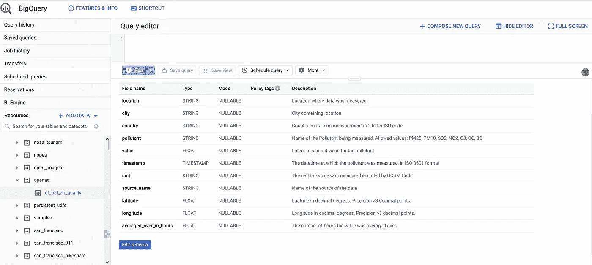

# 基于 Cron 和 R 的实时数据抽取

> 原文：<https://medium.com/analytics-vidhya/live-data-extraction-with-cron-and-r-f29324bf153e?source=collection_archive---------7----------------------->

了解如何使用 Cron 和 Docker 容器安排健壮的数据提取。



我们将要提取的 Google Big Query 上的公共实时数据集的模式

*这篇文章还发表在【https://www.r-bloggers.com/】[](https://www.r-bloggers.com/)**上。***

*这是用 R 和 Docker 构建和部署一个健壮的 API 的系列文章的第二部分，这个 API 允许您从 Google Big Query 中提取实时数据。第一部分见 [*带 R 的 Google 大查询*](/analytics-vidhya/google-big-query-with-r-875facef7844) *。关于 Docker 的简短介绍，请参阅关于构建和部署仪表板的文章系列的第二部分，* [*使用 Docker*](/analytics-vidhya/deploying-a-shiny-flexdashboard-with-docker-cca338a10d12) *部署闪亮的 Flexdashboard。**

*通过数据库查询或 API 调用定期提取数据是构建数据基础设施的重要组成部分。这使您能够轻松地复制数据源，并在一定的延迟后获得最新的数据。另一个用例是预先计算来自不断更新的源的聚合/过滤数据，以提高服务的性能。我将向您展示如何使用 Unix cron 作业来安排提取。最大限度减少陈旧数据的更高级的方法是设置一个监听器或 web 挂钩。*

*我们将从 [openAQ](https://openaq.org/#/?_k=h8s64f) 的公共大查询实时空气质量数据集中提取数据。这是一个开源项目，提供来自 5490 个全球空气质量测量站的实时数据(如果你扩展“实时”的定义)，但我们将只提取印度站的测量数据。全球空气质量数据集定期更新，但旧的条目被省略，可能是为了节省存储成本。为了保存旧的度量，我们将通过 Docker 容器中的 cron 作业设置数据提取。关于 Docker 的简短介绍以及我们为什么使用它，请看本文。关于 Google Big Query 的介绍，如何访问这个公共数据集并使用`dplyr`动词查询它，请参见本系列的第一部分， [Google Big Query with R](/analytics-vidhya/google-big-query-with-r-875facef7844) 。*

## *r 用于调度的提取脚本*

*如果数据集被更新，下面的脚本将用于提取数据。你可以在 [github repo](https://github.com/timosch29/Dockerized-Plumber-API) 项目中找到`cron/src/get_data_big_query.R`的脚本。*

## *使用 Cron 调度提取*

*Cron 是一个调度程序，已经包含在大多数现代的基于 Unix 的发行版中。所谓的 cron 作业的调度是通过 crontab 管理的。您可以通过`crontab -l`在 crontab 表中看到当前用户的 cron 作业，或者通过`crontab -e`编辑 cron 作业。以下语法用于通过五个时间参数定义执行间隔:*

```
** * * * * command to be executed
- - - - -
| | | | |
| | | | ----- Day of week (0 - 7) (Sunday=0 or 7)
| | | ------- Month (1 - 12)
| | --------- Day of month (1 - 31)
| ----------- Hour (0 - 23)
------------- Minute (0 - 59)*
```

*相反，它也可以由特殊字符串定义:*

```
*string         meaning
              ------         -------
              [@reboot](http://twitter.com/reboot)        Run once, at startup.
              [@yearly](http://twitter.com/yearly)        Run once a year, "0 0 1 1 *".
              [@annually](http://twitter.com/annually)      (same as [@yearly](http://twitter.com/yearly))
              [@monthly](http://twitter.com/monthly)       Run once a month, "0 0 1 * *".
              [@weekly](http://twitter.com/weekly)        Run once a week, "0 0 * * 0".
              [@daily](http://twitter.com/daily)         Run once a day, "0 0 * * *".
              [@midnight](http://twitter.com/midnight)      (same as [@daily](http://twitter.com/daily))
              [@hourly](http://twitter.com/hourly)        Run once an hour, "0 * * * *".*
```

*您可以在[https://crontab.guru/](https://crontab.guru/#23_0-20/2_*_*_*)查看如何设置具体的时间间隔。请注意，有各种 cron 监控工具值得一看，如[https://deadmanssnitch.com/](https://deadmanssnitch.com/)或[https://cronitor.io/](https://cronitor.io/)。*

*我们将设置用于数据提取的 cron 作业，每 12 小时在第 11 分钟运行一次 R 脚本。这是避免与任何以整小时或五分钟间隔运行的进程发生冲突的最佳做法。因为 cronjobs 是在主目录中执行的，所以第一次很容易弄错文件路径。**检查您是否有正确的文件路径**到 R，到 R 脚本，以及在 R 脚本中的依赖关系。在 cronjob 中，`>> var/log/cron.log 2>&1`将脚本输出附加到一个日志文件，并将标准错误重定向到标准输出，这样我们就有了所有打印的 R 输出以及记录的警告和错误。*

***注意:**如果您的开发不是在 Linux 中，而是在 Windows 中，请确保行尾序列是 LF，而不是 CRLF，以便它是 Linux 容器的有效 cron。*

## *构建 Dockerimage*

*这假设了 Docker 的基本知识，如果没有看到 [*用 Docker*](/analytics-vidhya/deploying-a-shiny-flexdashboard-with-docker-cca338a10d12)部署一个闪亮的 Flexdashboard。为了运行我们预定的容器化提取，我们构建了一个映像，它是通过 Dockerfile 中的[食谱构建的。我们将使用来自](https://docs.docker.com/registry/recipes/) [Dockerhub](https://hub.docker.com/r/rocker/tidyverse/dockerfile) 的 rocker/tidyverse 映像作为基础映像，并在 recipe 的顶部添加具有所需 R 库和系统依赖项的层，将包含 R 脚本和 cronjob 的目录复制到映像，最后 CMD 将启动 cron 并结束日志文件，因此输出显示在 Docker 容器日志中:*

*然后在 Dockerfile 运行`**docker build -t openaq_extraction .**`的目录中，这将从 Dockerfile 构建图像，并将其标记为 *openaq_extraction* 。*

*您可以导出图像并将容器部署在服务器或云服务上，如 [AWS](https://www.ybrikman.com/writing/2015/11/11/running-docker-aws-ground-up/) 、 [Google Cloud](https://blog.machinebox.io/deploy-docker-containers-in-google-cloud-platform-4b921c77476b) 和 [DigitalOcean](https://blog.machinebox.io/deploy-machine-box-in-digital-ocean-385265fbeafd) ，或者部署在本地。通过以下方式启动容器:*

```
*$ docker run -d \
  --restart=always \
  --name openaq_extraction_container \
  --rm \
  --mount type=bind,source=/filepath_to/openaq_extraction/shared-data,target=/src/shared-data \
   openaq_extraction*
```

*这将在分离模式下运行容器，总是在退出时重新启动并删除保存的文件系统。此外，这会将保存提取数据的目录挂载到主机上的现有源目录，如果容器停止，您需要使用该目录来保留提取的数据。*

****注意:查询开放数据集会在你的谷歌云计费账户上计费，但是你每月有 5TB 的免费查询。如果不需要数据提取，请记住停止这个 Docker 容器。此外，您还有一个秘密文件，其中包含复制到 Docker 映像的 Google Cloud 凭据。这通常是不好的做法，如果您将容器部署在其他地方作为本地机器，请使用秘密管理工具。不要在 Dockerhub 或 GitHub 上分享包含秘密的 Docker 图片！****

*现在，我们已经启动并运行了一个强大的、可共享的、可重复的计划数据提取。在项目的最后一部分，我们将在 Docker 容器网络中使用 R 构建一个 REST API，以便轻松访问正在提取的印度空气质量的永久记录。请参阅本系列文章的第三部分。*