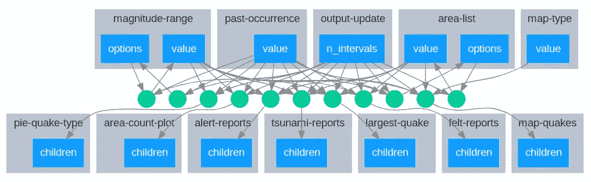
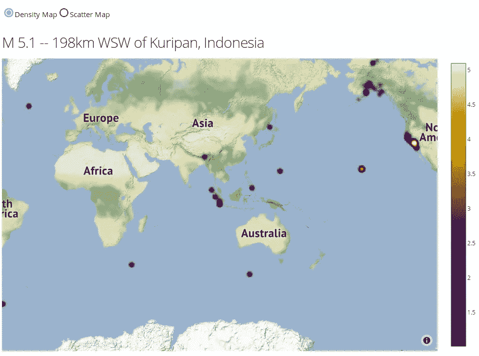
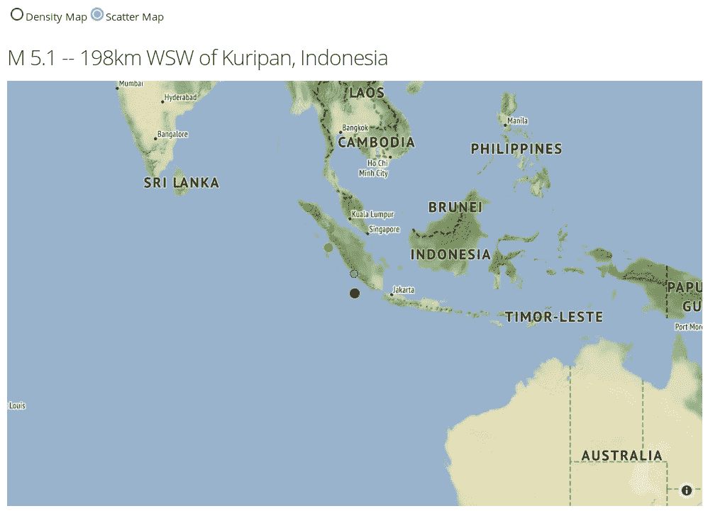
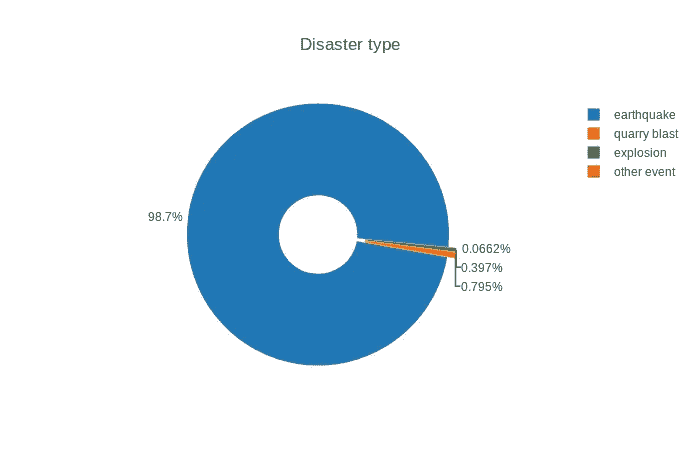
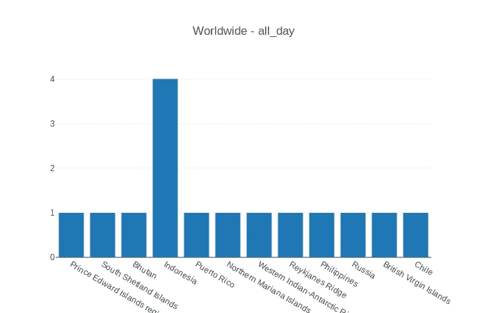

# 使用 Dash 和 Plotly 的实时地震跟踪系统。

> 原文：<https://medium.com/analytics-vidhya/live-earthquake-tracking-system-using-dash-and-plotly-858fa4fffe03?source=collection_archive---------11----------------------->

使用 USGS 数据源的实时地震跟踪系统，并在 Dash 应用程序中显示发生的事件。

## USGS 的微妙介绍


USGS(改变世界的科学)-徽标

美国地质调查局(USGS)是地质学家和科学家研究地球科学的科学机构。这包括景观、自然资源和自然灾害等。美国地质调查局的**地震灾害计划**实时收集地震数据，每分钟更新[。](https://earthquake.usgs.gov/earthquakes/feed/v1.0/csv.php)

利用这些实时数据，我开发了一个用户友好的 dash 应用程序，它可以跟踪地震，并让您查看特定地区发生的特定震级的地震。

## 程序

通过“熊猫 read_csv()”函数读取 CSV 数据。

```
import pandas as pddef GrabOccurrenceData(past_occurrence, mag_value): url = '[https://earthquake.usgs.gov/earthquakes/feed/v1.0/summary/'](https://earthquake.usgs.gov/earthquakes/feed/v1.0/summary/') + str(past_occurrence) + '.csv' qdf = pd.read_csv(url)
 qdf = qdf[qdf['mag'] > int(mag_value)] return qdf
```

这将返回一个由大于“*地震值”的地震组成的数据框。*

```
>>> qdf = GrabOccurrenceData("all_hour", 1)
>>> qdf.columns
Index(['time', 'latitude', 'longitude', 'depth', 'mag', 'magType', 'nst', 'gap', 'dmin', 'rms', 'net', 'id', 'updated', **'place'**, 'type', 'horizontalError', 'depthError', 'magError', 'magNst', 'status', 'locationSource', 'magSource'], dtype='object')>>> qdf['place'].to_list()
['13km E of Little Lake, CA',
 '24km E of Waukomis, Oklahoma',
 '16km SW of La Quinta, CA',
 '9km NNW of Borrego Springs, CA',
 '24km WNW of Warm Springs, Nevada',
 'South Shetland Islands']
```

如果我们注意到*“place”*列，我们会看到它有*“some _ value，region”。*我们对*“区域”*更感兴趣，因为当选择并只显示那些已经发生的地震时，我们可以根据区域来分离地震的总数。

为此，我们将使用以下函数。

```
def GrabSpecificArea(past_occurrence, mag_value):
 qdf = GrabOccurrenceData(past_occurrence, mag_value)
 places = qdf['place'].to_list() specific_areas = []
 for place in places:
  area = place.split(', ')
  if len(area) == 2:
   specific_areas.append(area[1])
  if len(area) < 2:
   specific_areas.append(area[0]) area_counts = []
 for area in specific_areas:
  area_counts.append(area+' - '+str(specific_areas.count(area))) specific_areas = list(set(area_counts))

 return specific_areas
```

使用上述函数可以获得以下结果。

```
>>> area_list = GrabSpecificArea("all_hour", 1)
>>> area_list
['CA - 3', 
 'Oklahoma - 1', 
 'Nevada - 1', 
 'South Shetland Islands - 1']
```

现在我们已经知道了地震发生的具体区域，我们可以在 MapBox 地图上显示出来。

为了可视化地图上的区域，我们需要*“纬度”*和*“经度”。*为了实时可视化，我们必须定义一个时间间隔。因为数据每 1 分钟更新一次。我们可以设置 3 分钟的时间间隔，以便正确捕获更新的数据。

我们将导入所需的包。

```
import dash
import dash_core_components as dcc
import dash_html_components as html
from dash.dependencies import (Input, Output)
```

现在，我们将创建一个 dash 对象，并为应用程序创建布局。

```
external_scripts = ['[https://www.google-analytics.com/analytics.js'](https://www.google-analytics.com/analytics.js')]
external_stylesheets = ['[https://codepen.io/chriddyp/pen/bWLwgP.css'](https://codepen.io/chriddyp/pen/bWLwgP.css')]app = dash.Dash(__name__,
 external_scripts=external_scripts,
 external_stylesheets=external_stylesheets)
app.config['suppress_callback_exceptions'] = Trueapp.layout = html.Div([
 html.Div([
  dcc.RadioItems(
   id='map-type',
   options=[{'label':s, 'value':s} for s in ['Density Map','Scatter Map']],
   value='Density Map',
   labelStyle={'display': 'inline-block'}
  )
 ],style={'margin-left':20,'margin-top':20,'margin-bottom':10}
 ),
 **html.Div([dcc.Interval(id='output-update', interval=180*1000)])**,
 **html.Div(id='map-quakes')**,
 html.Div([
  html.Div([
   **html.Div(id='pie-quake-type')**
  ], className='five columns'),
  html.Div([
   **html.Div(id='area-count-plot')**
  ], className='seven columns')
 ], className='row', style={'margin-left' : 20, 'margin-top' : 30}), 
html.Div([])
], style={'margin-top' : 20, 'margin-bottom' : 20})
```

让我们为数据可视化创建一些辅助函数。

```
import plotly.graph_objs as go#<DensityMap>
def PlotDensityMap(lat, lon, z, radius, colorscale):
 density_map_trace = go.Densitymapbox(
   lat=lat,
   lon=lon,
   z=z,
   radius=radius,
   colorscale=colorscale,
 )
 return density_map_tracedef LayoutDensity(height, width, mapbox_style, c_lat, c_lon, zoom):
 layout_density_map = go.Layout(
  height=height,
   width=width,
   autosize=True,
   showlegend=False,
   hovermode='closest',
   margin=dict(l=0, r=0, t=0, b=0),
   mapbox_style=mapbox_style,
   mapbox_center_lat=c_lat,
   mapbox_center_lon=c_lon,
   mapbox=dict(
    zoom=zoom
   )
 )
 return layout_density_map
#</DensityMap>#<ScatterMap>
def PlotScatterMap(lat, lon, size, color, colorscale, text):
 scatter_map_trace = go.Scattermapbox(
  lat=lat,
  lon=lon,
  mode='markers',
  marker=dict(
   size=size, color=color, opacity=1,
   colorscale=colorscale,
  ),
  text=text, hoverinfo='text', showlegend=True
 )
 return scatter_map_tracedef LayoutScatter(height, width, mapbox_style, c_lat, c_lon, zoom):
 layout_scatter_map = go.Layout(
   height=height,
   width=width,
   autosize=True,
   showlegend=False,
   hovermode='closest',
   margin=dict(l=0, r=0, t=0, b=0),
   mapbox_style=mapbox_style,
   mapbox=dict(
     center=dict(
       lat=c_lat,
       lon=c_lon
     ),
     zoom=zoom
   )
 )
 return layout_scatter_map
#</ScatterMap>
```

让我们创建一个回调装饰器，通过包装来扩展函数的行为。这用于在输入值发生变化时自动触发变化。

**注意:**我在开发这个应用时使用了几个回调函数。在某些情况下，我只使用其中的一部分。然而，要熟悉这里是回调图。



回调图表

MapBox 显示地震位置的输出地图。

```
import plotly.graph_objs as go#<density_scatter_mapbox>
[@app](http://twitter.com/app).callback(
 Output('map-quakes', 'children'),
 [Input('past-occurrence', 'value'), Input('magnitude-range', 'value'), Input('map-type', 'value'), Input('area-list', 'value'), 
  Input('output-update', 'n_intervals')],
)
def visualize_quakes(past_occurrence, mag_value, map_type, specific_area, n_intervals):
 try:
  eqdf = GrabOccurrenceData(past_occurrence, mag_value)
  eqdf = eqdf[eqdf['place'].str.contains(str(specific_area.split(' - ')[0]))]
  zoom = 3
  radius = 15
  latitudes = eqdf['latitude'].to_list()
  longitudes = eqdf['longitude'].to_list()
  magnitudes = eqdf['mag'].to_list()
  mags = [float(i)*radius_multiplier['outer'] for i in magnitudes]
  mags_info = ['Magnitude : ' + str(m) for m in magnitudes]
  depths = eqdf['depth'].to_list()
  deps_info = ['Depth : ' + str(d) for d in depths]
  places = eqdf['place'].to_list() center_lat = eqdf[eqdf['mag'] == eqdf['mag'].max()['latitude'].to_list()[0]
  center_lon = eqdf[eqdf['mag'] == eqdf['mag'].max()]['longitude'].to_list()[0] if (map_type == 'Density Map'):
   map_trace = PlotDensityMap(latitudes, longitudes, magnitudes, radius, 'Electric')
   layout_map = LayoutDensity(600, 980, 'stamen-terrain', center_lat, center_lon, zoom)
   visualization = html.Div([
    dcc.Graph(
     id='density-map',
     figure={'data' : [map_trace], 'layout' : layout_map}
    ),
   ])
   return visualization if (map_type == 'Scatter Map'):
   quake_info = [places[i] + '<br>' + mags_info[i] + '<br>' + deps_info[i] for i in range(eqdf.shape[0])]
   map_trace = PlotScatterMap(latitudes, longitudes, mags, magnitudes, default_colorscale, quake_info)
   layout_map = LayoutScatter(600, 980, 'stamen-terrain', center_lat, center_lon, zoom)
   visualization = html.Div([
    dcc.Graph(
     id='scatter-map',
     figure={'data' : [map_trace], 'layout' : layout_map}
    ),
   ])
   return visualization
 except Exception as e:
  return html.Div([
   html.H6('Please select valid magnitude / region ...')
  ], style={'margin-top' : 150, 'margin-bottom' : 150, 'margin-left' : 200})
#</density_scatter_mapbox>
```

上面的回调将地图上的地震可视化。密度地图框是地震的一个很好的表现，但是我也包括了散点图框。

为了进一步可视化，我们可以使用饼图显示*【类型】*栏，使用条形图显示每个区域的地震总数。

用于显示“灾难类型”的饼图。

```
#<earthquake_type_pie>
[@app](http://twitter.com/app).callback(
 Output('pie-quake-type', 'children'), 
 [Input('past-occurrence', 'value'), Input('magnitude-range', 'value'), Input('output-update', 'n_intervals')]
)
def category_pie_chart(past_occurrence, mag_value, n_intervals):
 eqdf = GrabOccurrenceData(past_occurrence, mag_value)
 qtype = eqdf['type'].value_counts().to_frame()
 qtype.reset_index(inplace=True)
 qtype.columns = ['type', 'count']
 labels = qtype['type'].to_list()
 values = qtype['count'].to_list() pie_type = go.Pie(labels=labels, values=values, hole=0.3, pull=0.03, textposition='outside', rotation=100)
 pie_layout = go.Layout(title='Disaster type') pie_chart_type = html.Div([
  dcc.Graph(id='disaster-type', figure={'data' : [pie_type], 'layout' : pie_layout})
 ])
 return pie_chart_type
#</earthquake_type_pie>
```

显示“面积计数”的条形图。

```
#<count_area_bar>
[@app](http://twitter.com/app).callback(
 Output('area-count-plot', 'children'),
 [Input('past-occurrence', 'value'), Input('magnitude-range', 'value'), Input('output-update', 'n_intervals')]
)
def count_area_plot(past_occurrence, mag_value, n_intervals):
 counts_area = GrabSpecificArea(past_occurrence, mag_value) areas_alone = []; count_vals = []
 for area in counts_area:
  area = area.split(' - ')
  areas_alone.append(area[0])
  count_vals.append(int(area[1])) area_counter = go.Bar(x=areas_alone, y=count_vals)
 repeat_layout = go.Layout(title='Worldwide - ' + str(past_occurrence)) repetitive_areas = html.Div([
  dcc.Graph(id='area-repeat-list', figure={'data':[area_counter], 'layout' : repeat_layout})
 ])
 difficult_message = html.Div([
  html.P('Quite difficult to load the graph ...')
 ], style={'margin-top' : 150, 'margin-bottom' : 50, 'textAlign' : 'center'}) if past_occurrence == 'all_week' and mag_value < 3:
  return difficult_message
 if past_occurrence == 'all_week' and mag_value >= 3:
  return repetitive_areas
 return repetitive_areas
#</count_area_plot>
```

最后运行我们使用的应用程序

```
if __name__ == '__main__':
 app.run_server(debug=True, dev_tools_props_check=False, dev_tools_ui=False)
```

## 结果

密度图是表现地震的好方法。下面的结果显示了发生在**【昨天】**的世界各地的地震。



密度图结果

类似地，特定区域(“印度尼西亚”)的散点图结果如下所示。



印度尼西亚地震—过去 24 小时

为了显示灾难类型，我们使用了饼图。为此我考虑了**“上周”**的数据。



显示事件类型的饼图

为了显示面积计数图，我考虑了**“昨天”**的数据。



面积计数图

下面可以看到实时地震报告生成的更有效和更新的结果。

地震实时追踪— dash 应用程序

如前所述，这个应用程序是一个实时跟踪应用程序，每 3 分钟自动更新一次。我们不需要刷新页面就能注意到变化。这是 Dash 专长，有助于开发动态 web 应用程序。

## 结论

1.  在开发这个应用程序的过程中，我学到了很多东西(数据可视化、数据操作和设计等)。
2.  我也将尝试通过开发机器学习模型来增强这个项目，并预测下一次发生的情况(序列挖掘和时间序列分析)。
3.  总的来说，开发这个很有趣。谢谢大家。