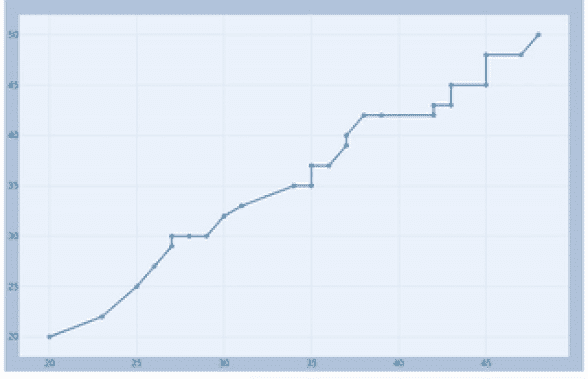

# 使用 JupyterDash 进行实时流可视化

> 原文：<https://medium.com/analytics-vidhya/live-streaming-visualization-with-jupyterdash-dded3b9c93c5?source=collection_archive---------6----------------------->

在本文中，我将解释我们如何使用由 Plotly 社区开发的名为 [jupyter-dash](https://github.com/plotly/jupyter-dash) 的包在 jupyter 笔记本中集成实时流图形。

我将在这篇文章中解释的是，我们如何更新本地 CSV 文件来读取数据，并经常可视化新的变化。时间-频率只不过是图形发生变化的间隔。如果你熟悉 dash 库，那你就太棒了。如果你不是，这将帮助你开始。

由[卢克·切瑟](https://unsplash.com/@lukechesser?utm_source=medium&utm_medium=referral)在 [Unsplash](https://unsplash.com?utm_source=medium&utm_medium=referral) 上拍摄的照片

类似于我们如何实现 dash 应用程序以在浏览器中查看结果，我们可以在笔记本的输出单元格中集成 JupyterDash 的相同方面。让我们看一个如何实现它的例子。

像 dash 一样，定义 JupyterDash 对象——我们可以这样做。

布局设计类似于我们设计 dash 应用布局的方式。

在 dash 应用程序中，为了显示结果，我们用某个回调函数包装了一个函数。在 JupyterDash 也是类似的。但是我们希望看到实时流数据的图形更新。让我们创建一个快速函数，在这个函数中，我们的虚拟 CSV 文件在本地追加新值进行更新。

现在，让我们创建回调函数来查看实时变化。

为了最终在笔记本中看到实时更新结果，我们必须以“内联”模式运行服务器。

瞧啊。现在，我们可以使用 JupyterDash 在 jupyter notebook 中创建实时流图。要了解更多关于 JupyterDash 的信息，请访问 [this](/plotly/introducing-jupyterdash-811f1f57c02e) 。