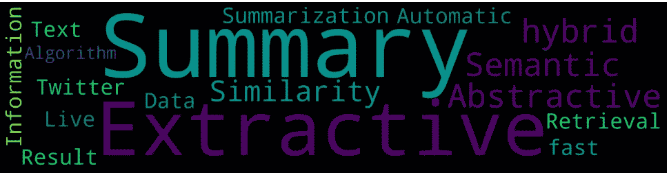
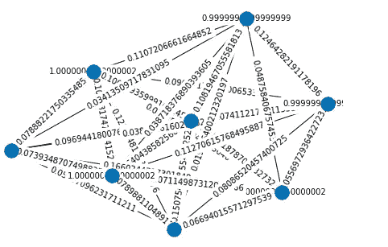
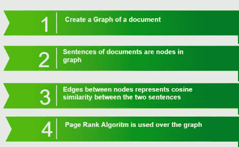
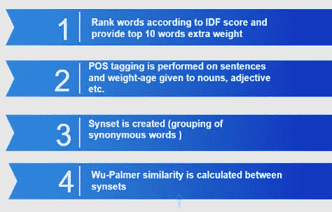
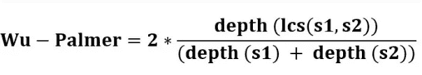
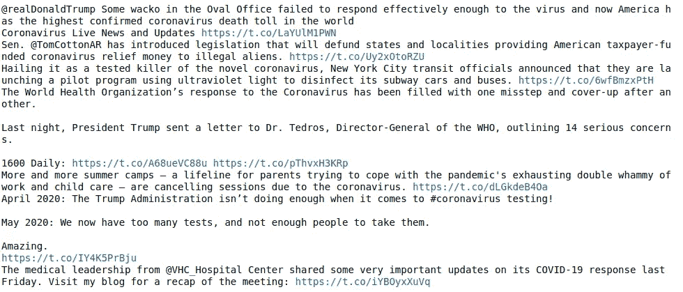
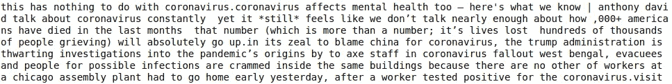
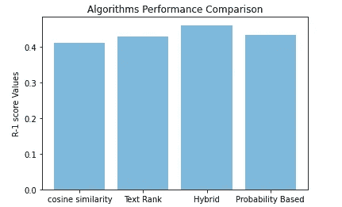
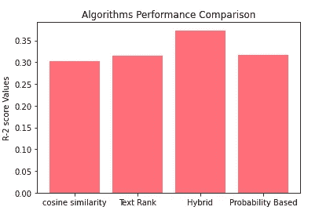

# Twitter 数据的实时摘要

> 原文：<https://medium.com/analytics-vidhya/live-summarization-on-twitter-data-11d488325ba0?source=collection_archive---------10----------------------->

# **为什么要总结？**

> 闪光的不一定都是金子，有时也很简洁！无论是书评、影评，还是在办公室会议上展示的统计数据，简明扼要的数据都会引起观众的兴趣。

微博网站 twitter 上的热门话题摘要将有助于人们在一分钟的阅读中了解周围发生的事情。所以，是的，这个问题的想法仅仅是这样构思的。

# 什么是自动文本摘要？

自动文本摘要的任务包括使用*自然语言处理*技术来生成给定数据的摘要。自动文本摘要技术进一步分为两类，即*提取摘要* & *抽象摘要*。

抽取摘要方法基于句子与文本的相似性对文本中的句子进行排序。排名靠前的句子作为摘要返回。就检索时间而言，这是很快的，但是在多域摘要生成的某些情况下，精度值可能会下降。

抽象摘要方法的不同之处在于它们试图找出单词和句子的语义上下文和隐含的含义。它涉及大量使用 NLP 和监督学习技术，因此与提取摘要相比速度较慢，但在精度方面表现良好。

# **我们是怎么做到的？**

twitter 上的数据属于*单域多文档*文本数据的类型，即几条推文共同代表对趋势中单个主题的观点。我们使用 twitter 流媒体 API *Tweepy 从 twitter 上搜集了 20 个不同主题的推文，如*“科罗诺病毒”、“一级防范”、“奥运会”*和*“加密货币”*。*

为了生成推文摘要的*基础事实*,我们在分步多次阅读推文后从文本中挑选出摘要，并从生成的摘要中删除冗余部分。

一种常用的文本摘要算法是基于谷歌网页链接排名算法的*文本排名算法*。在 Textrank 中，首先根据某种相似性度量对句子进行加权。句子之间的余弦相似性通常用于给句子赋予初始权重，并且由句子簇构建有向图，其中每个句子形成图的节点，而边是基于句子之间的相似性的句子之间的链接。

*句子的等级(u)=(1-d)/N+dσ(对于每个句子 v(等级(v) /程度(v))*

这里的“d”是阻尼参数，它决定了传送操作的概率(即跳到任何随机句子或链接的机会)。

排名背后的想法是，网络上最重要的链接是与网络上大多数其他链接相连接的。这里，在 textrank 的情况下，用句子的链接和句子之间的相似性的连接替换链接，结果是对句子进行排序的算法。

图 1:句子的加权图示例

上面解释的简单使用 Textrank 算法的问题是，它不能捕获文本的语义知识。这是因为文本中使用的单词具有潜在的含义，这些含义可以作为提取重要单词特征的基础。因此，为了优化文本排名产生的分数，我们开发了一种混合算法**,该算法使用“抽象”技术和提取技术，而不会影响提取摘要的速度。**

# ****混合算法****

> ****混合算法第一阶段:****

****

**图 2:第一阶段**

**所以基本上阶段 1 在 Textrank 算法的基础上给出句子的初始分数，其中在阻尼参数为 0.85 的情况下使用图上行走的多次迭代。**

> ****混合算法的第二阶段:****

****

**图 3:第二阶段**

**在算法的阶段 2 中，在基本的文本清理和预处理步骤(哈希去除、url 去除、句子标记化、单词标记化、解析等)之后，基于单词的 *IDF(逆文档频率)*提取文本的前 10 个特征单词，将每个句子视为唯一的文档。具有也是特征词的一部分的词的句子被给予额外的权重给它们的初始得分。**

****抽象出现的部分-****

**在下一步 **POS(词性)**中，使用 NLTK 库对文本进行标记。它基于这样的想法，即文本中的重要特征是描述讨论主题的质量方面的单词，即*名词(用于命名实体识别)*和*形容词*。具有这些特征的句子被赋予额外的权重。**

**词语之间的相似性在描述主题时也起着重要的作用。将先前提取的顶部特征单词与考虑中的句子的每个单词进行比较。 *wordnet 库*用于根据单词的不同含义生成单词的“同义词集”。然后使用 **Wu-Palmer 相似性度量**来比较生成的同素集，其中基于单词在单词的上位词树中的深度来比较单词。**

****

**图 4: WP 相似度**

**使用上述公式获得的单词之间的相似性得分被添加到句子的总得分中。**

# ****终于！****

**我们检索排名靠前的句子作为摘要。**

****样本输入:****

****

**图 5:关于冠状病毒的推文**

****样本输出:****

****

**图 6:输出**

# ****评估&结果:****

**我们使用的评估标准称为 **ROUGE** score。Rouge 代表面向回忆的替角，是广泛使用的评价摘要准确性的标准。基于所生成的概要和基本事实概要之间的不同类型的比较步骤，存在不同的 Rouge 评分变量，例如 *R-1、R-2、R-L* 。**

**我们使用基本的 Textrank 算法、基于概率的算法和基于余弦相似度的算法来比较我们的混合算法的结果。获得的一些最终结果如下所示:**

****

**图 7: R-1 分数**

****

**图 8: R-2 得分**

# ****个人贡献:****

****Mohd Zartab Ali-** 详细分析了有关自动文本摘要、数据收集、混合算法开发等主题的基础文献。**

****Dhawal Singh Pundir-** 收集数据，生成基础事实，开发基线比较模型(如文本等级)&评估。**

****Rohit Ghai-** 在生成地面实况、分析文献、开发基线模型、开发生成总结的评价模型中。**

****参考文献:****

**[1][https://medium . com/Luis fredgs/automatic-text-summary-with-machine-learning-an-overview-68de d 5717 a 25](/luisfredgs/automatic-text-summarization-with-machine-learning-an-overview-68ded5717a25)**

**[2][https://medium . com/free-code-camp/what-is-rouge-and-how-it-works-for-evaluation-of-summaries-e 059 FB 8 AC 840](/free-code-camp/what-is-rouge-and-how-it-works-for-evaluation-of-summaries-e059fb8ac840)**