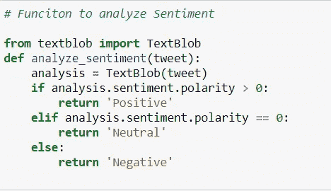
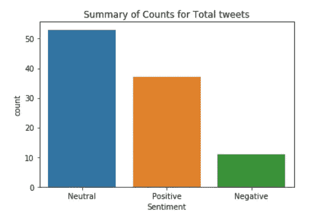

# 实时 Twitter 情绪分析(部署)

> 原文：<https://medium.com/analytics-vidhya/live-twitter-sentiment-analysis-with-deployment-e4a84f826b92?source=collection_archive---------3----------------------->

这个故事将分为 4 个部分:

1.  连接 **Twitter API** 并提取数据。
2.  对数据进行预处理，使用 **TextBlob** 进行情感分析。
3.  使用**流线型**和**烧瓶**创建一个 API。
4.  在 **Heroku 上部署项目。**

*   我们的**目标**将是创建一个 API，用户将输入一个主题，我们将在 Twitter 上搜索并提取与该主题相关的推文。
*   然后，我们将对提取的推文进行情感分析，并将其分为积极、消极和中性。
*   此外，我们将提供可视化，以便用户可以进一步分析数据。
*   这是我已经部署的项目的链接，只是为了让我们清楚我们正在朝着什么方向努力。

> 链接:[https://twitter-sentiment-analysis07.herokuapp.com/](https://twitter-sentiment-analysis07.herokuapp.com/)

> **我们要讨论的所有步骤都可以在这里的 TwitterSentimentAnalysis.ipynb 文件中找到。这里我将只介绍重要的概念，其余的只是标准的 Python 代码。**
> 
> Github 链接:[https://github.com/DarekarA/TwitterSentimentAnalysis_Public](https://github.com/DarekarA/TwitterSentimentAnalysis_Public)

# **1。连接 Twitter API 并提取数据。**

*   为此，你需要一个 Twitter 开发者账户，如果你没有的话，很容易就能得到，只需遵循以下步骤:

> 申请一个 Twitter 开发者账户。
> 
> [https://www . extly . com/docs/autotweetng _ joocial/tutorials/how-to-auto-post-from-Joomla-to-Twitter/apply-for-a-Twitter-developer-account/](https://www.extly.com/docs/autotweetng_joocial/tutorials/how-to-auto-post-from-joomla-to-twitter/apply-for-a-twitter-developer-account/)

*   一旦你得到帐户，只需创建一个虚拟应用程序，从该应用程序中，我们将获得必要的密钥和令牌，我们需要的 API。
*   **这两个步骤是**:

1.一个 [Twitter 应用](https://developer.twitter.com/en/docs/basics/developer-portal/guides/apps)可以通过 [Twitter 应用仪表板](https://developer.twitter.com/en/apps)页面用一个批准的[开发者账户](https://developer.twitter.com/en/docs/basics/developer-portal/overview)创建。

2.在 [Twitter 应用程序](https://developer.twitter.com/en/docs/basics/developer-portal/guides/apps)仪表板内应用程序“详细信息”部分的“密钥和令牌”选项卡上生成访问令牌。单击“访问令牌&访问令牌密码”部分中的“创建”按钮。

*   连接建立后，我们可以查询 Twitter Api，请求我们想要的数据。
*   我们将准备一个数据帧“df”来存储提取的数据。

使用 tweepy 获取数据。光标()

*   使用 tweepy。Cursor()我们将获取我们选择的主题的推文，每条推文都会附带一些信息，如发布推文的人的用户名、该推文的点赞/转发、用户的位置等等。
*   我们可以只使用我们感兴趣的任何属性，并将其存储在数据帧中，以便我们可以进一步处理它。

# 2.**对数据进行预处理(清洗)，使用 TextBlob 进行情感分析。**

图片来自:【https://dimensionless.in/ 

*   像任何其他项目一样，我们需要在执行任何分析之前清理数据。
*   清理阶段将是直截了当的，我们将删除任何标签，如“@，#”。我们也将删除特殊字符和任何链接。
*   所有这些都可以用一个简单的函数来完成

函数来清理所有提取的 Tweets。

*   既然数据是干净的，我们可以使用这个数据通过 **TextBlob** 来分析情绪。

*   [**TextBlob**](https://textblob.readthedocs.io/en/dev/) 是一个用于处理文本数据的大型库，然而我们目前只对 TextBlob 提供的“极性”得分感兴趣，使用它我们可以将推文分类为正面、负面或中性。
*   TextBlob 给出了一个句子的极性。极性范围为[-1，1]。
*   -**1 =负**
*   **0 =空档**
*   **1 =正**

分析情感的功能

*   一旦我们获得了情绪，我们就可以像往常一样分析数据。
*   以下是我们如何分析/可视化数据的一些示例。

总体情绪分布。

不同情绪的饼图。

我们提取的推文中最常用的词。

*   类似地，我们可以根据我们从推文中获得的观点进行许多这样的可视化和不同的分析，以了解 Twitter 上正在发生的关于我们选择的任何主题的讨论。

# 3.使用**流线**和**烧瓶**创建 API。

*   API 部分很简单，代码参考 App_Streamlit.py 即可。
*   https://github.com/DarekarA/TwitterSentimentAnalysis_Public 有这份文件和所有其他需要的文件。
*   您可以在本地运行这段代码，并在 [http://localhost:5000/](http://localhost:5000/) 进行测试
*   之后，把它上传到你的 GitHub 账户，这样它就可以在 Heroku 上部署了。

# 4.在 **Heroku 部署项目。**

*   除了我们的。py 文件，我们需要一个:

1.Procfile，2.setup.sh，3。Requirement.txt(在 CMD 中，只需键入 Pip Freeze 即可获得需求文件)。所有这些文件都可以在 GitHub 链接中找到。

*   1.更新 procfile(这是程序的起点)
    2。更新 setup.sh 文件
    3。将所有这些文件直接转储到 Github 存储库中。(不在文件夹内)
*   然后只需进入 Heroku 应用程序并链接 GitHub，选择正确的目录并部署项目。
*   就这样，你的项目就可以供所有人使用了！！！

*   希望这些步骤在部署端到端项目的过程中对你有所帮助，并且能够顺利进行。如有任何疑问，或您认为我们可以做的任何补充，请联系我！