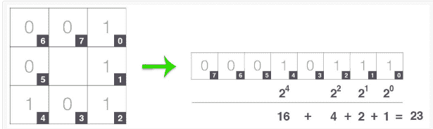
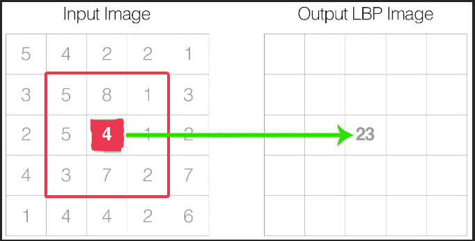
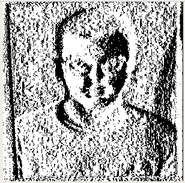

# 人脸验证中的活体检测

> 原文：<https://medium.com/analytics-vidhya/liveness-detection-in-face-verification-a30b890ef2c7?source=collection_archive---------13----------------------->

如果有人用你自己的照片进行人脸验证，获取你的手机数据怎么办？你怎么阻止这一切？

答案是**活性检测** ……

在百度工作期间，吴恩达介绍了百度的人脸验证系统。他的演示如下:

正如我们在上面两张图片中看到的，Andrew 试图使用自己的照片进入办公室，但是失败了。而只有当他自己走到面部验证系统前面时，他才能进入内部。正如我们所看到的，这台机器足够聪明，能够区分真假图像。由于活性检测，所有这些都是可能的。但是出现的问题是什么是活性检测？

# 一个**活体检测**系统意识到照片不同于真人，因此在人脸验证系统中，他们确保没有未经授权的访问被给予任何拥有授权人照片的人。

人脸识别技术是近几年发展起来的，与其他方法相比，它更直接、更友好、更方便。但是人脸识别系统容易受到非真实人脸的欺骗攻击。这是一种通过面部图片(如照片)欺骗面部识别系统的简单方法。安全系统需要活性检测，以防止诸如欺骗之类的行为。

生物识别技术是根据个人的身体或行为特征来确定个人身份的技术。现代社会对大规模身份管理系统的需求增强了生物识别技术的重要性，这些系统的功能依赖于在各种应用程序的框架上对个人身份的准确推断。

生物统计系统的可信度取决于它阻止这种欺骗攻击的能力。在这里，攻击有时可能和提供 3D 模型一样好。活体检测的主要工作是在基于频率和纹理的分析中进行的，其主要目的是在形状和细节方面区分活体和伪脸(2D 纸面具)。

作者已经实现了基于功率谱的频率分析方法，该方法利用了存在于高频区域的信息。为了分析给定人脸的纹理，实现了基于局部二值模式的描述方法。

另一种称为基于融合的提取的技术是著名的，其中作者使用 SVM 分类器和基于 LBP 的方法的向量输出来学习具有由功率谱生成的特征向量的活性。基于融合的方法通过结合由基于功率谱的特征向量训练的 SVM 分类器和由基于 LBP 的特征向量训练的 SVM 分类器的判决值来提取特征向量。

在上面提到的所有技术中，LBP 显示了最有前途的结果。

**本地二进制模式:**

首先将图像转换为其等效灰度。对于图像中的每个像素，我们决定大小为 r 的邻域。

然后为该像素计算 LBP 值，然后存储在输出 2D 矩阵中，该矩阵的大小与灰度图像的大小相同。构建 LBP 的第一步是取 8 个像素并对其进行阈值处理，以构建一组 8 个二进制数字。它的工作原理如下:

1.  以中心像素为阈值。
2.  任何大于阈值的值，将其设置为 0。
3.  否则将其设置为 1。

4.对于 8 个周围像素，我们总共有 256 种可能的 LBP 码组合。

5.从那里我们需要计算中心像素的 LBP 值。

6.我们可以从任何相邻像素开始，顺时针或逆时针工作，但我们的顺序必须对图像中的所有像素和数据中的所有图像保持一致。

7.最后一步是找出输出 LBP 数组的直方图。

8.由于 LBP 值范围从 0 到 255，因此我们构建了 256 个柱的直方图。

以下是完整 LBP 2D 阵列的示例:

真实图像:

假图像:

在这里，我们可以看到真实和虚假图像之间的纹理差异水平。真实图像由于其三维特征而具有更大的深度，而伪图像是普通的 2D 图片，因此在纹理上缺少 3D 图像的必要细节。这种原始 LBP 的主要好处是我们可以捕捉小尺度的细节。然而缺点是我们不能捕捉不同尺度的细节。为了解决这个问题，我们依赖于具有 p 个点的循环邻域的概念。半径 r 保证了我们有不同的尺度。为了保持 LBP 的一致性，我们最多有两个 0-1 或 1-0 跃迁。获得的纹理然后用于训练分类器网络。

**其他值得注意的活性检测方法:**

*可变聚焦*:在这种方法中，我们通过在不同焦点连续拍摄的两幅图像之间聚焦来利用像素值的变化。我们研究了当从每个受试者身上采集两个聚焦图像时，真实和虚假人脸之间聚焦值的差异。我们注意到，在真实图像的情况下，焦点值的差异是巨大的，而在印刷副本的不同焦点之间几乎没有变化，因为它们不是实心的。

*基于眼睛运动的分析*:该技术基于眼睛的运动。注意到每个眼睛区域的变化。基本假设是，由于人眼瞳孔的眨眼和不受控制的运动，形状会有很大的变化。

*光流场*:研究 2D 和 3D 物体产生的光流。平移、旋转、移动和摆动。

*眨眼动作*:真实人脸表现出多变且持续的眨眼，可以作为欺骗检测的一个因素。

*基于组件的描述符*:这里我们定位一张脸的组件。对所有组件的低级特征进行编码。通过将代码与权重合并来导出高级表示。由于分辨率有限，假面会变得模糊

**参考文献**

[1] Saptarshi Chakraborty，Dhrubajyoti Das。活性检测综述。

[2][https://www . pyimagesearch . com/2015/12/07/local-binary-patterns-with-python-opencv/](https://www.pyimagesearch.com/2015/12/07/local-binary-patterns-with-python-opencv/)