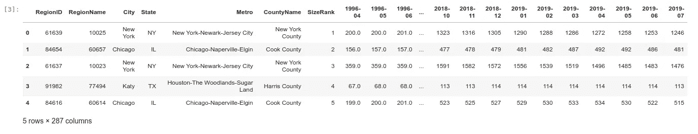
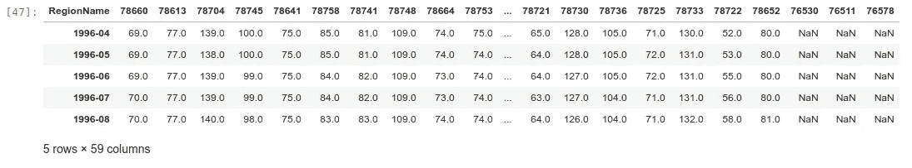
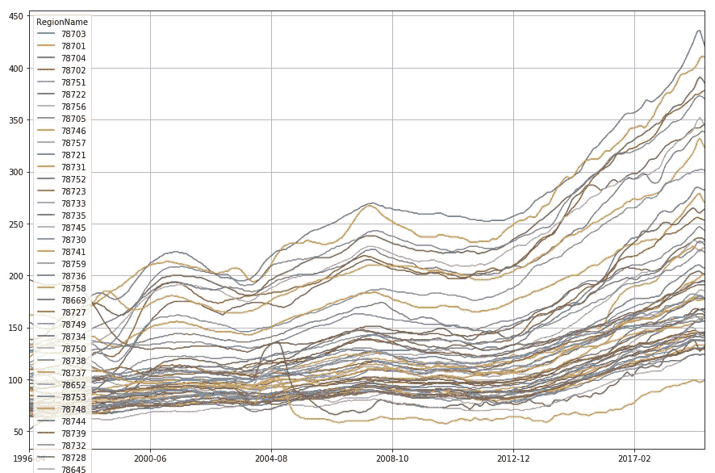
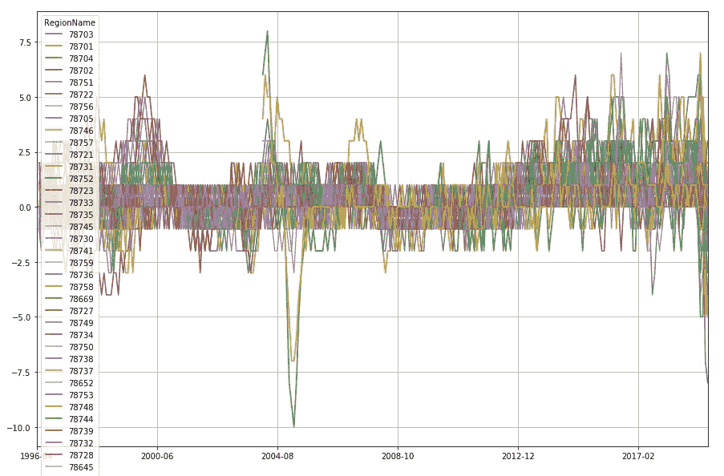
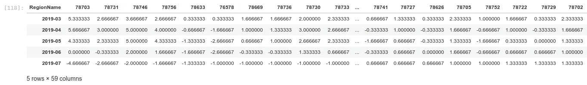
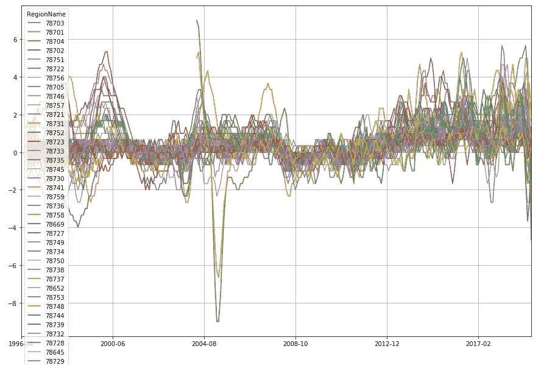

# 住在德克萨斯州奥斯汀；第 1 部分——时间序列分析的住房趋势

> 原文：<https://medium.com/analytics-vidhya/living-in-austin-texas-part-1-housing-trends-with-time-series-analysis-e131250f5c37?source=collection_archive---------16----------------------->


德克萨斯州奥斯汀市中心

任何一个在奥斯汀生活了几年以上的人都会告诉你，这里的房地产和租赁市场，正如我们所说的那样，非常好！(如果你不会说德克萨斯西班牙语，那就意味着，“真他妈的热！”).

奥斯汀的住房和租赁市场到底有多热？或许更重要的是，它们在近期或中期会有冷却的迹象吗？对于住房或租赁市场的个人参与者来说，对这些问题和其他问题有一个好的、基于经验的答案可能非常有价值——这可能意味着在错误的时间进入或退出住宅房地产市场，或者在其他邻近地理位置有更具竞争力的选择的公寓中支付过高的租金。

在这篇两部分文章的第一部分，我将讨论奥斯汀住宅房地产和租赁市场的过去和当前趋势，并对可用的*时间序列数据*进行一些分析，以获得洞察力，这可能有助于潜在的买家/卖家/租户就何时何地购买/出售/租赁他们的计划做出更明智的决定。

然后，第 2 部分着重于使用基于位置的*享乐回归*构建租金定价模型，例如，在给定个人的位置、价格和享乐偏好/约束的情况下，该模型可用于找到最佳公寓。

**数据来源**

为了进行分析，我使用了主要的数据来源: [Zillow 公共经济数据](https://www.zillow.com/research/data/)(第 1 部分和第 2 部分)，以及来自[Apartment.com 上市公司](https://www.apartments.com/austin-tx/)(第 2 部分)的结果。

具体来说，使用的 Zillow 数据包括:

*   从 1996 年 4 月到 2019 年 7 月，每个美国邮政编码每平方英尺的房屋价值中值($)(Zip _ MedianValuePerSqft _ all homes . CSV)；和
*   从 2010 年 9 月到 2019 年 7 月，每个美国邮政编码的一居室公寓的租金中值列表价格(Zip _ MedianRentalPrice _ 1 bedroom . CSV)。

**使用 Pandas 将数据读入 Python**

让我们从使用 Pandas Python 库读取 DataFrame 对象中的中位数家庭美元/英尺数据开始:

```
import numpy as np
import pandas as pddf=pd.read_csv("Zip_MedianValuePerSqft_AllHomes.csv",encoding='latin-1')
df.head()
```

最后一行代码产生以下输出:



房价时间序列数据的前 5 行

正如我们所看到的，这个表中有几列，前几列代表美国邮政编码(“RegionName”)、城市、州、城市和县(“CountyName”)等类别。后面几列表示每个美国邮政编码的每月时间序列数据，单位为美元/英尺。

现在我们已经了解了表中的内容，让我们只关注与奥斯汀市区相关的数据行。为了简化分析，我们过滤掉所有不同时具有(1) State 等于“Texas”和(2) CountyName 等于“Travis County”(奥斯汀所在的县)或“Williamson County”(奥斯汀北部的一个县，包括许多奥斯汀郊区)的行:

```
df_atx = df[((df.State=="TX") & ((df.CountyName == "Travis County") | (df.CountyName == "Williamson County")))]
```

为了更好地将我们的数据准备为适当的时间序列格式，我们将邮政编码列转换为数据帧的索引，删除现在不需要的列，并转置数据帧:

```
df_atx_drop = df_atx.set_index("RegionName")
df_atx_drop = df_atx_drop.drop(columns=["RegionID","City","State","Metro","CountyName","SizeRank"])df_atx_t=df_atx_drop.transpose()
df_atx_t.head()
```



剥离和转置的多时间序列数据框架

厉害！现在，我们可以对数据进行一些可视化处理，以便更好地从图形上理解数据的趋势。为什么我们不在月和年(x 轴)与中位数美元/英尺(y 轴)的图表上查看每个时间序列？这可以使用以下命令来完成:

```
cols=list(df_atx_t.columns)
df_atx_t.plot(y=cols, figsize=(15,5), grid=True)
```

输出是:



年月(x 轴)与美元/英尺中位数(y 轴)的关系图

嗯，这是一个丰富多彩的图表，不是吗！？因为图中显示了如此多的邮政编码，所以很难直观地找出具体的邮政编码。但是，一些宽泛的模式清晰可见:

*   数据中似乎有一些清晰的“带”或“层”,似乎表明某些邮政编码可能在相同的大致范围内具有中值房价。例如，在高端(T1)，美元/英尺值将从大约 300 美元/英尺到可能超过 450 美元/英尺。在中上地区(T2)，你会看到另一个区域的邮政编码趋势线，价格在 200 美元到 299 美元/英尺之间。靠近中底部和底部的是那些价格在 120-199 美元/英尺(T3)的房屋。
*   许多趋势线似乎彼此紧密跟随(可能类似于道琼斯工业平均指数或标准普尔 500 等平均指数和指数中包含的股票)。然而，一些邮政编码升值更快，超过了其他邮政编码。例如，从 2008 年到 2019 年，邮政编码 78757(上面的浅蓝色)超过了同行的邮政编码，并且(可以说)在此期间从上 T2 到下 T1。这个邮政编码可能升值了很多，因为它相对靠近市中心/UT 校园，也在 MoPac/Loop 1 和美国 183 号公路的范围内。
*   2007 年的房地产峰值也很明显，大衰退的下降趋势发生在 2008-2012 年，而复苏则从 2013 年开始。事实上，从 2008 年到 2012 年，住房危机似乎只对房价产生了适度的负面影响，许多地区的房价仅下降了 5%—10%。然而，2013 年及以后的复苏非常有利于提高奥斯汀房主的房屋价值，在许多情况下，价格在此期间上涨了 50-80%。
*   查看最近的数据点(2019 年 7 月)，我们可以看到几个邮政编码的价格似乎比前期(2019 年 6 月)有所下降，这*可能是*奥斯汀住房市场未来降温的迹象。

关于上面的最后一点，查看时间序列数据中的*随时间的变化*的一个有用方法是对时间序列的*进行差分*，这样我们就可以查看从一个月到下一个月的*价格变化。这可以使用 Pandas 库中的 *diff()* 函数来完成:*

```
df_atx_delta1 = df_atx_t.diff()
```

并绘制它:

```
df_atx_delta1.plot(y=cols, figsize=(15,5), grid=True)
```



差分时间序列

在上图的最右侧肯定有一些活动在进行，因为在过去的几个月中，几个邮政编码的每英尺美元中值指标出现了*显著的*下降。

为了让图表看起来更好，同时也为了关注最近跌幅最大的邮政编码，我们将计算差异的 *3 个月滚动平均值*(以平滑上述时间序列)，并按照最近的差异对我们的数据框架中的行进行排序(即按照 2019 年 6 月和 2019 年 7 月之间的美元/英尺差异中值进行排序):

```
df_atx_delta1_rolling = df_atx_delta1.rolling(3).mean()
df_atx_delta1_rolling.sort_values(by = "2019-07", axis=1, inplace = True)df_atx_delta1_rolling.tail()
```



从左到右排序-2019 年 6 月(2019-06)到 2019 年 7 月(2019-07)之间按美元/英尺变化的邮政编码

```
df_atx_delta1_rolling.plot(y=cols, figsize=(15,10), grid=True)
```



差异时间序列的 3 个月滚动平均值

我们可以看到，邮政编码 78703、78731 和 78633 在过去几个月下降最多。最值得注意的是， [78703](https://www.google.com/maps/place/78703/) 和 [78731](https://www.google.com/maps/place/78731/) 是市中心和生活成本高昂的社区，在 2013 年至 2019 年期间快速升值后，这些社区可能会经历一些价格通缩。相比之下，zip [78633](https://www.google.com/maps/place/78633/) 位于乔治城(奥斯汀北部的一个郊区),因此有必要深入探究为什么这个地区的房价在过去的几个月里下跌了。

那么，这些信息对潜在的买方或卖方意味着什么呢？从上述数据来看，目前看来，我们可能会在短期内看到房价的大幅下跌。还有其他经济预警信号，如反向收益率曲线和与中国的贸易战，这使得更大范围的经济衰退更有可能发生...

*   因此，如果你想卖掉你的房子，那么你可能要考虑:( 1)在市场下跌太多之前从你的房子中撤出，或者(2)长期等待，希望长期房价在一年或更长时间内继续上涨。
*   *如果你是市场上的潜在买家*，那么你可能要考虑看看市场是否会在未来几个月继续走软，然后在市场见顶时买入。此外，如果你相对富裕，你可以考虑在 78703、78731 和 78633 区购买一处明显降价的房产。然而，要警惕在最昂贵的市场(如市中心或西北丘陵地区)购买价格过高的房产，因为与其他地区相比，这些市场可能会经历一些更大的调整。

在本帖的[第二部分中，我们转向在奥斯汀生活的租金方面，并致力于建立一个享乐回归模型，该模型将价格建模为位置和一系列“享乐”变量的函数(如公寓是否有游泳池，或公寓是否有花岗岩台面/不锈钢设备)。](/@vmusgrove86/living-in-austin-texas-part-2-constructing-a-rent-pricing-model-using-hedonic-regression-73bd3fd9266c)

链接到 Github 代码:【https://github.com/vincent86-git/Austin_Housing 