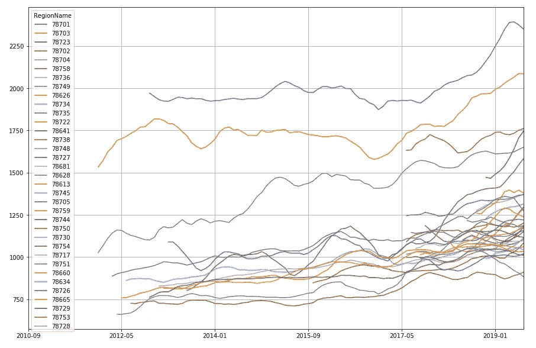
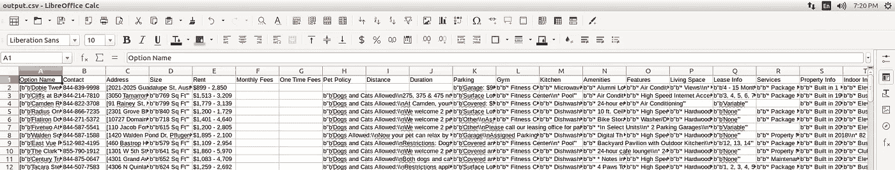
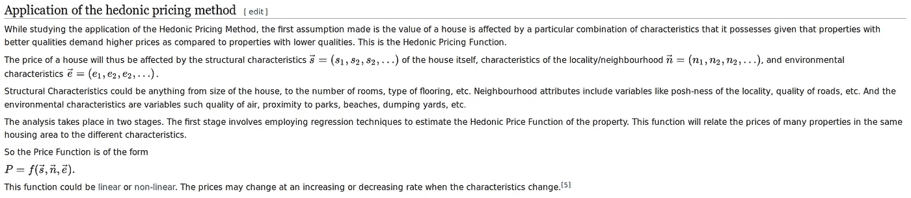
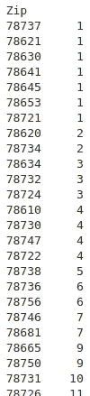
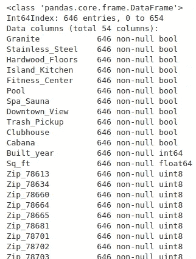
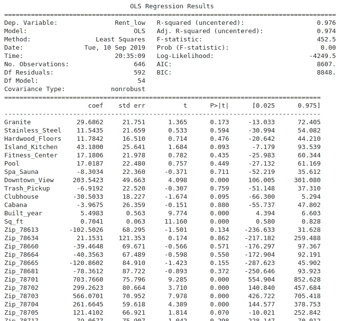
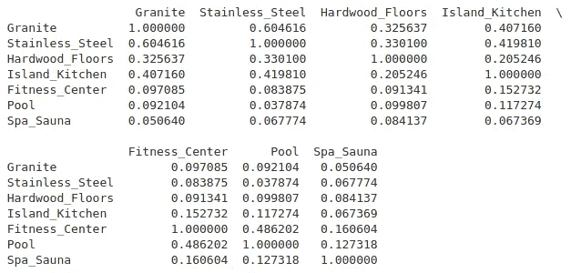
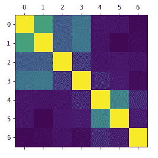
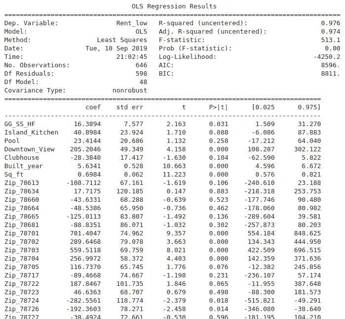

# 住在德克萨斯州奥斯汀；第 2 部分——使用 Hedonic 回归构建奥斯汀租赁市场的定价模型

> 原文：<https://medium.com/analytics-vidhya/living-in-austin-texas-part-2-constructing-a-rent-pricing-model-using-hedonic-regression-73bd3fd9266c?source=collection_archive---------7----------------------->


从齐尔克公园看到的奥斯汀市中心——奥斯汀监视器

上一篇文章[住在奥斯丁；第 1 部分](/@vmusgrove86/living-in-austin-texas-part-1-housing-trends-with-time-series-analysis-e131250f5c37)，我们使用*时间序列数据研究了奥斯汀住宅房地产市场的过去和当前趋势。*在第二部分的继续中，我们将深入了解奥斯汀租赁市场的各种趋势和特征，包括初步了解租金价格时间序列数据，以及影响给定奥斯汀公寓租金价格的因素。

该信息对于公寓搜索非常有用，因为它可以识别奥斯汀地区的那些公寓是“好”交易、“坏”交易，或者仅仅是“好”交易。公寓开发商可以利用这种分析来规划奥斯汀周围的地点或位置，在这些地点或位置建造新的公寓综合体将有很好的机会获得高利润。公寓管理公司也可能发现了解如何准确地给他们的公寓定价是有竞争力的。

**奥斯汀租赁价格的时间序列:**

我们可以使用上一篇文章中的相同方法来查看 Zillow 从 2010 年 9 月到 2019 年 7 月针对每个美国邮政编码的一居室公寓的租金中值(Zip _ MedianRentalPrice _ 1 bedroom . CSV):

```
df=pd.read_csv("Zip_MedianRentalPrice_1Bedroom.csv",encoding='latin-1')
```

Zillow 的数据只是从 2010 年 9 月到 2019 年 7 月，但这对我们的分析应该足够了！

执行与本文第一部分相同的代码，我们得到以下按邮政编码划分的月租金中位数的时间序列图:



年月(x 轴)与月租金中位数(y 轴)的关系图

尽管许多邮政编码区的租金价格随着时间的推移而上涨(特别是在过去的 2-4 年里，某些邮政编码区)，但这种价格上涨似乎没有第一部分中讨论的奥斯汀房地产价格上涨那么剧烈，至少乍一看是这样。

作为一名长期居住在奥斯汀的居民，有些事情让我印象深刻:

*   **那些日子一去不复返了——现在如果你能以每月不到 1000 美元的价格买到房子，那你就是幸运的了。**
*   ***大多数邮政编码的租金中位数在 1000 美元到 1400 美元之间:*** 从图表中可以看出，80%到 90%的邮政编码都在这个范围内，只有几个邮政编码的月租金中位数超过了 2000 美元，分别是 78701 美元(蓝色，上图)和 78703 美元(橙色，上图)。

上述数据可以让我们了解奥斯汀地区租赁价格的历史。但同样重要的是，如果不能提供更多信息的话，我们可以更仔细地看看关于当前租赁市场的*的*细节*。为此，我们将不得不使用另一个数据源—[Apartments.com](https://www.apartments.com/)！*

**从 Apartments.com 获取数据**

我在 Github 上使用了以下代码的修改版本:[https://github.com/adinutzyc21/apartments-scraper](https://github.com/adinutzyc21/apartments-scraper)。注意，这个脚本需要 *beautifulsoup* Python 库。确保小心/尊重你访问 Apartments.com 网站的次数！！

收集完数据后，我们可以打开一个电子表格程序(我使用的是 LibreOffice Calc)来查看我们正在处理的内容:



因此，我们的表中有几列数据(“[公寓]名称”、“联系人”、“地址”、“大小”、“租金”等)。).现在我们有了数据，我们必须提醒自己这个数据分析项目的目标是什么。在本帖中，我们关注的是使用基于经验数据的各种参数(如位置和/或公寓设施)对公寓租金进行*特征回归*或*特征建模*。相应地，在我们进一步深入之前，让我们对什么是享乐回归有一个正确的理解。

**什么是*享乐回归*？**

维基百科将[享乐回归](https://en.wikipedia.org/wiki/Hedonic_regression)定义为一种[揭示偏好](https://en.wikipedia.org/wiki/Revealed_preference)的方法，用于估算一种商品的[需求](https://en.wikipedia.org/wiki/Demand)，或者等价地，它对消费者的[价值](https://en.wikipedia.org/wiki/Value_(economics))。它将被研究的项目分解成其组成特征，并获得每个特征的贡献值的估计值维基百科进一步给出了对享乐定价法的简明解释(特别适用于房屋，但也适用于出租公寓):



这里，我们将使用一个简单的线性模型用于我们的回归分析——公寓的月租金(*Y；**因变量*将被建模为公寓位置(由有限可能的邮政编码表示)的*线性组合*，以及给定公寓的属性、特征和性质(例如公寓的大小或公寓是否包括游泳池)，这将是我们模型中的 *X* 或*自变量*。

**提取、清理和格式化数据**

首先，让我们使用 Pandas 导入原始数据:

```
import numpy as np
import pandas as pddf=pd.read_csv("output.csv",encoding='latin-1')
df.head()
```

既然我们的 Python 实例中有了原始数据，我们就可以开始提取、清理数据，并将其格式化为有用的信息。

首先，让我们确保我们的“租金”变量可以表示为美元金额(理想情况下为浮点数):

```
temp_df = df["Rent"].str.split(" - ", n = 1, expand = True)
df["Rent_low"] = temp_df[0]
df["Rent_high"] = temp_df[1]df.Rent_low = df.Rent_low.str.replace("$", "")
df.Rent_low = df.Rent_low.str.replace(",", "")
df.Rent_high = df.Rent_high.str.replace(",", "")df = df[df.Rent_low != "Call for Rent"]df.Rent_low = df.Rent_low.astype("float")
df.Rent_high = df.Rent_high.astype("float")
```

上面的代码提取了给定公寓楼的低租金和高租金，并将它们作为单独的行添加到 DataFrame 对象中，这些行被正确格式化为“float”数据类型。

下面的代码将从 DataFrame 的“Address”列中提取邮政编码，将其添加为另一列，并将其转换为“int”数据类型:

```
df["Zip"] = df.Address.str.extract(pat = '(TX 7....)')
df.Zip = df.Zip.str.replace("TX ", "")
df.Zip = df.Zip.astype("int")
```

现在我们可以做一些探索性的分析，看看我们的邮政编码样本量有多好。让我们计算数据中的行数，按邮政编码分组:

```
zip_count = df.groupby("Zip").count()
zip_count["Option Name"].sort_values()
```



每个邮政编码的行数

好的，看起来我们的数据中至少有几个邮政编码只有 2 行或更少(即样本/数据点)。让我们将极低样本数的邮政编码(少于 3 个样本)合并到较大的邮政编码中，以便从较大样本数的邮政编码中获得更好的统计方法。

我不得不手动计算出哪个低样本计数的邮政编码接近哪个其他的邮政编码(注意，我们的分析的完整实现可以使这成为一个自动化的过程)。

生成的代码如下所示:

```
df.loc[df["Zip"] == 78721, "Zip"] = 78723
df.loc[df["Zip"] == 78737, "Zip"] = 78749
df.loc[df["Zip"] == 78621, "Zip"] = 78653
df.loc[df["Zip"] == 78630, "Zip"] = 78613
df.loc[df["Zip"] == 78641, "Zip"] = 78613
df.loc[df["Zip"] == 78645, "Zip"] = 78613
df.loc[df["Zip"] == 78653, "Zip"] = 78749
df.loc[df["Zip"] == 78734, "Zip"] = 78732
df.loc[df["Zip"] == 78737, "Zip"] = 78739
df.loc[df["Zip"] == 78620, "Zip"] = 78732
```

**从原始数据中提取享乐变量(更多的提取、清理和格式化)**

现在是有趣的部分！让我们开始*享乐回归*分析，从我们的数据中挑选出一些变量，这些变量包括会直观地影响租赁物业价格的属性或特征。这里有很大的实验空间，所以我挑选了以下我认为*可能*对预测公寓租金有用的属性/特征:

*   花岗岩柜台面
*   不锈钢器具
*   硬木地板
*   岛式厨房
*   健身中心
*   泳池
*   水疗/桑拿
*   市区景观
*   挨家挨户收垃圾
*   体育俱乐部会所；音频社交软件（网友戏称“聊斋”）
*   小屋

还需要更多的手工工作来确定哪些列包含上述变量。下面是从原始数据中提取这些信息的 Python 代码:

```
df["Granite"] = df["Kitchen"].str.contains("Granite", na = False)
df["Stainless_Steel"] = df["Kitchen"].str.contains("Stainless Steel", na = False)
df["Hardwood_Floors"] = df["Living Space"].str.contains("Hardwood Floors", na = False)
df["Island_Kitchen"] = df["Kitchen"].str.contains("Island Kitchen", na = False)
df["Fitness_Center"] = df["Gym"].str.contains("Fitness Center", na = False)
df["Pool"] = df["Gym"].str.contains("Pool", na = False)
df["Spa_Sauna"] = df["Gym"].str.contains("Spa|Sauna", na = False)
df["Downtown_View"] = df["Amenities"].str.contains("Downtown View", na = False)
df["Trash_Pickup"] = df["Services"].str.contains("Trash Pickup - Door to Door", na = False)
df["Clubhouse"] = df["Indoor Info"].str.contains("Clubhouse", na = False)
df["Cabana"] = df["Outdoor Info"].str.contains("Cabana", na = False)
```

现在让我们从数据中提取每套公寓的建造年份(在我们的回归中用作另一个快乐依赖变量):

```
df["Built_year"] = df["Property Info"].str.extract(pat = '(Built in ....)')
#df["Reno_year"] = df["Property Info"].str.extract(pat = '(Renovated in ........)')
df.Built_year = df.Built_year.str.replace("Built in ", "")
df.Built_year = df.Built_year.astype("int")
#df.Reno_year = df.Reno_year.str.replace("Renovated in ", "")
#df.sort_values(by = "Built_year", ascending = False).head()
df["Built_year"]=df["Built_year"]-1900
```

平方英尺也可能有助于解释公寓的价格:

```
df["Sq_ft"] = df["Size"].str[4:8]
df.Sq_ft = df.Sq_ft.str.replace(",", "")
df.Sq_ft = df.Sq_ft.str.strip().astype("float")
```

让我们估算那些缺少平方英尺数据的公寓的平方英尺大小。我们通过计算那些有平方英尺数据的公寓的平均每英尺金额来做到这一点:

```
df["Dollar_per_ft"] = df.Rent_low / df.Sq_ft
m = df.Dollar_per_ft.mean()
print(m)1.6710012889876373
```

使用上述平均值(约 1.67 美元/英尺)以及单个公寓的租金价格，我们可以估算出那些缺少平方英尺数据的公寓的平方英尺:

```
df.loc[df['Sq_ft'].isna(), "Sq_ft"] = df.loc[df['Sq_ft'].isna(), "Rent_low"] / m
```

既然我们已经完成了每英尺美元的专栏，让我们放下它:

```
df.drop(columns=["Dollar_per_ft"], inplace = True)
```

好的，现在让我们在进行回归之前提取一些最后的数据。以下 Python 语句将为每个邮政编码创建虚拟变量，以更好地表示我们回归的数据(记住在回归之前使用 *drop_first = True* 删除一个虚拟变量):

```
df_dummies = pd.get_dummies(df, columns = ["Zip"], drop_first = True)
```

要存储一个只有我们的回归变量/自变量( *X* )的数据框，让我们剥离不再需要的列，并查看我们最终确定的信息 *X* 数据框:

```
regressors = list(range(25, len(df_dummies.columns)))x = df_dummies.iloc[:,regressors]
x.info()
```



最终独立变量(X)数据框架

我们还为我们的预测变量提取了一个数据框架(在本例中为“Rent_low”，表示给定公寓的最低月租金报价):

```
y = df["Rent_low"]
```

太好了！现在我们终于可以开始生成我们的快乐回归模型了。

**生成 Hedonic 回归模型**

使用以下代码:

```
import statsmodels.api as smmodel = sm.OLS(y, x.astype(float))
results = model.fit()
```

**输出模型参数**

使用以下代码:

```
print(results.summary())
```

我们从 *OLS* 模型的输出中得到以下摘要:



OLS 模型的摘要输出，包括线性系数(coef)、标准误差(std err)、t 得分(t)、P 值(P>|t|)、置信区间([0.025±0.075])和 R (R 平方)值。

**分析输出**

虽然一些独立变量似乎非常重要，并且对租金价格有很大的影响(例如，Downtown_View，Zip_78701)，但有些出乎意料的是，其他独立变量在该模型中似乎不太重要(例如，花岗岩、不锈钢、硬木地板)。鉴于这只是我们最初的模型(我们仅仅是用直觉想出来的)，那么问题就变成了——我们如何改进这个模型？

**检查多重共线性**

首先，我们可能应该找出哪些变量具有高水平的共线性，并最小化共线性的不利影响:

```
dfn = df_dummies.iloc[:,25:32]
print(dfn.corr())
```

输出:



更加丰富多彩的可视化输出:

```
plt.matshow(dfn.corr())
plt.show()
```



我们可以看到，花岗岩柜台、不锈钢器具和硬木地板具有中度到高度的相关性，因此一种解决方案是通过加法将这三个变量合并为一个变量(一个名为“GG_SS_HF”的新列)，并删除这三列:

```
df["GG_SS_HF"] = df["Granite"].astype("float") + df["Stainless_Steel"].astype("float") + df["Hardwood_Floors"].astype("float")...
...
#NOTE: rewrite df_dummies using GG_SS_HF in df
...
...df_dummies.drop(columns=["Granite", "Stainless_Steel", "Hardwood_Floors"], inplace = True)
```

**去除统计上不重要的独立变量**

其次，我们应该从模型中移除那些在统计上非常不重要的变量*。移除这些变量可以最小化它们可能对我们的模型产生的任何混淆效应。*

*使用以下代码删除这些列:*

```
*df_dummies.drop(columns=["Fitness_Center", "Spa_Sauna", "Trash_Pickup", "Cabana"], inplace = True)regressors = list(range(25, len(df_dummies.columns)))x = df_dummies.iloc[:,regressors]model = sm.OLS(y, x.astype(float))
results = model.fit()*
```

*我决定保留“Pool”和“Clubhouse”列，只是为了看看它们是否会变得更加重要，因为我们已经调整了模型参数。*

*好，让我们检查一下在第二次迭代中我们的模型参数是什么:*

```
*print(results.summary())*
```

**

*现在，我们的几个变量在统计意义上增加了(相对于我们享乐模型的第一次迭代)。比如 GG_SS_HF 现在是 95%水平显著，Pool 几乎是 75%水平显著，Clubhouse 几乎是 90%水平显著。*

*那么，这些数字到底意味着什么呢？*

*   ****GG_SS_HF:*** 给定该变量的系数 16.3894，我们的模型预测花岗岩柜台、不锈钢器具和硬木地板的*每件*将多花费 15 美元/月。*
*   ****泳池:*** 在公寓楼里有一个泳池可能会增加 23 美元左右的租金，但这似乎不是一个非常显著的因素(偏差约为+/-20 美元)。*
*   ****市中心 _ 查看:*** 这是一个对公寓定价非常显著、非常有影响力的变量。上面的模型预测，一个租房者每个月要多付大约 200 美元，仅仅是为了市区的风景。请注意，我们的分析没有*而不是*查看市中心的景色是好还是不好！*
*   ****建成 _ 年份:*** 也高度显著，我们的模型估计，对于每年*一处房产的房龄，租金减少 5.63 美元。这很有道理，但最好能有一个确切数字来说明租金价值下降与公寓年龄的关系。**
*   *****Sq_ft:*** 再次，高度显著。我们的模型估计，人们将为每平方英尺的居住空间支付平均 0.69 美元(假设其他变量不变)。**

**我们将模型的第二次迭代应用于我们当前的数据，看看我们的模型在哪里表现良好，在哪里表现不佳，如何？为了获得每个数据点的预测租金值(以及预测租金和实际租金之间的差异)，我们执行以下代码:**

```
**df["Predicted_rent_low"] = results.fittedvalues
df["Delta"] = df.Predicted_rent_low - df.Rent_low**
```

**并写入. csv 文件以在电子表格中查看结果:**

```
**df.to_csv("result.csv")**
```

****模型表现好的地方:****

*   **公寓名称:[宽石渡](https://www.apartments.com/broadstone-crossing-austin-tx/5zg30sm/)；预计租金= 1150 美元；实际租金= 1170 美元；delta =-20 美元。**
*   **公寓名称:[侯爵索科](https://www.apartments.com/marquis-soco-austin-tx/pdh91xs/)；预计租金= 1264 美元；实际租金= 1250 美元；delta =+14 美元。**
*   **公寓名称:[白石镇的贝克斯利](https://www.apartments.com/bexley-at-whitestone-austin-tx/07hxs60/)(我目前居住的地方)；预计租金= 1163 美元；实际租金= 1069 美元；Delta = +$94。**

****模特表现差的地方:****

*   **户型名称:[复式](https://www.apartments.com/penthouse-austin-tx/6wyg4ts/)；预计租金= 1510 美元；实际租金= 1055 美元；delta =+455 美元。**
*   **公寓名称:[链接](https://www.apartments.com/link-austin-tx/ppv1dpt/)；预计租金= 975 美元；实际租金= 1575 美元；delta =-600 美元。**
*   **公寓名称:[缪勒马赛克](https://www.apartments.com/mosaic-at-mueller-austin-tx/mdgjmyk/)；预计租金= 1147 美元；实际租金= 1512 美元；delta =-365 美元。**

****总结思路和潜在未来分析****

**这一分析实际上只是对奥斯汀租赁市场高度深入分析的皮毛。享乐回归模型能够获得许多输入变量的统计显著值，并可以进一步扩展到包括其他变量或更多数据。**

**例如，在本分析中，仅使用了粗略的租金衡量标准(一个单一的“租金低”数字代表*整个公寓楼*)。进一步的分析可以着眼于每个公寓小区内的单个公寓的租金，以增加模型中使用的样本数量。事实上，这就是为什么这里设计的模型无法准确预测至少一些样本的租金的一个重要原因(例如，因为数据点是错误的/不准确的)。**

**给定数据中的模式，还可以进一步微调和调整模型参数。例如，可以测试 GG_SS_HF 变量是否随地理位置而变化(这意味着市区公寓中花岗岩/不锈钢/硬木的成本可能远远高于郊区公寓中花岗岩/不锈钢/硬木的成本)。查看上面的相关性数据，我们可以看到 Pool 和 Fitness_Center 也高度相关，因此一种选择是将它们合并到一个变量中(或者执行[主成分分析](https://en.wikipedia.org/wiki/Principal_component_analysis))。**

**尽管可以对其进行显著的改进，但当前的模型对于那些围绕租赁物业做出明智决策的人和玩家来说仍然非常有用:**

*   ***在公寓搜索*中，我们的模型可以识别奥斯汀地区的那些公寓，它们是“好”的交易，“坏”的交易，或者只是“好”的交易。例如，我可以说，我目前租的公寓(位于白石酒店的[贝克斯利)的当前租赁交易是一笔“体面/不错”的交易，因为模型估计我的租金为 1163 美元，而我每月支付的租金约为 960 美元(对于一间卧室——完全公开！).](https://www.apartments.com/bexley-at-whitestone-austin-tx/07hxs60/)**
*   ***对于一家公寓开发商*，可以分析奥斯汀周围的场地或位置的预期租金收入(根据我们的模型估计)，这可用于寻找具有正 ROI 的位置。例如，公寓开发商可能希望取消邮政编码 [78726](https://www.google.com/maps/place/78726/) 和 [78724](https://www.google.com/maps/place/78724/) ，因为根据我们的 hedonic 回归模型预测，这些邮政编码在我们的数据集中具有最低的估计租金。**
*   ***公寓管理公司*也可以了解如何准确地给他们的公寓定价，以便在竞争中具有竞争力。例如，我们的模型表明[阿什顿奥斯汀](https://www.apartments.com/ashton-austin-austin-tx/dfkp6mk/)的价格过高(预计租金= 2004 美元；实际租金= 2793 美元)。在我写这篇文章的时候，阿什顿酒店的租金已经下降到了 2767 美元。所以也许阿什顿管理层意识到他们定价过高？也许术语“定价过高”的用法可能取决于你独特的享乐偏好[/效用函数](https://en.wikipedia.org/wiki/Utility)！**

**Github 上的 Python 代码链接:[https://github.com/vincent86-git/Austin_Housing](https://github.com/vincent86-git/Austin_Housing)**