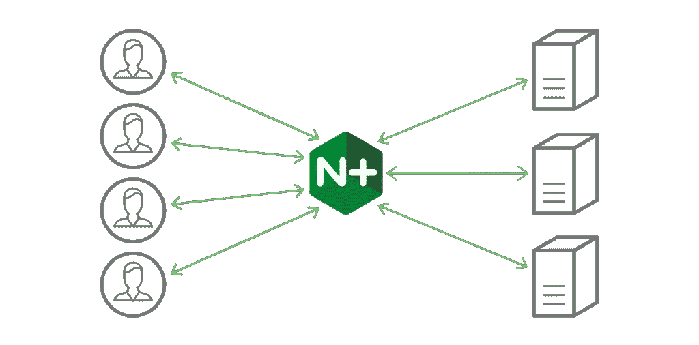
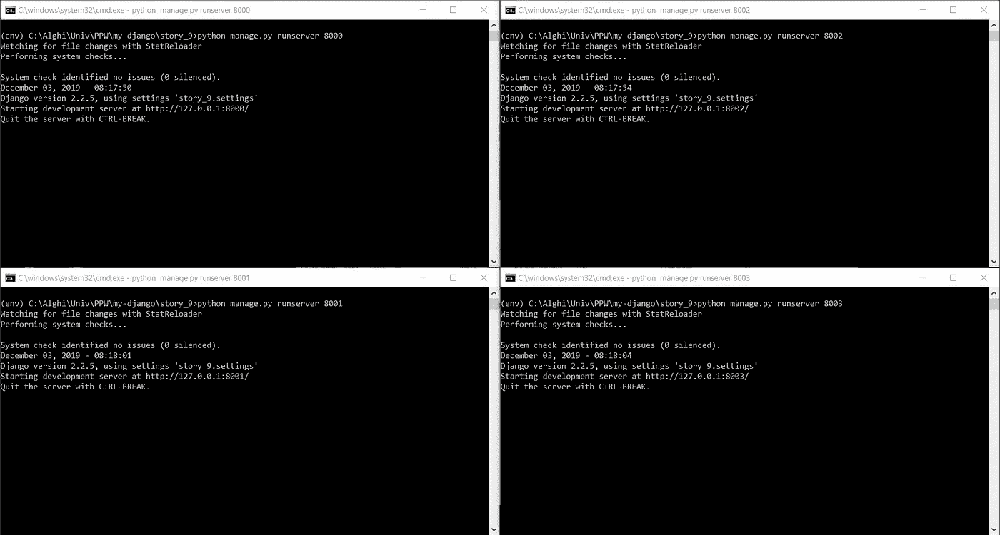
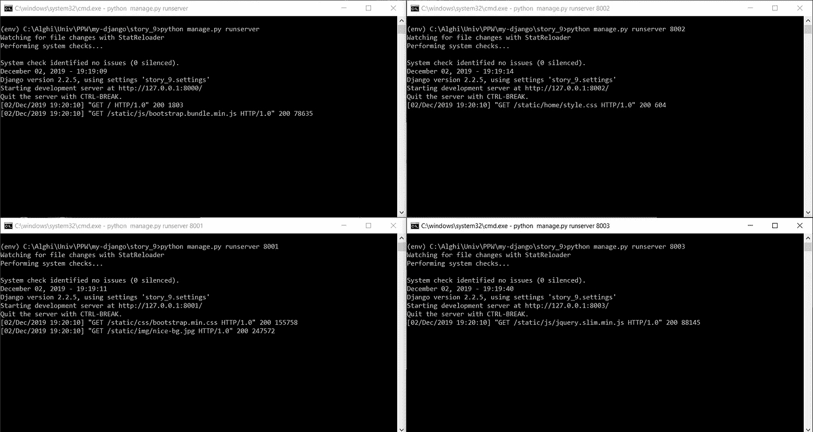

# 使用 Nginx 简化负载平衡

> 原文：<https://medium.com/analytics-vidhya/load-balancing-made-simple-using-nginx-88667e0df63?source=collection_archive---------20----------------------->


Nginx。你怎么读它？哈哈，其实读起来是“引擎 X”。我敢肯定，如果你像我一样来自一个非英语国家，你一开始就弄错了。不过没关系，老实说，我觉得读成“nginx”:D 更好

所以，让我们回到我们的主题，负载平衡。据 [Nginx 网站](https://www.nginx.com/resources/glossary/load-balancing/) —

> **负载平衡**指的是在一组后端服务器上有效地分配传入的网络流量，也称为*服务器群*或*服务器池*



基本上，当您构建一个 web 应用程序时，您通常将它部署在一台服务器上。这次，您将它部署在多台服务器上。但是，如何配置服务器的访问权限呢？一种方法是使用 Nginx。

## 首先，下载 Nginx

可以在 [Nginx 官网](http://nginx.org/en/download.html)下载。

## 解压并运行它！

解压缩后，在命令提示符/终端中打开该文件夹，并运行以下命令

```
start nginx
```

之后在浏览器中打开 [http://localhost/](http://localhost/) 。您应该会看到类似这样的内容


恭喜你！意味着 nginx 安装成功，配置正确。

## 在 4 台不同的计算机/端口上运行您的 web 应用程序

这里，我使用了 4 个不同的端口。所以我的 web 应用程序有 4 个实例: [http://localhost:8000/](http://localhost:8000/) 、 [http://localhost:8001/](http://localhost:8001/) 、 [http://localhost:8002/](http://localhost:8002/) 和 [http://localhost:8003/](http://localhost:8003/)



## 编辑 Nginx 配置文件

现在，再次导航到 Nginx 文件夹。在 conf 文件夹中，有一个名为 nginx.conf 的文件，打开它。编辑 http 括号内的一些部分，使其变成这样

```
http {
    upstream myapp1 {
        server 127.0.0.1:8000;
        server 127.0.0.1:8001;
        server 127.0.0.1:8002;
        server 127.0.0.1:8003;
    }

    server {
        listen 80;

        location / {
            proxy_pass http://myapp1;
        }
    }
}
```

## 重新加载 Nginx

更改配置后，您需要重新加载 Nginx。您可以运行以下命令

```
nginx -s reload
```

现在打开 [http://localhost/](http://localhost/)


哒哒。如果您看到您的 web 应用程序打开了，那么它可能工作正常。您还可以检查您的 web 应用程序控制台(如果可用)，这样您就可以看到请求分布在不同的服务器上。



所以，是的，一切都很好。要停止 nginx，您可以运行

```
nginx -s quit
```

一切都结束了。负载平衡很简单，对吧？:D

## 感谢您阅读这篇文章。如果您有任何问题或反馈，您可以通过 [LinkedIn](https://www.linkedin.com/in/firdaus-al-ghifari/) 或其他社交媒体平台联系我。