# 贷款数据预测

> 原文：<https://medium.com/analytics-vidhya/loan-data-prediction-c326c72c489d?source=collection_archive---------10----------------------->

# 介绍

问候！欢迎来到我的博客。这个博客是关于贷款预测的。在这里，我们要做的是，我们将尝试根据数据属性来预测用户是否会获得贷款。所以，让我们从它开始。

# 数据

数据取自 kaggle.com[点击此处](https://www.kaggle.com/altruistdelhite04/loan-prediction-problem-dataset)获取数据。我不拥有数据的权利，我把它用于我的练习目的。

# 导入数据

首先，让我们从导入库开始。

```
import pandas as pd
```

# 读取数据

```
data  = pd.read_csv('../input/loan-prediction-problem-dataset/train_u6lujuX_CVtuZ9i.csv')
```

# 数据概述

```
data.head(10)
```

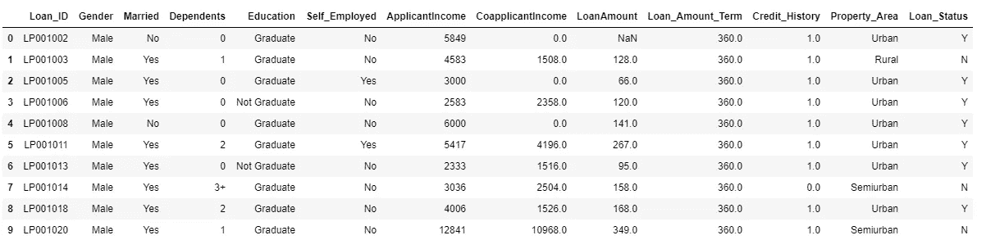

数据头

```
data.info()
```

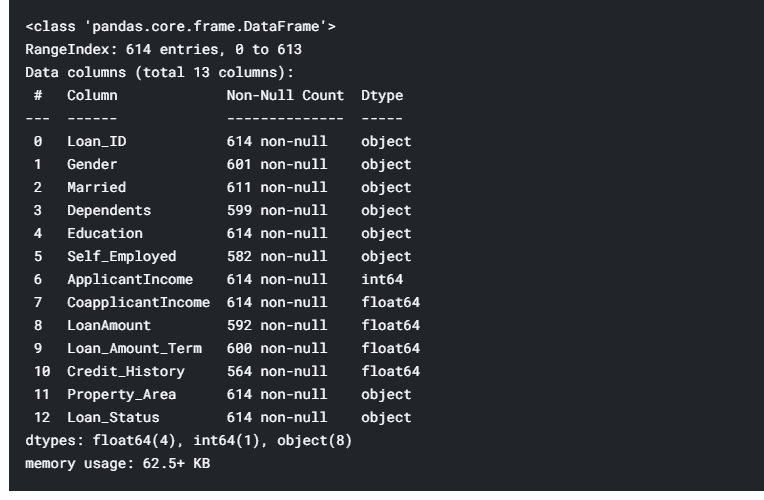

数据信息

# 删除空值

```
data.dropna(inplace=True)
vdata.dropna(inplace=True)
```

# 应用标签编码器

标签编码器用于将分类数据编码成数字数据。

让我们导入必要的类。

```
from sklearn.preprocessing import LabelEncoder
```

为标签编码器创建对象

```
le = LabelEncoder()
```

现在我们要做的是，我们将找出具有这种分类数据的数据列。然后，我们将使用标签编码器对其进行拟合变换。

```
datatype = data.dtypes==object
columns = data.columns[datatype].tolist()
data[columns]=data[columns].apply(lambda val : le.fit_transform(val))
```

应用标签编码器后，我们的数据看起来是这样的:

```
data.head()
```

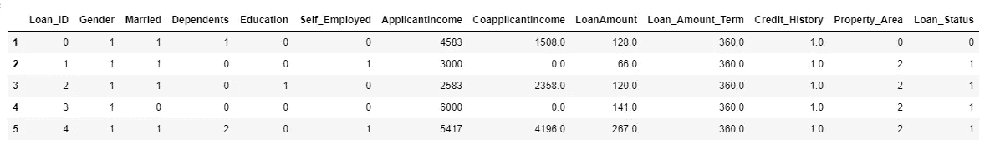

标签编码器后的数据

删除 Loan_id，因为它没有用。

```
data.drop('Loan_ID',axis=1,inplace=True)
```

# 形象化

让我们从导入可视化库开始。

```
import seaborn as sns
import matplotlib.pyplot as plt
```

让我们看看不同变量之间的相关性

```
plt.figure(figsize=(12,7))
sns.heatmap(data.corr(),annot=True,fmt='.2f')
```

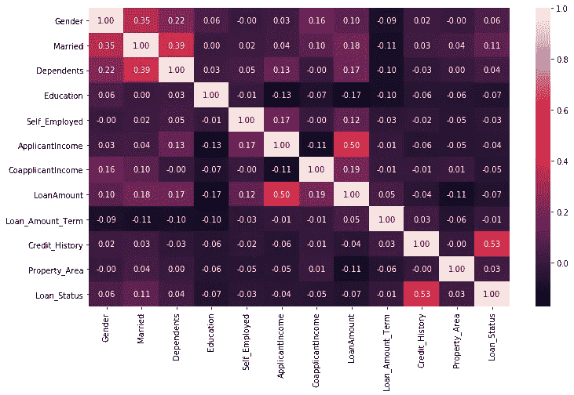

相关性-1

贷款金额和申请人收入

```
plt.figure(figsize=(12,7))
sns.scatterplot(data=data,y='ApplicantIncome',x='LoanAmount',hue='Loan_Status')
```

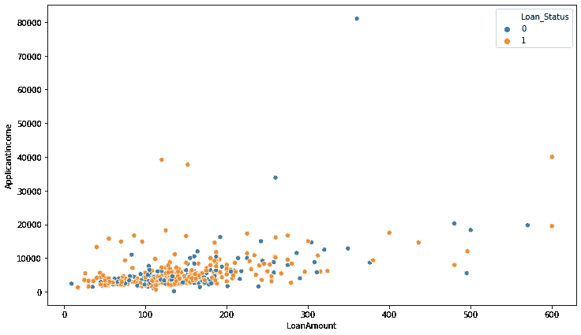

贷款金额和申请人收入

申请人和共同申请人收入

```
plt.figure(figsize=(12,7))
sns.scatterplot(data=data,y='ApplicantIncome',x='CoapplicantIncome',hue='Loan_Status')
```

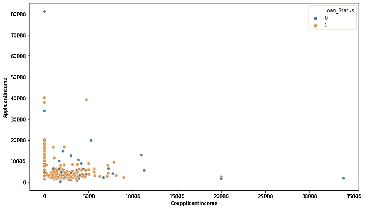

申请人和共同申请人收入

贷款金额和申请人收入

```
plt.figure(figsize=(12,7))
sns.scatterplot(data=data,y='ApplicantIncome',x='LoanAmount',hue='Credit_History')
```

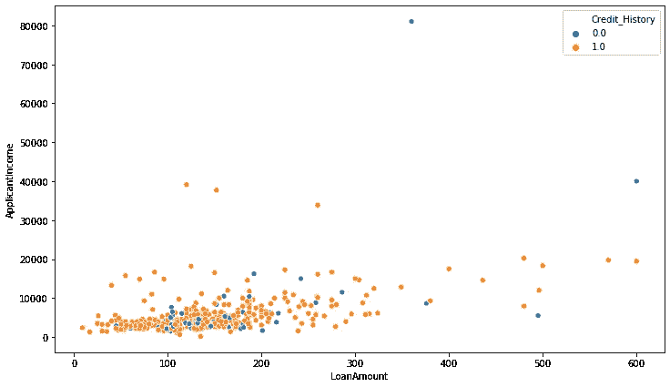

贷款金额和申请人收入

申请人的收入和贷款状况与婚姻状况的关系

```
plt.figure(figsize=(12,7))
sns.barplot(data=vdata,x='Loan_Status',y='ApplicantIncome',hue='Married')
```

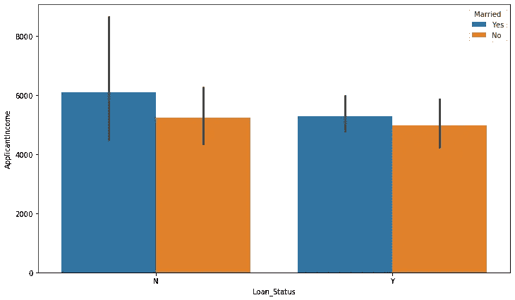

贷款状况和申请人已婚收入

房产面积和贷款状况

```
plt.figure(figsize=(12,7))
sns.countplot(data=vdata,x='Property_Area',hue='Loan_Status')
```

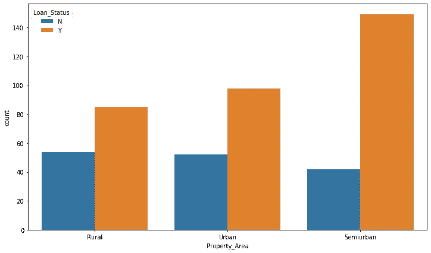

房产面积和贷款状况

贷款金额期限和贷款状态

```
plt.figure(figsize=(12,7))
sns.countplot(data=vdata,x='Loan_Amount_Term',hue='Loan_Status')
```

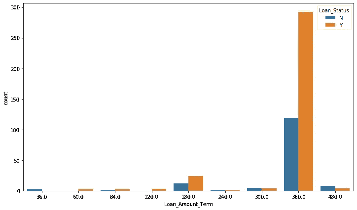

贷款金额定期贷款状态

性别贷款状态

```
plt.figure(figsize=(12,7))
sns.countplot(data=vdata,x='Gender',hue='Loan_Status')
```

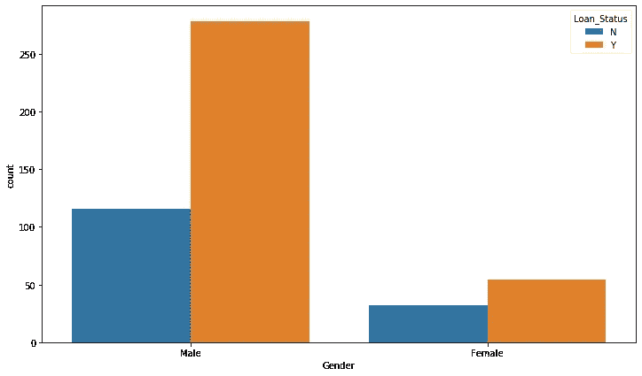

性别和贷款状况

个体户贷款状态

```
plt.figure(figsize=(12,7))
sns.countplot(data=vdata,x='Self_Employed',hue='Loan_Status')
```

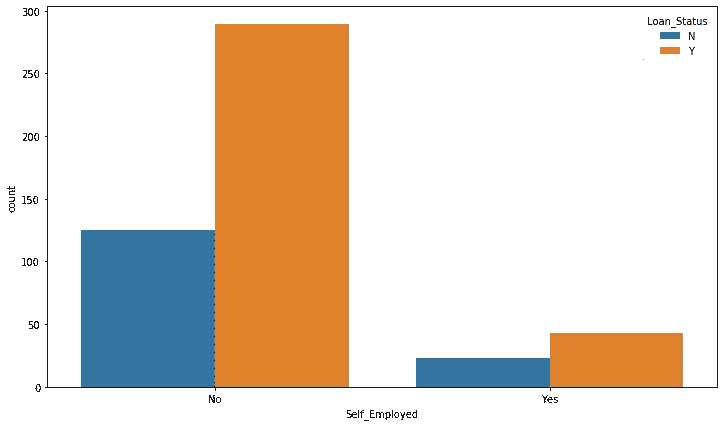

个体户贷款状态

受抚养人和贷款状态

```
plt.figure(figsize=(12,7))
sns.countplot(data=vdata,x='Dependents',hue='Loan_Status')
```

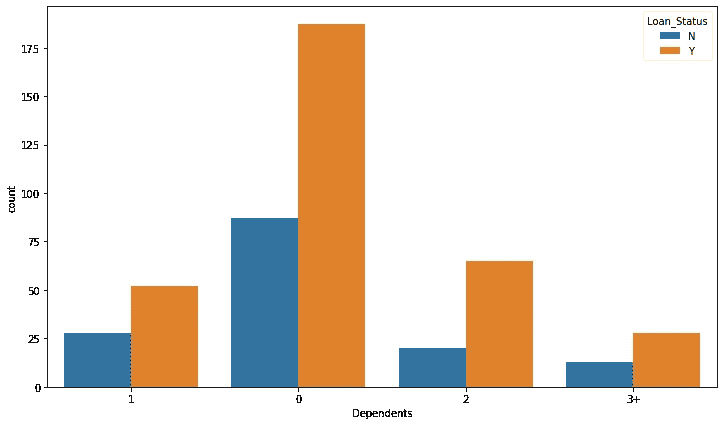

家属与贷款状态

# 数据异常值

申请人收入异常值检测

```
plt.figure(figsize=(12,7))
sns.boxplot(data=data,y='ApplicantIncome')
```

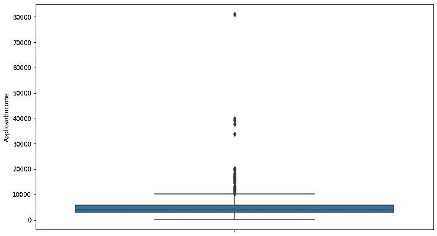

申请人收入异常值

```
desc = data['ApplicantIncome'].describe()
q1 = desc[4]
q3 = desc[6]
iqr = q3-q1
low = q1 -0.5*iqr
up = q3 +0.5*iqr
print('Lower limit is ',low,'Upper lim is ',up)
print('New DataFrame')
data = data[(data['ApplicantIncome']>low)&(data['ApplicantIncome']<up)]

Lower limit is  1421.875 Upper lim is  7329.375 
```

剔除异常值后

```
*# Checking outlier*
plt.figure(figsize=(12,7))
sns.boxplot(data=data,y='ApplicantIncome')
```

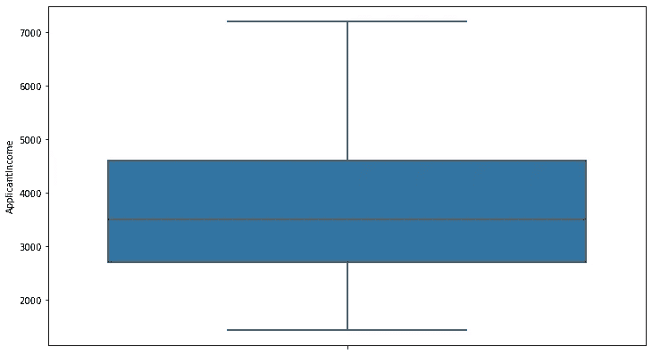

申请人收入

共同申请人收入异常值

```
plt.figure(figsize=(12,7))
sns.boxplot(data=data,y='CoapplicantIncome')
```

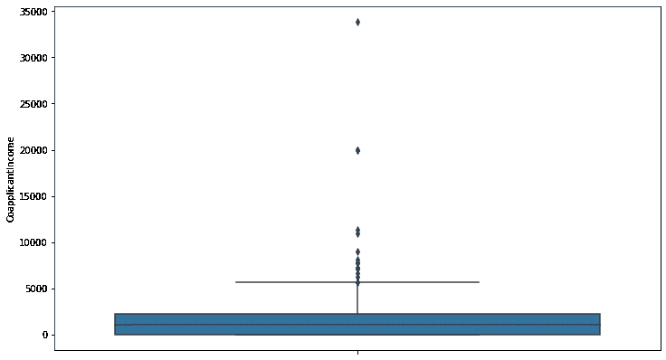

共同申请人收入异常检测

```
desc = data['CoapplicantIncome'].describe()
q1 = desc[4]
q3 = desc[6]
iqr = q3-q1
low = q1 -0.5*iqr
up = q3 +0.5*iqr
print('Lower limit is ',low,'Upper lim is ',up)
print('New DataFrame')
data = data[(data['CoapplicantIncome']>low)&(data['CoapplicantIncome']<up)]
Lower limit is  -1166.5 Upper lim is  3499.5
```

剔除异常值后

```
*# Checking outlier*
plt.figure(figsize=(12,7))
sns.boxplot(data=data,y='CoapplicantIncome')
```

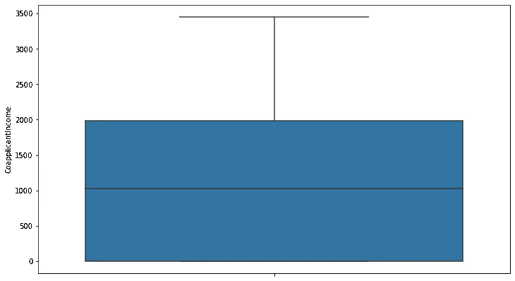

共同申请人收入

贷款金额异常值

```
plt.figure(figsize=(12,7))
sns.boxplot(data=data,y='LoanAmount')
```

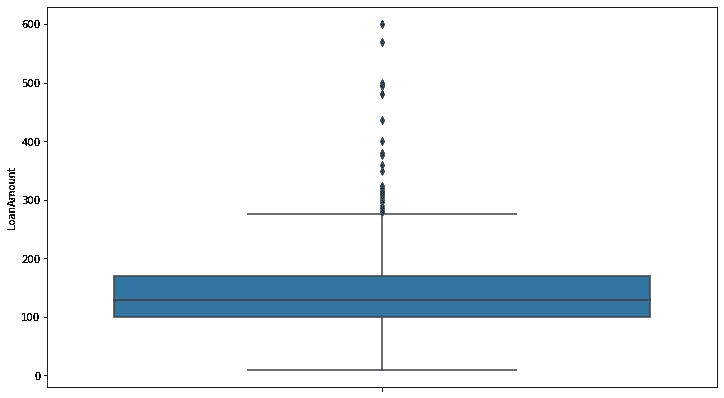

贷款金额异常检测

```
desc = data['LoanAmount'].describe()
q1 = desc[4]
q3 = desc[6]
iqr = q3-q1
low = q1 -0.5*iqr
up = q3 +0.5*iqr
print('Lower limit is ',low,'Upper lim is ',up)
print('New DataFrame')
data = data[(data['LoanAmount']>low)&(data['LoanAmount']<up)] Lower limit is  74.0 Upper lim is  162.0
```

移除后

```
*# Checking outlier*
plt.figure(figsize=(12,7))
sns.boxplot(data=data,y='LoanAmount')
```

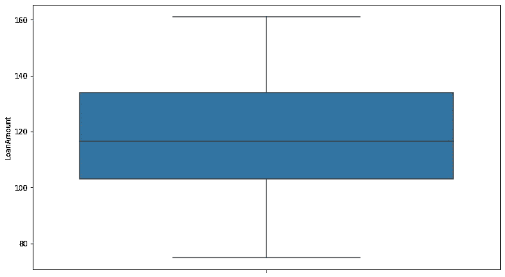

贷款金额

```
data
```

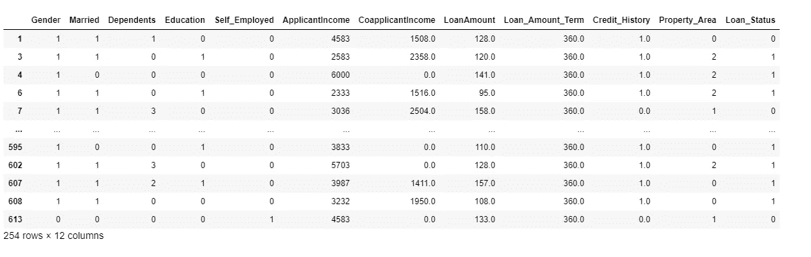

移除异常值后的数据概览

# 特征抽出

在这个过程中，我们确定哪些因素最突出或最适合训练我们的模型，并帮助我们给出准确的结果。

```
plt.figure(figsize=(12,7))
sns.heatmap(data=data.corr(),annot=True,fmt='.2f',cmap='winter')
```

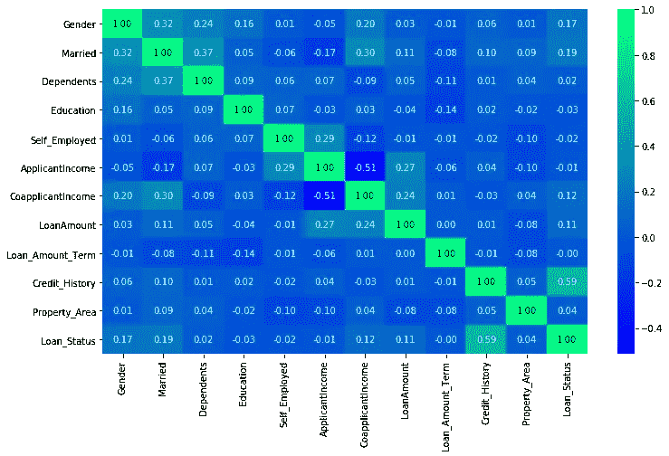

```
x = data.loc[:,['Gender','Married','CoapplicantIncome','LoanAmount','Credit_History']]
y = data['Loan_Status']
```

# 拆分数据

使用 train_test_split 将数据拆分为训练数据和测试数据

我们先导入它的库。

```
from sklearn.model_selection import train_test_splittrain_x,test_x,train_y,test_y = train_test_split(x,y,test_size=0.1,random_state=101)
```

我们将 test_size 保持为 10%,因此训练规模是我们总数据的 90%

让我们导入 NumPy 和准确度分数和混淆矩阵。这将有助于我们获得模型的准确性，它的混淆矩阵。

```
from sklearn.metrics import accuracy_score,confusion_matrix
import numpy as np
```

# 培训模式

因此，我们考虑了几种分类算法，并选择了精确度最高的一种。
考虑的算法有:
1) SVC
2)逻辑回归
3)决策树分类器
4) K 近邻
让我们看看哪个性能更好。

SVC
SVC 代表支持向量分类器。它返回对我们的数据进行有效分类的最佳拟合超平面。SVC 有许多超参数，如 C、Kernel 等，我们可以更新它们，这可以帮助我们提高模型的性能。但是，我们已经使用了所有模型的基本版本，以获得最佳效果。

让我们导入模型并初始化它。

```
from sklearn.svm import SVC
sr = SVC()
```

现在，让我们使用 fit()将训练数据拟合到模型中。

```
svr.fit(train_x,train_y)
```

结果是:

```
SVC(C=1.0, break_ties=False, cache_size=200, class_weight=None, coef0=0.0,
    decision_function_shape='ovr', degree=3, gamma='scale', kernel='rbf',
    max_iter=-1, probability=False, random_state=None, shrinking=True,
    tol=0.001, verbose=False)
```

现在，让我们应用 predict()来预测测试数据的值。

```
predict = svr.predict(test_x)
```

现在，让我们看看它的准确率%和混淆矩阵

```
accuracy_score(test_y,predict)
0.6923076923076923 
confusion_matrix(test_y,predict)
array([[ 0,  8],
       [ 0, 18]])
```

它给出了 69.23%的准确率。它的混淆矩阵显示
真阳性= 0
假阳性= 0
真阴性= 8
假阴性= 18
由此，我们可以得出结论，在传递的 26 行数据中，它只能识别 8 行为真阴性，18 行为假阴性。

逻辑回归

它是分类算法的一种基本形式。当只有两个类别要分类时使用。让我们看看它是如何为我们工作的。

让我们导入并初始化它。

```
from sklearn.linear_model import LogisticRegression
lr = LogisticRegression()
```

让我们训练我们的模型。

```
lr.fit(train_x,train_y)
```

现在是时候预测了。

```
predict = lr.predict(test_x)
```

现在，让我们检查一下它的性能:

```
accuracy_score(test_y,predict)*100
92.3076923076923
confusion_matrix(test_y,predict)
array([[ 6,  2],
       [ 0, 18]])
```

哇，92.3 %太棒了。一个更加平衡的混乱矩阵。我想我们已经有了赢家。

决策树分类器

因此，决策树分类器是一种用于分类数据的决策树。

让我们导入并初始化它。

```
from sklearn.tree import DecisionTreeClassifier
dtc = DecisionTreeClassifier()
```

让我们训练它或者我可以说让我们成长它:P

```
dtc.fit(train_x,train_y)DecisionTreeClassifier(ccp_alpha=0.0, class_weight=None, criterion='gini',
                       max_depth=None, max_features=None, max_leaf_nodes=None,
                       min_impurity_decrease=0.0, min_impurity_split=None,
                       min_samples_leaf=1, min_samples_split=2,
                       min_weight_fraction_leaf=0.0, presort='deprecated',
                       random_state=None, splitter='best')
```

它的预测时间:

```
predict = dtc.predict(test_x)
```

来看看它的性能:

```
accuracy_score(test_y,predict)
0.8076923076923077
confusion_matrix(test_y,predict)
array([[ 4,  4],
       [ 1, 17]])
```

还不错，80.76%的准确率。体面的分数必须说。

k-最近邻

最后但同样重要的是，KNN 是最简单的算法，它使用最近的数据点进行分类。最近的数据点是使用像欧几里德距离这样的距离函数找到的。

让我们导入并初始化

```
from sklearn.neighbors import KNeighborsClassifier
knn =KNeighborsClassifier(n_neighbors=5)
```

让我们训练它。

```
knn.fit(train_x,train_y)KNeighborsClassifier(algorithm='auto', leaf_size=30, metric='minkowski',
                     metric_params=None, n_jobs=None, n_neighbors=5, p=2,
                     weights='uniform')
```

预测:

```
predict = knn.predict(test_x)
```

让我们检查一下它的性能

```
accuracy_score(test_y,predict)
0.6923076923076923
confusion_matrix(test_y,predict)
array([[ 2,  6],
       [ 2, 16]])
```

其精度与 SVC 相同，但有不同的混淆矩阵。

注意:
我很快会写关于这些算法的详细博客。

# 结论

所以，我们有了明确的赢家，那就是逻辑回归。其他模型也可以提供这么多或者可能更多，我们对其进行微调。我将很快就这些算法撰写详细的博客，尽可能详细地解释它们。

我希望你喜欢这个博客。如果你觉得这个博客有帮助/信息，请喜欢它。下次见