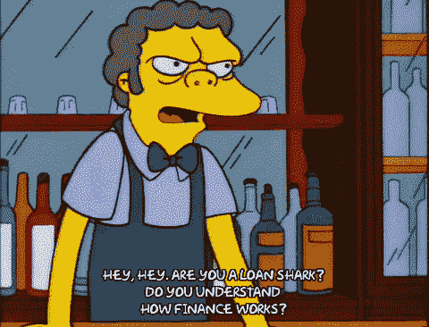
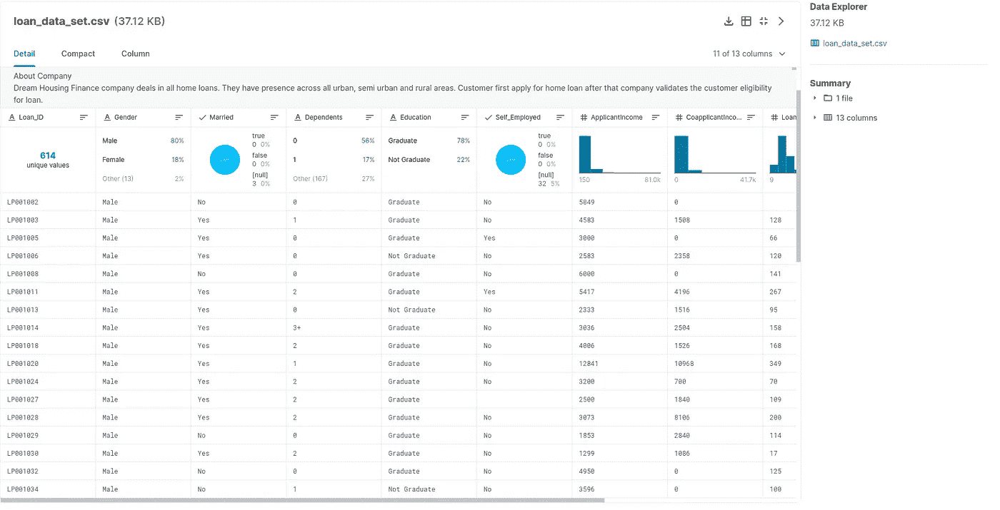
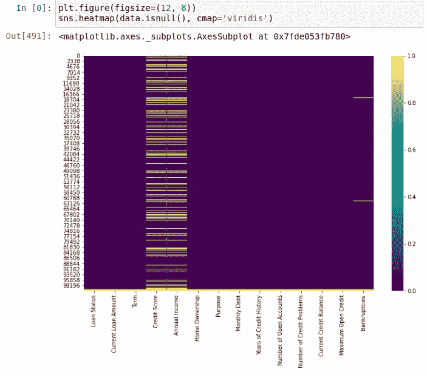
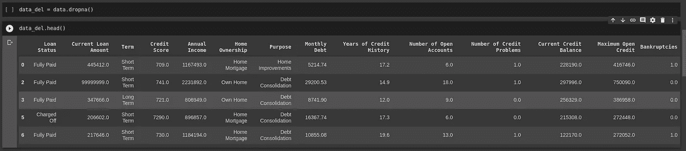
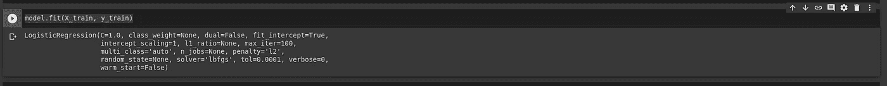
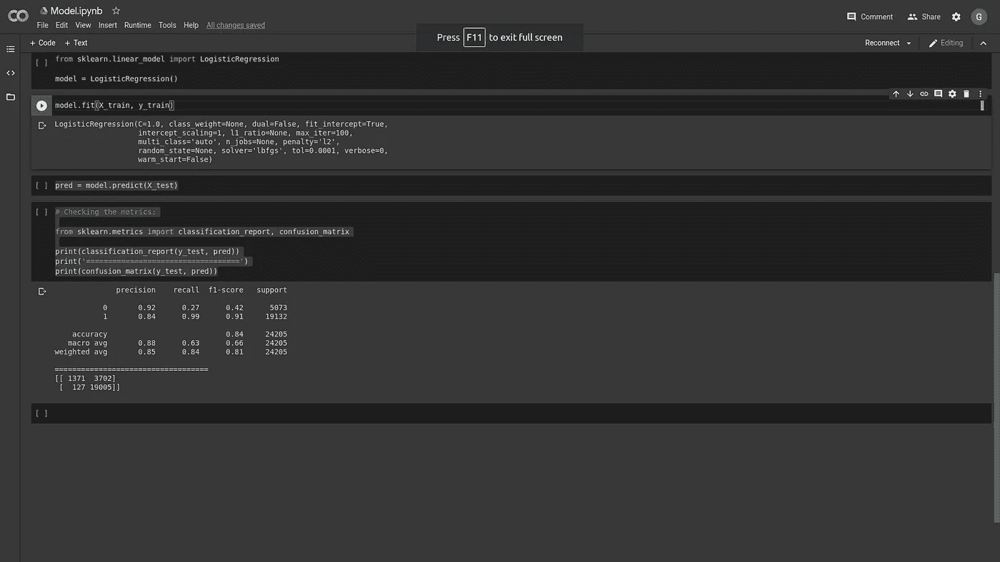

# 基于机器学习的贷款风险预测

> 原文：<https://medium.com/analytics-vidhya/loan-risk-prediction-using-machine-learning-fff008622bfe?source=collection_archive---------7----------------------->

在这篇文章中，我们将谈论我最近的项目以及如何使用机器学习来预测贷款的风险。



贷款之王 GIF [此处](https://www.google.com/url?sa=i&url=https%3A%2F%2Fgiphy.com%2Fexplore%2Floan-shark&psig=AOvVaw1Qs7vDeZsqKwzsBk1nNnA4&ust=1590786002919000&source=images&cd=vfe&ved=0CAIQjRxqFwoTCNDLvum51-kCFQAAAAAdAAAAABAb)

其中最强大的 ***机器学习应用*** 就是贷款风险预测。很可能，所有的银行都在使用机器学习来决定谁可以贷款，谁不可以。

实际上，建立一个 ***贷款风险模型*** 并不复杂，而且可以是一项非常直观的任务。

理论很简单:获取大量贷款人的历史数据及其特征，然后给我们的模型识别模式，并能够预测特定人的贷款风险。

让我们谈谈你需要什么…

# 你需要什么

首先，像每个机器学习应用程序一样，你需要数据！

这是银行和大金融机构的一大优势，他们有大量的数据！

> “我们没有更好的算法。我们只是有更多的数据。”— **彼得·诺维格**

对于我的项目，我使用了来自 [Kaggle](https://www.kaggle.com/) 的这个[数据集](https://www.kaggle.com/burak3ergun/loan-data-set)。

现在，我们已经有了[数据集](https://www.kaggle.com/burak3ergun/loan-data-set)，让我们来看看。



[数据集](https://www.kaggle.com/burak3ergun/loan-data-set)

看一看我们的[数据集](https://www.kaggle.com/burak3ergun/loan-data-set)我们可以看到许多有趣的数据，这是如此详细，这很好！

最棒的是，我们的数据已经标注了！这对我们帮助太大了！

> 此数据由[**Burak er gun**](https://www.kaggle.com/burak3ergun)用户从 [Kaggle](https://www.kaggle.com/) 提供，谢谢老弟！

现在，我们已经知道我们的[数据集](https://www.kaggle.com/burak3ergun/loan-data-set)中有什么，是时候格式化宝贝了！

# 格式化我们的数据集

> 已经格式化的数据在这篇文章的 Github [仓库里！](https://github.com/gabrielmayers/loan_ml/tree/master)

我们需要做的第一件事是找到 nan 或不完整的数据，就我个人而言，我喜欢通过使用 **Seaborn** 绘制**热图**来做到这一点，如下图所示:



很容易，对吧？

我们有很多问题，我们有两种方法来解决它:

*   排除所有有问题数据的行(不推荐)
*   使用以下技术填充这些数据:列的平均值或与行中的其他数据相关联。

我们的[数据集](https://www.kaggle.com/burak3ergun/loan-data-set)有超过 **900，000 个**示例，在这种特定情况下，我们可以删除缺少数据的行。

> **但是请记住:**对于专业项目，不建议这样做，因为这样会损害模型的性能。删除数据，如果你不能使用一些技术格式化它！

要删除数据我们只需使用 ***dropna()*** 方法从 ***熊猫*** 中删除即可。

现在，我们需要删除模型中不必要的列。选择哪些列重要，哪些不重要的一个简单方法是思考:如果我需要猜测(你的具体问题)，这些信息会有用吗？

适用于我们的问题:如果我需要猜测哪些人会支付贷款，哪些人不会，这个信息将是有用的？

使用这个类比，我们想要删除以下各列:

```
data.drop(columns=[‘Loan ID’, ‘Customer ID’, ‘Months since last delinquent’, ‘Tax Liens’, ‘Years in current job’], inplace=True)
```

你可以想:“为什么我需要删除这些列？更多的数据意味着模型的更多性能，对吗？”

而答案是:不会！

实际上，真正重要是有用的数据。在机器学习中，我们常说:

> 垃圾进，垃圾出！— **我上一任老板**

这句话真的改变了我的心态，我个人推荐千万不要忘记！

但是现在，我们已经只有对我们的模型有用的列，但是如果你在我们的数据集中修复，我们有一个文本信息，这对我们的模型没有用！

你可以想:“好吧，让我们放弃这些专栏，问题解决了！”

但是我们不能删除这些列，因为我们的[数据集](https://www.kaggle.com/burak3ergun/loan-data-set)(“贷款状态”)中最重要的列是文本格式！

为了解决这个问题，我们可以使用***get _ dummies()***from***Pandas***，在这里我们将一个整数值应用于列的每个单独的值。

我们希望将它应用到我们的[数据集](https://www.kaggle.com/burak3ergun/loan-data-set)的所有文本列中，之后，他将看起来像这样:



[数据集](https://www.kaggle.com/burak3ergun/loan-data-set)已格式化！

现在，我们已经格式化了我们的[数据集](https://www.kaggle.com/burak3ergun/loan-data-set),我们可以将它分成训练和测试。为此，我们想使用下面的代码:

```
# Splitting Data:X = data.drop(columns=[‘Fully Paid’])y = data[‘Fully Paid’]from sklearn.model_selection import train_test_splitX_train, X_test, y_train, y_test = train_test_split(X, y, test_size=0.3)
```

我们已经将数据分离出来，并准备好输入到我们的模型中！

是时候让机器学习了，宝贝！

# 构建我们的模型

我个人经常做的一个好的实践是选择 4 种可能的模型来解决我的问题，构建它，最后，看看哪一种表现得更好。

我在这篇文章的[库](https://github.com/gabrielmayers/loan_ml)的 [POC 文件](https://github.com/gabrielmayers/loan_ml/blob/master/POC.ipynb)中做的。

我的实验的赢家模型是“逻辑回归模型”，这是一个非常强大的模型，如果你想了解更多关于逻辑回归的知识，我写了这篇文章。

建立一个逻辑回归模型很简单，我们只需要使用***sk learn . Model _ selection***包，导入***LogisticRegression***。

```
# Building the Model:from sklearn.linear_model import LogisticRegressionmodel = LogisticRegression()
```

现在，我们可以使用我们的 ***X_train 和 y_train*** 来训练我们的模型:

```
model.fit(X_train, y_train)
```

模特训练有素！



我们模型训练的结果

现在，我们已经可以在我们的 ***X_test*** 中做出预测:

```
pred = model.predict(X_test)
```

为了可视化我们的模型的性能，我们可以使用 ***分类报告*** 和 ***混淆矩阵******sklearn . metrics***包，如下面的代码所示:

```
# Checking the metrics:from sklearn.metrics import classification_report, confusion_matrixprint(classification_report(y_test, pred))print(‘===================================’)print(confusion_matrix(y_test, pred))
```

让我们想象一下模型的性能:



不错吧？

我们有很好的表现，实际上，我们可以通过使用像 ***GridSearch*** 这样的技术来改善我们的训练和测试集的大小。但是现在，这就足够了！

在本文中，您了解了贷款机器学习模型背后的理论和实践。

你可以在[这里](https://github.com/gabrielmayers/loan_ml)访问这篇文章的资源库。

目前，这就是全部！

下次见！

***我的社交媒体:***

***领英:****[https://www.linkedin.com/in/gabriel-mayer-779b5a162/](https://www.linkedin.com/in/gabriel-mayer-779b5a162/)*

****GitHub:***【https://github.com/gabrielmayers】T4*

****insta gram:***[https://www.instagram.com/gabrielmayerl/](https://www.instagram.com/gabrielmayerl/)*