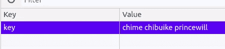
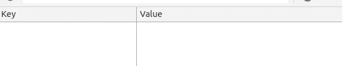
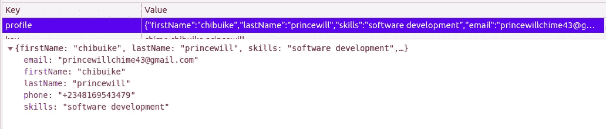
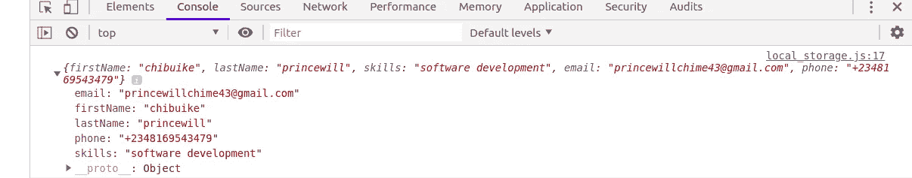

# 使用普通 JAVASCRIPT 的本地存储

> 原文：<https://medium.com/analytics-vidhya/local-storage-with-vanilla-javascript-c87e3923163a?source=collection_archive---------10----------------------->


迈克尔·泽兹奇在 [Unsplash](https://unsplash.com?utm_source=medium&utm_medium=referral) 上的照片

您是否使用过浏览器 API“window . location . href”跨不同页面传输数据？还是你一直在应用的模块？这很酷，但是你有没有想过更新现有的数据？我必须告诉你，有一个简单的方法可以从你想要的每一页访问和更新你的数据。

在本课程中，您将了解如何使用 javascript 从每个文件中访问您的数据。

同时，让我们了解一下什么是**本地存储；**
**本地存储**是一个用于数据存储和持久化的浏览器 API。你可能会说它是一个数据存储仓库，但是，如果你正在处理非常大量的数据，你可能必须使用任何云存储来保存数据。

保存在本地存储器中的数据即使在离开页面后也保持持久，因此，它没有到期日。在构建/测试 web/移动应用程序时，它非常擅长数据缓存。在移动上，它可以容纳 5mb 的存储空间，在桌面上，它可以分别容纳 50mb 的存储空间。**本地存储**数据保存在键/值对中。

让我们深入了解这个 API 的使用方法。web API**本地存储**有访问它的方法。以下是使用**本地存储** API 时应用的方法。

```
window.localStorage.setItem();window.localStorage.getItem();window.localStorage.removeItem();window.localStorage.clear();window.localStorage.key();
```

这些方法将使用一个字符串和一个对象来应用，也可以使用数组和其他方法。

## 将数据设置到本地存储

为了将数据设置到**本地存储器中，**如果你的值被声明为变量，那么它可以是一个变量，否则它也可以是一个普通的字符串。下面，让我们将数据添加到**本地存储器:**

```
//adding value as a variable
let fullName = "chime chibuike princewill";
window.localStorage.setItem("key", fullName);
```

全名已经成功保存到**本地存储器**，setItem 方法有两个参数，第一个参数保存数据的密钥，第二个参数保存要设置到**本地存储器**的值。让我们看看下面的**本地存储**视图:



本地存储视图

```
//adding value as a string
window.localStorage.setItem("key", "chime chibuike princewill" );
```

它没有将值设置为变量，而是作为字符串直接传递。

## 从本地存储获取数据

之前，我们将全名变量设置为**本地存储。与带两个参数的 setItem 方法不同，getItem 方法带一个参数。让我们看看这种方法在下面是如何使用的:**

```
let data = window.localStorage.getItem("key");console.log(data);//chime chibuike princewill
```

这里，记住我上面说过的，数据以键和值对的形式保存/设置，当从**本地存储**中获取数据时，无论何时我们想要获取设置到**本地存储**中的值，都将使用设置的全名的键来获取值。

## 从本地存储中删除数据

使用设置到**本地存储器**的数据键从**本地存储器**中移除数据。以下是我们如何从**本地存储器**中移除数据；

```
window.localStorage.removeItem('key')
```

如果具有给定键的键/值对存在，我们从与对象相关联的列表中删除了具有给定键的键/值对。在我们的例子中，给定的键是存在的，所以数据将被删除。

目前，**本地存储器**是空的。



本地存储现在是空的

## 清除本地存储数据

顾名思义，它清除/删除保存在**本地存储器**中的所有数据。它是这样使用的；

```
window.localStorage.clear()
```

我们已经删除了与所有键/值对的对象相关联的列表，如果有的话。此方法不接受任何参数；因为它要求全面擦除本地存储数据。

## 使用索引从本地存储获取数据

如果索引存在，该方法通过**本地存储器**中数据的索引获取数据。当字符串作为参数添加时，它返回本地存储的第一个对象。Infra 是如何实现这一点的；

```
//getting value by the nth key. window.localStorage.key(0)//with the previous data we had, it will print (key) as its result 
```

这将返回列表中第 n 个键的名称，如果该数字大于或等于对象中键/值对的数量，则返回 null。

既然我们已经看到了如何设置、获取、移除和清除本地存储中的数据，现在让我们看看如何将对象和数组设置到下面的**本地存储**；

```
//to set an object to the local storage
const object = {firstName: "chibuike",lastName: "princewill",skills: "software development",email: "princewillchime43@gmail.com",phone: `+234${8169543479}`};localStorage.setItem("profile", JSON.stringify(object));
```

下面让我们看看**本地存储**的样子:



我们设置到本地存储的对象

这里创建的对象是使用 JSON.stringify()方法设置的。这是因为保存到**本地存储器**的数据必须是字符串，所以使用 JSON.stringify()方法**将对象转换成 JavaScript 对象符号(JSON)。**

注意:数组也将被设置到本地存储器**中，就像上面截图中使用的一样。**

现在让我们看看如何从**本地存储器**中检索对象/数组

```
let result = JSON.parse(localStorage.getItem("profile"));console.log(result);
```

上面是检索我们发送到**本地存储的对象的方法。**
JSON . parse()方法是一种用于将 JSON 字符串转换为纯对象的方法。

这是一个转换结果的函数。为对象的每个成员调用这个函数。如果成员包含嵌套对象，则嵌套对象会在父对象转换之前进行转换。下面让我们看看从本地存储器中检索到的数据的控制台视图:



从本地存储中检索对象/数组

这就把我们带到了本文的结尾。如果本课程对您有所帮助，请点击👏图标，分享，推荐。

你也可以在***M***[***edium***](https://medium.com/u/ca30ca69cc7e)***里好好跟着我上。t***[***witter***](https://twitter.com/cprincewill102)和***L***[***inkedin***](http://www.linkedin.com/in/chime-princewill-3a2b1b192)*更多我的惊艳文章*