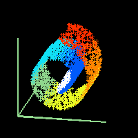

# 局部线性嵌入(LLE) |数据挖掘和机器学习

> 原文：<https://medium.com/analytics-vidhya/locally-linear-embedding-lle-data-mining-b956616d24e9?source=collection_archive---------0----------------------->

阿什利·朱利斯在 [Unsplash](https://unsplash.com?utm_source=medium&utm_medium=referral) 上拍摄的照片

[阅读无付费墙](/@mihirkhandekar/locally-linear-embedding-lle-data-mining-b956616d24e9?source=friends_link&sk=765b92ff2187dd089b07aab5c60737fd)

局部线性嵌入(LLE)是 Sam T. Roweis 和 Lawrence K. Saul 于 2000 年在他们的论文[“通过局部线性嵌入进行非线性降维”](http://citeseerx.ist.psu.edu/viewdoc/download?doi=10.1.1.456.5279&rep=rep1&type=pdf)中提出的一种非线性降维方法。本文基于参考资料部分提到的多个来源。Jennifer Chu 的项目帮助我更好地了解 LLE。

机器学习算法使用它们被训练的特征来预测输出。例如，在房价预测问题的情况下，可能有许多特征，如房子的大小、卧室的数量、浴室的数量等。使用某种机器学习模型对其进行训练，以尽可能准确地预测房价。许多机器学习算法在这样做时面临的一个主要问题是[过拟合](https://machinelearningmastery.com/overfitting-and-underfitting-with-machine-learning-algorithms/)，其中模型拟合训练数据如此之好，以至于它无法准确预测真实生活的测试数据。这是一个问题，因为它使得算法非常有效。

[降维](https://towardsdatascience.com/dimensionality-reduction-for-machine-learning-80a46c2ebb7e)有助于降低机器学习模型的复杂性，有助于在一定程度上减少过拟合。这是因为我们使用的功能越多，模型就越复杂，这可能会导致模型与数据拟合得太好，从而导致过度拟合。也可以使用对决定输出标签没有帮助的特征，这在现实生活中可能没有帮助。比如，在房价预测问题中，我们可能会有一个类似于卖家年龄的特征，这个特征可能不会以任何方式影响房价。降维有助于我们保留特征集中更重要的特征，减少预测输出所需的特征数量。

降维。来源:https://www.geeksforgeeks.org/dimensionality-reduction/

**局部线性嵌入(LLE)**

数据集通常可以在 n 维特征空间中表示，每个维度用于一个特定的特征。

LLE 算法是一种无监督的降维方法。它试图减少这些 n 维，同时试图保留原始非线性特征结构的几何特征。例如，在下图中，我们将瑞士卷的结构投射到一个低维平面，同时保持其几何结构。

简而言之，如果我们有数据 X1 的 D 维，我们试图将 X1 简化为 D 维特征空间中的 X2。

来源:https://cs.nyu.edu/~roweis/lle/swissroll.html

LLE 首先找到这些点的 k 个最近邻。然后，它将每个数据向量近似为其 k 个最近邻的加权线性组合。最后，它计算从其相邻向量中最佳重构向量的权重，然后产生由这些权重最佳重构的低维向量[6]。

1.  寻找 K 个最近的邻居。
    LLE 算法的一个优点是只有一个参数需要调整，即 K 的值，或者作为聚类一部分的最近邻居的数量。如果 K 选择得太小或太大，它将不能容纳原始数据的几何形状。
    这里，对于我们拥有的每个数据点，我们计算 K 个最近的邻居。
2.  我们对每个点的邻居进行加权聚合，以构建一个新点。我们试图最小化成本函数，其中第 j 个最近邻为点 Xi。

3.现在我们定义新的向量空间 Y，使得我们最小化 Y 作为新点的成本。

[来源](https://cs.nyu.edu/~roweis/lle/algorithm.html)

这个算法的详细算法伪代码可以在[这里](https://cs.nyu.edu/~roweis/lle/algorithm.html)找到。

**LLE 相对于其他降维算法的优势**

1.  对结构非线性的考虑
    LLE 超越了密度建模技术，如局部主成分分析或混合因子分析。密度模型不能提供一组一致的全球坐标，将观测值嵌入整个管汇；因此，它们不能用于，例如，可视化原始数据集的低维投影。如下图所示，它们只能检测线性要素。它在探测下面的弯曲图案方面做得不好，而 LLE 能够探测到。
    同样，其他方法如核 PCA、Isomap 也无法检测到 LLE 检测到的特征。
    在下面的图像中，我们观察到局部点的邻域被 LLE 保留了，但没有被其他算法保留。

左起:三维瑞士卷特征，使用 PCA 的瑞士卷示例[来源](http://www.math.sjsu.edu/~gchen/Math285F15/285%20Final%20Project%20-%20LLE.pdf)

左起:使用内核 PCA 的瑞士卷特征，使用 LLE 的瑞士卷特征

2.更好的计算时间
由于 LLE 倾向于累积稀疏矩阵，因此在计算空间和时间方面比其他算法更有效。

**参考文献**

1.  [http://www . math . sjsu . edu/~ gchen/math 285 f15/285% 20 final % 20 project % 20-% 20 LLE . pdf](http://www.math.sjsu.edu/~gchen/Math285F15/285%20Final%20Project%20-%20LLE.pdf)
2.  [https://cs.nyu.edu/~roweis/lle/](https://cs.nyu.edu/~roweis/lle/)
3.  [https://www.geeksforgeeks.org/dimensionality-reduction/](https://www.geeksforgeeks.org/dimensionality-reduction/)
4.  [https://towards data science . com/dimensionally-reduction-for-machine-learning-80 a 46 C2 ebb 7 e](https://towardsdatascience.com/dimensionality-reduction-for-machine-learning-80a46c2ebb7e)
5.  [https://towards data science . com/principal-component-analysis-for-dimensionally-reduction-115 a3 d 157 bad](https://towardsdatascience.com/principal-component-analysis-for-dimensionality-reduction-115a3d157bad)
6.  [https://www.youtube.com/watch?v=scMntW3s-Wk&t = 27s](https://www.youtube.com/watch?v=scMntW3s-Wk&t=27s)