# 来自 Stack Overflow 2017 年至 2020 年年度开发者调查的基于位置的见解

> 原文：<https://medium.com/analytics-vidhya/location-based-insights-from-stack-overflows-yearly-developer-survey-for-the-period-2017-to-2020-f9fc72eb5b6e?source=collection_archive---------29----------------------->

威廉·方特瑙在 [Unsplash](https://unsplash.com/?utm_source=unsplash&utm_medium=referral&utm_content=creditCopyText) 上拍摄的照片

# 介绍

Stack Overflow 的开发者调查是大约十年前开始的一年一度的活动，通常在每年的二月左右进行。调查方法、结果和数据集的详细信息可通过[2]获得。该网站包含从 2011 年开始的数据集。在这个项目中，我选择了 2017 年至 2020 年的数据集(见下文)。

该项目的目的是学习如何处理生产类型数据集，以及如何在生产环境中应用 CRISP-DM。为此，我将在以下方面研究时间和地理变化:

调查期间受访者人数的变化。

这一时期性别分布的变化。

一段时间内工作满意度指标的变化。

这一时期三大编程语言的变化。

# 数据集

每年的数据集是在 Stack Overflow 收集的，目的是深入了解全球软件开发人员的观点和经验。在开放数据库许可[1]下，匿名化数据集以 csv 文件的形式提供给公众。

每一年的数据都是由一系列问题组成的，这些问题每年都有所不同。例如，2020 年和 2019 年的方案是相似的，2018 年的方案是不同的，2017 年的方案与其他方案不同，等等。每年的计划主要反映软件工程和软件开发的当前趋势、当前问题和当前技术发展。

## 数据准备

由于每个年度数据集的模式存在差异，因此对 csv 文件中选定的列名和列内容进行了比对，以便能够以一致的方式处理不同的数据集。例如，2017 年数据集的性别栏将"男性"和"女性"作为备选项列表中可能选项的一部分，而在 2018 年、2019 年和 2020 年数据集，备选项列表中的选项是"男性"和"女性"。

在 2017 年和 2018 年的数据集中，底薪是衡量薪酬的标准，而在 2019 年和 2020 年的数据集中，薪酬不仅仅是底薪。试图观察 2017 年至 2020 年的薪酬趋势很困难，所以我决定不考虑。在补偿的情况下，我想做的事情之一是将每个年度数据集的补偿归一化为最大补偿，但我不确定这种归一化的基本统计理论。

**探索性数据分析**

在数据科学/数据分析中，为了获得一些初步的见解，按原样(以其原始形式)查看原始数据通常是一种良好的做法。探索性的数据分析程序构成了对数据的初步观察的一部分。以下是每个数据集中受访者总数的条形图:

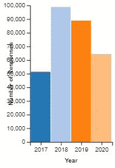

图一。年度调查中的受访者总数。

从柱状图中我们已经可以看到 2018 年后受访者总数的下降趋势。2021 年的趋势会有所不同吗？这种趋势有地域差异吗？

作为探索数据的一部分，在数据集的每一列中寻找无效值和异常值也是常见的做法；inf，INF，？、-、Nan、NA、N/A 或-999。诸如“在哪个列/特征中我们有最多的缺失或无效值”这样的问题可以作为项目中这个阶段的一部分来回答。此外，这种类型的分析在处理机器学习模型和实际上每个数据科学项目时都很有用。

下面的条形图显示了每个数据集的选定列中缺失值的比例。

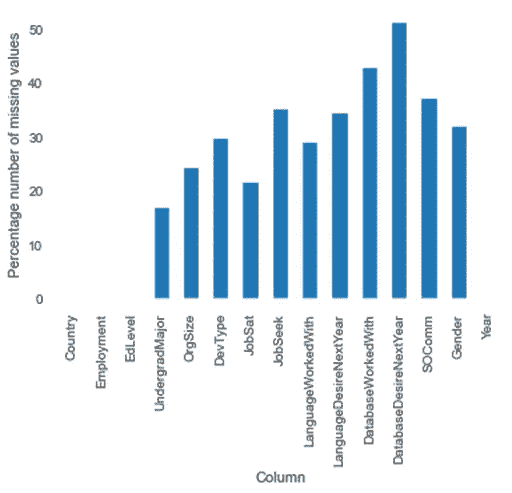

图二。2017 数据集的选定列中缺失值的比例。

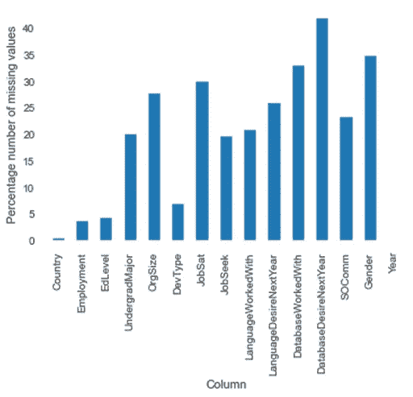

图 3。2018 年数据集的选定列中缺失值的比例。

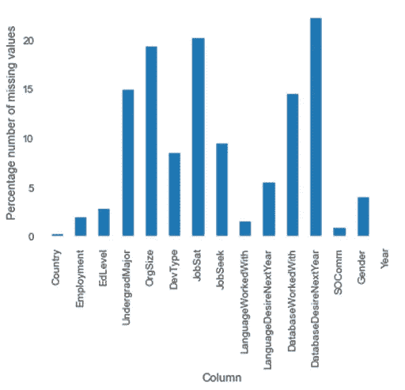

图 4。2019 数据集的选定列中缺失值的比例。

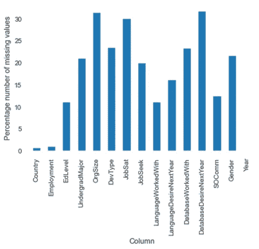

图 5。2020 年数据集的选定列中缺失值的比例。

如图 3、4 和 5 所示，2018 年、2019 年和 2020 年的数据集包含未指明原籍国的受访者。在地图上显示数据时，这些受访者通常会被忽略。尝试并理解为什么特定的列在不同的时间段内总是有来自应答者的缺失值也是很有趣的。“明年需要的数据库”列就是一个例子。一个可能的原因是大多数应答者不使用数据库。为了检查这一点，我们可以查看每一列中缺失值之间的相关性:在“database worked with”列中的缺失值和“database desired next”列中的缺失值之间是否存在相关性？以下是 2020 年数据集的相关图:

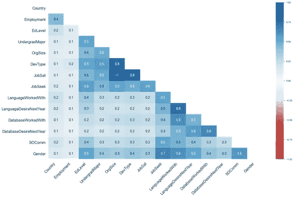

图 6。2020 数据集的每个选定列中缺失值之间的相关性。

如上面的图 6 所示，在“工作的数据库”列和“下一年希望的数据库”列中的缺失值之间存在+0.6 的相关性。这表明，除了“处理的数据库”之外，我们还有其他因素导致遗漏，如热图所示。

**缺失数据的处理**

在此项目中，在执行数据分析时，缺失值将被视为空白。这意味着缺失值不会被删除，也不会进行插补。这是可行的，因为这里没有使用机器学习/预测模型。

# 分析

在这一节中，我将探讨各国答复的地理差异。

## 方法

基本方法将包括分析 2017 年至 2020 年的总体数据，按国家和年份进行分析，以及随机选择两个国家的例子。

**按国家分列的答复数量**

在图 1 中，我们可以看到，与 2018 年的受访者人数相比，2019 年和 2020 年的受访者总人数呈下降趋势。以下数据基于每个国家每年的受访者人数。所示的例子是针对瑞典的:

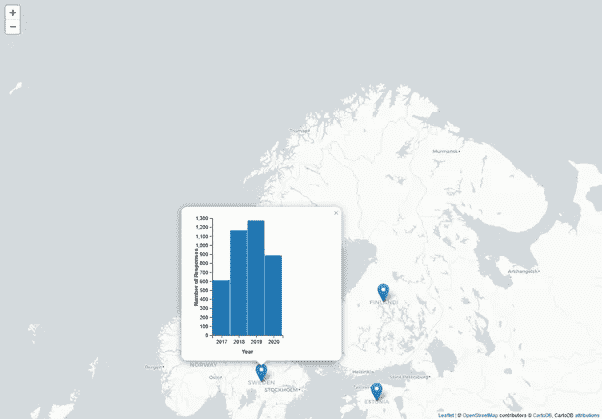

图 7。瑞典受访者人数。

为清晰起见，地图弹出窗口中的图表如下所示:

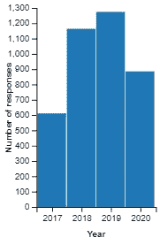

图 8。瑞典受访者人数。

从图 8 可以看出，瑞典受访者人数的趋势不同于总体趋势。

**按国家分列的性别答复**

需要以不同的方式处理技术和现代生活的许多方面，这是可以解决的当代问题。在软件工程多样化领域，性别是很重要的。利用这些数据，有可能了解受访者性别分布的地理差异。

在分析中，我已经在每个数据集的性别列中包括了空白的数量，并且我已经将所有性别中立的类别分组到一个更大的组中，我称之为中立。下面的地图显示了瑞典的结果。

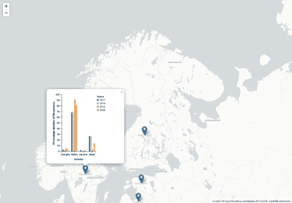

图 9。瑞典受访者人数的性别分布。

为清晰起见，地图弹出窗口中的图表如下所示。

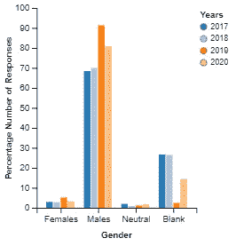

图 10。瑞典受访者人数的性别分布。

纳米比亚的性别分布也如下所示。

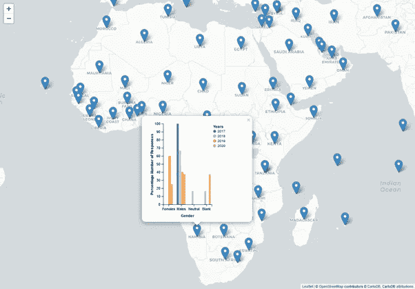

图 11。纳米比亚受访者人数的性别分布。

为清晰起见，纳米比亚地图弹出窗口中的图表如下所示。

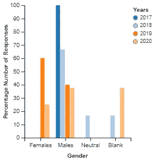

图 12。纳米比亚受访者人数的性别分布。

**总体工作满意度**

可以从数据中收集到的对雇员和雇主都有用的衡量标准。这里，在为每个年度数据集调整模式差异时存在一些问题。例如，2017 年的数据集有 11 个等级来表示工作满意度，2018 年的数据集有 7 个等级，而 2019 年和 2020 年的数据集有 5 个等级。

下图显示了每个数据集的受访者工作满意度得分的分布。

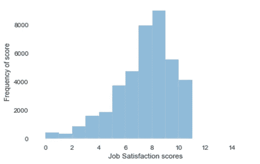

图 13。2017 年数据集的工作满意度得分分布。

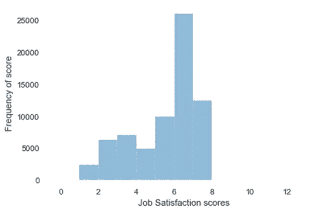

图 14。2018 年数据集的工作满意度得分分布。

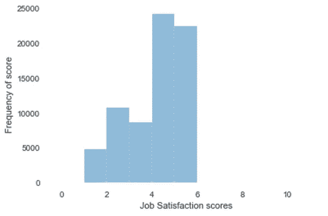

图 15。2019 年数据集的工作满意度得分分布。

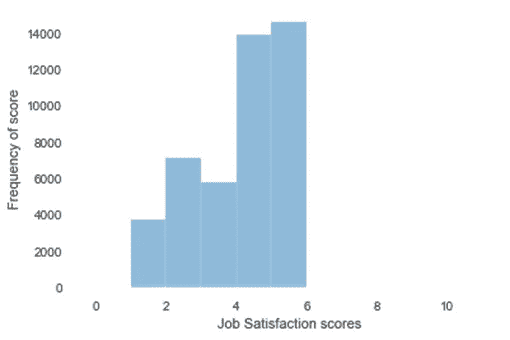

图 16。2020 年数据集的工作满意度得分分布。

为了对齐数据集，我保留了每年的原始尺度，并使用每个尺度的中值进行分组。结果分为三组:对低于中值的水平不满意，对等于中值的水平既不满意也不不满意，对高于中值的水平满意

**按国家划分的工作满意度**

下面是瑞典的结果。

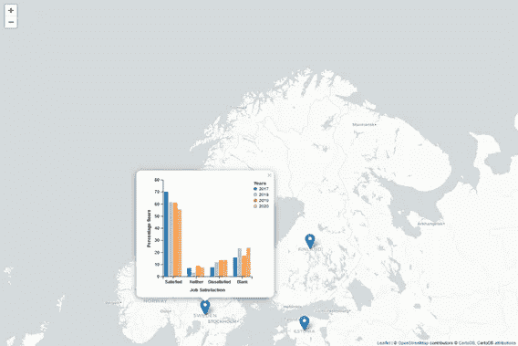

图 17。瑞典的工作满意度得分。

为清晰起见，地图弹出窗口中的图表如下所示。

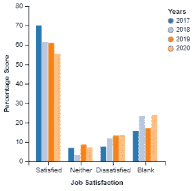

图 18。瑞典的工作满意度得分。

以下是日本的工作满意度得分

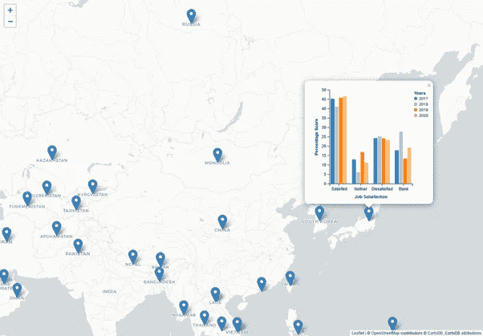

图 19。日本的工作满意度得分。

为清晰起见，地图弹出窗口中的图表如下所示。

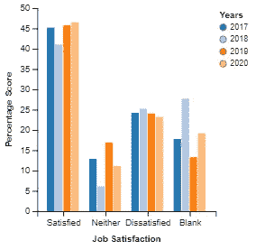

图 20。显示日本工作满意度得分的图表。

**编程语言综合排名**

目的是观察 2017 年至 2020 年间三大编程语言的变化。下图显示了从 2017 年到 2020 年按年份分组的排名前三的编程语言。

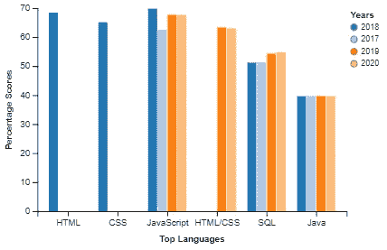

图 21。从 2017 年到 2020 年按年份分列的总体排名前 3 的编程语言。

**国家排名前三的编程语言**

下图显示了三种最受欢迎的编程语言在不同国家排名中的差异。

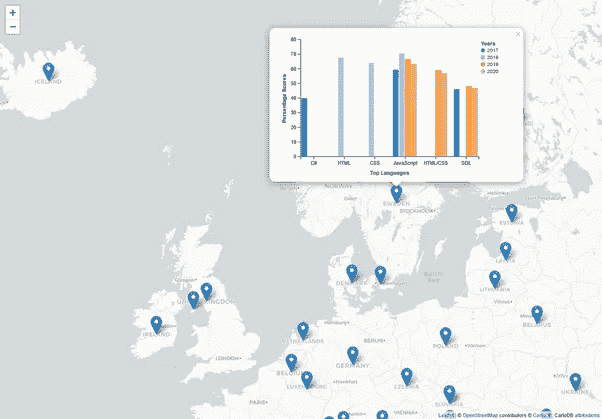

图 22。2017-2020 年瑞典排名前 3 的编程语言按年份分组。

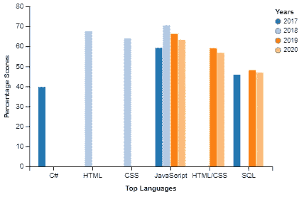

图 23。2017-2020 年按年份分组的瑞典前 3 名编程语言。

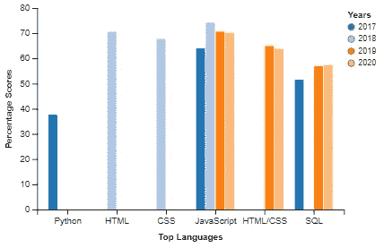

图 24。2017-2020 年美国排名前 3 的编程语言。

## 部署

这个项目是 Udacity 的数据科学纳米学位项目的一部分。该代码可从 github 中的链接获得:[https://github . com/OtasowieRotimiOsifo/PDS nd _ github/tree/master/data _ science _ blog](https://github.com/OtasowieRotimiOsifo/pdsnd_github/tree/master/data_science_blog)

# 结论

堆栈溢出调查数据包含大量与全球软件开发人员相关的信息和见解。这里的报告仅仅触及了通过对数据集进行复杂分析可以获得的丰富见解的表面。

## 参考

1.[https://stack overflow . blog/2020/05/27/2020-stack-overflow-developer-survey-results/](https://stackoverflow.blog/2020/05/27/2020-stack-overflow-developer-survey-results/)

2.https://insights.stackoverflow.com/survey