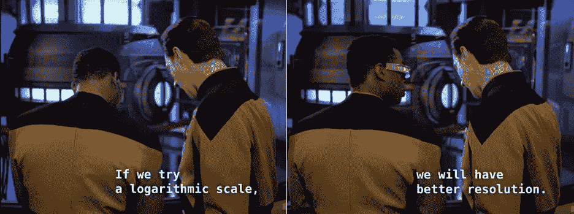

# 对数图、核密度估计和实验数据

> 原文：<https://medium.com/analytics-vidhya/log-plots-kernel-density-estimation-and-experimental-data-10ae0a2a8378?source=collection_archive---------19----------------------->

数据是正确的。数据永远是对的。

我一直在忙着处理一些实验数据。我试图将数据的子集拟合到一个模型分布中，其中一个函数遵循正态分布(在线性空间中)。听起来很简单，对吗？

基于这个问题的领域知识，我*也*知道数据可能可以用一个混合模型来拟合，并且…