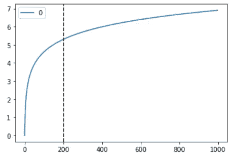

# 积极性的对数变换。

> 原文：<https://medium.com/analytics-vidhya/log-transform-for-positivity-d3e1f183c804?source=collection_archive---------1----------------------->

版权:图片(抄送):WalterM 版权所有 2006 WalterM 保留所有权利。

简而言之，对数变换压缩或压缩大数值的范围，扩大小数值的范围。因此，如果 x 越大，log(x)增加越慢。

范围(1，1000)上的对数变换，x 轴上是实数值，y 轴上是对数变换值。