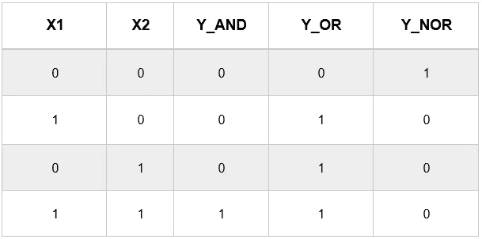
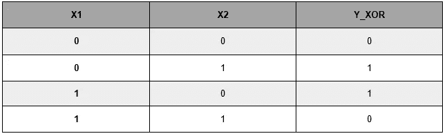
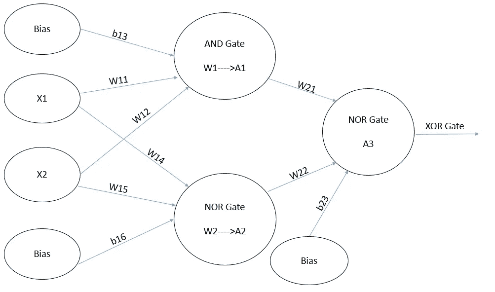
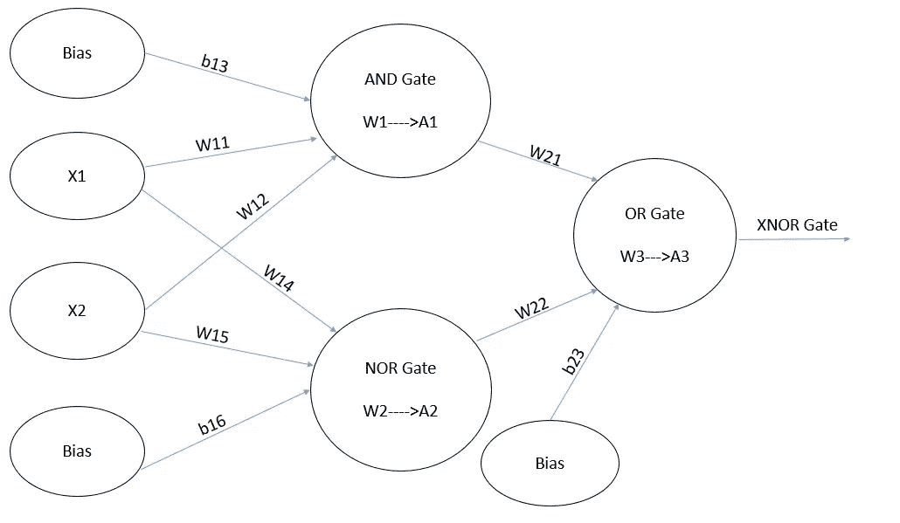

# 逻辑门:或，与，或非，异或，XNOR 使用 TensorFlow 2.0 API，GradientTape。

> 原文：<https://medium.com/analytics-vidhya/logical-gates-or-and-nor-xor-xnor-using-tensorflow-2-0-api-gradienttape-fce55a318d35?source=collection_archive---------6----------------------->

今天我们将讨论使用 tensorflow2 API 的逻辑门。

“与”、“或非”和“或”门可以由单个感知器来计算。

首先，我们将建立“与”、“或非”和“或”门。我们将保持输入不变，并将输出改为计算“与”、“或”和“或非”门。



与门、或门和或非门的真值表

在本教程中，我们将使用 tensorflow2 API。只需在 Jupyter 笔记本中运行以下命令，就可以知道 TensorFlow 的版本。

```
import tensorflow as tf
print(tf.__version__)#!pip install --upgrade tensorflow
```

现在，我们将初始化所有的训练示例，在我们的例子中只有四个。

```
# Let us initialize our training examples first. 
import tensorflow as tf
X1=tf.Variable(initial_value=[0.,1.,0.,1.])
X2=tf.Variable(initial_value=[0.,0.,1.,1.])
Y_AND=tf.Variable(initial_value=[0.,0.,0.,1.])
Y_NOR=tf.Variable(initial_value=[1.,0.,0.,0.])
Y_OR=tf.Variable(initial_value=[0.,1.,1.,1.])
Y_XOR=tf.Variable(initial_value=[0.,1.,1.,0.])
Y_XNOR=tf.Variable(initial_value=[1.,0.,0.,1.])
```

我们将创建一个模型类，在这里我们将做下面的
1)初始化权重，
2)创建一个感知机。
3)由于输出总是 0 或 1，我们将使用激活作为 [Sigmoid](https://en.wikipedia.org/wiki/Sigmoid_function) 。

```
class Model(object):

   def __init__(self):
     # Initialize the weights to `2.0` and the bias to `2.0`
     # In practice, these should be initialized to random values
     # self.W1=tf.random.normal([1])
     self.W1 = tf.Variable(2.)
     self.W2= tf.Variable(2.)
     self.b=tf.Variable(2.)

   def __call__(self, x1,x2):
     self.K1=self.W1 * x1 + self.W2 * x2 + self.b
     self.Output = tf.keras.activations.sigmoid(self.K1)
     return(self.Output)model=Model()
```

注意:在 TF 2.0 中，让模型类的对象可调用是一个很好的做法。
tensor flow 中的激活函数，可以参考这里的。

现在我们的模型类已经准备好了，我们需要写一个成本函数。由于我们有一个二进制分类问题，我们将使用二进制交叉熵损失函数。

```
def compute_cost(target_y, predicted_y):
    c=tf.keras.losses.BinaryCrossentropy()
    return(c(target_y,predicted_y))
```

你可以从这个[链接](https://www.tensorflow.org/api_docs/python/tf/keras/losses/BinaryCrossentropy)学习更多关于 tf.keras 损失函数的知识。至于现在，我们已经在模型类中创建了一个感知器，我们还创建了一个损失函数，所以现在将准备好计算梯度和训练我们的模型。

我们将使用 GradientTape 来寻找梯度，并将我们的模型收敛到最佳最小值。在进入 GradientTape 之前，我们将编写一个小函数，将空梯度转换为 0，因为，如果我们不进行转换，我们将在向变量分配空值时出错。

```
def None_to_Zero(v):
   if v==None:
      v=0
   return v
```

用于计算梯度和训练我们的模型的函数将被写成:

```
def train(model, X1, X2, Y2, learning_rate):
     with tf.GradientTape() as t:
          current_loss = compute_cost(Y2,model(X1,X2)) dW1,dW2,db=t.gradient(current_loss,[model.W1,model.W2,model.b])          
     dW1=None_to_Zero(dW1)
     db=None_to_Zero(db)
     dW2=None_to_Zero(dW2)
     model.W1.assign_sub(learning_rate * dW1)
     model.b.assign_sub(learning_rate * db)
     model.W2.assign_sub(learning_rate * dW2)
```

现在我们已经编写了所有需要的函数，现在我们将调用我们的 train 函数，在这里我们可以初始化所有的输入和输出值。

```
# As we have very less Input data we need to increase the number of # epochs.
epochs=range(1000)
learning_rate=0.1
for epoch in epochs:
   train(model, X1, X2,Y_AND, learning_rate)
   # train(model, X1, X2,Y_NOR, learning_rate)
   # train(model, X1, X2,Y_OR, learning_rate)#Once the training is done we can find results by calling the Model  #Class object as 
print(np.round(model(X1, X2).numpy()))
```

对于 Y_AND、Y_NOR、Y_OR，我们会得到 W1、W2 和 b 的不同值。我们会将这些值存储在字典中，因为我们将来会需要这些权重。

```
W_AND={‘W1’:model.W1.numpy(),
       ’W2':model.W2.numpy(),
       ’b’:model.b.numpy()}
#W_NOR(calculated by keeping Y_NOR)={‘W1’:-8.65,’W2':-8.65,’b’:3.86}
#W_OR(calculated by keeping Y_OR)={‘W1’:8.69,’W2': 8.69,’b’: -3.88}
```

现在我们将计算异或门。为此，我们需要将两个门“与”和“或非”组合在一起。



XOR 真值表

这个真值表可以借助下面的流程图来实现。



异或门-使用与门和或非门

我们现在将使用字典中存储的权重 W_AND 和 W_NOR 重写模型类

```
class Model_XOR(object):

     def __init__(self):
          self.W11 = tf.Variable(W_AND[‘W1’])
          self.W12= tf.Variable(W_AND[‘W2’])
          self.b13=tf.Variable(W_AND[‘b’])
          self.W14 = tf.Variable(W_NOR[‘W1’])
          self.W15= tf.Variable(W_NOR[‘W2’])
          self.b16=tf.Variable(W_NOR[‘b’])
          self.W21 = tf.Variable(W_NOR[‘W1’])
          self.W22= tf.Variable(W_NOR[‘W2’])
          self.b23=tf.Variable(W_NOR[‘b’])

     def __call__(self, x1,x2):
          self.W1=self.W11 * x1 + self.W12*x2 + self.b13
          self.W2=self.W14 * x1 + self.W15*x2 + self.b16
          self.A1 = tf.keras.activations.sigmoid(self.W1)
          self.A2 = tf.keras.activations.sigmoid(self.W2)
          self.W3=self.W21 * self.A1 + self.W22*self.A2 + self.b23
          self.A3 = tf.keras.activations.sigmoid(self.W3)
          return(self.A3)
model_xor=Model_XOR()
```

训练我们的 Model_XOR 将会像

```
def train_xor(model_xor, X1, X2, Y2, learning_rate):
      with tf.GradientTape() as t:
           current_loss = compute_cost(Y2,model_xor(X1,X2))

      dW11,dW12,db13,dW14,dW15,db16,dW21,dW22,db23=t.gradient
      (current_loss,[model_xor.W11,model_xor.W12,model_xor.b13,
      model_xor.W14,model_xor.W15,model_xor.b16,
      model_xor.W21,model_xor.W22,model_xor.b23,])

      model_xor.W11.assign_sub(learning_rate * None_to_Zero(dW11))
      model_xor.b13.assign_sub(learning_rate * None_to_Zero(db13))
      model_xor.W12.assign_sub(learning_rate * None_to_Zero(dW12))
      model_xor.W14.assign_sub(learning_rate * None_to_Zero(dW14))
      model_xor.b16.assign_sub(learning_rate * None_to_Zero(db16))
      model_xor.W15.assign_sub(learning_rate * None_to_Zero(dW15))
      model_xor.W21.assign_sub(learning_rate * None_to_Zero(dW21))
      model_xor.b23.assign_sub(learning_rate * None_to_Zero(db23))
      model_xor.W22.assign_sub(learning_rate * None_to_Zero(dW22))
```

最后，我们将设置我们的纪元和学习率，并调用我们的训练函数，以分别用 X1、X2 和 Y_XOR 作为输入和输出来训练我们的模型。

```
epochs=range(100)
learning_rate=0.1
for epoch in epochs:
   train_xor(model_xor, X1, X2,Y_XOR, learning_rate)
   #Once the training is done we can find results by calling the Model_XOR  #Class object as 
print(np.round(model_xor(X1, X2).numpy()))
```

我们现在已经完成了异或门和同或门，唯一的区别是在最终输出端的或门。您可以使用下图和我们之前存储的字典来完成 XNOR 门。



XNOR 门-使用 AND、NOR 和 OR 门

你可以在这里找到 XNOR 和异或门的完整代码。