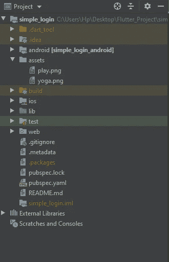
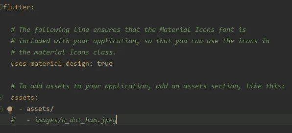
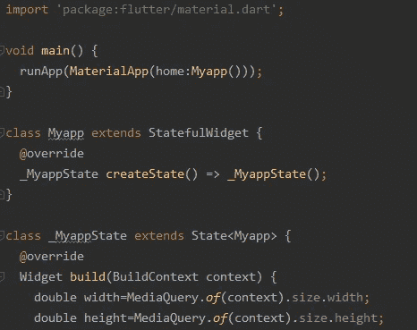

# 用 Flutter 设计登录页面

> 原文：<https://medium.com/analytics-vidhya/login-page-design-with-flutter-28371e78f7a2?source=collection_archive---------1----------------------->

登录页的代码演练

嘿，伙计们

欢迎回来，所以今天我们将使用 Flutter 创建令人惊叹的登录页面。所以大家都知道，通过使用 Flutter，我们可以创建跨平台的应用程序，如 Android、iOS、桌面、web 和 Linux。我使用 Android studio 来创建 flutter 应用程序，你也可以使用 Visual studio，这完全取决于你。因此，没有进一步的原因，让我们进入编码部分。

你可以看到下面的图片，它将显示当你打开 Android studio 时项目目录的样子。因此，在这里我们必须添加**资产文件夹**，在这里我们将存储项目所需的图像。



所以一旦你添加了那个文件夹，你就不能马上使用那个图像，你必须为它设置一些属性(简单地说你必须提到那个图像的路径)。要做到这一点，你必须打开**的 Pubspec。项目目录中 YAML** 文件。



在那个文件中，你必须提到资产文件的位置，这里你必须小心，因为这里的**缩进很重要**。一旦你确定了这条路，你就可以走了。是的，你现在可以在你的项目中使用这些图像，听起来不错，对吧😀

然后你要打开**主。dart** 文件并开始编码部分的工作。一旦你打开了那个文件，你就有了默认的代码，只需删除那些代码，使用你自己的代码，这将帮助你提高你的实现技巧。你可以在下图中看到，我在主函数中使用了 **MaterialApp 小部件**。在里面，你可以看到我有一个 home 属性，它被设置为名为 **Myapp** 的 dart 类。这就是所谓的**有状态小部件。**

生活黑客💡您可以键入 **stf** 并点击 enter 来创建有状态小部件，或者如果您想要创建无状态小部件，只需键入 **stl** 并点击 enter。



所以是的，我们完成了第一步。现在我们可以开始在返回小部件的**构建方法**中创建一些其他的小部件。

```
double width=MediaQuery.*of*(context).size.width;
double height=MediaQuery.*of*(context).size.height;
```

这里，我在 Build 方法中创建了一些 double 变量，它将给出当前设备的屏幕大小，我们可以用它来创建响应性应用程序。

```
return Scaffold(
      body: Container(
        height: height,
        width: width,
        child: SingleChildScrollView()));
```

最初，我创建了一个**脚手架小部件**，然后我创建了一个**容器**，并将宽度和高度设置为屏幕大小，在容器内部，我使用 **SingleChildScrollview 小部件**来滚动小部件。

这个 SingleChildScrollview 小部件有时会用于避免小部件重叠。

```
SingleChildScrollView(
          child: Column(
            mainAxisAlignment: MainAxisAlignment.center,
            children: [
              Container(
                width: width,
                height: height*0.45,
                child: Image.asset('assets/yoga.png',fit: BoxFit.fill,),
              ),
             Text('Login',style: TextStyle(fontSize: 25.0,fontWeight: FontWeight.*bold*),),
```

在那个 **SingleChildScrollview** 小部件中，我创建了**列小部件**，然后我使用了**容器**来存储图像，我将高度指定为 45%,宽度指定为屏幕的整个宽度。然后我有了**文本小部件**，它将显示**登录**标签，字体粗细为粗体，大小为 25。

```
 SizedBox(height: 30.0,),
              TextField(
                decoration: InputDecoration(
                  hintText: 'Email',
                  suffixIcon: Icon(Icons.*email*),
                  border: OutlineInputBorder(
                    borderRadius: BorderRadius.circular(20.0),
                  ),
                ),
              ),
```

这里我使用了一些 **SizedBox 部件**来提供顶部和底部部件之间的空间。我将 SizedBox 的高度指定为 30。然后我创建了 **TextField 小部件**，它将有许多属性。大多数情况下，我们在 Textfield 小部件中使用**控制器**和**输入解码**。在这个输入说明中，我们将指定**提示文本**和**后缀图标**。有时我们会指定边界来使这个文本字段更有吸引力。我们在文本字段中使用了**observecuretext**属性，这将帮助我们将这个文本字段设置为密码字段。

```
SizedBox(height: 20.0,),
              TextField(
                obscureText: true,
                decoration: InputDecoration(
                  hintText: 'Password',
                  suffixIcon: Icon(Icons.*visibility_off*),
                  border: OutlineInputBorder(
                    borderRadius: BorderRadius.circular(20.0),
                  ),
                ),
              ),
```

例如，您可以看到我在密码文本字段中使用了**observecuretext**属性。最初，它将被设置为 false，所以当我们需要该特性时，我们必须将该值设置为 true。**控制器**将帮助我们保存用户输入的文本。

```
RaisedButton(
                      child: Text('Login'),
                      color: Color(0xffEE7B23),
                      onPressed: (){},
                    ),
```

这里我有一个带有登录标签的 RaisedButton 和一些颜色属性。当您使用该按钮时，您必须指定按下功能上的**，否则该按钮将被禁用。在 **Onpressed** 函数内部，你可以编写你的动作。**

```
GestureDetector(
                onTap: (){
                  Navigator.*push*(context, MaterialPageRoute(builder: (context)=>Second()));
                },
                child: Text.rich(
                  TextSpan(
                    text: 'Don\'t have an account',
                    children: [
                      TextSpan(
                        text: 'Signup',
                        style: TextStyle(
                          color: Color(0xffEE7B23)
                        ),
                      ),
                    ]
                  ),
                ),
              ),
```

最后，我们有了**手势检测器部件**，它将识别用户输入，如双击、点击、按下、悬停等等。通过使用这个小部件，我们可以对许多小部件使用手势活动。所以在这里我将这个手势特性添加到了**文本小部件**中。当用户点击该文本时，它会使用**导航器**将用户重定向到另一个页面。导航器会将新页面推到当前页面的顶部。在这里，这个导航器将推送注册页面。

```
class Myapp extends StatefulWidget {
  @override
  _MyappState createState() => _MyappState();
}

class _MyappState extends State<Myapp> {
  @override
  Widget build(BuildContext context) {
    double width=MediaQuery.*of*(context).size.width;
    double height=MediaQuery.*of*(context).size.height;
    return Scaffold(
      body: Container(
        height: height,
        width: width,
        child: SingleChildScrollView(
          child: Column(
            mainAxisAlignment: MainAxisAlignment.center,
            children: [
              Container(
                width: width,
                height: height*0.45,
                child: Image.asset('assets/yoga.png',fit: BoxFit.fill,),
              ),
              Padding(
                padding: const EdgeInsets.all(8.0),
                child: Row(
                  mainAxisAlignment: MainAxisAlignment.start,
                  children: [
                    Text('Login',style: TextStyle(fontSize: 25.0,fontWeight: FontWeight.*bold*),),
                  ],
                ),
              ),
              SizedBox(height: 30.0,),
              TextField(
                decoration: InputDecoration(
                  hintText: 'Email',
                  suffixIcon: Icon(Icons.*email*),
                  border: OutlineInputBorder(
                    borderRadius: BorderRadius.circular(20.0),
                  ),
                ),
              ),
              SizedBox(height: 20.0,),
              TextField(
                obscureText: true,
                decoration: InputDecoration(
                  hintText: 'Password',
                  suffixIcon: Icon(Icons.*visibility_off*),
                  border: OutlineInputBorder(
                    borderRadius: BorderRadius.circular(20.0),
                  ),
                ),
              ),
              SizedBox(height: 30.0,),
              Padding(
                padding: const EdgeInsets.all(10.0),
                child: Row(
                  mainAxisAlignment: MainAxisAlignment.spaceBetween,
                  children: [
                    Text('Forget password?',style: TextStyle(fontSize: 12.0),),
                    RaisedButton(
                      child: Text('Login'),
                      color: Color(0xffEE7B23),
                      onPressed: (){},
                    ),
                  ],
                ),
              ),
              SizedBox(height:20.0),
              GestureDetector(
                onTap: (){
                  Navigator.*push*(context, MaterialPageRoute(builder: (context)=>Second()));
                },
                child: Text.rich(
                  TextSpan(
                    text: 'Don\'t have an account',
                    children: [
                      TextSpan(
                        text: 'Signup',
                        style: TextStyle(
                          color: Color(0xffEE7B23)
                        ),
                      ),
                    ]
                  ),
                ),
              ),

            ],
          ),
        ),
      ),
    );
  }
}
```

因此，通过使用上面的代码，我们可以创建登录屏幕。注册页面也有相同的代码，但是添加了一些额外的文本字段。如果你有任何疑问，你可以参考我的 [Github 页面](https://github.com/bjoffficial/Simple-login)或者我的 [Youtube 视频](https://www.youtube.com/watch?v=xfPGvLPfKv0&feature=youtu.be)