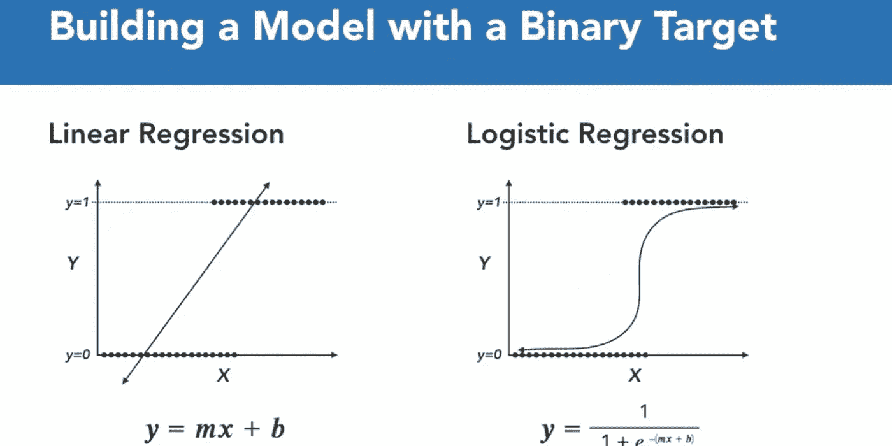

# 逻辑回归！

> 原文：<https://medium.com/analytics-vidhya/logistic-regression-37955f041b27?source=collection_archive---------20----------------------->


> 我们将从回归的定义开始，然后解析什么是逻辑回归。因此，作为一个通用术语，回归是一个估计变量之间关系的统计过程。这通常用来预测某个结果。线性回归是当您有一个连续的目标变量时使用的一种回归类型。例如，在这种情况下，我们试图通过降雨量来预测雨伞的销量，线性回归的算法定义是 y = mx + b，这就是线性回归。但是让我们回到逻辑回归。
> 
> 逻辑回归是一种回归形式，其中目标变量或您试图预测的事物是二元的。所以只有 0 或 1，或真或假，或类似的东西。为什么我们需要两种不同的回归算法？为什么线性回归不适用于二元目标变量？想象一个图，我们只是用一个 x 轴上的 x 特征来预测一个二进制的 y 结果。如果我们对这样的二元目标使用线性回归，用一条最佳拟合线就可以了。线性回归会尝试拟合一条适合所有数据的直线，最终会预测负值和大于 1 的值，这是不可能的。
> 
> 逻辑回归是建立在逻辑曲线或 sigmoid 曲线的基础上的，就像你在下面看到的这个 S 形。。这将总是在 0 和 1 之间，这使得它更适合二进制分类问题。我们看到了这个方程，它代表了逻辑回归的方程是什么样的？逻辑回归的方程是什么样的？基本上，它只是采用线性回归算法， 它只对 mx + b 线采用线性回归算法，对 mx + b 线采用线性回归算法，把它作为 e 的负指数，把它作为 e 的负指数，所以我们的完整方程是 1/1+e 到负 mx + b，所以我们的完整方程是 1/1+e 到负 mx + b，这就产生了这条很好的 S 形曲线，非常适合二进制分类问题。 这使得它非常适合二进制分类问题。



所以什么时候用逻辑回归，什么时候不用！！

## 何时使用

> 二元目标变量
> 
> 透明度很重要，或者对预测值的显著性感兴趣。
> 
> 表现相当好的数据
> 
> 需要一个快速的初始基准..

## 何时不使用

> 连续目标变量
> 
> 海量数据
> 
> 性能是唯一重要的东西

# 让我们建立逻辑回归模型，预测用户是否会购买该产品。

输入库

```
**import** **pandas** **as** **pd** 
**import** **numpy** **as** **np** 
**import** **matplotlib.pyplot** **as** **plt**dataset = pd.read_csv('...**\\**User_Data.csv')
```


现在，要预测用户是否会购买该产品，需要找出年龄和估计工资之间的关系。在这里，用户 ID 和性别不是发现这一点的重要因素。

```
*# input* 
x = dataset.iloc[:, [2, 3]].values 

*# output* 
y = dataset.iloc[:, 4].values
```

拆分数据集以进行训练和测试。75%的数据用于训练模型，25%的数据用于测试模型的性能。

```
**from** **sklearn.cross_validation** **import** train_test_split 
xtrain, xtest, ytrain, ytest = train_test_split( 
x, y, test_size = 0.25, random_state = 0)
```

现在，在这里执行特征缩放非常重要，因为年龄和估计工资值位于不同的范围内。如果我们不缩放特征，那么当模型在数据空间中找到数据点的最近邻居时，估计工资特征将支配年龄特征。

```
**from** **sklearn.preprocessing** **import** StandardScaler 
sc_x = StandardScaler() 
xtrain = sc_x.fit_transform(xtrain) 
xtest = sc_x.transform(xtest) 

print (xtrain[0:10, :])
```

**输出:**

```
[[ 0.58164944 -0.88670699]
 [-0.60673761  1.46173768]
 [-0.01254409 -0.5677824 ]
 [-0.60673761  1.89663484]
 [ 1.37390747 -1.40858358]
 [ 1.47293972  0.99784738]
 [ 0.08648817 -0.79972756]
 [-0.01254409 -0.24885782]
 [-0.21060859 -0.5677824 ]
 [-0.21060859 -0.19087153]]
```

这里曾经看到年龄和估计的工资特征值被缩放，现在在-1 到 1 之间。因此，每个特征在决策中的贡献是相等的，即最终确定假设。

最后，我们正在训练我们的逻辑回归模型。

```
**from** **sklearn.linear_model** **import** LogisticRegression 
classifier = LogisticRegression(random_state = 0) 
classifier.fit(xtrain, ytrain)
```

训练完模型后，就可以用它对测试数据进行预测了。

```
y_pred = classifier.predict(xtest)
```

让我们测试一下我们的模型——混淆矩阵的性能

```
**from** **sklearn.metrics** **import** confusion_matrix 
cm = confusion_matrix(ytest, y_pred) 

print ("Confusion Matrix : **\n**", cm)Confusion Matrix : 
 [[65  3]
 [ 8 24]]
```

满分 100 分:
真正+真负= 65 + 24
假正+假负= 3 + 8

绩效衡量——准确性

```
**from** **sklearn.metrics** **import** accuracy_score 
print ("Accuracy : ", accuracy_score(ytest, y_pred))Accuracy :  0.89
```