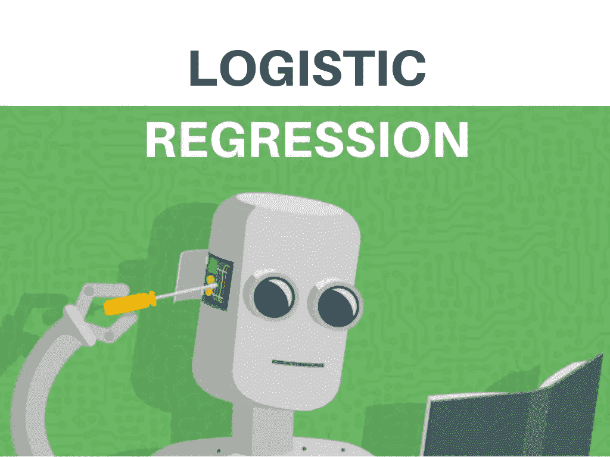
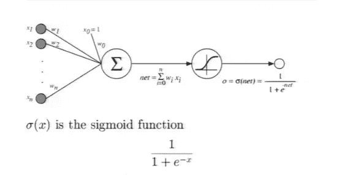
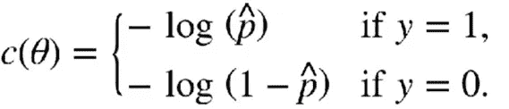
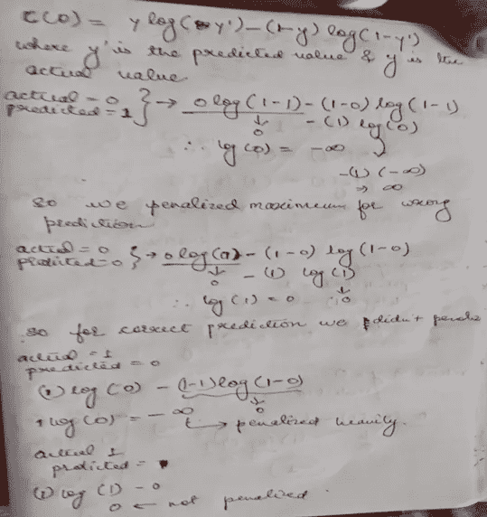
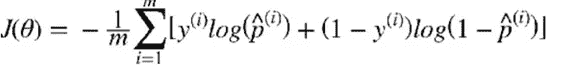
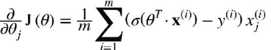

# 逻辑回归

> 原文：<https://medium.com/analytics-vidhya/logistic-regression-46a0f3cdecef?source=collection_archive---------17----------------------->

[https://S3 . AP-south-1 . Amazon AWS . com/S3 . study tonight . com/curious/uploads/pictures/1544244178-1 . jpg](https://s3.ap-south-1.amazonaws.com/s3.studytonight.com/curious/uploads/pictures/1544244178-1.jpg)

逻辑回归类似于多元线性回归，只是结果是二元的。与其名称相反，逻辑回归是一种分类方法，在基于文本的分类中非常强大。它通过首先对逻辑函数执行回归来实现这一点，因此得名。由于它的快速计算速度和它的模型输出有助于新数据的快速评分，它是一种流行的方法。

问题是，我们如何从一个二元结果变量得到一个可以用线性方式建模的结果变量，然后再回到二元结果？就像线性回归模型一样，逻辑回归模型计算输入要素的加权和(加上一个偏差项)，但它不像线性回归模型那样直接输出结果，而是输出该结果的逻辑。

基本上，它首先像线性回归一样计算权重和截距，然后将结果传递给一个称为逻辑函数或 sigmoid 函数的函数，该函数将输出限制在 0 和 1 之间。

[https://d2o 2 utebsixu 4k . cloudfront . net/media/images/9 a 57 ce 9 a-b10c-4ed 0-9729-50d 979 af 0a 6 f . jpg](https://d2o2utebsixu4k.cloudfront.net/media/images/9a57ce9a-b10c-4ed0-9729-50d979af0a6f.jpg)

[https://cdn-images-1 . medium . com/max/1500/1 * A5aJEuk5SX-L-b8 _ 2 kw 7 BG . png](https://cdn-images-1.medium.com/max/1500/1*A5aJEuk5SX-L-b8_2Kw7Bg.png)

输出(p)的范围在 0 和 1 之间；而如果**Y = 1；如果 p ≥ 0.5 且为 0；如果 p ≤ 0.5**

# 培训和成本函数

现在我们知道了逻辑回归模型是如何估计概率并做出预测的。但是它是怎么训练出来的呢？训练模型的目的是估计正面实例(y = 1)的高概率和负面实例(y = 0)的低概率

上面的等式是单个训练实例的成本函数。这个等式是有意义的，因为我们想要对每一个错误的预测进行严厉的惩罚。

作者图片

整个训练集的成本函数就是所有训练实例的平均成本。

现在，我们的目标是找到最小化该成本函数的θ，但坏消息是，没有已知的**闭合形式方程**来计算它。但好消息是这个代价函数是**凸**的，所以**梯度下降**(或者其他任何优化算法)保证能找到全局最小值。

对于每个实例，它计算预测误差并将其乘以第 j 个特征值，然后计算所有训练实例的平均值。一旦你有了包含所有偏导数的梯度向量，你就可以在批量梯度下降算法中使用它。就这样:你现在知道如何训练一个逻辑回归模型。

# 词汇提醒

二元的:只涉及两个选项之间的选择或条件的。

**封闭型方程**:如果一个方程从一个给定的普遍接受的集合中通过函数和数学运算解决了一个给定的问题，那么这个方程就是一个封闭型解

**凸函数:**考虑一个函数 y=f(x)，假设它在区间[a，b]上连续。如果对于[a，b]中的任意两点 x1 和 x2，以下不等式成立，则函数 y=f(x)称为向下凸(或向上凹):

> **f((x1+x2)/2)≤(f(x1)+f(x2))/2**

**代价函数:**是**针对给定数据，衡量机器学习模型**性能的函数。成本函数量化了预测值和期望值之间的误差，并且**以单个实数的形式呈现。**

您可以查看我的 github 链接，了解真实世界数据集上的逻辑回归实现——[https://github.com/akshayakn13/Logistic-Regression](https://github.com/akshayakn13/Logistic-Regression)

查看我关于机器学习的其他文章:

[从零开始的线性回归。](https://ak95ml.blogspot.com/2020/06/linear-regression.html)

[美汤刮痧](https://www.blogger.com/blog/post/edit/1004924421828631592/5881650886724527591#)

[我如何开始我作为机器学习爱好者的旅程](https://www.blogger.com/blog/post/edit/1004924421828631592/5881650886724527591#)

# 了解更多关于逻辑回归的外部资源

> 使用 Scikit-Learn 和 TensorFlow- Aurélien Géron 进行机器学习实践。
> 
> *数据科学家实用统计学-Peter Bruce 和 Andrew Bruce*
> 
> 用 Python 构建机器学习系统——威利·里歇特·路易斯·佩德罗·科埃略