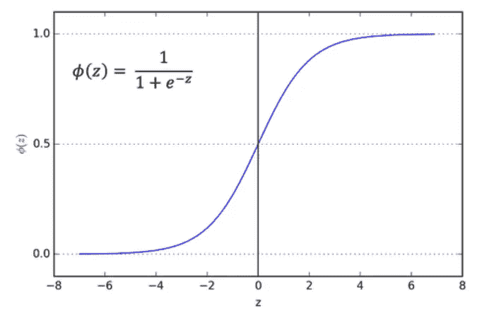

# 逻辑回归

> 原文：<https://medium.com/analytics-vidhya/logistic-regression-8f037d180d6f?source=collection_archive---------12----------------------->

逻辑回归是一种基于概率概念的监督分类算法。这是解决二元分类问题的常用方法。逻辑回归用于将观察值分配给一组离散的类。分类问题的一些例子是垃圾短信或非垃圾短信、在线交易欺诈或非欺诈、恶性或良性癌症。逻辑回归使用逻辑 sigmoid 函数转换其输出(在 0 和 1 之间),以返回概率值。

在分类问题中，对于给定的一组特征(或输入)x，标签(或输出)y 只能取离散值。

逻辑回归建立回归模型(预测连续值输出的模型)来预测给定数据条目是否属于特定类别/类的概率。逻辑回归以 sigmoid 函数/逻辑函数作为成本函数对数据进行建模。

Sigmoid 函数:

逻辑回归的假设将成本函数限制在 0 和 1 之间。因此，sigmoid 函数被用作成本函数，因为线性函数无法表示它(线性函数可以具有大于 1 或小于 0 的值，根据逻辑回归的假设，这是不可能的)。

# 假设表示

线性回归中的假设公式

在哪里，

和

对于逻辑回归公式的假设将是

这基本上是一个 sigmoid 函数，

。让我们看看这个函数如何总是给我们 0 到 1 之间的值。

当...的时候

什么时候

因此，这种假设总是给出 0 到 1 之间的值。

# 判别边界

例如，我们有 2 个类，让我们把它们看作垃圾邮件和非垃圾邮件(1-垃圾邮件，0-非垃圾邮件)。我们基本上确定一个阈值，高于该阈值时，我们将输入分类为类别 1，如果该值低于该阈值，则我们将其分类为类别 2。

如上图所示，我们选择阈值为 0.5，如果预测函数返回值为 0.7，则我们会将此观察结果分类为 1 类(垃圾邮件)。如果我们的预测返回值为 0.2，那么我们会将观察结果分类为第 2 类(非垃圾邮件)。

# 价值函数

我们知道成本函数

在线性回归中，成本函数代表优化目标，即我们创建一个成本函数并将其最小化，以便我们可以开发一个误差最小的精确模型。

如果我们在“逻辑回归”中使用线性回归的成本函数，那么它会给我们一个具有许多局部最小值的非凸函数，这将使我们难以找到全局最小值。

非凸函数

对于逻辑回归，成本函数定义为:

上述两个函数可以写成一个函数，即

# 梯度下降

现在，我们必须将成本价值降至最低。这可以通过几种方法来完成。其中**梯度下降**最简单易懂。

现在，为了最小化成本函数，我们需要对每个参数运行梯度下降函数，即

我们的目标是最小化成本函数，我们必须对每个参数运行梯度下降函数

梯度下降简化|图片:吴恩达球场

梯度下降有一个类比，我们必须想象自己在一个山谷的顶部，我们的目标是到达山脚，感受我们周围地形的坡度。这个动作实际上类似于计算梯度下降，并且采取一个步骤类似于更新参数的一次迭代。

梯度下降类比

一旦我们达到了局部最小值，我们就最小化了我们的成本函数，我们的模型得到了一个假设，给出了几乎准确的结果。

到目前为止，我们只关注二元分类。现在让我们简要了解一下使用逻辑回归进行多类分类的方法。

多类分类

在多类分类中，我们将输入分为两类以上，例如，从给定的维度识别物体的形状，识别不同种类的车辆，预测颜色类型等。因此，现在不是 y = {0，1}，而是 y = {0，1…n}。

由于我们有 y = {0，1…n}，我们将我们的问题分成 n+1 个二进制分类问题。在每个二元分类问题中，我们预测“y”是其中一个类别的成员的概率。

在这里，我们选择一个类，然后将所有其他类放在一个单独的第二类中。我们一次又一次地这样做，对每个案例应用二元逻辑回归，然后使用返回最高值的假设作为我们的预测。

多类分类