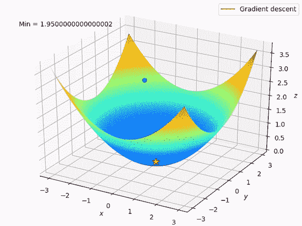

# 逻辑回归——几何视角

> 原文：<https://medium.com/analytics-vidhya/logistic-regression-a-geometric-perspective-c2997fdb54cc?source=collection_archive---------15----------------------->

Jossuha Théophile 在 [Unsplash](https://unsplash.com/s/photos/math?utm_source=unsplash&utm_medium=referral&utm_content=creditCopyText) 上拍摄的照片

L 逻辑回归是最流行的监督机器学习技术之一，广泛用于解决分类问题。在这篇博文中，我们将逐步理解逻辑回归，我们也将到达逻辑回归内部解决的最优化问题。

尽管“逻辑回归”的名字中有**回归**，但它实际上解决了分类问题。逻辑回归只能解决两类分类问题，但我们也可以在**一对一**设置中使用它来解决多类分类问题。

有多种方法可以得出逻辑回归的优化方程，我们可以遵循概率方法、损失最小化方法或几何方法。在本讨论中，我们将遵循**几何方法**得出优化方程。

但是在我们开始推导逻辑回归之前，我们先来谈谈直线的方程。

## 一条线的方程是什么？

众所周知，一条线的方程是，

但是，还有另一种形式可以表达直线方程，称为**一般形式**。直线方程的一般形式是，

但是这两个方程是如何联系在一起的呢？让我们把这两个等式联系起来。

就是这样！很简单，对吧？

为了推导逻辑回归，我们将使用直线方程的一般形式。

## 逻辑回归是如何工作的？

假设:逻辑回归的大假设是*我们的数据点在它们所在的空间( *2D，3D 或 nD* )中是线性可分的*。

**步骤 1** :由于逻辑回归只能解决两个分类任务，所以我们将得到两个唯一的输出或目标变量( *Y* )。在逻辑回归的几何公式中，我们将一个目标变量标记为 *-1* ，将另一个标记为 *+1。*

假设， *D 是我们的数据集，我们必须解决两类分类问题。*

逻辑回归背后的核心思想:在逻辑回归中，我们试图找出(在 *2D* 中的)直线或(在 *3D* 中的)平面或(当维数大于 *3* 时的)超平面，它们最好地分离了我们所有的输入变量( *X* )。

因此，对于高维空间，逻辑回归的决策边界是线(在 2D)、平面(在 3D)和超平面。

视觉上，

> 为了得到最好地分离我们需要的所有数据点的线， *w 和 w_0，*为了降低数学复杂性，我们将丢弃 w_0 的截距项，并且对于这个讨论，我们将把自己限制在仅仅二维空间中，但是这个想法也可以容易地扩展到多维设置。

**第二步**:假设， *w* 是垂直于最佳分隔我们所有输入变量( *X)的直线的单位向量。*某一特定点(假设 x_i)到直线的距离为，

正如我们所讨论的，我们的输出变量有两个标签，+1 代表一组数据点，而-1 代表另一组数据点。

**第三步**:现在我们将 x_i 到对应类标号(Y_i)的直线的距离相乘，也称为 x_i 的有符号距离。

***注意:当且仅当 x_i* 的符号距离为 *+ve 且 w* 时，x _ I 才会被正确分类。我们希望所有的 *x 的*都被正确分类。**

因此，将最大化符号距离的 *w 单位向量*将与垂直于最佳分离我们所有数据点的平面的 *w* 相同。我们希望找到最佳的 *w* ，它最大化我们数据集中所有 *x_i* 的符号距离。所以，最优的 *w* 可以写成:

但是在现实世界中，我们的数据集包含大量异常值，上面的寻找最优值的公式不容易出现异常值。一个简单的异常值可以扭曲整个设置。

**第四步**:为了使其易于离群，研究人员引入了一个名为 ***的函数，Sigmoid function*** 将弱模型转化为一个健壮的易于离群的模型。实际上，我们采用的不是原始的带符号距离，而是 Sigmoid 函数。但是这个 sigmoid 函数是什么呢？

视觉上，

*sigmoid 函数*在 0 附近几乎是线性的，但随着 x 变大或变小，它会逐渐消失。在取我们的符号距离的 sigmoid 之后，优化方程变成，

**步骤 5** :现在，我们想使我们的函数单调，所以我们只取它的对数。众所周知，对数是一个单调函数。

**步骤 6** :现在，我们的目标是将最大化问题转化为最小化问题。这很简单，我们只要接受它的负面影响，我们就完成了。

以上是逻辑回归内部求解的优化方程。让我们更清楚地了解上面的等式。等式说，

## 引入正规化:

真实世界的数据集包含大量的离群值。如果我们使模型过度适应训练数据，那么会增加模型的泛化误差，这是我们不希望的！但是一个模型什么时候会过度拟合呢？只有当损失变为 0 或几乎为 0 时。

让我们来看看我们已经推导出的损失函数。

我们知道，log(1) = 0。因此，当且仅当 exp(-z_i)趋于 0 时，loss 将变为 0 或接近 0，这意味着我们剩下 log(1)为 0。但是什么时候项变成 0 呢？我们来画一下。

x 轴代表 z_i，y 轴代表 exp(-z_i)。

可以看到，只有当 z_i 趋于无穷大(或者大于 5)时，exp(-z_i)才变成 0，我们不要忘记 z_i 只有一个变量 *w.*

作为一个正则表达式，我们将使用λ乘以 L2 范数 *w，*，其中λ是一个超参数。随着 exp(-z_i)的减少，正则项将自动增加，这将避免训练数据中的过度拟合。我们通过超参数调谐找到 lamda，在正确的 lamda 处我们将有很好的拟合！

还有其他可用的正则化技术。命名，L1 正则，创造 sparcity，弹性网正则等。

## **但是我们如何解这个复杂的方程并得到最优的 w 呢？**

没什么特别的。我们使用梯度下降或梯度下降的任何其他变体(如小批量 SGD、SGD 等)来解决它，其中我们多次更新 w 以最小化损失，最终我们得到最小化损失的最佳 w。

## 参考资料:

1.  [AAIC 的逻辑回归。](https://youtu.be/wzwZtZAJGq8)
2.  [梯度下降，神经网络如何学习。](https://youtu.be/IHZwWFHWa-w)
3.  W [机器学习中的 Norm 是什么？](https://youtu.be/FiSy6zWDfiA)