# 逻辑回归

> 原文：<https://medium.com/analytics-vidhya/logistic-regression-a8e3d7c2e5ee?source=collection_archive---------20----------------------->

逻辑回归是监督学习分类算法。在这个算法中，目标属性或因变量是二分的，这意味着只有两个可能的类。简而言之，因变量本质上是二进制的，数据编码为 1(代表是/肯定/成功)或 0(代表否/否定/失败)。它用于估计一个实例属于特定类的概率。

我们使用给定的逻辑函数，

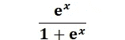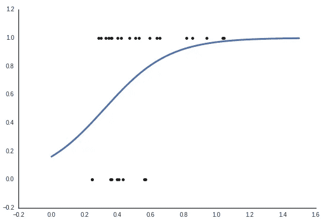

逻辑函数具有以下特征:
其值在 0 和 1 之间。
收敛于 1，趋近于+∞。
收敛到 0，趋近于-∞。
是平滑对称的曲线。

**用 scikit 学习 Python 中的逻辑回归:**

在给定的例子中，我们已经确定了泰坦尼克号上有多少人幸存，有多少人没有。为此，我们必须导入所需的库。

```
import pandas as pd
import numpy as np
import seaborn as sns
import matplotlib.pyplot as plt
from sklearn.model_selection import train_test_split
from sklearn.linear_model import LogisticRegression
from sklearn.metrics import classification_report,confusion_matrix,accuracy_score
```

以下命令用于使用 pandas 读取 CSV 文件。
下载数据集:[点击此处](https://www.kaggle.com/hesh97/titanicdataset-traincsv)

```
df=pd.read_csv('/content/drive/My Drive/titanic.csv')
df
```

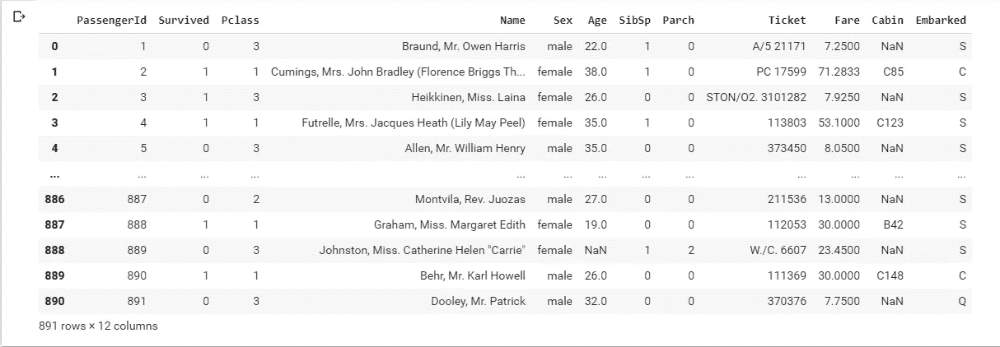

泰坦尼克号. csv

可视化数据:

```
df.hist()
```

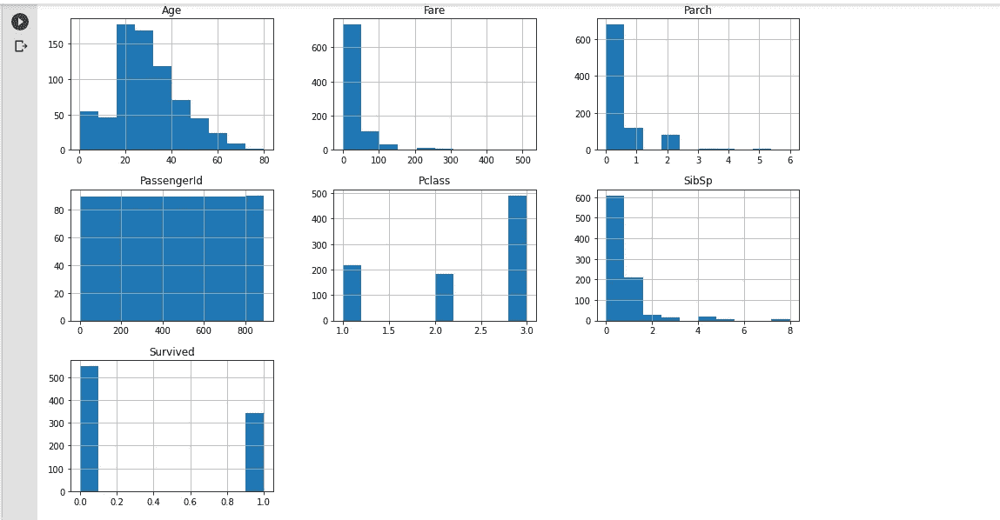

```
sns.countplot(x = 'Survived',data = df)
```

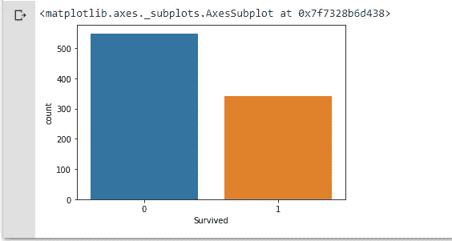

```
sns.countplot(x = ’Survived’,hue = ’Sex’,data = df)
```

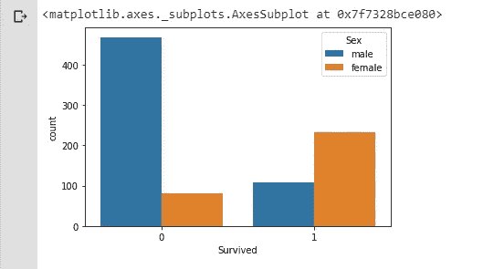

数据预处理:

```
df.isnull().sum()
```

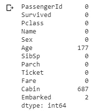

```
sns.heatmap(df.isnull(),yticklabels = False)
```

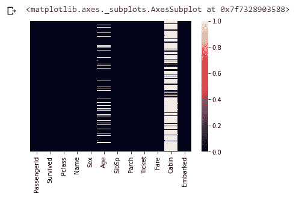

将分类变量转换为指示变量

```
sex = pd.get_dummies(df[‘Sex’])
sex
```

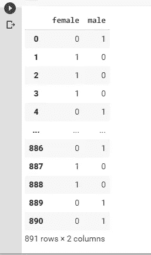

```
embarked = pd.get_dummies(df[‘Embarked’])
embarked
```

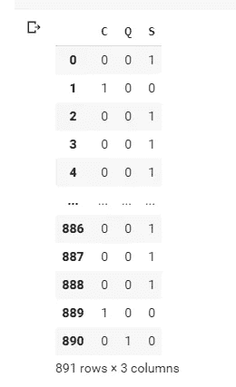

从数据集中删除不必要的列

```
df.drop([‘Sex’,’Embarked’,’PassengerId’,’Name’,’Ticket’,’Fare’,’Cabin’,’Parch’,’SibSp’,’Age’],axis=1,inplace=True)
```

连接所需的列

```
df=pd.concat([df,sex,e],axis=1)
df
```

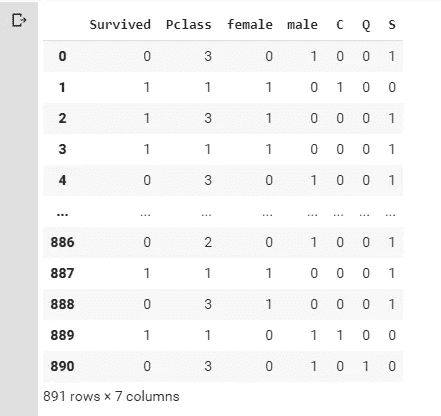

数据集分为“属性”和“标签”。属性是自变量，而标签是因变量，其值将被预测。在这个例子中，Pclass、sex、embarked 是自变量，而 Survived 是因变量。

```
X = df.drop(“Survived”,axis=1)
y = df[“Survived”]
```

训练和测试数据:

```
X_train,X_test,y_train,y_test=train_test_split(X,y,test_size=0.3,random_state=1)
```

在将数据分成训练集和测试集之后，是时候训练我们的算法了。为此我们使用了逻辑回归

```
model = LogisticRegression()
model.fit(X_train,y_train)
```

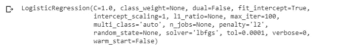

```
y_pred = model.predict(X_test)
y_pred
```

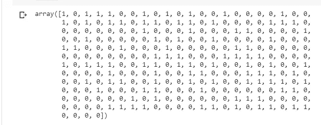

显示混淆矩阵:
混淆矩阵是对一个分类问题的预测结果的总结。正确和错误预测的数量用计数值汇总，并按每个类别细分。

```
confusion_matrix(y_test,y_pred)
```


找出准确度分数

```
print(‘Accuracy Score:’,accuracy_score(y_test,y_pred)*100)
```


**结论:**
本文研究了机器学习算法，即逻辑回归。
我们使用 scikit learn 实现了逻辑回归。

我希望你们理解如何实现逻辑回归。请在评论区告诉我你的疑问和建议。

快乐学习！！