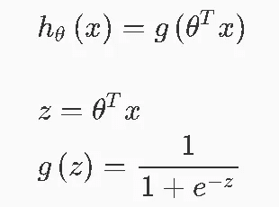
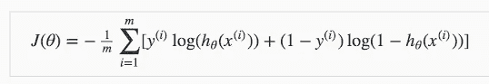
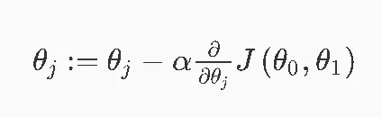
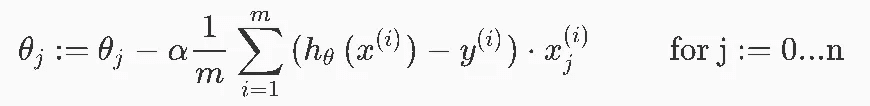
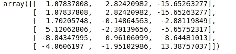

# Python 中从头开始的逻辑回归算法

> 原文：<https://medium.com/analytics-vidhya/logistic-regression-algorithm-from-scratch-with-python-447b17c7502?source=collection_archive---------19----------------------->


有许多机器学习包和框架可以帮助你训练你的模型，但它们并没有显示幕后发生了什么，在每一步中你的数据发生了什么，以及所涉及的数学，因此在本文中，我将在没有任何框架的情况下从头实现逻辑回归算法。

我要用的数据集是鸢尾花数据集，你可以在这里找到它。

Iris flower 数据集是由英国统计学家和生物学家罗纳德·费雪在其 1936 年的论文《分类问题中多重测量的使用》中引入的多元数据集。它有时被称为安德森虹膜数据集，因为埃德加·安德森收集的数据量化了三个相关物种的虹膜花的形态变化。该数据集由来自三种鸢尾(刚毛鸢尾、海滨鸢尾和杂色鸢尾)的每一种的 50 个样本组成。测量每个样品的四个特征:萼片和花瓣的长度和宽度，以厘米为单位。

# 预处理我们的数据

```
import numpy as np
import scipy.optimize as opt
import pandas as pd# the get the same random order of row
np.random.seed(4)#the location of your IRIS.csv
data = pd.read_csv('data/IRIS.csv')#replace flowers name by numbers 1,2,3
species={'Iris-setosa':0,'Iris-versicolor':1,'Iris-virginica':2}# reorder the row of the dataset
data  = data.sample(frac=1)data = data.replace({'species':species})X = data.iloc[:,:-1].values
y = data.iloc[:,-1].values
y = y[:,np.newaxis]# split our data 
train_X ,test_X = X[:100,:],X[100:,:]
train_y ,test_y = y[:100,:],y[100:,:]
```

# sigmoid 函数

既然我们在分类问题中，我们假设的结果 **h(x)** 函数应该只在 1 或 0 之间。所以我们需要使用 sigmoid 函数 **g(z) :**



假设函数 h(x)

```
#sigmoid function code 
def sigmoid(z) : 
    h = 1 / (1 + np.exp(-z))
    return h
```

# 价值函数

逻辑回归的成本函数表示如下:



价值函数

```
#cost function 
def costFunction(theta, X, y):
    m = X.shape[0]
    h = sigmoid(X @ theta)
    temp1 = np.multiply(y,np.log(h))
    temp2 =np.multiply( (1 - y), np.log(1 - h))
    cost = -(1/m)* np.sum(temp1 + temp2) 
    return cost
```

# 梯度下降

梯度下降不断改变参数以逐渐降低成本函数。随着每次迭代，我们将更接近全局最小值。每次迭代时，参数必须同时调整！“步长”/迭代的大小由参数α(学习速率)决定。我们需要仔细选择α，如果我们选择小α，成本函数会变慢，如果我们选择大α，我们的成本函数将无法收敛



计算成本函数的导数后，我们得到:



```
#gradient descent code
def gradient(theta,X,y):
    m = X.shape[0]
    temp = sigmoid(np.dot(X, theta)) - y
    grad = np.dot(temp.T, X).T / m

    return grad
```

# 成本函数优化

在运行优化函数之前，我们需要初始化参数θ

```
m = train_X.shape[0] # number of train set row 
m_test = test_X.shape[0] # number of test set row#add a coulmn of ones the data set (the bias)
train_X = np.hstack(( np.ones((m,1)) ,train_X)) 
test_X = np.hstack(( np.ones((m_test,1)) ,test_X))# number of classes
k = 3n =train_X.shape[1]# initialize theta
theta = np.zeros((n,k))
```

现在我们可以运行我们的优化函数，我将使用 scipy *fmin_cg* 函数

```
for i in range(k) :
    theta[:,i] = opt.fmin_cg(
        f=costFunction,
        x0=theta[:,i],
        fprime=gradient,
        args=(train_X,(train_y == i).flatten()),
        maxiter=50
    )
```

参数θ的优化值应该是这样的

```
print(theta)
```



希腊字母的第八字

现在让我们检查模型的准确性，为此我们应该使用测试集数据:

```
prediction = np.argmax(test_X @ theta,axis=1) 
accuracy = np.mean(prediction == test_y.flatten()) * 100
accuracy
```

你应该得到 100%的准确性，所以我们的模型做得很好

所以从零开始实现机器学习的目的是为了获得对机器学习算法中使用的数学的强烈直觉。

在下一次，我将使用 sklearn 解决同样的问题，这样我们可以比较这两种方法，并了解 sklearn 方法在幕后做什么。