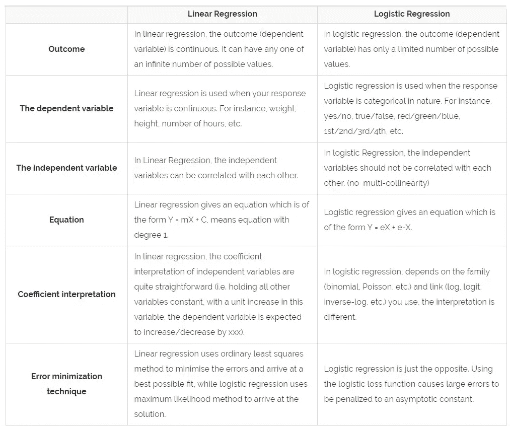
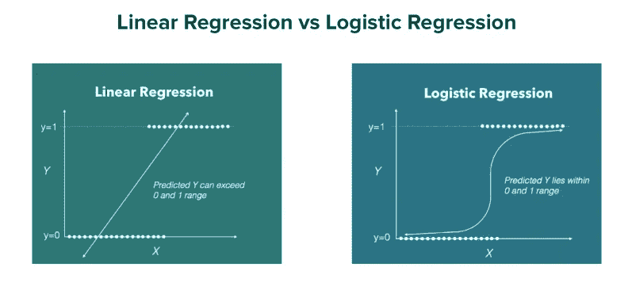

# 逻辑回归及其数学实现

> 原文：<https://medium.com/analytics-vidhya/logistic-regression-and-its-mathematical-implementation-722434ed01a5?source=collection_archive---------7----------------------->

每种机器学习算法在给定的一组条件下表现最佳。为了确保良好的性能，我们必须知道根据手头的问题使用哪种算法。你不能用一种特定的算法来解决所有的问题。例如:线性回归算法不能应用于分类相关变量。这就是逻辑回归的用武之地。

你一定想知道什么是逻辑回归？和其他算法有什么不同？如果不对连续结果建模，为什么逻辑回归被称为“回归”？

为了回答所有这些有趣的问题，并学习逻辑回归背后的一些数学知识，我们将在这个博客中学习:-

1.  逻辑回归？

*   什么是逻辑回归？
*   逻辑回归曲线
*   何时使用逻辑回归？
*   使用案例:

2.线性与逻辑回归。

3.数学实现。

*   阈值
*   逻辑回归方程

4.如果不对连续结果建模，为什么逻辑回归被称为“回归”？

5.线性回归如何转化为 logistic 回归？

6.逻辑回归的利与弊。

# 逻辑回归

> 逻辑回归是一种流行的用于二元分类的统计模型，即用于类型*这个或那个*、*是或否*、 *A 或 B* 等的预测。

然而，逻辑回归可用于多类分类，但这里我们将集中于其最简单的应用。这是二进制分类中最常用的机器学习算法之一，它将输入转换为 0 或 1。举个例子，

*   0:负类
*   1:积极类

分类的一些例子如下:

*   **电子邮件**:垃圾邮件/非垃圾邮件
*   **网上交易**:欺诈/非欺诈
*   **肿瘤**:恶性/非恶性

## 什么是逻辑回归？

> 当因变量有二元解时，逻辑回归是适当的回归分析。它以二进制格式**产生结果**，用于**预测**分类因变量的结果。它给出范围在 0 和 1 之间的离散输出。

逻辑回归的实施步骤。

## 逻辑回归曲线

逻辑函数

函数 **g(z)** 是**逻辑函数**，也称为 *sigmoid 函数*。

逻辑函数在 0 和 1 处有渐近线，它在 0.5 处穿过 y 轴。

## 何时使用逻辑回归？

当输入需要被线性边界分成“两个区域”时，使用逻辑回归。数据点使用直线分隔，如下所示:

根据类别的数量，逻辑回归可以分为:

1.  **二项式:**目标变量只能有两种可能的类型:“0”或“1”，分别代表“赢”与“输”、“通过”与“失败”、“死”与“活”等。
2.  **多项式:**目标变量可以有 3 个或更多未排序的可能类型(即类型没有数量意义)，如“疾病 A”对“疾病 B”对“疾病 C”。
3.  **序数:**用有序的类别处理目标变量。例如，一个测试分数可以被分类为:“非常差”、“差”、“好”、“非常好”。在这里，每个类别都可以被赋予 0、1、2、3 这样的分数。

我们可以通过**准确度、精确度、FI 得分、ROC 曲线、混淆矩阵**等各种技术来检查**准确度或拟合模型**的优度。

## 使用案例:

**(一)天气预测:**在 logistic 回归中我们会预测是否多云，是否下雨。而在线性回归中，我们可以预测温度。

**(ii)确定疾病:**在逻辑回归中，我们将预测是否患病。

# 线性与逻辑回归

线性回归和逻辑回归之间的图形表示。

这里可以清楚地看到，对于线性，它形成了一条直线，范围也可以大于 1。而对于逻辑，它形成 S (sigmoid)曲线形状，原因是所有小于 0 和大于 1 的值都被消除了。

# 数学实现

逻辑回归图中的值介于 0 和 1 之间。

**→阈值**

这里我们介绍一下**阈值**。现在让我们通过例子来理解门槛。

见上图，阈值取为 0.5，并给出了相应的两个条件。

1)如果该值> 0.5，则该值取整为 1。

2)如果得到曲线的值<0.5 , then the value get round of to 0.

**我们必须做等式。**

**→逻辑回归方程**

逻辑回归方程是从直线方程推导出来的。

多自变量直线方程。

其中 c=常数，

B1，B2，…=斜坡，

X1，X2，..=独立值

Y =因变量

让我们推导逻辑回归方程-

现在要得到 0 到无穷大之间的范围，让我们变换 Y

让我们进一步变换它，得到在—(无穷大)到+(无穷大)之间的范围

# 如果不对连续结果建模，为什么逻辑回归被称为“回归”？

**逻辑回归**属于监督学习的范畴；它通过使用逻辑/sigmoid 函数估计概率来衡量分类因变量与一个或多个自变量之间的关系。

尽管名为“逻辑回归”，但它并不用于任务是预测实值输出的回归问题。这是一个分类问题，用于在给定一组独立变量的情况下预测二元结果(1/0，-1/1，真/假)。

逻辑回归有点类似于线性回归，或者我们可以把它看作一个广义的线性模型。

在线性回归中，我们根据输入变量的加权和来预测实值输出 y。

y = c+x1∫w1+x2∫w2+x3∫w3……..+xn∫wny

= c+x1∫w1+x2∫w2+x3∫w3+……..+xn∫wn

线性回归的目的是估计模型系数 c，w1，w2，w3 …的值。wn，并用最小平方误差拟合训练数据，并预测输出 y

**逻辑回归**做了同样的事情，但是增加了一点。它通过一个称为**逻辑函数或 sigmoid 函数**的特殊非线性函数运行结果，以产生输出 y

y =逻辑(c+x1∫w1+x2∫w2+x3∫w3……..+xn∫wn)y

= logistic(c+x1∫w1+x2∫w2+x3∫w3+……..+xn÷wn)

y = 1/1+e[(c+x1∫w1+x2∫w2+x3∫w3+……..+xn∫wn)]y

= 1/1+e[(c+x1∫w1+x2∫w2+x3∫w3+……..+xn∫wn)]

sigmoid/logistic 函数由下式给出。

y = 1/1+e x

这个故事的寓意是，分类和回归并不是我们想象的那种不同的野兽，它都是关于我们试图解决的那种问题。如果我们关心概率而不是二进制输出，那么我们可以简单地将分类器的输出视为回归，然后我们使用回归度量来评估我们的模型。

# 线性回归如何转化为 logistic 回归？

逻辑回归分类器可以通过类比 ***线性回归假设*** *得到，即*:

线性回归假设

然而，逻辑回归假设*对线性回归假设*进行了推广，因为它使用了 ***逻辑函数*** :

物流功能。

结果是逻辑回归假设:

逻辑回归假设

函数 **g(z)** 是**逻辑函数**，也称为 *sigmoid 函数*。

线性到逻辑回归。

# 逻辑回归的利与弊

线性回归模型的许多优点和缺点也适用于逻辑回归模型。尽管许多人广泛使用逻辑回归来解决各种类型的问题，但由于其各种限制，它未能保持其性能，并且其他预测模型也提供了更好的预测结果。

## 赞成的意见

*   逻辑回归模型不仅充当分类模型，还提供概率。这是相对于其他只能提供最终分类的模型的一大优势。知道一个实例对于一个类有 99%的概率，相比之下有 51%的概率，这有很大的不同。当数据集是线性可分的时，逻辑回归表现良好。
*   逻辑回归不仅给出了预测值(系数大小)相关程度的度量，还给出其关联方向(正或负)。我们看到，逻辑回归更容易实现，解释和训练非常有效。

## 骗局

*   逻辑回归可能遭受完全分离。如果有一个特征可以完美地区分这两个类别，那么就不能再训练逻辑回归模型了。这是因为该要素的权重不会收敛，因为最佳权重将是无穷大。这真的有点不幸，因为这样的功能真的很有用。但是如果你有一个简单的规则来区分这两类，你就不需要机器学习。完全分离的问题可以通过引入权重的惩罚或定义权重的先验概率分布来解决。
*   逻辑回归不太容易过度拟合，但它可能会在高维数据集中过度拟合，在这种情况下，应考虑正则化技术以避免在这种情况下过度拟合。

# 结论

**逻辑回归**为二元响应变量对一个或多个解释变量的依赖性建模提供了一种有用的方法，其中后者可以是分类变量，也可以是连续变量。可以使用多种方法来评估所得模型的拟合度。

说到这里，我们已经到了这篇文章的结尾。非常感谢你的阅读。

如果你喜欢这篇文章，你可以鼓掌…这是免费的。