# 作为神经网络的逻辑回归

> 原文：<https://medium.com/analytics-vidhya/logistic-regression-as-a-neural-network-b5d2a1bd696f?source=collection_archive---------0----------------------->

逻辑回归是一种统计方法，用于因变量或输出为分类变量时的预测。当我们想知道一个特定的数据点是属于 0 类还是 1 类时，就要用到它。在逻辑回归中，我们需要找到*在给定输入向量 ***x*** *的情况下，输出为 *y=1* 的概率*。* ***y'*** 是输入为 ***x*** 时的预测值。数学上它可以定义为:

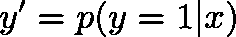

# 数学模型

**输入**:***X****是输入矩阵的维数****n****X***m****其中 *n* 是 ***X*** 和**中的特征数******

****参数**:**:*W****是维度***n***X***1***其中 *n* 是 ***X*** 中特征的个数。偏置 ***b*** 有助于控制激活功能触发的值。***

****输出**:**

**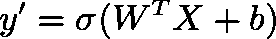**

# **激活功能**

**激活函数对于人工神经网络学习和理解一些非常复杂的东西非常重要。它们将非线性特性引入网络。它们的主要目的是将节点的输入信号转换成输出信号。该输出信号现在被用作神经网络下一层的输入。上面使用的激活是***s 形*** 激活功能。数学上，它可以定义为:**

**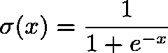**

# **损失函数**

**损耗可以定义为实际输出和预测输出之间存在的误差。我们希望损失函数值尽可能低，因为它会减少损失，并且预测值会接近实际值。我们用来训练神经网络的损失函数因情况而异。因此，为我们的用例选择一个适当的损失函数是很重要的，以便神经网络被适当地训练。我们将用于逻辑回归的损失函数可以在数学上定义为:**

**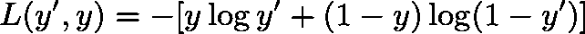**

**让我们研究一下为什么这个损失函数对逻辑回归有好处，**

1.  **当 ***y=1*** 时，损失函数等于 ***L(y '，y) = -log y'*** *。*由于我们希望损失函数值越小， ***log y'*** 的值应该越大，的值应该越大，当***【y '***越大，即越接近 1 时，预测值和实际值就越接近。**
2.  **当 ***y=0*** 时，损失函数等于 ***L(y '，y) = -log(1-y')*** 。由于我们希望损失函数值更小，***log(1-y’)***的值应该更大，当***y’***越小，即接近 0 时，预测值和实际值就越接近。**
3.  **上述损失函数是凸的，这意味着它具有单个全局最小值，并且网络不会陷入非凸损失函数中存在的局部最小值。**

# **价值函数**

**损失函数用于训练过程中的每个输入训练示例，而成本函数用于一次迭代中的整个训练数据集。因此，基本上，成本函数是整个训练数据集上所有损失值的平均值。数学上它可以定义为:**

**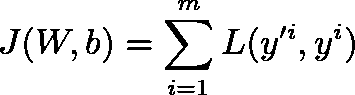**

**在上式中， ***m*** 是训练样本的总数。训练网络的目标是找到权重矩阵 ***W*** 和偏差 ***b*** ，使得成本函数 ***J*** 的值最小。**

# **梯度下降**

**权重矩阵 ***W*** 被随机初始化。我们用梯度下降法最小化代价函数 ***J*** 得到最优权重矩阵 ***W*** 和 Bias ***b*** 。梯度下降是一种寻找函数最小值的一阶迭代优化算法。我们将梯度下降应用于成本函数 ***J*** 以最小化成本。数学上它可以定义为:**

**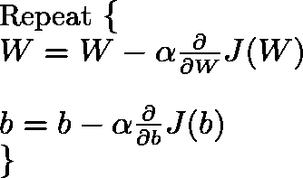**

**第一个等式表示权重矩阵*的变化，而第二个等式表示偏差 ***b*** 的变化。值的变化由学习率***α***和成本 ***J*** 相对于权重矩阵 ***W*** 和偏差 ***b*** 的导数确定。我们重复 ***W*** 和 ***b*** 的更新，直到代价函数 ***J*** 被最小化。现在让我们借助下图了解梯度下降的工作原理:***

**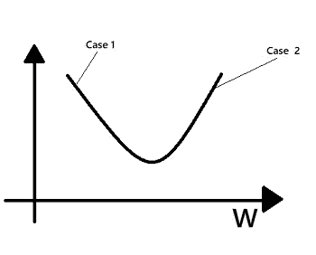**

****案例一**。假设 ***W*** 被初始化为小于达到全局最小值的值，那么在该点的斜率，即 ***J*** 相对于 ***W*** 的偏导数是负的，因此，根据梯度下降方程，权重值将 ***增加*** 。**

****案例二**。假设 ***W*** 被初始化为大于其达到全局最小值的值，则该点的斜率，即 ***J*** 相对于*W 的偏导数为正，因此，根据梯度下降方程，权重值将 ***减小*** 。***

**相应地， ***W*** 和 ***b*** 都将达到它们的最优值，并且成本函数 ***J*** 的值将被最小化。**

# **使用梯度下降的逻辑回归**

**到目前为止，我们已经了解了逻辑回归和梯度下降的数学模型。在本节中，我们将了解如何在逻辑回归环境中使用梯度下降来学习权重矩阵 ***W*** 和偏差 ***b*** 。让我们总结一下目前已知的所有方程。**

**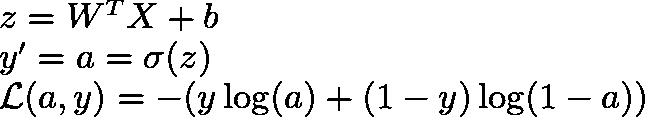**

1.  **第一个等式表示输入 ***X*** 与权重矩阵 ***W*** 和偏差 ***b*** 的乘积。**
2.  **第二个方程是引入非线性的*激活函数。***
3.  ***第三个等式是损失函数，其计算给定的 ***Y*** 和预测的***Y’***之间的损失。***

**这些方程可以使用称为 ***计算图*** 的图来建模。为了简单起见，让我们考虑在给定的输入矩阵 ***X*** 中有两个特征 ***x1*** 和 ***x2*** 。相应地在权重矩阵***【W***中会有 2 个权重 ***w1*** 和 ***w2*** 。上述场景的计算图可以定义为:**

**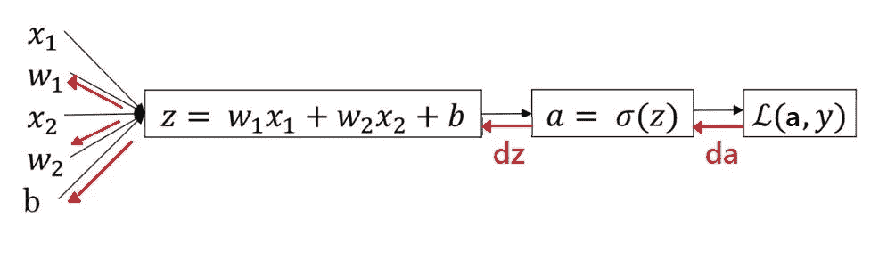**

**在上图中，前向传播(黑色箭头)用于预测*，后向传播(红色箭头)用于更新权重 ***w1*** 和 ***w2*** 和偏差 ***b*** 。正如我们在梯度下降中看到的，我们需要计算权重和偏差的导数来更新它们。使用计算图可以很容易地计算这些导数。由于损失 ***L*** ，依赖于*，首先我们计算导数***【da】***即代表导数的 ***L*** 相对于****

**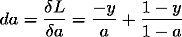**

**之后，我们使用等式 2 计算代表*相对于 ***z*** 的导数 ***dz*** 。这可以使用链规则来完成，如下所示:***

**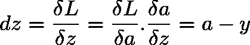**

**同样，我们可以利用等式 1 和链式法则求出所有导数 ***dw1*** 、 ***dw2*** 和 ***db*** 。这些衍生产品的价值如下:**

**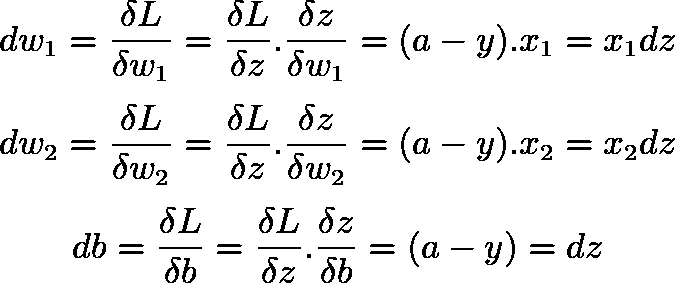**

**现在我们已经找到了所有的导数，我们需要借助梯度下降来更新权重和偏差值，如下所示:**

**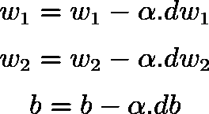**

**据此，我们将梯度下降应用于逻辑回归，并研究如何更新权重矩阵***【W】***和偏差 ***b*** 以使损失 ***L*** 最小化。**

> **我建议读者，如果他们有微积分的知识，他们应该做数学，自己算出上述方程，以便正确理解这个话题。**

**注意，上述所有计算都是针对单个训练示例实现的，但是在训练过程中，我们必须在单次迭代中将上述步骤应用于所有训练示例。让我们想想该怎么做。我们知道成本函数 ***J*** 在数学上定义如下:**

****

**在培训过程中，我们需要最小化成本 ***J*** 。这可以通过最小化所有 ***m*** 训练示例中的每个训练示例 ***i*** 的损失 ***L*** 来实现。由于损失函数 ***L*** 本身取决于权重****w2***和 ***b*** ，我们不得不相对于权重******w2***最小化 ***J*********

**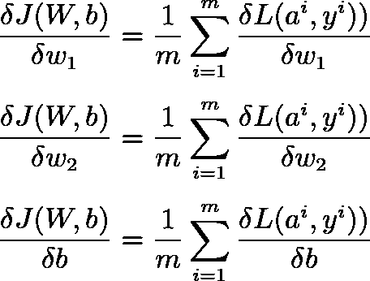**

# **摘要**

**以上几节以逻辑回归为例解释了神经网络工作背后的数学原理。让我们总结一下如何将逻辑回归作为神经网络来实现，如下所示:**

**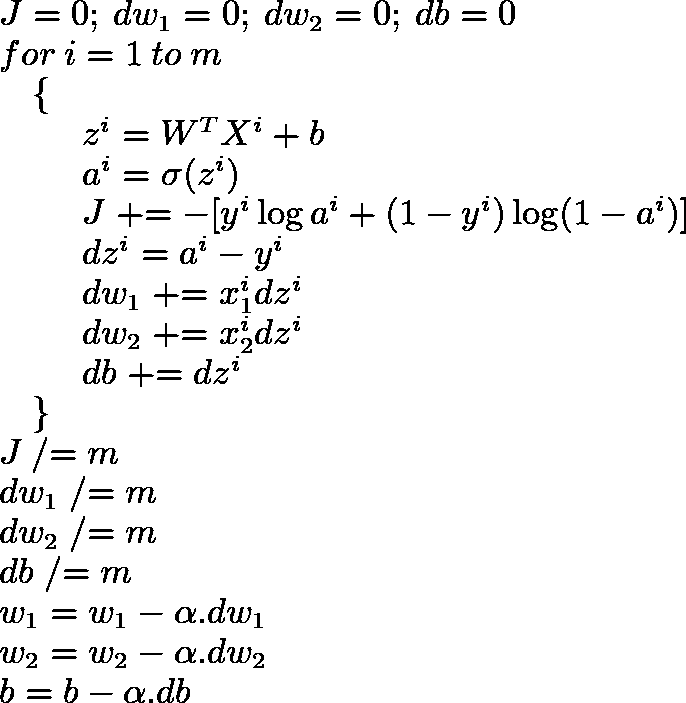**

**这是在所有训练示例的单个训练步骤中完成的计算。在训练期间，我们需要多次重复执行上述所有步骤，根据任务的不同，重复次数从 1000 到 1000k 不等。当精度没有提高或者成本 ***J*** 最小化时，我们可以停止训练过程，从而不再需要指定步数。随着硬件和软件的改进，由于深度学习的兴起，如此庞大的计算量所需的时间大幅减少。**

**因此，在这个故事中，我们在逻辑回归的背景下研究了神经网络背后的数学。**

## **参考**

1.  **[Coursera —深度学习课程 1](https://www.coursera.org/learn/neural-networks-deep-learning?specialization=deep-learning)**

**我要感谢读者阅读这个故事。如果你有任何问题或疑问，请在下面的评论区提问。我将非常乐意回答这些问题并帮助你。如果你喜欢这个故事，请关注我，以便在我发布新故事时获得定期更新。我欢迎任何能改进我的故事的建议。**