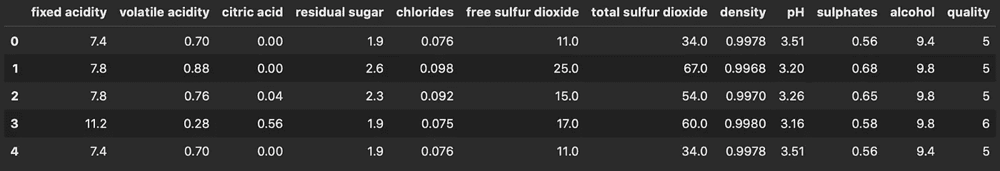
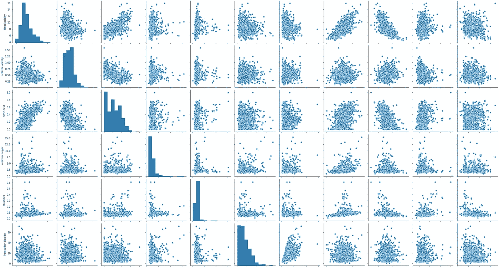
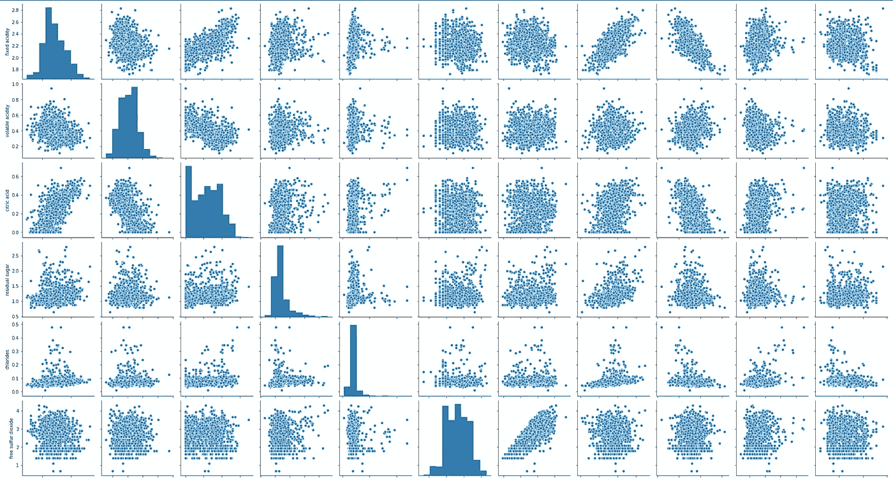
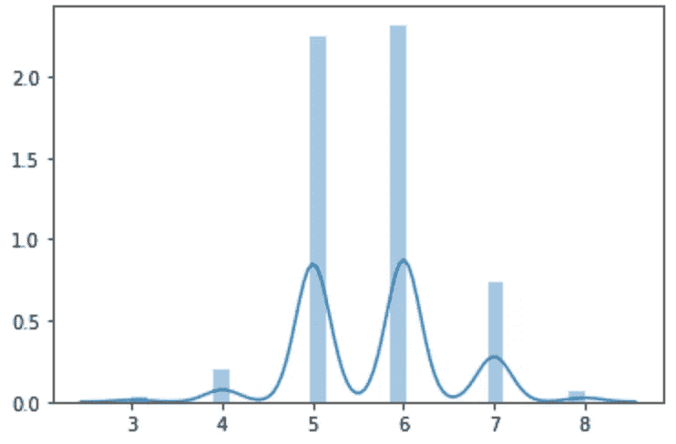
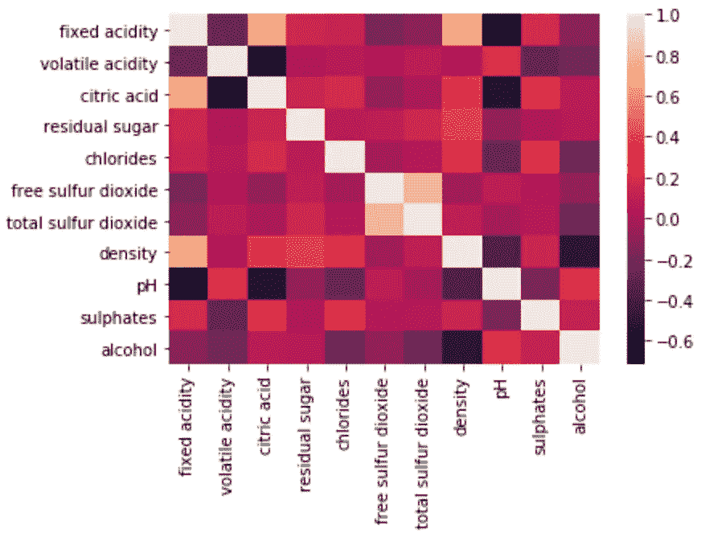
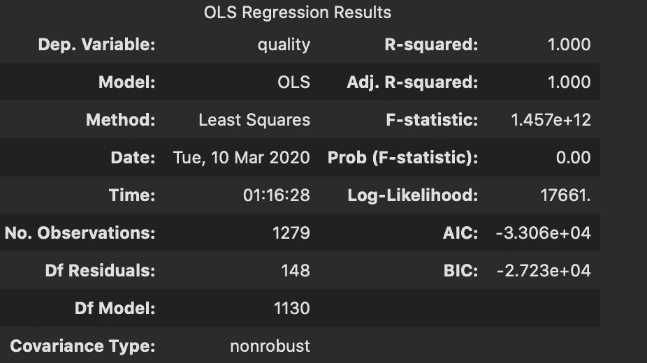

# 逻辑回归

> 原文：<https://medium.com/analytics-vidhya/logistic-regression-b30ca0bec653?source=collection_archive---------15----------------------->

总有一天，你会得到或选择一个分类数据集，当你到达这一点时，你会很快发现线性回归并不像你想象的那样有用。

当您处理分类数据集时，您希望使用**逻辑回归**来获得模型的最佳拟合。**逻辑回归**可用于二进制数据甚至更复杂的扩展。

# 数据集示例

让我们来看一个红酒数据集，它有 12 列，可以在 Kaggle 上的[这里](https://www.kaggle.com/uciml/red-wine-quality-cortez-et-al-2009)找到。由此，我们可以将我们的因变量定义为“质量”，剩下的 11 列将是我们的自变量，或者称为特征。

在我们的整个数据集中有连续的值，但是当我们到达我们的因变量时就停止了，因为它看起来是一个分类变量。

## 数据可视化

独立变量的 Seaborn 散点图

通过绘制自变量的散点图，你可以看到你的数据是如何分布的。通常，您希望您的数据具有一些线性分布的正态分布。我们上面的可视化显示了一些正态分布和更多的指数分布。我们可以通过执行相反的等式，对数，来摆脱指数分布。

**注意**:日志转换可以像调用一行代码一样简单

在使用 log 转换我们的数据之后，我们现在应该看看我们的数据是如何分布的。

对数转换数据的 Seaborn 散点图

上面的可视化显示了我们新转换的自变量。看起来我们的数据有更多的正态分布和一些线性分布，这正是我们想要的。

下一步是检查因变量的分布:

因变量的 Seaborn 分布图

## 检查多重共线性

下一步是找出我们的数据是否具有多重共线性(指的是多元回归模型中两个或多个解释变量高度线性相关的情况)。最好不惜一切代价避免多重共线性，因为它会降低模型的准确性。

## 我们如何检查

我们可以使用热图来查看多重共线性。如果该值大于 0.4，对于更多的要素，则存在严重的多重共线性，您可能需要考虑删除一些要素。

看起来我们的数据很好地避免了多重共线性，因此不会删除任何要素。

## 回归

我们查看了我们的数据，对其进行了转换，并检查了多重共线性。我们现在准备对我们的数据做一个回归模型。

我们正在调用**逻辑回归**类并实例化它。然后，我们拟合我们的训练集，并预测独立变量的所述训练集。然后，我们将使用分数方法来返回我们的训练集的准确性，遗憾的是，它看起来不太好。我们得到了 58%的分数，这意味着我们的模型不太符合数据。

## 如何改进模型？

有多种方法可以提高模型的得分，从多项式回归到正则化，甚至是返回并对数据进行不同的变换。但是现在我们将做多项式回归，看看我们是否能得到一个更好的分数。通过进行多项式回归，它将试图通过稍微操纵曲线来更好地拟合我们的数据。

上面的代码帮助我们将多项式回归拟合到我们的逻辑回归中，从而将准确率提高到 62%。是的，我知道 62%不是你应该吹嘘的东西，但让我们通过检查我们的 R 平方(一种表示回归模型拟合度的统计度量)来看看它可能有多差。

## 统计模型

我们可以使用另一个名为 StatsModels 的库，它将列出关于我们的回归模型的各种信息。

我们的 R 平方和 Adj. R 平方的值都是 1.0。这意味着我们的模型处于最大拟合状态，实际值与预测值之间没有残差。

## 有没有更好的办法？

是啊！最可能