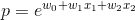
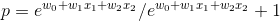

# 逻辑回归算法背后的数学

> 原文：<https://medium.com/analytics-vidhya/logistic-regression-b35d2801a29c?source=collection_archive---------0----------------------->

人们经常处理现实生活中在不同的事物中进行选择的问题。比如客户是否要买某个产品，客户要订阅哪个套餐。所有这些都属于分类的策略，预测特定数据点属于哪个集合。

线性分类是基于线性预测函数进行分类的方法，将权重与因变量的值相结合。在这个过程中可能涉及非线性操作。

逻辑回归流

在上述两个等式中，等式 1 将每个特征与权重相关联。我们之所以称 logistic 回归为广义线性模型之一。随后使用链接函数(将在下面提供解释),该函数转换在(0，1)范围内提供的数据。这里是等式 2。是连接函数，它是一个 sigmoid 函数，z 是一个值，它给出了一个事件发生的概率。

## **逻辑回归过程**

给定数据(X，Y)，X 是具有 m 个示例和 n 个特征的值的矩阵，Y 是具有 m 个示例的向量。目标是训练模型来预测未来值属于哪一类。首先，我们创建一个随机初始化的权重矩阵。然后我们乘以特征。

Eq 1。

然后，我们传递从等式 1 获得的输出。链接函数。

链接功能

随后计算该迭代的成本，其公式为

价值函数

计算该成本的导数，然后更新权重。

梯度

更新

逻辑回归的完整 python 代码如下

从零开始的逻辑回归

**逻辑回归背后的数学和直觉**

逻辑回归算法的目标是创建一个线性决策边界，将两个类彼此分开。这个决策边界是由条件概率给出的。

中间的线是决策边界，上下有两个类。

假设黑线(判定边界)以上的类，即 *'+'* 被分类为 *'1'* ，判定边界*' 0 '*以下的类被定义为*' 0’。逻辑回归的作用是计算条件概率，即*

类别“1”的概率

类别“0”的概率

逻辑回归计算属于这两类中任何一类的一组特定数据点的概率，给定值为 *x* 和 *w.* 逻辑是这样的，我们有一组基于线性模型从负无穷大到正无穷大获得的值，我们需要将其缩小到 0 到 1 之间的分数，因为概率总是在该范围内，逻辑回归讨论的是概率。链接函数，sigmoid 函数负责这项工作。

在 sigmoid 函数中使用指数是合理的，因为概率总是大于零，并且指数的性质考虑了这一方面。然后，我们需要担心如何限制小于 1 的值，这是通过将分子中的值除以大于它的值来实现的。

概率大于 0

概率大于 0 小于 1

现在，为了得到交替类的概率，我们只需将上面得到的值减去 1。当我们将上述方程除以分子项时，我们得到 sigmoid 连接函数

**赔率比**

我们从周围的许多人那里听到“一个团队获胜的几率有多大”这个术语。赔率基本上是一个事件发生的概率与一个事件不发生的概率之比。在逻辑回归中，事件发生的几率可以由公式给出

事件发生的几率

事件的对数概率或对数似然性由上述等式的对数给出。由于概率在范围(0，1)内，所以比值比被对数转换以移除受限范围。对数变换将它更改为从负无穷大到正无穷大的值。第二个原因是对数值更容易解释。

日志(赔率)

如果我们考虑得到输出 P(y = 1 | x；w)等于 sigmoid 函数，p(y = 0 | x；w)= 1-p(y = 0 | x；w)并且如果假设我们的样本具有伯努利分布，则逻辑回归模型的成本函数由下式导出:

取 log 这个等式可以转换成上面的成本函数。函数开头出现负号是为了确保我们尝试最小化负的可能性，而不是最大化值，因为梯度下降会最小化误差。

逻辑回归的 Scikit-learn 实现如下所示

Sklearn 实现

> 如果你发现任何不一致的地方，一定要评论。
> 
> github 到笔记本的链接是[https://github . com/sidsekhar/Regression-Basics/blob/master/Logistic % 20 Regression . ipynb](https://github.com/sidsekhar/Regression-Basics/blob/master/Logistic%20Regression.ipynb)
> 与分类相关的指标将作为单独的文字处理。