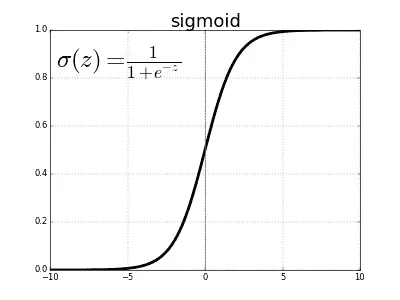
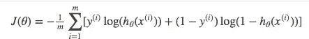
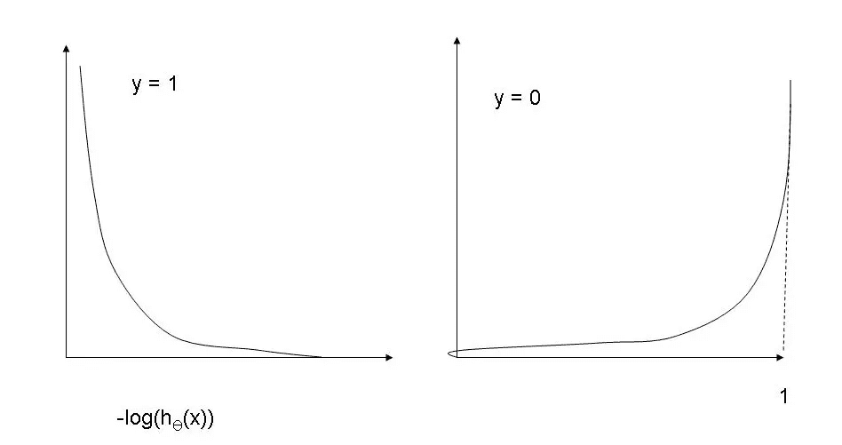

# 逻辑回归

> 原文：<https://medium.com/analytics-vidhya/logistic-regression-bb2087fbd588?source=collection_archive---------26----------------------->

**逻辑回归**是一种用于解决分类问题的数学算法。此模型背后的基本工作类似于线性回归，但逻辑回归不是预测值，而是用于估计实例属于特定类的概率。

# 估计概率

在逻辑回归中，我们计算独立变量的加权和。但是我们不是预测值，而是计算加权和的*逻辑*。这是通过在输出上应用*逻辑函数*来完成的。

g(x) = θ₀*X₀ + θ₁*X₁ + θ₂*X₂ + θ₃*X₃ + …+θₙ*xₙ

***g(x) = X*θ***

逻辑函数是 ***sigmoid 函数*** ，输出一个介于“0”和“1”之间的数字。

***p = h(X)=σ(g(X))=σ(X *θ)***

# 做预测

一旦我们的逻辑模型估计了实例的概率，我们就可以通过对分类器输出应用阈值来预测每个实例属于哪个类。如果概率≥ 0.5，则为 ***类 1*** 否则为 ***类 0*** 。

(图片来源:dorianbrown.dev)

所用阈值的默认值为 0.5。但是在许多分类问题中，两类的实例是不平衡的。因此，我们应该根据数据集中的类不平衡来调整它，以获得更好的性能。

# 训练我们的分类器

在线性回归中，我们最小化实例与其预测值之间的均方距离，但我们不能在逻辑回归中使用均方函数，因为它可能包含许多局部最小值，这将使梯度下降难以收敛。

因此，代替使用均方误差函数，我们将使用 ***交叉熵*** 函数作为我们的成本函数。成本函数如下所示:

(图片来源:[https://ml-cheatsheet.readthedocs.io/](https://ml-cheatsheet.readthedocs.io/))

如果我们看一下对数函数的曲线图，我们会清楚地了解为什么选择这个函数。

(图片来源:gigadom.in/2013/11/15/)

对于 **y = 1** ，如果我们的预测值也是 1，那么成本函数中的“log”将是 0，并且权重不会发生变化。但是如果预测值是 0，那么“log”将给出一个高值，并且权重将被更新。

对于 **y = 0** ，如果我们的预测值也是 0，那么‘log’将是 0，并且权重不会发生变化。但是如果预测值是 1，那么“log”将给出一个高值，并且权重将被更新。

我们将使用**梯度下降**算法来最小化我们的成本函数。为此，我们需要计算成本函数的偏导数。并且迭代地更新权重。

# 例子

让我们看一个例子，看看我们的算法是如何工作的。我随机取了一些数据。你可以选择任何数据集。数据集在可视化上看起来是这样的。

训练完我们的模型后，我们可以画出两个类的分界线。

可以参考 Github 上的完整代码— [这里](https://github.com/ShubhAgarwal/Logistic-Regression)

我们可以借助 Scikit 学习库直接实现逻辑回归。它有一个名为 LogisticRegression 的类，直接为我们训练模型，我们可以根据自己的要求调整超参数。

# 结论

我们学习了逻辑回归、它的成本函数以及如何使用梯度下降算法训练我们的模型。

我们还看到了如何使用 Scikit 学习库在不同数据集上实现逻辑回归算法。

我希望你发现通过我的博客很容易理解逻辑回归的概念。