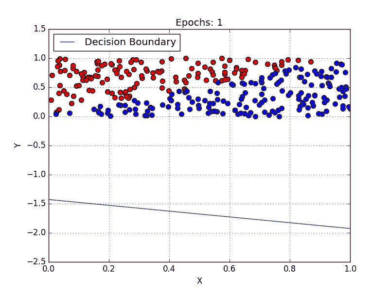
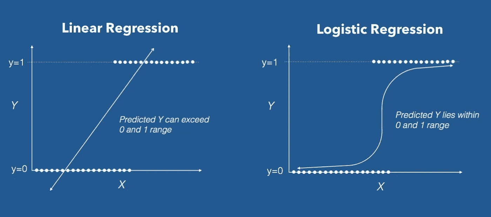
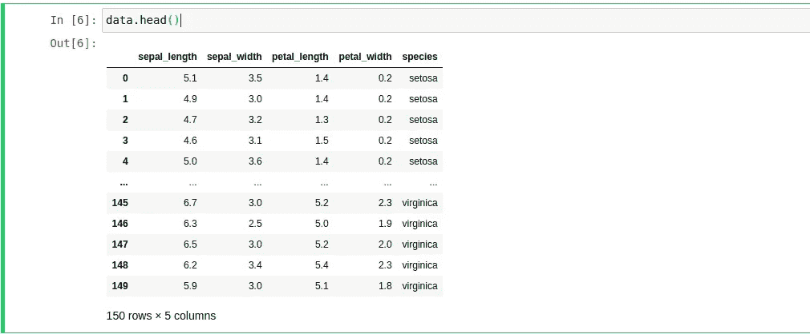
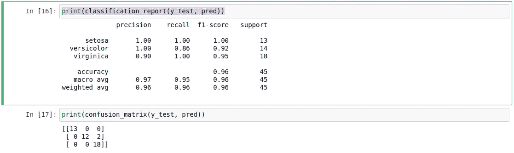

# 逻辑回归去神秘化

> 原文：<https://medium.com/analytics-vidhya/logistic-regression-demystified-215def00b37d?source=collection_archive---------25----------------------->

在这篇文章中，我们将看到如何应用和如何工作的*****回归算法。*****

****

**链接[此处](https://miro.medium.com/max/1600/1*PQ8tdohapfm-YHlrRIRuOA.gif)**

**当我们讨论分类问题时，逻辑回归是一个非常著名的算法。我们可以很容易地实现 ***逻辑回归*** ，只用几行代码就可以得到非常满意的结果。**

# ****但是这到底是怎么回事呢？****

*****逻辑回归*** 与线性回归非常相似，它们的区别在于函数。在 ***线性回归*** 中我们有一个可以返回负数的函数，在 ***逻辑回归*** 中，我们有一个只返回正数的函数。**

**我们可以在下图中看到更多细节:**

****

**链接[此处](https://miro.medium.com/max/4640/1*dm6ZaX5fuSmuVvM4Ds-vcg.jpeg)**

**当我们使用 ***二进制分类*** (只有 2 个类)时，这是非常积极的，我们使用 ***二进制逻辑分类*** 。**

**在[这个库](https://github.com/gabrielmayers/kaggle_titanic-logistic_regression)中，你可以看到我是如何应用逻辑回归来解决 ***【卡格尔挑战泰坦尼克号】、*** 的，这里我们只有 2 个类！**

**但是我们也可以将 ***逻辑回归*** 应用到我们拥有 2 个以上类的问题中，这被称为: ***多项逻辑回归*** ，我们将在下一个例子中深入探讨。**

**假设你想在著名的 [Iris 数据集](https://archive.ics.uci.edu/ml/datasets/iris)中使用 ***逻辑回归*** ，对花卉种类进行分类…**

**让我们做机器学习吧，宝贝！**

# **看一看数据集**

**我们可以使用下面的代码行，使用 *Seaborn* 将数据集加载到我们的笔记本中:**

```
**# Load dataset:data = sns.load_dataset(‘iris’)**
```

**之后，我们可以看看数据…**

****

**我们的数据集**

**只是做一个补遗，对于分类问题，神经网络可以比任何算法表现更好，你可以看看我在[这个帖子](/analytics-vidhya/solving-titanic-machine-learning-from-disaster-using-neural-networks-and-tensorflow-2abade61994a)中如何应用 ***神经网络*** 来解决 ***《卡格尔挑战泰坦尼克号】*** 。**

**但是在这个特定的问题中，我们的数据集中有一个改变所有场景的特征。**

**正如你在上面的图像中看到的，我们只有 150 个例子，当我们谈论 ***神经网络时，这是不够的。*** 其实*，*这是为了少！**

**而这也是为什么在这个问题中使用 ***逻辑回归*** 比较好。**

**这里要观察的另一件重要事情是关于我们的数据。我们不需要改变或格式化任何东西，我们的数据已经准备好输入到我们的模型中，这是非常罕见的！**

**但是回来后，我们需要将我们的数据分成训练和测试。对于这个例子，我想使用我的数据集的 30% 进行测试，70% 进行训练。**

**我们可以使用下面的代码来拆分:**

```
**X = data.drop(columns=’species’)
y = data[‘species’]# Splitting: 
from sklearn.model_selection import train_test_splitX_train, X_test, y_train, y_test = train_test_split(X, y, test_size=0.3)**
```

*****但是我们只有几个数据…*****

**我知道，但是对于我们的**逻辑回归模型**，这就足够了！**

**现在，我们已经将数据集分为训练和测试两部分**

**让我们建立我们的模型！**

# **构建我们的模型**

**我们想使用 [**scikit-learn**](https://scikit-learn.org/stable/) 来构建我们的模型，但是你可以选择对你更好的。**

**为了构建我们的 ***逻辑回归模型*** ，我们可以从[**scikit-learn**](https://scikit-learn.org/stable/)**中导入 Logistic Regression 类，并将其实例化为一个变量，如下面的代码所示:****

```
****# Building the model:from sklearn.linear_model import LogisticRegressionmodel = LogisticRegression()****
```

****现在，我们想要使用 *fit()* 方法训练我们的模型，将我们的训练 X 和 Y 作为参数传递，其中:****

*   ******X:** 为输入，如*萼片长度*和*花瓣长度*。****
*   ******Y:** 为输出，可以是: *Setosa* ， *Virginica* 或 *Versicolour* 。****

****训练我们的模型后，我们可以在测试数据集中进行预测。为此，我们使用 *predict()* 方法将我们的 X_test(测试数据集的输入)作为参数传递，如下面的代码所示:****

```
****pred = model.predict(X_test)****
```

# ****可视化我们模型的度量****

****现在，我们已经有了模型的预测，我们可以看看他是否得到了正确的结果。****

****为此，我们可以使用下面的代码使用[**scikit-learn**](https://scikit-learn.org/stable/)**的 classification_report:******

```
******from sklearn.metrics import classification_report, confusion_matrixprint(classification_report(y_test, pred))******
```

******运行代码后，我们可以看到模型在我们数据集中表现得非常好，在我们的两个类中达到了 100%的准确率，在另一个类中达到了 90%。看一下我们的混淆矩阵，我们可以更好地将预测与正确答案进行比较:******

************

******我们模型的结果******

******现在，我们有一个训练有素的模特，而且表演得太好了！******

******你可以在[这里](https://github.com/gabrielmayers/flowers_classifying-logistic_regression)访问这篇文章的资源库。******

******目前，这就是全部！******

******下次见！******

*********我的社交媒体:*********

*********领英:****[https://www.linkedin.com/in/gabriel-mayer-779b5a162/](https://www.linkedin.com/in/gabriel-mayer-779b5a162/)*******

*********GitHub:**[https://github.com/gabrielmayers](https://github.com/gabrielmayers)*******

**********Instagram:***[https://www.instagram.com/gabrielmayerl/](https://www.instagram.com/gabrielmayerl/)*******