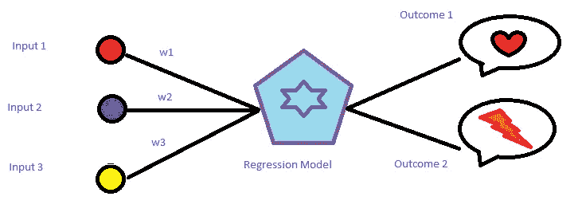
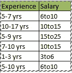

# 编码糖果逻辑回归:在 Python 中编码分类变量。

> 原文：<https://medium.com/analytics-vidhya/logistic-regression-encoding-categorical-variables-in-python-e23e1d395339?source=collection_archive---------1----------------------->

逻辑回归简图

用 python 中的 scikit-learn 编写数据挖掘代码，必然会导致您解决数据中有多个分类变量的逻辑回归问题。尽管 scikit-learn 支持简单回归和多项式回归，但它希望输入是数字形式，以便使用其内部激活函数来计算结果。

下面是将分类变量转换成 scikit-learn 模块可以理解的数值变量的最简单方法。

让我们考虑一下下面的数据，从中可以推断出一个人的经历决定了他的薪水。很明显，这里的自变量和因变量都是一个范围。使用 scikit- learn 模块进行逻辑回归将返回一个错误，因为内部模块无法将 string 转换为 float。因此，我们需要在 python 中将这些列指定为分类变量，并将每个类别的值转换为一组新的数值。

例如，想象一个包含雇员性别信息的数据集。

在我们的数据集中，我们将把这些值编码为数值{1，0，0，1 }，并在我们的建模等式中使用这个数值元组，而不是像{ '男性'，女性'，'女性，'男性' }这样的值。

将这两列视为数据集 data_train 的一部分。下面的代码将这两列声明为 Python 的 category 类型，编码后的列可进一步用于使数据符合逻辑回归。

> data _ train[' experience ']= data _ train[' experience ']。astype(' category '
> data _ train[' exp _ cat ']= data _ train[' experience ']. cat . codes
> Test = data _ train[' exp _ cat ']

Test.head()返回以下值，而不是上面显示的类别。
0 104
1 19
2 106
3 112
4 8

现在，像这样的数据集可以用于在下面的代码中构建 2d 数组 x，以开发逻辑回归模块

> from sklearn.linear_model 导入 LogisticRegression
> lr = LogisticRegression()。拟合(x，y)

这是一个编程的小技巧！希望有用！