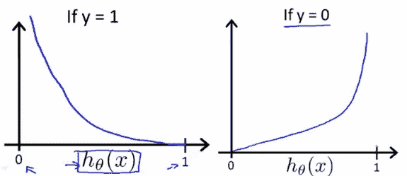

# 逻辑回归—已解释

> 原文：<https://medium.com/analytics-vidhya/logistic-regression-explained-c6bb5dc5842c?source=collection_archive---------20----------------------->


# 介绍

在这篇文章中，我们将探索和理解机器学习中的基本分类技术之一—**逻辑回归**。

*原载于 2019 年 11 月 25 日*[*https://machinelearningmind.com*](https://machinelearningmind.com/2019/11/25/logistic-regression-explained/)*。*

*   **二元逻辑回归 *:*** 它只有两种可能的结果。示例-是或否
*   **多项逻辑回归**:有三个或三个以上的名义类别。例子-猫，狗，大象。
*   **有序逻辑回归** -它有三个或更多有序类别，有序意味着类别将按顺序排列。示例-用户评级(1–5)。

现在，让我们关注二元逻辑回归。

# 逻辑回归


逻辑回归模型用于计算一个关键预测因子的特定值的预测概率，通常是在所有其他预测因子保持不变的情况下。

让我们以预测患者是否有未来冠心病(CHD)的 10 年风险为例。

可能的预测因素包括患者的心率、血压、吸烟者/非吸烟者等。。我们想预测患者未来 10 年是否有患冠心病的风险。我们可以有一个决策边界，例如:0.5，使得 P(Y) > 0.5，将患者分类为处于危险中，并且 P(Y) < 0.5, classify patient as not at risk.

So basically, if a model has to succeed in predicting this, we need individual predictor ( **X** 对处于 CHD 危险中的患者的概率具有恒定的影响[ **P(Y)** ]。但是，X 对 Y 的概率的影响有不同的值，这取决于 X 的值。

这就是**赔率**出现的原因，因为赔率代表预测值 X 对 Y 发生的可能性的恒定影响。

# 可能性

赔率告诉你一个结果的可能性。对于那些不熟悉赔率概念的人，这里有一个例子。

假设 Y 代表有风险的患者，Z 代表没有风险的患者，有人说事件 Y 的概率是 1/3。这是什么意思？

4 名患者中，1 名有风险，3 名无风险。所以患者处于危险中的几率是 1:3。

这就是概率和赔率的区别。这种情况下的概率是 P(Y) = 1/(3+1) = 1/4。
概率考虑了所有结果(3 无风险+ 1 有风险)。

概率和赔率在数学上是相关的。


患者有患冠心病风险的几率

如果 *P(Y)* =患者处于危险中的概率，那么 1- *P(Y)* 将给出患者不处于危险中的概率

逻辑回归使用 **Sigmoid 函数**来预测概率。


Sigmoid 函数

Sigmoid 函数的等式:1/(1+ *e* ^-z)，其中


现在让我们知道 P(Y) = 1/(1+ *e^* -z)来推导 log(赔率)


导出的对数(比值)

这里是 x 1，x 2..代表预测因子β 1，β 2 …代表我们前面讲过的预测因子的 ***常量效应*** 。

# 价值函数

成本函数基本上量化了模型预测值和实际值之间的差异，给出了误差值。

这里我们不能使用线性回归(MSE)的代价函数，因为 h θ(x) [sigmoid function]是非线性函数，使用 MSE 将导致具有许多局部最小值的非凸函数。当存在许多局部最小值时，梯度下降将不能成功地找到全局最小值。


成本函数 J(θ)



将上述函数组合成一个函数，就得到最终的成本函数。


成本函数 J(θ)

## 使用 sklearn 的逻辑回归

sklearn 实现了逻辑回归，这使得我们只需调用函数 fit()和 predict()来完成分类变得非常容易。

让我们以 10 年内有患冠心病风险的患者为例。

```
df = pd.read_csv("framingham.csv") 
df.info()
```


df.info()

```
print("Percentage of People with heart disease: {0:.2f} %".format(100*df.TenYearCHD.value_counts()[1]/df.TenYearCHD.count()))
```

**产量**:心脏病患者比例:15.23 %

在执行清理操作并剔除统计上无关紧要的变量后，让我们创建新的数据框架并执行逻辑回归。

```
# Creating new dataframe with statistically significant columns new_df = df[['male','age','cigsPerDay','prevalentHyp','diabetes','sysBP','diaBP','BMI','heartRate','ed__2.0','ed__3.0','ed__4.0', 'TenYearCHD']] # Splitting into predictors and label 
X = new_df.drop(['TenYearCHD'], axis=1) 
Y = new_df.TenYearCHD # Splitting dataset into train and test in the ratio 7:3 x_train,x_test,y_train,y_test = train_test_split(X,Y,test_size=0.3,random_state=5)
```

现在我们已经准备好应用 sklearn 的逻辑回归函数了

```
logreg = LogisticRegression() 
logreg.fit(x_train,y_train) 
y_pred = logreg.predict(x_test)
```

y_pred 保存因变量的所有预测值(TenYearCHD)。现在让我们检查模型的准确性。

```
sklearn.metrics.accuracy_score(y_test,y_pred)
```

**输出**:0.8648686868686

这意味着我们的模型能够正确分类 86%的测试数据，这是一个很好的数字(这个值是否令人满意取决于业务案例)。如果这不令人满意，有优化技术来改进模型，或者可以使用不同的分类技术，这些将在以后的帖子中讨论。

上面例子的完整笔记本可以在 [**Kaggle**](https://www.kaggle.com/fahadanwar/logreg-smote) 和 [**Github**](https://github.com/fahadanwar10/ml-classification/tree/master/LogisticRegression) 找到。