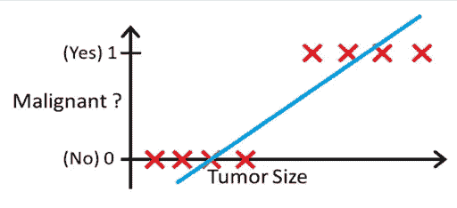
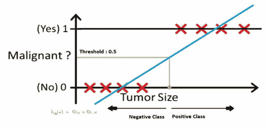
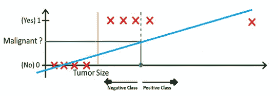
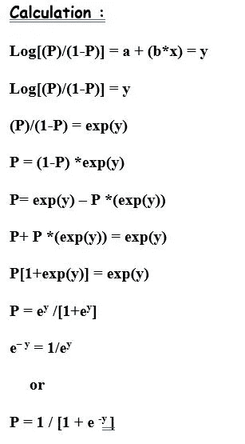
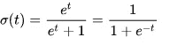
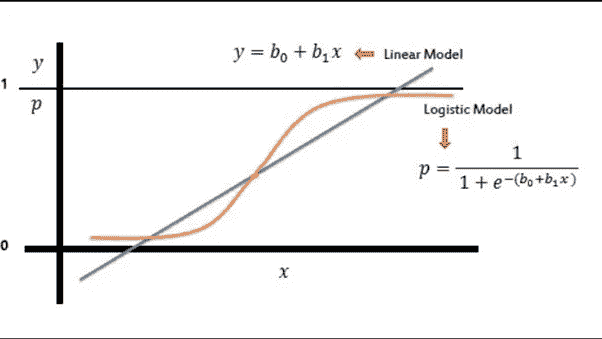
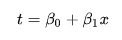
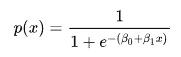
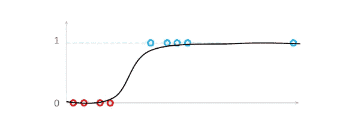
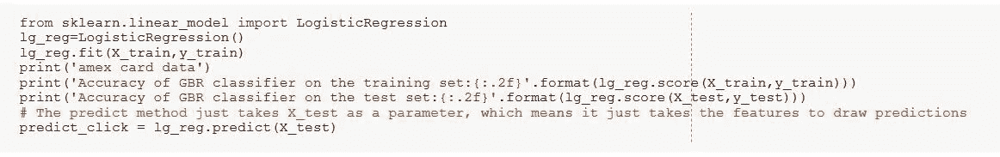

# 逻辑回归

> 原文：<https://medium.com/analytics-vidhya/logistic-regression-f9845e1aca5e?source=collection_archive---------3----------------------->

尽管被称为回归测量，但仍用于分类。逻辑回归是最基本和最流行的算法之一。它是回归分析的一种形式，使用连续和离散预测因子的混合来预测离散变量。

**什么是分类问题？**

当自变量本质上是连续的，因变量是分类形式的，即在像正类和负类这样的类中时，我们将问题识别为分类问题。所有这些问题的答案都是绝对形式的，即是或否

虽然，有时我们会遇到两个以上的类，但这仍然是一个分类问题。这些类型的问题被称为多类分类问题。

**为什么不用线性回归？**

假设我们有一个肿瘤大小与其恶性程度的数据。由于这是一个分类问题，如果我们绘图，我们可以看到，所有的值将位于 **0** 和 **1** 。如果我们拟合最佳找到的回归线，通过假设阈值为 0.5，该线做了合理的工作。

我们可以确定 x 轴上的点，从该点开始，位于其左侧的所有值都被认为是负类，位于其右侧的所有值都是正类。

但是如果数据中有异常值呢？事情会变得一团糟。例如，对于 0.5 阈值，

即使我们拟合最佳回归曲线，也不足以确定我们可以用来区分阶级的任何点。它会把一些正面类的例子放到负面类里。绿色虚线(决策边界)将恶性肿瘤与良性肿瘤区分开来，但该线应该位于黄线处，黄线清楚地将阳性和阴性示例区分开来。因此，仅仅一个异常值就会扰乱整个线性回归预测。这就是逻辑回归发挥作用的地方。

**问题**:

1.当我们使用线性回归模型时，预测值是无界的-∞到∞。

2.但是概率值被限制在 0 和 1 之间。

**解决方案**:运行 Logit 转换。

**什么是 Logit 转换，我们为什么需要它？**

Logit 是一个转换，我们用它来转换我们的模型，使之成为一个线性模型。logit 转换将直线转换为逻辑曲线。逻辑回归将逻辑曲线拟合到一组数据，其中因变量只能取值 0 和 1。

它取的是**‘比值比’的对数。**比值比是一个统计术语，表示成功概率与失败概率之比。

优势比= P/(1-P)

示例:如果成功概率= 0.75，则

故障概率= 1–0.75 = 0.25

优势比= (0.75/0.25)=3

P 和 1-P 的值会是多少？

P/(1-P) —取值范围为 0 至∞。因为记住“Y 的概率”只能取 0 到 1 的值。所以，

如果 P=0，P/(1-P)=(0/1)=0

如果 P=1，P/(1-P)=(1/0)= ∞时

我们不采用“Y 的概率”，而是采用“成功概率”的比值比，即“P/(1-P)”。现在，比值比可以取 0 到∞。

但是在线性回归模型中，预测值可以落在-∞到∞之间的任何地方。因此我们取 log(P/(1-P))。

Log(0) = -∞值

Log(1) = ∞值

**计算:**

**逻辑回归算法**

如前所述，为了处理异常值，逻辑回归使用 Sigmoid 函数。逻辑函数是一个 Sigmoid 函数，它取 0 到 1 之间的任何实数值。它被定义为

而如果我们画出来，图形会是 ***S*** 曲线，

让我们把 ***t*** 看作一元回归模型中的线性函数。

所以，逻辑方程式会变成

现在，当逻辑回归模型遇到异常值时，它会处理它。

但有时它会根据异常值的位置将其 y 轴向左或向右移动。

**Logistic 回归模型的估计:**

使用一种称为“最大似然估计(MLE)”的技术来估计逻辑方程。

当误差项的基本分布是正态分布时，MLE 估计类似于 OLS(普通最小二乘)估计。

像许多其他国家一样，OLS 是 MLE 的一个特例。

Y = mx + c

**MLE 直觉**:

发现系数值(m & c)使得它们最大化由模型描述的过程产生被观察的数据的可能性。

"未知参数的什么值使我们看到的数据最不令人惊讶？"

# **优点**:

这是一种广泛使用的技术，因为它非常高效，不需要太多的计算资源，可解释性强，不需要缩放输入要素，不需要任何调整，易于正则化，并且输出校准良好的预测概率。

与线性回归一样，当您移除与输出变量无关的属性以及彼此非常相似(相关)的属性时，逻辑回归的效果会更好。因此，特征工程对于逻辑回归的性能起着重要的作用。逻辑回归的另一个优点是它非常容易实现，训练起来也非常有效。

# 缺点:

*   识别独立变量
*   过度拟合模型
*   仅限于变量之间的线性关系
*   对异常值的敏感性
*   大样本量

## Python 实现:

感谢您的阅读。