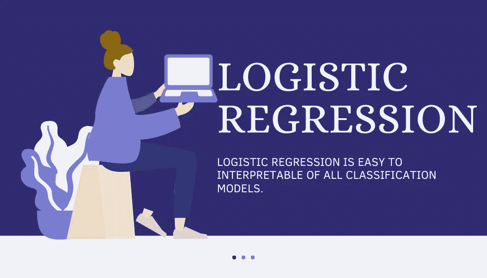
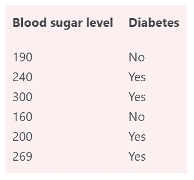
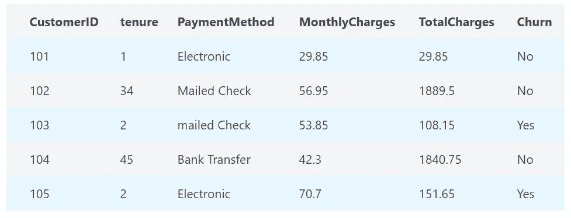
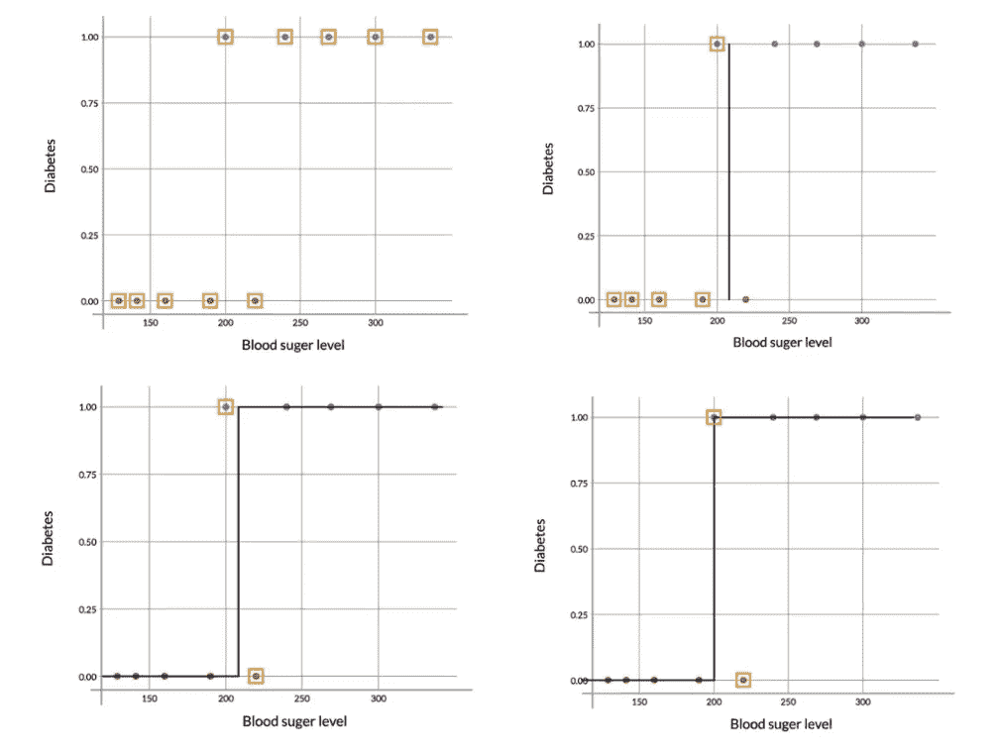

# 使用 Python 进行机器学习的逻辑回归

> 原文：<https://medium.com/analytics-vidhya/logistic-regression-for-machine-learning-using-python-53f2a2fc6eb0?source=collection_archive---------4----------------------->

**W** 欢迎来到**【逻辑回归】**部分。统计学领域的另一种机器学习技术。在[线性回归模型中](https://www.nucleusbox.com/linear-regression-using-python-with-automobile-case-study/)用于对连续变量(数值变量)进行预测。逻辑回归是一个**分类模型**。它将帮助您在输出为分类变量的情况下进行预测。

逻辑回归很容易解释所有的分类模型。使用银行、医疗保健等各种行业是很常见的。

本节将涵盖的主题有:

1.  二元分类
2.  Sigmoid 函数
3.  似然函数
4.  赔率和对数赔率
5.  在 Python 中构建单变量逻辑回归模型

我们将逐一研究所有这些概念。另外，如果这些术语现在对你来说有点陌生，你也不必担心。

# 单变量逻辑回归

在这个逻辑回归中，只有一个变量会用到。我们可以看到，只有一个变量“**血糖水平**”，我们需要使用它来对“**糖尿病**”进行分类。

例如:

# 多元逻辑回归

在这个逻辑回归中，多个变量将使用。正如我们所见，有许多变量可以对**“流失”**进行分类。

例如:

# 二元分类

在分类问题中，输出是一个分类变量。举个例子，

*   一家金融公司向客户发放贷款，客户想知道他是否会违约。一封电子邮件，你想预测垃圾邮件或火腿消息。
*   我们有一封电子邮件，我们想分为初级，社交，促销。
*   分类模型使我们能够提取相似的数据模式。并分成不同类别。

我们有两种可能输出的分类问题是二元分类。

以**表-1** 中的例子为例

## 观察

我们需要预测一个人是否有糖尿病。现在我们把血糖标在 x 轴上，糖尿病标在 y 轴上。正如我们在第**张图**中看到的。红点表示非糖尿病患者，蓝点表示糖尿病患者。

正如我们在**图-2** (右上)中看到的，我们可以基于决策边界进行决策。我们可以说所有血糖水平超过 210 的人都是糖尿病患者。并且血糖水平低于 210 的患者是非糖尿病患者。

因此，在这种情况下，我们的预测代表了一条曲线，如左下方的**图像-3** 所示。但是在这条曲线上有一个问题，我们错分了 2 个点。所以现在的问题是，有没有一个帮助我们零 is 分类的决策边界。答案是没有。

最好的情况是在**图像-4** (右下方)中截止值约为 195，因此会有一个遗漏分类。

这种方法有一个问题，特别是在图表的中间附近。我们不能根据一些假设就下结论。会有风险。这个人的糖水平(195 mg/dL)非常接近阈值(200 mg/dL)。很有可能这个人不是糖尿病患者，只是血糖有点高。毕竟，数据中确实有血糖水平很低的人(220 毫克/分升)(**图-4)** ，他们不是糖尿病患者。

# s 形曲线

我们看到了一个二元分类问题的例子。其中模型试图基于一个人的血糖水平来预测他/她是否患有糖尿病。我们看到了在这种情况下使用**简单的边界判定方法**是如何不起作用的。

所以解决这个急转弯问题的一个方法，用概率。

## [阅读更多](https://www.nucleusbox.com/logistic-regression-for-machine-learning-using-python/)