# 从零开始的逻辑回归:单变量多分类

> 原文：<https://medium.com/analytics-vidhya/logistic-regression-from-scratch-multi-classification-with-onevsall-d5c2acf0c37c?source=collection_archive---------1----------------------->

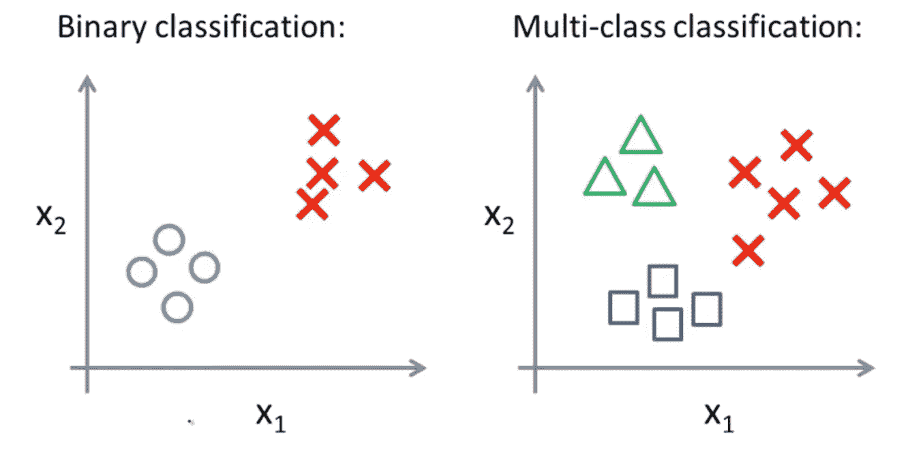

[来源](https://www.coursera.org/learn/machine-learning)

是或不是！！红的还是黑的！！值得或不值得…哦，上帝！！为什么我们有选择？🤔。我们的世界由许多面向选择的问题组成。不是吗？

因此..在我们的现实生活中，当我们不得不做出选择的时候，我们该怎么做呢？在做出决定之前，我们分析了一些方面。就像一个问题“穿什么(红色还是黑色)？”我们考虑这是什么样的场合？活动是什么时候？什么会让我被晒黑😁？所以，是的，有很多因素会影响我们的决定。这正是逻辑回归所做的。在逻辑回归中，我们看到现有的数据，我们称之为因变量，我们画出它们之间的关系，并根据我们拥有的细节预测(因变量)。而我们预测的永远是二分法(二元)。

但是，如果我们有多分类问题，即我们有多个因变量要预测，我们可以不使用逻辑回归吗？在本文中，我们将建立一个模型，其中使用逻辑回归，我们将分类 2 个以上的变量。

但是让我们先来理解逻辑回归背后的思想。“在逻辑回归中，借助于假设函数(也称为 **sigmoid** 函数),我们通过给定一些输入数据(已知变量)来计算概率，并在此基础上，模型进行分析以预测所需的分类。”这是什么意思？所以如果我们有一些因变量，比如 x1，x2，x3..我们有一个函数 f(X ),通过使用因变量，如果我们的函数计算出一个介于 0 到 1 之间的数，那么我们可以成功地对问题陈述进行分类。因此，对于分类问题，符号的基本概念可以解释为目标值为 0 或 1。即 **y ∈ {0，1}。**其中 y =目标或因变量。

因此，如果通过某种方式，我们可以找到给定 X(特征值)在 0 到 1 之间的假设函数的值，那么我们就可以成功地对数据集进行分类。所以，如果 **hθ (x** )是我们的逻辑回归函数或假设，那么 **hθ (x)** 需要满足条件为 **0≤ hθ (x) ≤1。**我们可以通过在我们的逻辑函数中使用***【θTX(θ转置 X)】****达到同样的目的。逻辑功能可以注意如下:*

*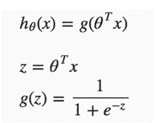*

*[片段来源](http://: https://www.coursera.org/learn/machine-learning/supplement/AqSH6/hypothesis-representation)*

*下图向我们展示了 sigmoid 函数(逻辑函数)的样子:*

*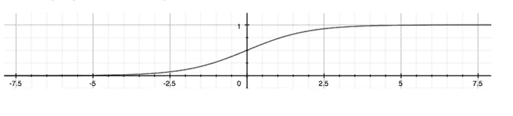*

*[片段来源](http://: https://www.coursera.org/learn/machine-learning/supplement/AqSH6/hypothesis-representation)*

*正如我们在上面看到的，z = θTX 的 g(z)函数会将所有不同值的特征(因变量)转换为一个介于 0 和 1 之间的数字。这肯定有助于我们对目标变量进行分类。*

*正如我们前面提到的，逻辑回归对概率起作用，所以这里我们的函数(hθ (x))将给出我们的输出是否为 1 的概率。例如，如果 hθ (x) = 0.8，则表示我们的输出为 1 的概率为 80%。因此，我们可以推断，我们的输出为 0 的概率是 20%。*

****决定边界:****

*为了得到我们的分类值 0 或 1，我们可以通过继承以下理解来对我们的特征进行分类:*

****If，hθ*(*x*)≥0.5→*y*= 1，If*hθ*(*x*)<0.5→*y*= 0***

*因此，如果我们对' **g'** 的输入是 **θTX** ，那么这意味着，如果 **θTX** 变得大于 0，那么我们的 out 概率将接近 1，我们可以将输出归类为 1，反之亦然。这个想法可以被记为:*

****hθ*(*x*)=*g*(*θTX*)≥0.5*当θTX* ≥ 0***

****θTX*≥0****y= 1***

****θTX*<0**y*y*= 0*

*判定边界是分隔 ***y = 0*** 和 ***y = 1*** 的区域的线。它是由我们的假设函数创建的。*

****成本函数:****

*我们的模型的主要目标应该是找出权重，即 ***θ*** 值。为了找出 ***θ*** 的值，我们需要一个函数(姑且称之为代价函数)，通过使用不同的 ***θ*** 的值来最小化它的值。最小化成本函数的权重将是我们最适合的权重。在逻辑回归中，我们需要选择一个凸函数，以便找到局部最优解。*

*逻辑回归的成本函数如下所示:*

*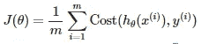*

*[来源](https://www.coursera.org/learn/machine-learning/supplement/bgEt4/cost-function)*

*如果 y = 1，Cost(hθ(x)，y)=-log(hθ(x))*

*如果 y = 0，Cost(hθ(x)，y)=-log(1hθ(x))*

*如果 hθ(x)=y，则 Cost(hθ(x)，y) =0*

*Cost(hθ(x)，y) →∞如果 y=0 且 hθ(x)→1*

*Cost(hθ(x)，y) →∞如果 y=1 且 hθ(x)→0*

*我们在解决方案中绘制了成本函数，显示了类似的模式。我们通常从选取随机的θ值开始，随后在梯度下降的帮助下更新这些值，并测量我们的模型结果有多好。该值是使用成本函数计算的，定义为:*

*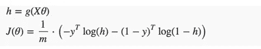*

*[来源](https://www.coursera.org/learn/machine-learning/supplement/bgEt4/cost-function)*

****渐变下降****

*我们的目标是最小化成本函数，通过改变权重，即θ值，我们可以达到同样的目的。我们可以通过对每个权重取成本函数的导数来更新 ***θ*** 值。同样，我们可以重复下面的公式:*

*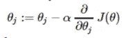*

*[来源](https://www.coursera.org/learn/machine-learning/supplement/0hpMl/simplified-cost-function-and-gradient-descent)*

*同样的公式可以写成:*

*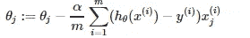*

*[来源](https://www.coursera.org/learn/machine-learning/supplement/0hpMl/simplified-cost-function-and-gradient-descent)*

*下面是上述公式的矢量化符号:*

*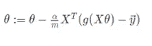*

*[来源](https://www.coursera.org/learn/machine-learning/supplement/0hpMl/simplified-cost-function-and-gradient-descent)*

*使用的阿尔法符号被称为学习率。这基本上有助于我们向凸函数的局部最优值发展。我建议阅读下面的文章(****)***，了解更多关于梯度下降和相关术语的知识。**

*****多类分类:一对多:*****

**现在，当我们有两个以上的类别时，我们将处理数据分类。我们必须扩展我们的描述而不是 ***y = { 0，1 }*** ，这样 ***y = { 0，1 … n}*** 。**

**一对一是一种策略，涉及训练 N 个不同的二元分类器，每个分类器被设计成识别特定的类别。之后，我们共同使用这 N 个分类器来预测正确的类别。我们如何用代码来实现呢？通过将一个类别视为 1，其余类别均视为 0，我们训练模型并获得必要的权重(theta 值)。我们以字典格式存储每个分类器的权重值。然后借助于 **Sigmoid 函数**我们计算概率。最大概率当选总统，我们将数据分类到相应的分类器中。**

*****代码:*****

****模型的执行:****

**在 **Fit ()** 方法中，我们实现了一个 vs Rest 算法，因为数据集需要多分类模型。我们迭代不同标签时间的代码，然后通过梯度下降法找出 **θ** 值。类似地，我们也在计算相对于相应的 **θ** 值的成本函数值。在我们获得每个标签类型的最佳 **θ** 值后，借助于 **Predict ()** 方法，我们正在使用我们最初找到的 **θ** 值找到给定特征的最大概率。因此，我们通过获得输入的最大概率来对每个特征输入进行分类。**

****绘制成本值:****

**由于这个数据集包含一个多分类问题，我们基本上扩展了我们的定义，使 y = {0，1…n}。在这种情况下，我们有 3 个类别，因此我们通过遵循一对一的方法相应地找到了 3 种不同情况下的成本值。因此，对于相应的成本值，我们有 3 个不同的图。考虑到与类别相关的成本值，PFB 绘制了成本与迭代次数的关系图。我们可以清楚地看到，随着每一次迭代，成本值都在减少，并趋向于零值。**

**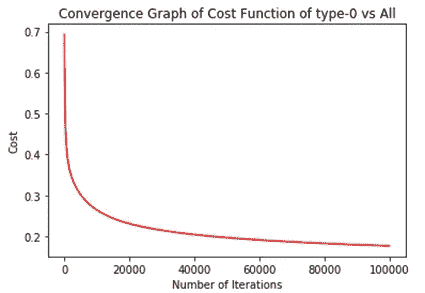****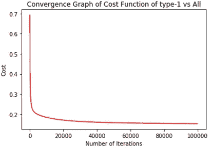****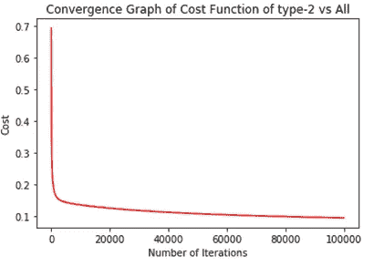**

**我们现在已经成功地实现了逻辑回归多分类算法，该算法可以用于分类 2 个以上的目标变量。**