# 简而言之，逻辑回归

> 原文：<https://medium.com/analytics-vidhya/logistic-regression-in-brief-515819a0da72?source=collection_archive---------28----------------------->

逻辑回归是一种分类算法，用于将观察值分配给一组离散的类。与输出连续数值的线性回归不同，逻辑回归使用逻辑 sigmoid 函数转换其输出，以返回一个概率值，该概率值可映射到两个或多个离散类。

例如:

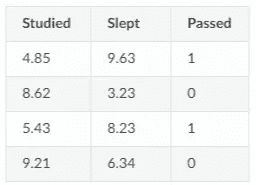

逻辑回归|作者图片

给出学习时间和考试分数的数据。逻辑回归可以帮助预测学生是通过还是失败。1 表示通过，0 表示失败。

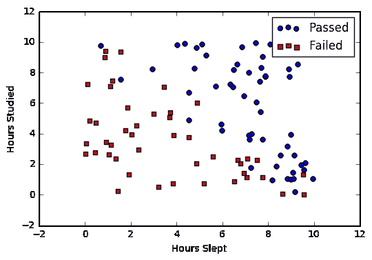

图形表示|作者图片

# 假设函数

统计**假设**是对数据总体之间关系的解释，它是从概率角度解释的。一个**机器学习假设**是一个逼近目标**函数**的候选模型，用于将输入映射到输出。逻辑回归的假设函数是

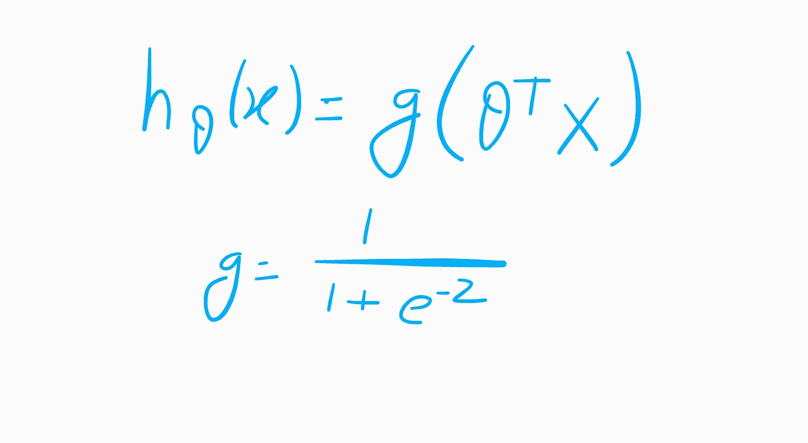

假设函数|作者图片

其中 ***θ*** 为模型的参数， ***X*** 为输入向量， ***g*** 为 ***Sigmoid 函数。***

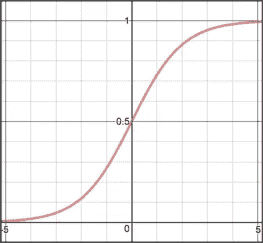

**Sigmoid 函数:**为了将预测值映射到概率，我们使用了 [sigmoid](https://ml-cheatsheet.readthedocs.io/en/latest/activation_functions.html#activation-sigmoid) 函数。该函数将任何实数值映射到 0 和 1 之间的另一个值。在机器学习中，我们使用 sigmoid 将预测映射到概率。

逻辑回归假设函数的完整表达式为

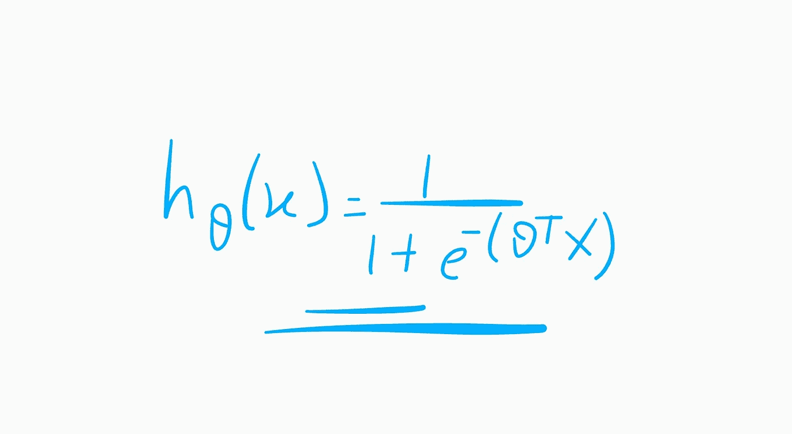

逻辑回归的假设函数|作者图片

# 判别边界

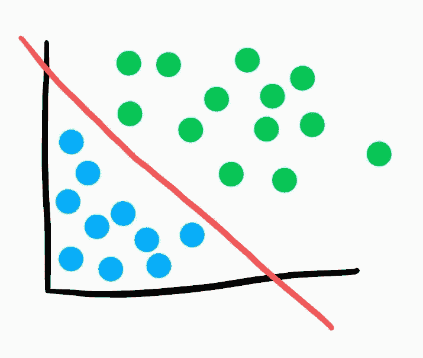

决策边界|作者图片

我们当前的预测函数返回 0 到 1 之间的概率分数。为了将其映射到一个离散的类别(真/假，猫/狗)，我们选择一个阈值或临界点，高于该阈值或临界点时，我们将值分类为类别 1，低于该阈值或临界点时，我们将值分类为类别 2。

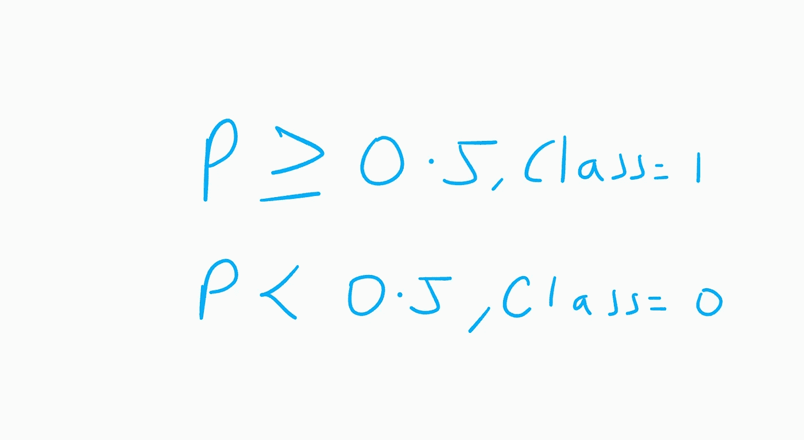

例如，如果我们的阈值是 0.5，而我们的预测函数返回 0.7，我们会将此观察结果归类为阳性。如果我们的预测是 0.2，我们会把观察结果归类为负面的。对于具有多个类别的逻辑回归，我们可以选择具有最高预测概率的类别。

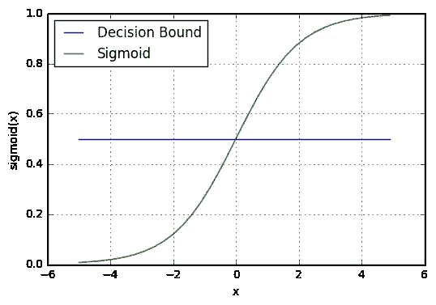

图形表示|作者图片

# 做预测

利用我们对 sigmoid 函数和决策边界的了解，我们现在可以编写一个预测函数。逻辑回归中的预测函数返回我们的观察值为正、真或“是”的概率。我们称之为 class 1，它的符号是 P(class=1)。随着概率越来越接近 1，我们的模型越来越确信观察值在类 1 中。

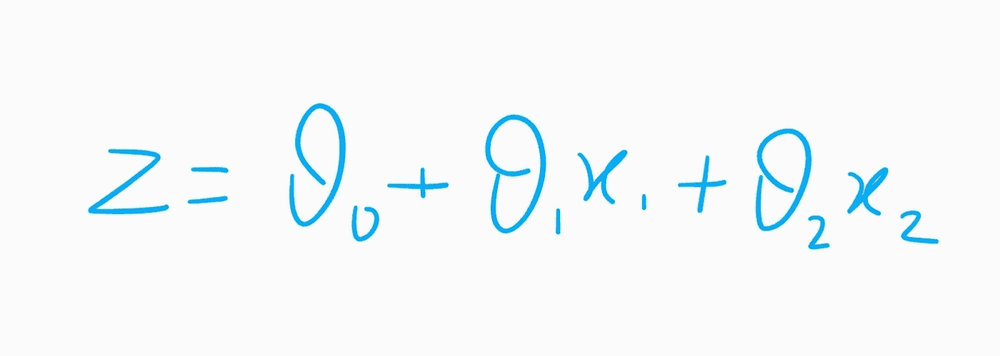

假设函数第 1 部分|作者图片

让我们使用假设函数。其中 ***X1*** 是 ***学过*** 和 ***X2*** 是 ***睡过。***

不过，这一次我们将使用 sigmoid 函数来转换输出，以返回介于 0 和 1 之间的概率值。

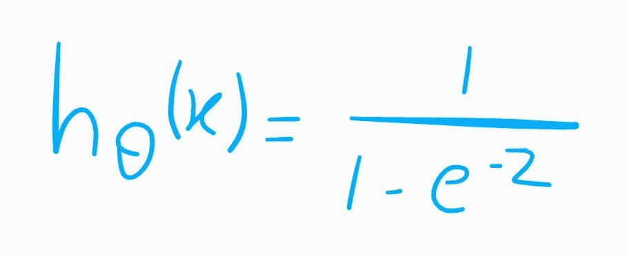

假设函数第 2 部分|作者图片

如果模型返回 0.4，它认为只有 40%的机会通过。如果我们的决策界限是 0.5，我们会将这个观察归类为“失败”

# 价值函数

不幸的是，我们不能(或者至少不应该)使用和线性回归一样的成本函数 MSE (L2)。为什么？有一个很好的数学解释，但现在我只想说这是因为我们的预测函数是非线性的(由于 sigmoid 变换)。像我们在 MSE 中所做的那样对该预测求平方会导致具有许多局部最小值的非凸函数。如果我们的成本函数有许多局部极小值，梯度下降可能找不到最优的全局极小值。

我们不使用均方误差，而是使用一种称为交叉熵的成本函数，也称为对数损失。交叉熵损失可以分为两个独立的代价函数:一个用于 ***y=1*** ，一个用于 ***y=0*** 。

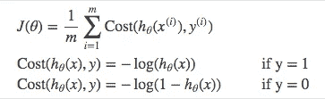

当你看一下 ***y=1*** 和 ***y=0*** 的成本函数图时，取对数的好处就显现出来了。这些平滑单调的函数(总是增加或总是减少)使得计算梯度和最小化成本变得容易。

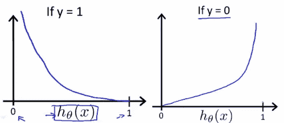

图片来自吴恩达关于逻辑回归的幻灯片。

需要注意的关键是，成本函数惩罚自信和错误的预测多于奖励自信和正确的预测！必然结果是，由于成本函数的逻辑性质，增加预测精度(接近 0 或 1)对降低成本的回报递减。

**以上功能压缩成一个**

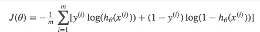

逻辑回归的成本函数

将上面等式中的 ***y*** 和***(1y)***相乘是一个巧妙的技巧，让我们用同一个等式来求解 ***y=1*** 和 ***y=0*** 两种情况。如果 ***y=0*** ，第一边抵消。如果 ***y=1*** ，则第二边抵消。在这两种情况下，我们只执行我们需要执行的操作。

**矢量化成本函数**

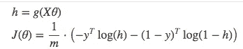

# 梯度下降

为了最小化我们的成本，我们使用 ***梯度下降*** ，就像之前线性回归一样。还有其他更复杂的优化算法，如共轭梯度法，如***【BFGS】***，但你不必担心这些。像 Scikit-learn 这样的机器学习库隐藏了它们的实现，这样你就可以专注于更有趣的事情了！

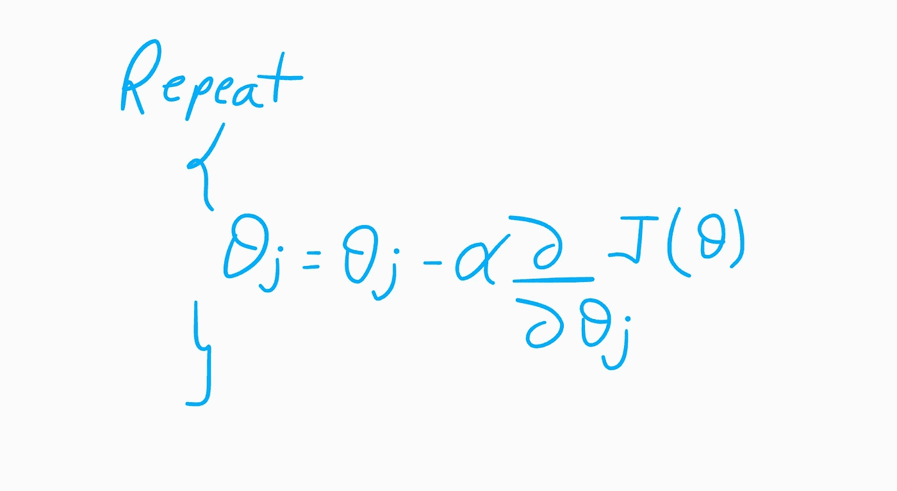

其中 ***J(θ)*** 为 ***代价函数。***

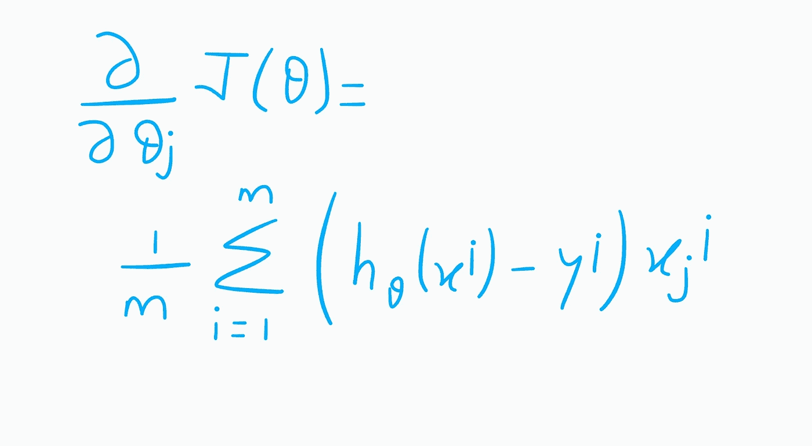

成本函数的部分推导|作者图片

现在把它们放在一起..

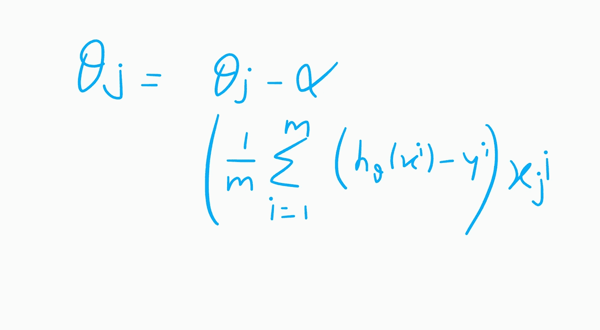

渐变下降|作者图片

重复此步骤，直到收敛。

这是逻辑回归背后的全部数学原理。在我的下一篇博客中，我们将实现这些方程并预测一些离散值。