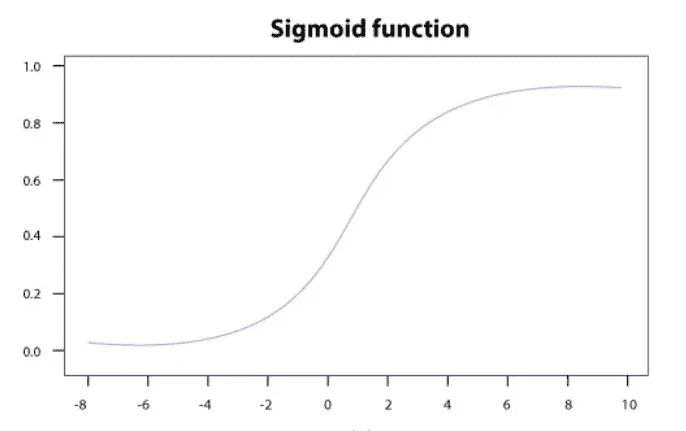

# 机器学习中的逻辑回归

> 原文：<https://medium.com/analytics-vidhya/logistic-regression-in-machine-learning-71fa3249223c?source=collection_archive---------24----------------------->

逻辑回归是一种可用于传统统计学以及机器学习的技术。

逻辑回归类似于线性回归，除了逻辑回归预测某事是**真还是假**，而不是预测像大小这样的连续事物。

此外，逻辑回归拟合的不是数据的直线，而是一个**“S”**形的逻辑函数。

曲线从 0 到 1，即曲线告诉我们曲线上特定点的概率。

逻辑回归一般用于**分类。**

就像线性回归一样，逻辑回归可以处理**连续数据**(比如体重和年龄)和**离散数据**(比如基因组和星座)。

逻辑回归使用**最大似然估计(MLE)** 来拟合直线。MLE 是一种使用一些观测数据来估计给定分布的参数的技术。

*   它计算所有点的可能性，然后将所有这些可能性相乘。这是给定这条线的数据的可能性。
*   然后你移动这条线，计算数据的新的可能性，然后再次移动这条线，一次又一次地计算可能性…
*   最后选择具有最大似然性的曲线。

## 在逻辑回归中使用 Sigmoid 函数-

我们选择 **sigmoid 函数**来模拟用**逻辑回归**解决的分类问题的原因是，我们希望确保预测值有一个确定的范围(即在 0 到 1 之间),这有助于我们区分类别。

> Y = 1 / 1+e -z

因此，如果 z 的值趋向正无穷大，那么 y 的预测值将变为 1，如果它趋向负无穷大，那么 y 的预测值将变为 0。如果 sigmoid 函数的结果大于 0.5，则我们将该标签分类为 1 类或正类，如果小于 0.5，则我们可以将其分类为负类或 0 类。

## 线性回归和逻辑回归的区别-

1.  线性回归将**线**拟合到数据，而逻辑回归拟合为**“S”形逻辑/S 形函数。**
2.  线性回归适用于预测工资、房价等连续产出。而逻辑回归用于预测概率范围在 0 到 1 之间的**分类**问题。
3.  对于线性回归，我们使用'**最小二乘法'，**拟合直线，换句话说，我们找到最小化残差平方和的直线，而逻辑回归使用**最大似然估计(MLE)** 来拟合直线。
4.  在线性回归中，我们也可以使用残差来计算 **R** 以比较简单模型和复杂模型。然而，在逻辑回归中没有 T2，没有残差的概念，所以我们不能计算 R。

## 逻辑回归总结-

*   逻辑回归可用于样本分类。
*   它可以使用不同类型的数据(如大小、基因组)来进行分类
*   它可用于评估哪些变量对样本分类有用。

我希望你喜欢我关于逻辑回归的短文。

谢谢大家！！！！！！