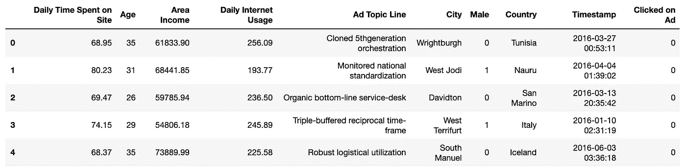

# Python 中使用 Pandas 和 Seaborn 的逻辑回归(适用于 ML 初学者)

> 原文：<https://medium.com/analytics-vidhya/logistic-regression-in-python-using-pandas-and-seaborn-for-beginners-in-ml-64eaf0f208d2?source=collection_archive---------4----------------------->

**数据集和问题陈述**

我们将使用广告数据集，显示特定的互联网用户是否点击了广告。我们将尝试创建一个模型，根据用户的特征来预测他们是否会点击广告。该数据集包含以下特征:

*   “每天花在网站上的时间”:消费者在网站上的时间(分钟)
*   “年龄”:以年为单位的客户年龄
*   “地区收入”:平均。消费者地理区域的收入
*   “每日互联网使用量”:平均。消费者每天花 30 分钟上网
*   “广告主题行”:广告的标题
*   “城市”:消费者的城市
*   “男性”:消费者是否为男性
*   “国家”:消费者所在的国家
*   “时间戳”:消费者点击广告或关闭窗口的时间
*   “点击了广告”:0 或 1 表示点击了广告

让我们一步一步地使用 Python 来分析、可视化和建模逻辑回归拟合

#首先，让我们导入所有必需的库-

```
import pandas as pd
import numpy as np
import matplotlib.pyplot as plt
import seaborn as sns
%matplotlib inline
```

#读取数据帧中的数据-

`ad_data = pd.read_csv(‘advertising.csv’)`

#使用 pandas 提供的标题、描述和信息功能检查数据



ad_data.head()


ad_data.info()


ad_data.describe()

# 探索性数据分析

这对于理解数据、各种特性的行为属性以及依赖关系(如果有的话)总是有帮助的。

我们尝试尽可能多的可视化。但在这里，让我们做一些常见的图表，这将有助于我们理解关键特性。

让我们使用 Python、Seaborn


#绘制年龄直方图

plt.hist(ad_data['Age']，bins = 40)


#创建一个显示地区收入与年龄的联合图。

sns.jointplot('年龄'，'地区收入'，数据=ad_data)


#创建一个显示每天花费在网站上的时间与年龄的 kde 分布的联合图

sns.jointplot('年龄'，'每天花在网站上的时间'，data=ad_data，kind='kde '，color='red ')


#创建“每天花在网站上的时间”与“每天使用互联网的时间”的联合图

sns.jointplot('每天花在网站上的时间'，'每天的互联网使用量'，data=ad_data，color='green ')

#最后，使用“点击广告”列功能定义的色调创建一个 pairplot，以分析每个变量之间的关系

`sns.pairplot(ad_data,hue=’Clicked on Ad’)`

#我们可以看到蓝色和橙色的数据点实际上是分开的，这是一个很好的指标。


# 逻辑回归—

# 将数据分成训练集和测试集

`from sklearn.model_selection import train_test_split`

变量 X 包含解释性列，我们将使用这些列来训练我们的模型，以适应广告是否被点击

```
X= ad_data.drop([‘Ad Topic Line’,’City’,’Timestamp’,’Clicked on Ad’,’Country’],axis=1)
y = ad_data[‘Clicked on Ad’]X_train, X_test,y_train, y_test = train_test_split(X,y,test_size=0.33, random_state=42)
```

# 训练模型

```
from sklearn.linear_model import LogisticRegression
logreg = LogisticRegression()logreg.fit(X_train,y_train)
```

我们得到下面，它显示了默认情况下使用 fit()方法设置的参数

```
LogisticRegression(C=1.0, class_weight=None, dual=False, fit_intercept=True,
          intercept_scaling=1, max_iter=100, multi_class='ovr', n_jobs=1,
          penalty='l2', random_state=None, solver='liblinear', tol=0.0001,
          verbose=0, warm_start=False)
```

# 我们模型的预测和评估

现在让我们从测试数据中预测数值-

`prediction = logrig.predict(X_test)`

#我们为逻辑回归模型创建分类报告。这比较了我们的实际值和预测值

来自 sklearn.metrics 导入分类 _ 报告

打印(分类 _ 报告(y _ 测试，预测))

```
precision    recall  f1-score   support

          0       0.87      0.96      0.91       162
          1       0.96      0.86      0.91       168

avg / total       0.91      0.91      0.91       330
```

这表明我们的模型有大约 91%的准确率。

全部完成！！我们刚刚使用 sklearn 完成了 python 中的逻辑回归。