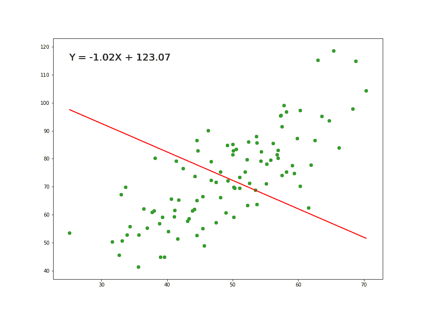
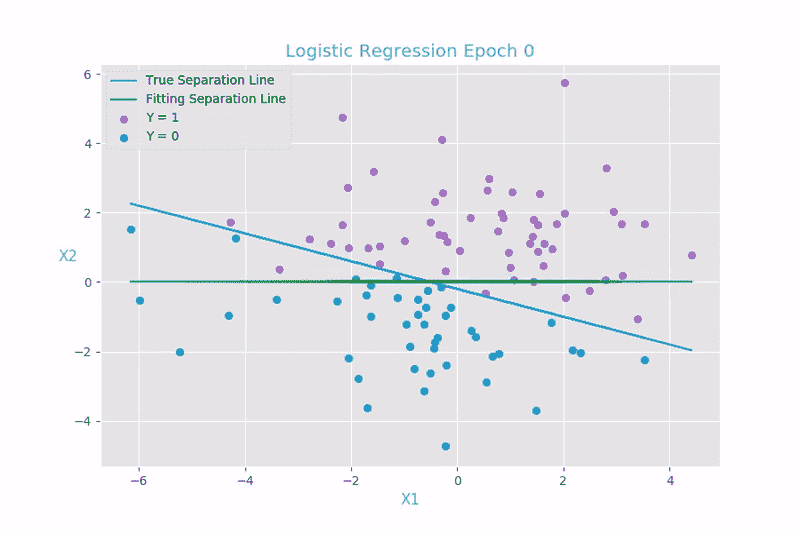
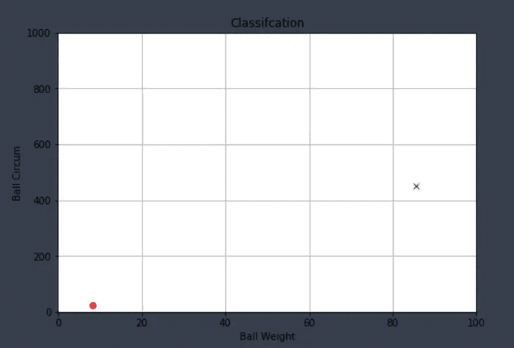
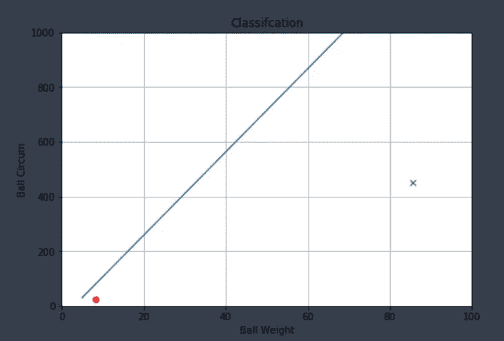
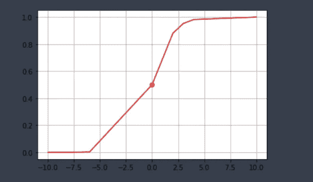
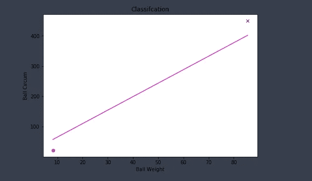

# 简单的逻辑回归

> 原文：<https://medium.com/analytics-vidhya/logistic-regression-in-simple-words-f747a202ddfe?source=collection_archive---------15----------------------->


美国国家航空航天局拍摄的照片——夜晚地球大气的天体视图

在这篇文章中，我们将看到逻辑回归的基本概念，并试图用简单的数学术语来解释它。

我们开始吧..

逻辑回归是机器学习中最流行和广泛使用的监督学习算法和分类技术之一，用于预测分类变量。

很少有实时应用程序，

a.在线交易中的欺诈检测(是或否)

b.电子邮件分类(垃圾邮件或非垃圾邮件)

c.癌症检测(是否为癌症)

d.降雨预报..等等

# 分类类型

有两种分类

1.  二元分类—最终结果是二元的，例如是/否、1/0、成功/失败..等等
2.  多类分类—最终结果有两种以上的可能性，例如差/一般/好。

## 它与线性回归有什么不同？

线性回归是一种数学技术，它在与实际值的平均偏差最小的数据点上绘制直线，因此我们可以使用该直线来预测未来的输入值。



线性回归

另一方面，逻辑回归是一种分类技术，通过基于其各自具有最小损失函数的结果值绘制**决策边界**来分离数据点。



逻辑回归

除了使用直线来分隔数据点之外，线性回归和逻辑回归没有任何共性。

好吧！那么它是如何从数学上分离数据点的呢？让我们从一个简单的例子开始，这样我们可以直观地理解算法是如何工作的。

假设我们有两个训练示例—我们有一个重量为 85.5 克、周长为 8.25 英寸的网球示例，而另一个样本足球重量为 450 克、周长为 22 英寸，现在我们的目标是要求逻辑算法根据标记数据的特征值对给定样本进行分类。

***球重=变量一= x1 =*【85.5，450】**

***球周长=变量二= x2 =【8.25，22】***

***球类型=输出= y =【网球、足球】***

在继续之前，让我们把数据形象化，这样更容易理解这个想法。



可视化给定数据

请记住，我们的目标是绘制基于特征值(x1，x2)分隔数据点的线，我们将抵制自己绘制分类器的诱惑，而是寻求算法的帮助，因为它可以处理大量的训练样本，这是人类不可能做到的。

实现这一点的一种方法是随机绘制多个分类器，并选择对训练数据和测试数据都表现良好的分类器。



随机线分类器

这是我们可以绘制的随机线分类器之一，但这实际上并没有分离数据点，因此我们无法说出哪个是足球，哪个是网球。因此，随机选择分类器不是解决问题的有效方法，尤其是当数据量增加时。

sigmoid 函数通过使用其优雅的数学特性，实际上可以帮助我们找到最准确的分类器。

# Sigmoid 函数

我们可以如下定义 sigmoid 函数。

> 1/1+e^(- z)

我们先来了解一下公式。乙状结肠的功能是什么？简单地说，如果你为 z 插入任何值，sigmoid 函数将产生 0 到 1 之间的数。

不要害怕“e”这个术语，它被称为“欧拉数”，属于 ***超越*** 数，在数学上具有有趣的性质，请参考【https://en.wikipedia.org/wiki/Transcendental_number】的了解更多信息，现在就把它想象成常数数值 **2.71828182845 ………** 继续。

举个例子，

如果 z = 3，sigmoid 函数将产生接近 1 的值 0.9526

如果 z = -3，sigmoid 函数将产生接近于 0 的值 0.047

```
z = 3
g = 1/(1+(np.exp(-z)))print(g)Output : 0.9525741268224334
```

由此可以看出，当 z > 0 时，g(z)将趋近于 1，当 z<0 then g(z) will approach 0 and when z = 0 , g(z) is exactly 0.5 .

We can visualise the sigmoid function in below graph for the mix of -ve and +ve values .

```
z = [-10,-8,-6,0,2,3,4,10]f = []
for i in range (0,len(z)):
    g = 1/(1+(np.exp(-z[i])))
    #print(g)
    f.append(g)
print(f)f = [4.5397868702434395e-05, 0.0003353501304664781, 0.0024726231566347743, 0.5, 0.8807970779778823, 0.9525741268224334, 0.9820137900379085, 0.9999546021312976]
```

For the above value of ‘z’ , we will get the sigmoid function as below graph..



Sigmoid Function

> Intuition of using sigmoid function is to find right the decision boundary (separating line) , line equation θ^t * x ≥ 0 or θ^t * x < 0 , in either one of the way we can achieve the classifier which separates two different probability of events .

# Hypothesis and cost function

Since we are going to plot the decision boundary as linear line or polynomial line, it is obvious that we will need a line equation. At the same time we want the line to be a classifier of probability of an event hence we are plugging the line equation in to sigmoid function.

Hypothesis for logistic regression is as follows,

> ***h(x)= g(z)= g(θ^t * x)= 1/(1+e^(-θ^t * x))***

> 在逻辑回归中，成本函数是实际结果和假设之间的分类差异。

*逻辑回归成本函数如下*

> *cost(h(x)，y) = { -log(h(x)如果 y = 1；-log(1-h(x))如果 y = 0}*

*如果 h(x) = 1 且 y =1，则 J(θ) = 0*

*如果 h(x) = 1 且 y =0，则 J(θ)接近∞*

现在，让我们使用上一个例子中的 sigmoid 函数来查找分类器。

我们希望 g(z) ≥ 0 .5，只有当 z≥0 时才有可能

这里 z = ***θ^t * x***

于是，***θ^t * x≥0；*θ^t * x =**θ0+θ1x1+θ2x 2)

我们知道 x1 和 x2 的值，但是θ0、θ1 和θ2 是未知的，并且必须通过优化算法(如梯度)来计算，让我们假设我们已经使用具有如下最小成本函数的梯度下降找到了参数。

我们来考虑，参数θ为→ [9.7，2.09，-0.47]

我们得到决策边界方程为，9.7 + 2.09 x1- 0.47 x2 ≥ 0，由此我们可以将数据点拆分为两个事件的概率。

我们只需要两个端点来绘制决策边界，因此上述等式也可以重新表述为:

X2 =(-9.7x 0)-(2.09 x1)/-0.47 =[57.49837741，401.93286108]

X1 = min(x1)，min (x2) = [8.25，85.5]

最后，通过绘制这条连接上述两个 X1 和 X2 的线，我们将得到分隔我们的数据点(在示例中为球重量和周长)的决策边界的近似值，如下所示:



训练数据的决策边界

酷！我们基于其可能的结果(这里是网球、足球)在数学上分离了两个数据点，因此当我们得到新的输入特征 x1、x2 时，我们可以说它属于网球还是足球的类别。

例如，如果我们输入新的球重量→ 50，周长→ 15.5，它将被假设为网球，因为它低于决策边界，反之亦然。

确切的方法也可以用于具有许多特征的较大数据点，但是基于我们的目标和数据的性质，我们可能需要通过添加多项式和一些其他调整技术来弯曲线，无论基本概念如何保持不变，

> “我们需要一个好的分类器来根据可能的结果将数据点分成两个或更多，该分类器将用于未知的新数据点，以预测其结果”。

# 结束注释

逻辑回归是一种广泛使用的分类技术，与线性回归相比，它可能看起来有点复杂，但一旦我们理解并用一些小数据集实现它，我们就可以意识到它是一种多么优雅和简单的分类和预测分类变量的技术。

也参考我以前的博客来了解 NumPy 中的[线性回归](/analytics-vidhya/simple-linear-regression-with-example-using-numpy-e7b984f0d15e)。

> 为了更好的未来，继续努力！！