# 逻辑回归数学&几何直观与实例

> 原文：<https://medium.com/analytics-vidhya/logistic-regression-math-geometrical-intuition-with-example-8a0cb8860f8a?source=collection_archive---------4----------------------->

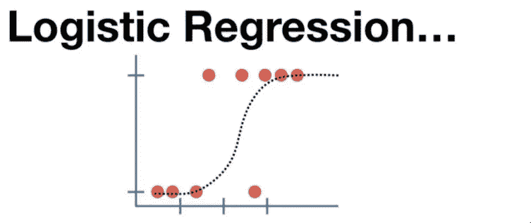

[https://images.app.goo.gl/qQ19gUc6zo4Ab9T58](https://images.app.goo.gl/qQ19gUc6zo4Ab9T58)

L 当因变量为二分变量(二元变量)时，逻辑回归是适当的回归分析。像所有回归分析一样，逻辑回归是一种预测分析。逻辑回归用于描述数据，并解释一个因变量与一个或多个名义变量、序数变量、区间变量或比率水平自变量之间的关系。

逻辑回归是一种用于解决分类问题的分类器。因为它在技术上依赖于线性回归& Logit 函数是一种用于分类问题的方法。

**为什么不能用线性回归进行分类？**

如果一切正常，我们可以使用线性回归，为什么需要逻辑回归。

a.离群值:如果数据集有离群值，线性回归不会表现得更好。

b.高端分类:可分类为> 1 或<0 which is an issue

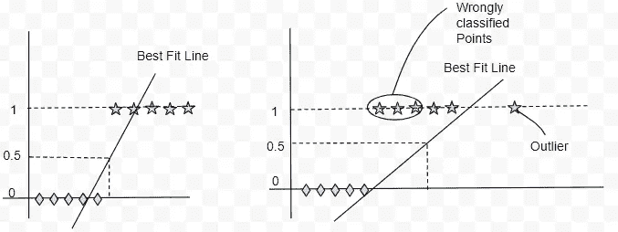

**Logistic 回归中有哪些假设？**

逻辑回归中的假设

1.逻辑回归要求因变量是二元的。

2.类几乎是线性可分的点。

3.要求自变量之间很少或没有多重共线性。

4.通常需要大样本量。

更多假设:[https://www . statistics solutions . com/assumptions-of-logistic-regression/](https://www.statisticssolutions.com/assumptions-of-logistic-regression/)

**数学&逻辑回归中的几何直觉。**

**步骤-1**绘制独立的&相关点&考虑最佳拟合线(几乎线性可分离的点)

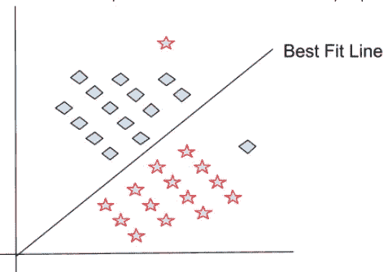

**步骤— 2** 从线性可分离点上的最佳拟合线计算距离函数。

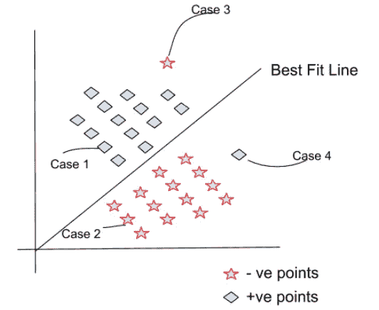

考虑上述示例，最佳拟合线值为 0，最佳拟合线以下的点被视为-ve 点，最佳拟合线以上的点为+ve 点。

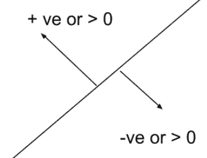

让我们从线性代数中计算距离函数。

从线性代数中我们得到

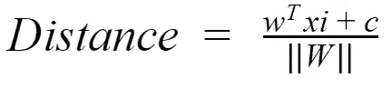

考虑||W||为单位值&通过 0 的截距 C。上述公式将被修改为

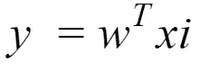

基于上述公式，我们将根据上述图片中的分类得出以下距离情况

**情况 1:** 根据给定数据 yi = +1 & wt * xi > 0

易* wt * xi > 0

**情况二:**根据给定数据 yi = -1 & wt * xi < 0

易* wt * xi > 0

**案例三:**根据给定数据 yi = -1 & wt * xi > 0

易*重量* xi < 0

**情况 4:** 根据给定数据 yi = +1 & wt * xi < 0

易* wt * xi < 0

Here Case 1 & Case 2 are correctly classified points but Case 3 & Case 4 are wrongly classified points.

Great now we got the distances of the classification points from the best fit line.

**第三步:**对计算出的距离求和&求 arg max。

我们已经计算了距离，现在我们要求和&考虑最大值，通过使用下面的公式来评估最佳拟合线。

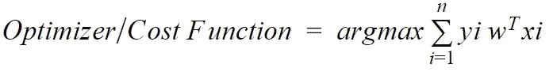

将考虑具有最大成本函数的最佳拟合线。通过改变 W 转置值，我们可以驱动我们的最佳拟合线，因为我们的易和 xi 是固定的(来自数据集)。

最后，我们需要最大化正确分类的点，最小化错误分类的点。

**如果数据有离群值怎么办？让我们考虑一个例子。**

**案例 1:**

让我们为不同的最佳拟合线实现成本函数

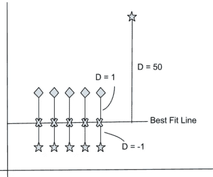

将为上面的成本函数输入数据，

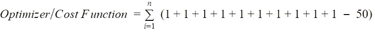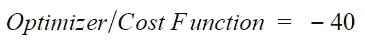

负类分类被计算为+1(因为-1 * -1)

**案例二:**

让我们为不同的最佳拟合线实现成本函数

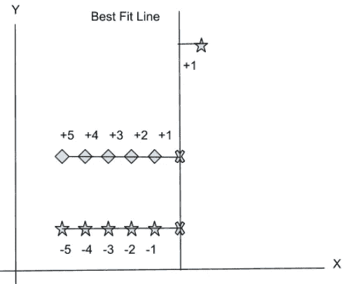

根据成本函数，这不是最好的拟合，但我们会尝试不同的方法

将输入上面给出的数据，

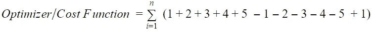

负类分类被计算为-1(因为-1 * +1)

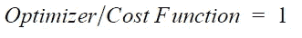

> 根据两种情况下的结果，我们看到，考虑到情况 1 (CF = 1)，情况 2 (CF = -40)具有最大成本函数，
> 
> 但是从视觉上，我们看到情况 1 比情况 2 具有最佳拟合函数。

由于异常值，我们有最佳拟合线，但大多数-ve 类被归类为+ve，这可能对预测结果有重大影响。下图。

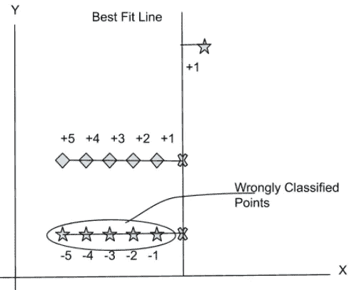

**那么，我们如何解决这个异常问题呢？**

简单的答案是实现 Sigmoid 函数异常值&优化公式如下。

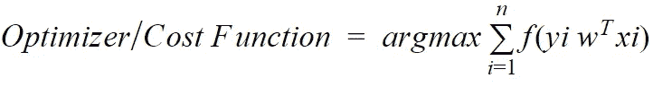

**乙状结肠定义(f):**

sigmoid 函数是一种数学函数，具有特征性的“S”形曲线或 sigmoid 曲线。sigmoid 函数的一个常见示例是第一张图中所示的逻辑函数，它由以下公式定义:

**乙状结肠公式:**

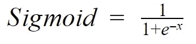

**s 形图:**

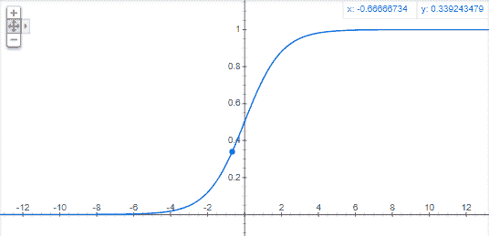

plot(1/(1+e^-x)——谷歌搜索

**变更后的成本函数公式:**

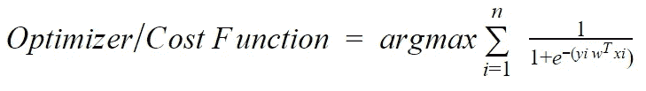

sigmoid 函数将在我们的范围内获取我们的异常值，这将导致用于减少异常问题的挤压技术。

感谢阅读。

您可以通过以下方式联系到我:

领英:[https://www.linkedin.com/in/shashikiranc/](https://www.linkedin.com/in/shashikiranc/)