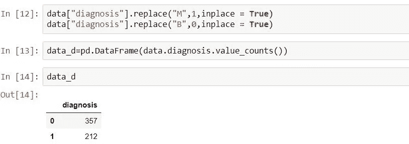

# 癌症预测模型

> 原文：<https://medium.com/analytics-vidhya/logistic-regression-model-d7792adb0dba?source=collection_archive---------20----------------------->

在本文中，我们将着重于在 Python 中构建逻辑回归模型来预测 ***乳腺癌*** 肿瘤的类型。

现在，让我们先来了解一下，什么是**乳房** **癌症**？

嗯，乳腺癌是一种乳腺细胞生长失控的疾病。

这里，我们将重点关注一个数据集，该数据集包含被诊断患有两种乳腺癌肿瘤的不同“客户 id”的数据。我们将构建一个逻辑回归模型，并使用随机森林分类器。

**逻辑回归:** *逻辑回归*是一种寻找一组输入变量和一个输出变量之间关系的技术(就像任何回归一样)，但在这种情况下，输出变量将是一个二元结果(即是/否或 1/0)。

你可以看看这里的数据:[https://www.kaggle.com/uciml/breast-cancer-wisconsin-data](https://www.kaggle.com/uciml/breast-cancer-wisconsin-data)

数据集有两种类型的诊断:

1) *恶性肿瘤(M)*——他们是癌性的。

2) *良性肿瘤(B)——*它们是非癌性的。

为了构建逻辑回归模型，我们将诊断 M 表示为“1”，B 表示为“0”。

让我们来看看数据栏:

显然，我们在数据中没有任何空值。因此，不需要进行缺失值处理。

python 中需要导入的库如下:

将诊断 M 表示为“1 ”, B 表示为“0”。

因此，357 人被诊断患有良性肿瘤，而 212 人被诊断患有恶性肿瘤。

现在，我们将把数据分为测试数据和训练数据，并将建立一个逻辑回归模型，我们还将检查模型的准确性。

因此，我们用逻辑回归模型得到了 94.4%的准确率。

现在让我们看看，如果我们使用随机森林分类器，准确率会有多少。

因此，我们使用随机森林分类器得到了 99.3%的准确率。

现在让我们看看逻辑回归和随机森林分类器的混淆矩阵。

***混淆矩阵:*** 它是一个表格，用来描述一个分类模型(或“分类器”)在一组真实值已知的测试数据上的表现。

**结论:**

***LOGISTIC 回归模型***

从上述混淆矩阵中我们可以清楚地观察到，从我们的测试数据来看，6 个客户患有恶性肿瘤，但被测试为良性，而在我们的模型中，2 个患有良性肿瘤的客户被测试为恶性肿瘤。

***随机森林分类***

在我们的模型中，只有 1 个患有良性肿瘤的客户被测试为恶性肿瘤，准确率为 99%。

因此，通过这篇文章，我们了解了如何使用逻辑回归这种流行的算法来解决分类问题。

感谢阅读:)