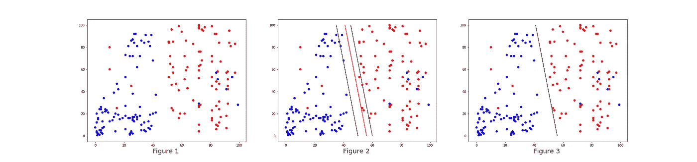
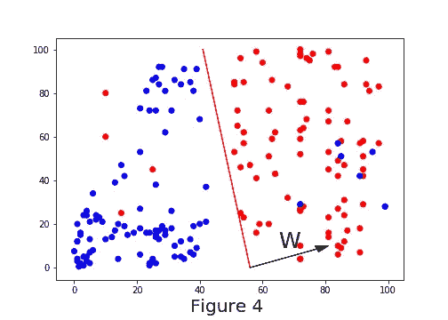
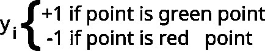
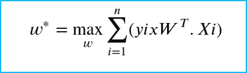
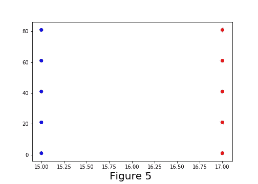
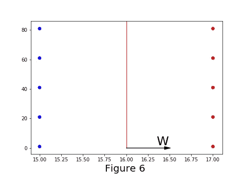
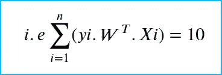
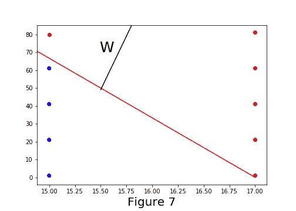
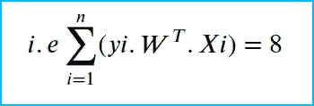

# 逻辑回归第一部分

> 原文：<https://medium.com/analytics-vidhya/logistic-regression-part-i-40d8fed8fdd4?source=collection_archive---------10----------------------->

## —献给想从机器学习开始的人—

理解逻辑回归有很多方法。在本文中，我们将学习用图形(几何直观)的方式来表示逻辑回归。即使名字本身讲的是回归问题，逻辑回归主要用于二元类分类问题。是的，逻辑回归是一种简单的分类技术。简单来说，我们可以说它找到了分隔两个类的最佳线。

如果你仔细观察图 1，图 1 中的点属于两类，即蓝色类和红色类。现在，作为一个人，我们可以画一条线来正确区分两个类别，如图 3 所示，但机器无法做到这一点，因此逻辑回归可以帮助机器学习区分这两个类别的最佳线。

得到如图 2 所示的线有许多种可能性，在这些可能性中最好的线是什么？最佳**线是对具有最小可能误差的点进行分类的线**这意味着无论你找到哪条最佳线，都会有最小的误差。那么，以最小误差分隔(分类)这些点的最佳直线是什么呢？图 2 中居中的线。请看图 3，有一条线将两个类分开。

> **直线的方程:-**w1x 1+w2 x2+w0 = 0
> 3D 中的直线成为平面
> **平面的方程:-** w1 x1 +w2 x2 +w3 x3 +w0 =0
> 如果假设直线通过一个原点那么截距将为零
> 即平面的方程为 w1 x1 +w2 x2 +w3 x3 = 0，在快捷方式中我们可以用 wTx = 0 来表示，其中 w 和 x 是矢量。

当这条线的概念扩展到 n 维时，它被称为超平面，这些平面中的每一个都将具有垂直于该平面的法线，如图 4 所示

**注:-**

1.当 w 方向上的一个点(如图 4 所示)乘以 w 时，我们得到一个正值。

2.当与 w 方向相反的一点乘以 w 时，我们得到一个负值。

## 即 w *红点=正值，w *蓝点=负值

现在我们知道，如果 w 和 x 的乘积是正的，那么这个点被认为是属于红点的点，如果 w 和 x 的乘积是负的，那么这个点被认为是属于蓝点的点。

**怎么能说这条线对点的分类是正确的呢？**有没有什么窍门可以找出这条线犯的这个错误？是的，有，考虑一个变量 yi，它对所有红点是+1，对所有蓝点是-1，如下所示。

现在要知道这条线是否对点进行了正确的分类，我们可以将这个 wTx 乘以 yi，即 yi wTx。

这个易 wTx 怎么能告诉我们 wTx 犯的错误？

让我们看一个例子

1.  我们考虑一个红点，wTx 会是正值，yi 也会是正值，那么 yi wTx 会是正值。
2.  让我们考虑一个蓝点，wTx 将是一个负值，yi 也将是一个负值，那么 yi wTx 将是一个正值，因为两个负值相乘将是正的
3.  让我们考虑一个被归类为蓝点的红点，wTx 将是一个负值(既然它被归类为蓝点我们得到负值对吗？)，而 yi 将是一个正值，因为原来它是一个红点那么 yi wTx 将是一个负值，因为正负的乘积将是负值
4.  让我们考虑一个被归类为红点的蓝点，wTx 将是一个正值(既然它被归类为红点我们得到正值对吗？)，而 yi 将是一个负值，因为它原本是一个蓝点。那么 yi wTx 将是一个负值，因为正负的乘积将是一个负值。

> **因此，如果一个点被正确分类，则 yi wTx > 0，如果一个点被错误分类，则 yi wTx < 0**
> 
> 所以我们必须找到一条线，使得所有点的 yi wTx 之和最大

到目前为止，我们获得了一个等式，以找出以最小误差分隔点的线的最佳权重。

**我们完成上面的等式了吗？**

让我们用一个简单的例子来测试上面的等式，假设我们已经向上面的等式传递了如图 5 所示的 10 个数据点，例如，假设它遇到了两种不同类型的线(图 6 和图 7)。

***类型 1 线(超平面):-***

让我们假设在每个类(组)中有 10 个点，如图 5 所示，并且有一条线将这 10 个点分成红色和蓝色类。

这里假设每个数据点到分隔线的距离为 1 个单位。这意味着从任何红点到线的距离将是 1，从任何蓝点到线的距离将是 1

因为所有的点都被正确分类并且位于 1 个单位的距离处，所以每个点的 yi*wT.xi 将如下

> yi * wt . Xi for red points }→+1(1)+1(1)+1(1)+1(1)+1(1)
> 
> 蓝色点数的 yi * wt . Xi }→+1(1)+1(1)+1(1)+1(1)+1(1)

**类型 2 线(超平面):-**

考虑具有法线“w”的蓝色点和红色点的分隔线，如图 7 所示。

这里假设每个数据点到分隔线的距离为 1 个单位。

正如你所见，所有的点都被正确分类，但只有一个蓝点是错误分类的(蓝点)。

对于每个红色和蓝色点，yi*wT.xi 将如下

> yi * wt . Xi for red points }→+1(1)+1(1)+1(1)+1(1)+1(1)-1(1)
> 
> 蓝色点数的 yi * wt . Xi }→+1(1)+1(1)+1(1)+1(1)

因此，最终逻辑回归选择类型 1 线来分离点，因为与类型 2 线的误差相比，类型 1 线的误差最小(在这种情况下没有误差)。

> 是的，我们已经完成了等式🤔但是等等……..离群值呢？

在逻辑回归[第二部分](/@yernagulahemanth/logistic-regression-part-ii-909e72cc8f9f)中解释了异常值对 yi.wT.xi 的影响

参考资料:-

1.  [应用人工智能课程](https://www.appliedaicourse.com)
2.  [谷歌](http://www.google.com)