# 逻辑回归第一部分——线性到逻辑的转换

> 原文：<https://medium.com/analytics-vidhya/logistic-regression-part-i-transformation-of-linear-to-logistic-395cb539038b?source=collection_archive---------1----------------------->

在这篇文章中，我们将探讨为什么我们需要逻辑，我们如何从线性和一些更重要的数学事实推导出逻辑。

# **让我们回忆一下线性回归的本质:**

在线性回归中，当 X & Y 之间存在线性关系时，我们试图根据任何类型的变量 X 来估计连续变量 Y。

如果我们说线性关系，这意味着，X 和 y 之间有一个模式。对于 X 的增加量，我们确定 y 的恒定变化。

这就是所谓的线方程。Y = mX + c

为了更好地理解，我们暂时把 c 看作 0。

那么方程就变成 Y = mX。

如果 m =2，=> Y = 2X。即，对于 1 个单位的上升(Y)，有 2 个单位的运行(X)。

所以，在线性回归中，对于 x 的任何值，Y 的变化都是常数。

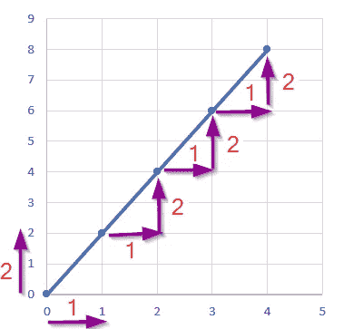

图表#1

取一条坐标为(1，2)，(2，4) & (3，6)的线…你可以看到(图 1)Y 值持续增加到 x 值的 2 倍

对于 1 个单位的运行(x)，有 2 个单位的提升(y)。

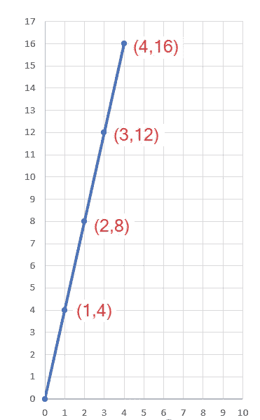

图表#2

在该图(图 2)中，对于任何 x 值，Y 也有恒定的变化。

这意味着 X 和 Y 值之间有一个比率。

考虑 Y 值不连续。如果 Y 值是离散的，那么它就绑定到上面提到的离散值。

如果问题是二项式的，那么 Y 值只能是 0 或 1。

比如成功还是失败，是还是不是，活下来了还是没活下来。

在这种情况下，我们所有的 Y 值不是 0 就是 1。既不在中间也不在远处。然后应用线性回归就变成这样了。

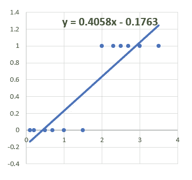

但是真正的问题发生在我们预测值的时候。

在上图中，它表示 Y 值等于 0.4058x — 0.1763。

对于较高的 X 值，Y 值超过 1。但是我们需要 0 或者 1。

> **那么我们如何在 0 & 1 内映射/归一化 Y 的值，以得到 x 的任何对应值**
> 
> **对于 X 的值，我们需要一个在 Y 中的常数效应，但是它不应该超过 1 或者低于 0。**
> 
> **我们需要以某种方式将离散的 Y 值映射/转换为连续的 Y 值，这对于 x 具有恒定的影响。**

现在让我们看看这个问题在数学世界里有什么！

我们的线性回归算法对连续值非常有效。

但是当 Y 值离散时，我们不能用直线方程的 Y 值来映射它。

我们需要映射这些概率离散值与连续值，我们可以使用线性回归算法。

换句话说，我们需要将可以预测范围从-无穷大到+无穷大的连续值的线性回归算法转换为预测离散值。

现在让我们看看这个问题在数学世界里有什么。

逻辑回归可以是二项式、序数或多项式。

**二项式或二元逻辑回归** —两种可能的结果“0”和“1”示例:成功/失败，是/否

**多项逻辑回归** —超过 2 个无法排序的结果。举例:选课:课程 A/课程 B/课程 c。

**有序逻辑回归** —类似于多项式，但结果可以排序。举例:电影排名:优秀/好/一般/差。

让我们在讨论中采用二项式/二元逻辑回归。当有两种可能的结果时，它可以与伯努利分布相比较。

> **伯努利分布是使用 0 或 1 的随机变量的概率分布。因为只使用了 2 个类，所以它是一个二元/二项式模型。**
> 
> **伯努利分布(Bernoulli distribution)以瑞士数学家雅克·伯努利(Jacques Bernoulli，1654–1705)的名字命名，描述了一个概率实验，其中一次试验有两种可能的结果，成功或失败。**

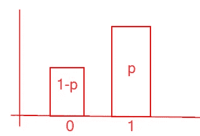

二项分布

如果所有可能的结果都是 100 %，如果成功的概率是 60%，那么所有其他剩余的机会都会自动失败。所以 100–60 = 40%。

如果成功被认为是 1，失败被认为是 0，那么总几率就是 0+1 = 1。

让我们用数学的方法来概括它，如果成功的概率是 p，那么失败的概率就是剩下的所有其他机会。

> **因此，故障概率可以写成 1-p，如果我们想用不同的变量来表示，可以说 q = 1-p**

然而，当涉及到导数时，把它作为 1-p 就容易理解了。

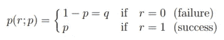

这里 r 是结果。

上述分布推广到以下形式:

P(x) = p^x * (1-p)^(1-x)

为了理解上面的等式，让我们在这个等式中插入 0 & 1 作为 x。

对于 x= 1(成功)，p(1)= p *(1-p)^(1–1)= p *(1-p)⁰= p * 1 = p

对于 x= 0(失败)，p(0)=p⁰*(1-p)^(1–0)= 1 *(1-p)= 1-p

现在你得到了 p(r；p)方程。

> **概率是成功发生的次数与总试验次数的比值。**

假设在 10 次事件中，成功的次数是 8 次，那么

成功的概率= 8/10 = 0.8

故障概率= 1- 0.8 = 0.2

现在我们发现了 Y 值的本质。它是一个二项式值，可以用成功和失败的概率来描述。

> **比值比是了解某件事发生的可能性的另一种衡量方法。**
> 
> **几率是成功发生的次数与失败发生的次数之比。**

即概率被定义为成功概率和失败概率的比率。

= >成功概率:失败概率

这可以表示为，

> **优势比(成功)=成功概率/失败概率**
> 
> **优势比(失败)=失败概率/成功概率**

我们可以从概率中确定优势比。

如果成功的概率是 p，

> **比值比= p/(1-p)**

赔率范围从 0 到无穷大。

如果成功的概率是 0.8，那么优势比是

OR = 0.8/(1–0.8)= 0.8/0.2 = 4

=> 4/1，也就是说赔率是 4:1。

每 4 次成功就有 1 次失败。

如果 p 值为 0.25，则 OR = 0.25/0.75 = 1/3

那么每 1 次成功就有 3 次失败。

最后，我们发现了一个规律。

但是这个比值比从 0 开始，因为概率从 0 开始，但是范围可以到无穷大。

别担心！我们有一个对数来改变它的范围。

我们来看看对数有什么性质。

> **log(x)是以 10 为底的对数。也可以写成 log10(x)。**
> 
> **ln(x)表示以 e 为底的对数。也可以写成 loge(x)。**
> 
> **对数和指数是互逆的。e^x 是 ln(x)** 的逆。

**Loge(a) = e^x**

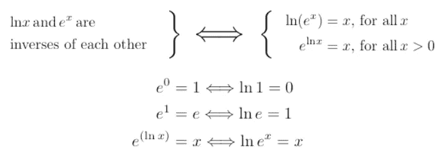

来源:[http://dev . relativity calculator . com/mathematical _ references . shtml](http://dev.relativitycalculator.com/mathematical_references.shtml)

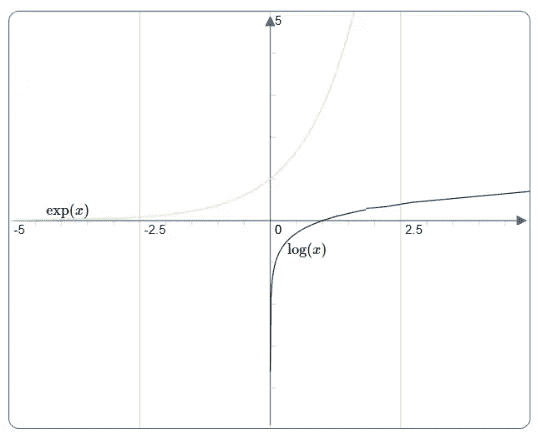

Exp 是 log 的倒数

你可以清楚地看到指数是对数的倒数。

任何值的对数范围可以从-无穷大到+无穷大。

下表说明了我们到目前为止所做的转变:

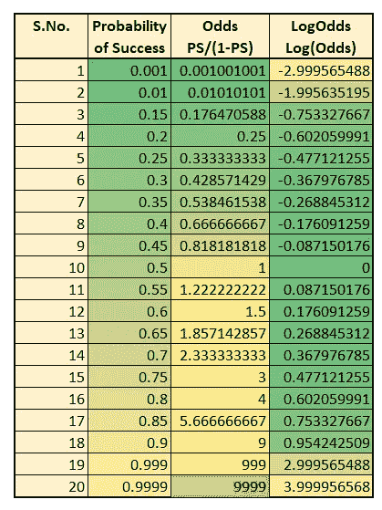

从二元到连续的转换

您可以看到，对于给定的值，Log odds 的范围从-2 到 3。对于不同的 p 值，它可以从-无穷大到+无穷大。

因此，我们将概率值转换为对数概率。这种转换称为链接函数。

# 将线性转换为逻辑:

在线性回归算法中，我们的直线方程是 **Y = mX + c**

你可以用任何有趣的符号来表示 X 斜率 m 和 y 截距 c。

专家写为***y*=*β*0+*β*1*x*1**

来自 [Minitab](https://support.minitab.com/en-us/minitab/19/help-and-how-to/statistical-modeling/regression/supporting-topics/logistic-regression/link-function/) 的解释:

> **链接函数将分类响应变量的水平概率转换为无限的连续标度。一旦转换完成，预测值和反应之间的关系可以用线性回归建模。**

例如，二进制响应变量可以有两个唯一的值。将这些值转换成概率使得响应变量的范围从 0 到 1。

> **当您对概率应用适当的链接函数时，得到的数字范围将从∞到+∞。**

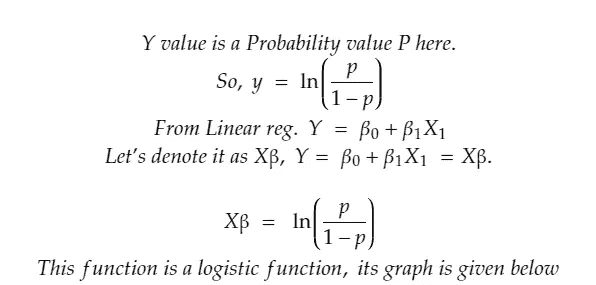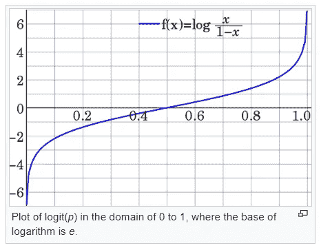

来源:[https://en.wikipedia.org/wiki/Logit](https://en.wikipedia.org/wiki/Logit)

你可以看到它是一条 S 形曲线。

这个函数的反函数给我们带来了 Sigmoid 曲线。

**反逻辑函数**被称为逻辑函数。

(想了解反函数的更多内容，请看[这段视频](https://www.khanacademy.org/math/algebra/x2f8bb11595b61c86:functions/x2f8bb11595b61c86:inverse-functions-intro/v/function-inverse-example-1)。用简单的例子解释得很好。)

来自 Wiki 的要点:

**逻辑回归**中的 **logit** 是广义线性模型中链接函数的特例:它是伯努利分布的规范链接函数。

**反逻辑**函数(即逻辑函数)有时也被称为 ***expit*** 函数。

如果 *p* 是一个概率，那么*p*/(1—*p*)就是对应的赔率；概率的对数是几率的对数，即

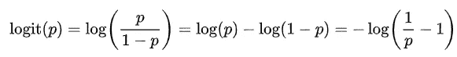

任何数字 **∝** 的“逻辑”函数由反逻辑给出:

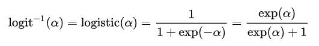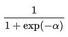

上面的函数是 Sigmoid 函数。

来源:[https://en.wikipedia.org/wiki/Sigmoid_function](https://en.wikipedia.org/wiki/Sigmoid_function)

:灯泡:我们已经达到了非常适合二项式数据的逻辑曲线。

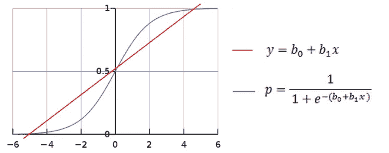

线性与逻辑曲线

从直线方程和 sigmoid 函数可以看出，如果我们知道 x 系数和斜率，我们可以将其转换为所需的概率值。

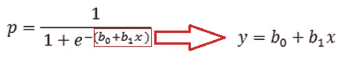

用线方程的 Y 值代替 alphs 或 xba

Sigmoid 函数是一个数学函数，具有范围在 0 和 1 之间的 S 形曲线。

该函数将值 x 转换为事件的概率。

如果概率值，即 sigmoid 函数值 p >= 0.5 的结果，则输出被标记为 1(真/肯定/成功)。

如果 p < 0.5, then it is marked as 0 (false/negative/failure).

Thus for any value of x, we have a constant effect in y and it could be ranged between 0 & 1 and also it could be classified to a discrete value.

# **结论:**

在本文中，我们已经看到了概率、对数优势，最后我们将已知的线性回归转换为未知的逻辑回归。

> **逻辑回归的工作方式类似于线性回归，首先找出 X 系数和斜率，除此之外，它还将 Y 预测值应用于 sigmoid 函数，以将接收到的真实值(范围从-无穷大到+无穷大)映射为二进制值(范围从 0 到 1)。**

🤞希望你现在能理解逻辑回归的概念。

这篇文章更加数学化，但是用 Python 实现一个模型就像我们在线性回归中做的一样简单。它只是一行 Python 代码。

让我们在一篇新帖的[逻辑回归第二部分——成本函数&误差指标](/@aasha01/logistic-regression-part-ii-cost-function-error-metrics-bbffbe93eb36?source=your_stories_page---------------------------)和&编程部分探讨成本函数。

如果你发现任何更正，我真的很感激知道，请在评论中添加它。

谢谢大家！👍

喜欢支持？只需点击拍手图标👏想吃多少就吃多少。

编程快乐！🎈

**感谢:**

 [## 维基百科，自由的百科全书

### 从维基百科，免费的百科跳转到导航跳转到搜索鱼腹虫是棘螈科的一个属…

en.wikipedia.org](https://en.wikipedia.org/)  [## 可汗学院|免费在线课程、课程和练习

### 免费学习数学、艺术、计算机编程、经济学、物理学、化学、生物学、医学、金融…

www.khanacademy.org](https://www.khanacademy.org/) 

【https://saedsayad.com/ 