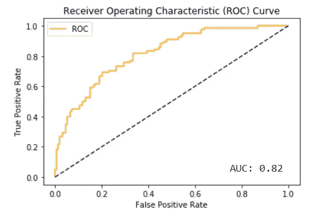
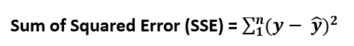
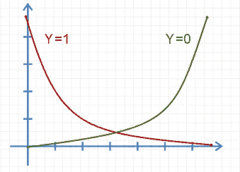
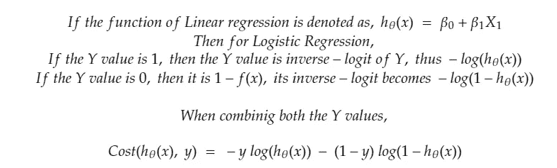
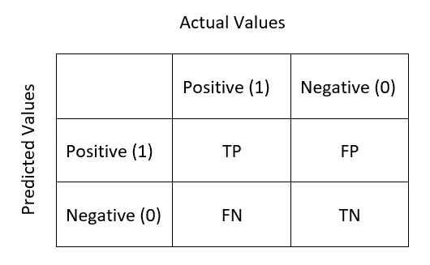
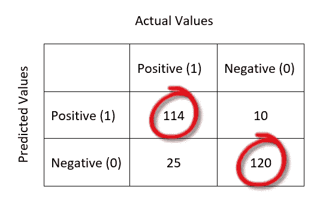
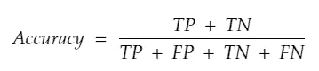
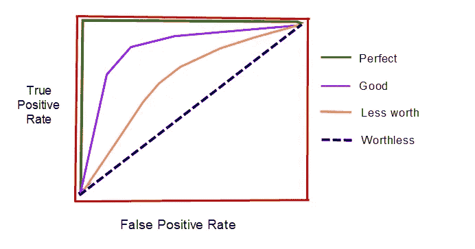

# 逻辑回归第二部分——成本函数和误差指标:

> 原文：<https://medium.com/analytics-vidhya/logistic-regression-part-ii-cost-function-error-metrics-bbffbe93eb36?source=collection_archive---------15----------------------->

ROC 曲线— AUC 得分

在这篇文章中，我们将探索逻辑回归的成本函数和误差度量。

逻辑回归是一种用于预测离散值的分类算法。

> **逻辑回归的工作方式类似于线性回归，首先找出 X 系数和斜率，除此之外，它还将 Y 预测值应用于 sigmoid 函数，以将接收到的真实值(范围从-无穷大到+无穷大)映射为二进制值(范围从 0 到 1)。**

要了解更多关于这种映射的信息，请查看[逻辑回归第一部分——线性到逻辑的转换](/analytics-vidhya/logistic-regression-part-i-transformation-of-linear-to-logistic-395cb539038b)。

逻辑回归通过将 Y 预测值放入 Sigmoid 函数中，将 Y 预测值转换为二进制值。

因此，Y 预测值成为介于 0 和 1 之间的概率值范围。

现在我们新的 Y 值落在了 Sigmoid 曲线上。

如果 p >= 0.5 那么我们把它设为 1，如果 p < 0.5 then we make it as 0.

The point 0.5 is called decision boundary.

In Linear Regression, the cost function is defined as,

But for Logistic Reg. this will not be suitable as we already took logistic (Sigmoid) of the Y value received.

Thus, the Cost Function becomes,

# **误差度量:**

## **混乱矩阵:**

我们的分类模型的预测将属于以下任何类别:

**真正 TP:** 实际值为正；预测值为正值

**真负值 TN:** 实际值为负值；预测值为负

**假阳性 FP:** 实际值为负；但是模型给出的是肯定的，这是一个错误的预测。

**假阴性 FN:** 实际值为正；但是模型给出的是否定的，这是一个错误的预测。

迷惑对吗？如果我们把这个总结成一个表格，那么就叫混淆矩阵。

Lol。它的名字叫混淆矩阵，但肯定不是因为它一开始很难理解。

这是正确预测的清晰表示。所有正确的预测都按对角线顺序排列(用红圈标出)。举个例子，

## 分类准确度:

在分类算法中，也存在准确性度量。但它是通过计算 TP、FP、TN 和 FN 的总数来衡量的。此指标衡量正确预测占预测总数的比率。对于更高的精度，该模型给出最好的结果。

## **召回率/灵敏度/真阳性率:**

> **在所有阳性类别中，有多少实例被正确识别。即，敏感度描述了模型在预测正类方面有多好。**

TPR = TP/P = TP / (TP + FN)

灵敏度值**越高，意味着您的模型在预测阳性类别**方面表现良好，只有少数阳性被预测为错误。

例如，如果测试数据有 10 个阳性类，并且 10 个中有 8 个被正确预测(真阳性)，那么这意味着 2 个阳性被预测为阴性(假阴性)。

TPR = 8/8+2 = 0.8

当分母 FN(错误预测)增加得比分子 TP 多时，TPR 的值减少。因此，**TPR 越高，正确的正面预测就越高。**

在某些模型中，我们可以接受一定的假阳性率，但不鼓励假阴性。例如，在恶性肿瘤检测中，如果恶性肿瘤阳性患者被预测为阴性，则比阴性患者被预测为阳性更危险。

这个时候，我们需要专注于获得一个好的敏感率。

假阴性率是 TPR 的倒数。

FNR = 1 — TPR = FN/ (FN + TP)

## **特异性/选择性/真阴性率:**

> **假阳性数除以假阳性数和真阴性数之和。特异性描述了一个模型在预测积极的类别方面有多好。**

TNR = TN/N = TN / (TN+ FP)

例如:如果测试数据有 10 个阴性类别，10 个中有 8 个被正确预测(真阴性)，那么这意味着 2 个阴性被预测为阳性(假阳性)。

TNR = 8/8+2 = 0.8

当分母 FP(错误预测)比分子 TN 增加得多时，TNR 的值减少。因此，TNR 越高，正确的负面预测就越高。

在某些情况下，假阳性是不可接受，但是假阴性的比率是可以协商的，我们需要关注特异性而不是敏感性。例如，如果球员的药物消耗测试的阳性结果受到法律的严厉惩罚，那么当一个没有消耗药物的人被错误地指控时，这是很危险的。

在这种情况下，我们需要关注特殊性。

假阳性率是 TNR 的倒数。

FPR = 1 — TNR = FP/ (FP + TN)

## **精度/阳性预测值:**

在所有预测的正面事例中，有多少是正确的。

精度= TP / (TP + FP)

## **F 值:**

从查准率和查全率来看，F-Measure 是计算出来的，有时也用作度量。f-Measure 只不过是精度和召回率的调和平均值。

F-Score = (2 *召回率*准确率)/(召回率+准确率)

## **ROC 曲线:**

即使分类精度是单个值，从该值我们可以知道模型的精度，但是该信息对于分类算法来说是不够的。

对于二元响应变量，出于某些原因，我们可能需要知道一个模型可以预测每个类别的好坏。

> **ROC(受试者工作特征)曲线是假阳性率(x 轴)和真阳性率(y 轴)的可视化。**

尽管我们有敏感度比率来发现预测阳性结果的优点，ROC 曲线提供了更好理解的可视化。

ROC 曲线上的每个点代表一个灵敏度/特异性对。

蓝色虚线是随机分类器，即每个无价值类别有 50%的机会。

ROC 曲线图解——了解好曲线和坏曲线

从上图可以辨别出 ROC 曲线中哪些是好的，哪些是不好的。这张图是手绘的，只是为了比较什么是好的，什么是坏的。

从糖尿病训练数据集获得的原始 ROC 曲线在本文的顶部“ROC 曲线 AUC 得分”中提到，我们将在本系列的下一部分中查看该曲线。

**从 ROC 曲线观察:**

👉Y 轴的急剧增加意味着高数量的真阳性，即高数量的正确预测。

👉曲线越靠近左侧边界和顶部边界，测试就越准确。

👉曲线越接近 45 度对角线，测试越不准确。

👉如果曲线上升到左上角，那么曲线将覆盖其下的更多区域。计算该面积并表示为 AUROC 曲线下面积)得分或 AUROC 得分。

👉如果 AUC 分数是 0.5，那么曲线只是随机选择。

👉如果 AUC 分数是 1，那么所有面积都是正确的预测。即完美模型。

👉AUC 分数越高，模型越好。

# 结论:

在本文中，我们已经看到了成本函数和误差度量。

在本系列的下一篇文章中，我们将研究使用 Python 进行逻辑回归的编程部分。

上一部分— [逻辑回归第一部分—线性到逻辑的转换](/analytics-vidhya/logistic-regression-part-i-transformation-of-linear-to-logistic-395cb539038b?source=your_stories_page---------------------------)

如果你发现任何更正，我真的很感激知道，请在评论中添加它。

谢谢大家！👍

喜欢支持？只需点击拍手图标👏想吃多少就吃多少。

编程快乐！🎈