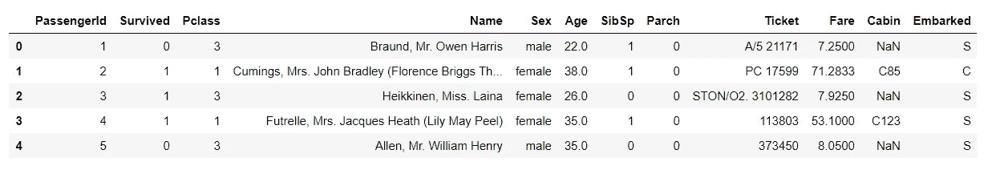
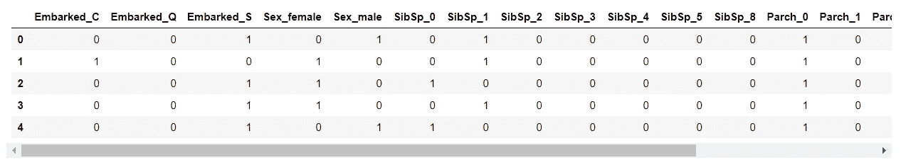
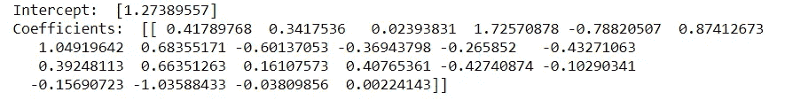
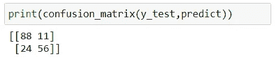
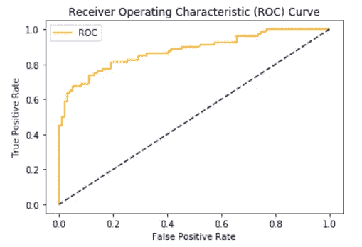
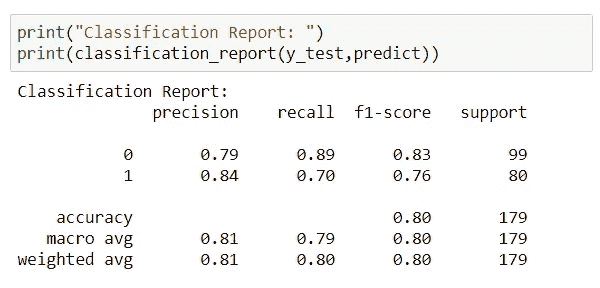

# 逻辑回归——第三部分——泰坦尼克号灾难生存预测

> 原文：<https://medium.com/analytics-vidhya/logistic-regression-part-iii-titanic-disaster-survival-prediction-8473c83e465d?source=collection_archive---------18----------------------->


来源:照片由马克·丹顿在 Unsplash 上拍摄

在本文中，我们将使用逻辑回归和分类度量来研究 Titanic 数据集。

让我们看看如何使用来自 sklearn 的 Python-LogisticRegression()进行逻辑回归。

我从 Kaggle 那里拿到了泰坦尼克号的数据集。[https://www.kaggle.com/c/titanic/data](https://www.kaggle.com/c/titanic/data)



这里，除了编码，我跳过了数据处理部分。我会提出一个新的职位专门为数据预处理。

#1= >删除了 Cabin，因为它看起来是大量的空列，并且对于具有高操纵值的列不能接收太多信息。

#2= >对类别列进行编码。我还将完成验证数据集(test.csv)的所有编码。

#3= >删除原始列并连接编码的列。



模型—使用逻辑回归:



最后，我们使用 predict()方法预测了测试数据的幸存值。

# 韵律学

要为错误度量导入的包:

```
from sklearn.metrics import accuracy_score, classification_report, confusion_matrix,roc_auc_score
```

## 1.混淆矩阵

这是正确预测的清晰表示。所有正确的预测都按对角线顺序排列。



## 2.分类准确度

此指标衡量正确预测占预测总数的比率。对于更高的精度，该模型给出最好的结果。

输出:0.804674368685

## 3.ROC 曲线和 AUC 分数

*ROC(受试者工作特征)曲线是假阳性率(x 轴)和真阳性率(y 轴)的可视化。*

predict_proba(…)在数组中提供概率。pred_prob[:，1]意味着我们只取正值。

AUC 分数:0.88



受试者工作特征曲线

我们可以看到 ROC 曲线还不错。通过更多的预处理，我们可以提高 AUC 分数。要了解更多 ROC 曲线，请访问[逻辑回归第二部分—成本函数&误差度量](/@aasha01/logistic-regression-part-ii-cost-function-error-metrics-bbffbe93eb36?source=your_stories_page---------------------------)。

## 4.分类报告

这是每个类的指标摘要。



在上面的报告中，我们分别给出了 0 类和 1 类的精度、召回率和 F1 值。

# 结论:

在本文中，我们已经了解了如何使用逻辑回归来预测离散值。

要了解更多关于逻辑回归的信息:

[逻辑回归第一部分——线性到逻辑的转换](/analytics-vidhya/logistic-regression-part-i-transformation-of-linear-to-logistic-395cb539038b?source=your_stories_page---------------------------)

[逻辑回归第二部分—成本函数&误差指标](/@aasha01/logistic-regression-part-ii-cost-function-error-metrics-bbffbe93eb36?source=your_stories_page---------------------------)。

请尝试逻辑回归并在此留下您的评论。

谢谢大家！👍

喜欢支持？只需点击拍手图标👏想吃多少就吃多少。

编程快乐！🎈