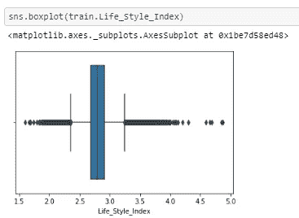
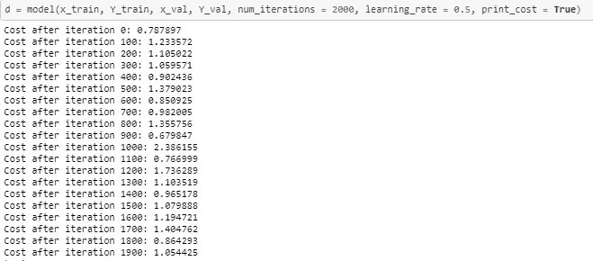

# 逻辑回归——实用方法

> 原文：<https://medium.com/analytics-vidhya/logistic-regression-practical-approach-a5546ad96d7d?source=collection_archive---------29----------------------->

在我的上一篇文章:[逻辑回归:理论方法](/analytics-vidhya/logistic-regression-the-theoretical-way-1f22f273b840)中，我已经和你谈过逻辑回归的重要关键概念，在开始实际实施之前应该知道。我希望你已经了解了这些概念。如果没有，在阅读这篇文章之前，我想请你浏览一下我以前的文章。

本文将不仅仅涵盖逻辑回归，其主要目的是简单地讨论解决业务问题的关键方法。构建模型让我们着迷，但实际上分析师只花 20%的时间。其余 80%用于数据探索和处理。在处理和创建模型之前，必须了解数据。

在本文中，我将讨论以下内容:

*   定义:问题陈述
*   对数据外观的一瞥
*   路线图或方法
*   逻辑回归模型

在本文中，我研究了移动性分析数据集。来源是 AnakyticsVidhya Jantahack。***注意:在将该数据集用于商业目的之前，请联系 AnalyticsVidhya！**

## **1)问题陈述**:

XYZ 是一个出租车聚合服务。他们的客户可以在智能手机上下载他们的应用程序，并在他们经营的城市的任何地方预订出租车。他们从各种服务提供商那里搜索出租车，并在所有可用选项中为客户提供最佳选择。他们从服务提供商那里获得了 surge_pricing_type，这是本研究的关键变量！

目标是建立一个预测模型，这有助于积极预测价格上涨类型。这反过来会帮助他们快速有效地将合适的出租车与合适的客户匹配起来。

## **2)数据一览**

下图显示的是数据字典，即告诉我们数据集中每一列的内容。

数据字典

简单来说，数据如下图所示。在导入数据后检查数据是一个很好的做法。它给你一些关于数据的关键概念，比如有什么类型的变量和什么数据类型。

数据集一览

## 3)让我们构建我们的路线图

当我们导入数据时，我们应该首先检查一些关于数据集的信息图表。我们所说的**信息图**是指一些基本信息**比如我们数据集的**类型、性质**和**描述**。**

*   **类型:**每个变量的数据类型
*   **性质:**变量类型——分类或连续
*   **描述:**一些基本的数据统计

探索数据类型至关重要。它告诉我们我们的变量是什么类型，例如，数字，字符串等。不仅如此，它还可以告诉我们数据中的一些潜在问题。例如:让我们以 Trip_Distance 变量为例，假设它是对象数据类型而不是 float。距离应该是数字的，这是合乎逻辑的。因此，它告诉我们，变量中存在字符串，字符或符号。因此，我们将不得不处理这些值的变量。我们要么估算它们，要么放弃那一行。下图显示了数据集的数据类型。

**类型**

另一个必要的步骤是检查数据中变量的性质。我们可以通过查看数据集的一些行来实现。我们可以确定变量是连续的还是分类的。参考下图:

**自然**

我们数据的描述性统计为我们的数据集提供了许多关键信息，例如:

*   我们确定变量的分布，
*   我们可以识别一些问题，比如数据中的**缺失值**、**异常值**——让我们以 Customer_Since_Months 变量为例，查看计数统计。当我们与他人比较时，计数会更少，这意味着数据中存在 **NaNs** ，即缺失值。现在如果我们取 Life_Style_Index 变量，你会看到最小值远小于下限。**下限为 25%——(1.5 * IQR)**。因此存在离群值。因此，我们必须解决数据集的这些问题，并对待它们。

现在我们已经对数据有了一些基本的概念，我们需要更深入地研究它，寻找数据中的异常，并做必要的处理！这里我们将只讨论两种类型的数据异常:

*   缺少值
*   极端值

**a)缺失值**

要浏览数据集中缺失的值，我们可以执行以下操作，如下图所示:

**探索缺失值**

在上面的图像序列中是我们导入数据的数据帧。 **isna()** 是一个函数，用于检查数据集的列中是否存在**nan**。**。sum()** 返回列中缺失值的总数。

在上图中，我们看到像 **Type_of_Cab、Customer_Since_Months、Life_Style_Index、Confidence_Life_Style_Index、Var1** 这样的变量缺少值。 **Total_Perc** 列返回该列中缺失值的百分比。

现在，让我们研究具有缺失值的列，以了解更多关于缺失值的本质。这将有助于您确定处理缺失值的合适方法。在删除丢失的值行或输入它们之间有一个权衡。*** *注:我们通过平均值或中值估算连续变量的缺失值，通过模式估算分类变量的缺失值。**让我们研究一下 **Type_of_Cab** 变量，以了解缺失值的性质。请参考下面显示的图片，它将向您展示一些关键发现以及对驾驶室类型的探索。

**分组激增-定价-按出租车类型分类**

按所有连续变量的 Cab 类型分组

主要发现

我已经创建了一个函数来处理缺失值列，请参考下图:

因此，上面的函数有四个输入:列名、变量类型:连续或分类、数据帧名、值、最后一个参数，即值是可选的。如果你想用用户定义的值进行估算，你可以将值分配给**值**参数，否则如果你想让函数估算自身，你可以让**值**参数默认等于**无**。

让我们来处理 Type_of_Cab 变量，在其中我们给它分配一个新的类‘F ’,因为丢失值的频率如此之大，以至于我们不能将它包括在现有的类中。如果我们看到类的计数是 10K (10，000)的倍数，缺失值的计数也是 10K 的倍数，因此我认为有一个类缺失。因此，我们定义新的类' **F** '。驾驶室类型有 4 个现有等级 **A、B、C、D、e**

驾驶室类型柱的处理

现在，我们已经了解了如何处理缺失值，让我们了解如何处理异常值？

**b)异常值**

异常值是一个与其他观察结果明显不同的数据点。**异常值**可能是由于测量中的**可变性造成的，或者它也可能表明**实验误差**。**

为了检查异常值，我们绘制每个变量的箱线图，下须和上须之后的点是异常值。

局外人

在数学上，我们通过下式定义下限和上限:

*   下限:(25%——(1.5 * IQR))
*   上限:(75% + (1.5*IQR))
*   IQR : (75% — 25%)

任何高于**上限**和低于**下限**的值都是异常值，必须进行修剪。下图中的函数用于处理异常值:

处理异常值

现在我们已经了解了异常处理，是时候了解我们的数据，探索数据并分析它了。这对于特征工程、重要特征选择和模型构建等后续过程至关重要。下面分享的图片只是一个例子，但是如果你想了解更多关于 EDA 的知识，你可以访问我的 [github 库](https://github.com/startmljourney/Logistic-Regression/blob/master/Mobility%20Analytics/Logistic_Regression.ipynb)

请务必阅读下面的最后评论，它会告诉我们可能的重要特性。

最终意见

既然我们已经介绍了**信息图、异常检测&处理、EDA、**，现在是时候谈谈开始建模前路线图的最后一步，即**数据预处理。**

我们需要将分类变量从字符串数据类型转换为数字数据类型，以便算法能够理解它。我们可以把它编码成二进制或多进制编码，也就是 0 & 1。可以使用**一次热编码**或**标签编码器**来完成。我做了一个热编码。参考下图了解如何做到这一点。

**一次热编码**

编码之后，我们需要把连续变量放在同样的尺度上，这样它们的大小是相同的，可以比较的。我们通过 sklearn 的 normalizer()函数来规范化我们的连续变量。参考下图:

建模前的最后一步是将数据分为训练和测试两部分。这里就不说了。我将在单独的文章中介绍它。

现在是进入模型开发阶段的时候了。

## 逻辑回归-从零开始开发它！

这里，在下图中显示的是我们模型的架构。

**逻辑回归**

因为我在上一篇文章中已经分享了理论基础，所以在这里我将只讨论逻辑回归的实践方面！

在下图中，我们定义了 sigmoid 函数，它将线性函数转换为概率。

乙状结肠的

当我们输入数据时，我们将它与权重相乘，以生成逻辑回归架构中所示的线性函数。为此，我们首先需要初始化权重。下图显示了初始化权重和偏差的函数。

初始化权重

现在让我们定义如何通过模型传播我们的输入来给出输出！当模型得到自变量的输入时，它取自变量和初始化权重的点积。然后，我们将其输入到 sigmoid 函数中，输出为 **yhat** ，我们将其与**实际 y** 进行比较，并计算损失函数。最后我们计算权重的梯度&偏差。

假设我们的独立特征集形状是(6583，29)，那么:

称重矩阵形状:(29，1)

z 形:(1，6583)

激活函数矩阵(A)形状:(1，6583)

dz 形状:(1，6583)

成本:它是一个标量值

dw 形状:(29，1)

现在我们需要优化我们的权重和偏差，使损失达到全局最小值，因此我们使用梯度下降算法。在这种情况下，我们获取由 **Propogate()** 函数计算的权重和偏差的梯度，并更新模型权重和偏差，直到损失达到全局最小值。

梯度下降

下图是**预测()**函数，用于将激活函数 **sigmoid()** 计算的概率转换为 0 & 1。

预测功能

使用上面定义的所有函数，最终模型如下图所示:

最后，我们执行我们的模型，如下图所示:

模型执行

这里有一个**学习率的概念，**简而言之，它是一个超参数，决定了模型损失多快达到其全局最小值。我将在接下来的文章中讨论这个问题。

现在剩下的重要事情是评估指标，我将在下一篇文章中讨论。

如果您有任何疑问，请随时发表评论，或者您可以通过 startmljourney@gmail.com 联系我

再见，朋友们！我希望这篇文章对你有所帮助，我们会很快见面的。