# 逻辑回归背后的数学

> 原文：<https://medium.com/analytics-vidhya/logistic-regression-simplified-a038de4a8143?source=collection_archive---------8----------------------->

## 逻辑回归的几何解释

在这篇文章中，我将用一些方程以最简单的方式解释逻辑回归。我期望有一些非常基础的机器学习主题知识作为先决条件。

## 如何训练逻辑回归模型？

有许多超平面 P’可以将两个类分开，但是我们想要一个平面，使得数据点离该平面的总距离尽可能大(这将使我们的模型更好地用于数据的一般化)。所以检查下图，我们的目标是找到最好地分离两个类的超平面 **P** 。为了找到这个平面 **P** ，我们需要找到双参数 **W** & **b** 使得平面(P)与两个类的距离最大化。这里， **W** 是垂直于平面 **P** 的向量，而 **b** 是偏置，如果平面通过原点，偏置为零。

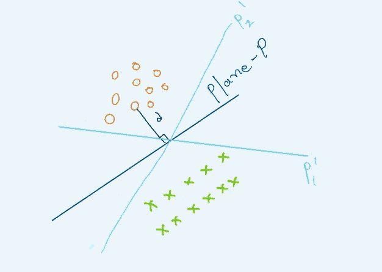

该点到平面 P 的距离可以用下面的公式表示。

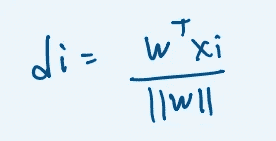

这里||w||总是垂直于平面 P，所以它的值总是 1。所以距离的公式变成如下。

注意，当 W.T*Xi > 0 时，我们的 Yi 为正(+1)，当 W.T*Xi < 0 时，我们的 Yi 为负(-1)

## 分类器怎么知道点分类正确与否？

让我们通过案例来理解上述问题

1.  当 Yi 为正且 **W.T*Xi** 为正时，则 **Yi*W.T*Xi** >为 0，表示该点分类正确
2.  当 Yi 为正而 **W.T*Xi** 为负时，则 **Yi*W.T*Xi** <为 0，这意味着该点分类不正确
3.  当 Yi 为负且 **W.T*Xi** 为正时，则 **Yi*W.T*Xi** <为 0，这意味着该点被错误分类
4.  当 Yi 为负且 **W.T*Xi** 为负时，则 **Yi*W.T*Xi** >为 0，这意味着该点被正确分类

我们可以得出结论，当 Yi*W.T*Xi 为正时，我们的模型对这些点进行了正确分类，因此我们需要一个模型，使得 **W.T*Xi** 对于更多的数据点为正。这个问题在数学上可以写成如下。

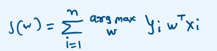

这里注意，X 是训练数据，Y 是数据的标签，所以我们只能调整 W 的值(在平面不通过原点的情况下也是 b 的值)。

上面的等式说我们需要找到一个使 **W*** 最大化的平面 **P** (正确分类更多点)。

## 为什么叫逻辑回归？Sigmoid 函数的需求是什么？

很简单，我们的分类器从超平面中找到 Yi*W.T*Xi 的值，并将所有值相加。现在，假设我们的数据集有一个异常值，如下图所示，它离平面非常远，如下图所示。然后，由于这个孤立点，我们的模型将考虑不同的超参数，并使超平面可能看起来像 P ’,这是一个与我们所要求的完全不同的平面。在这里，由于一个孤立点，整个模型都会改变，并且会有不同的表现。

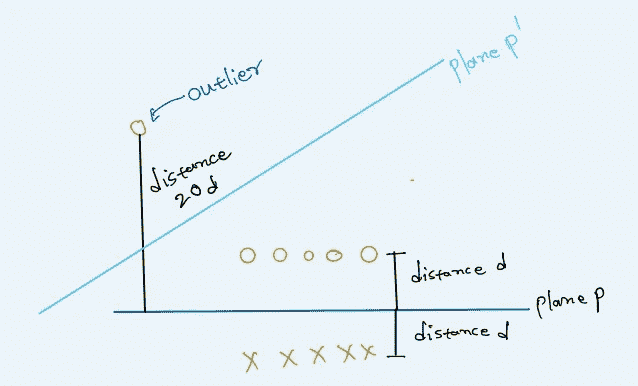

正如我们之前讨论的，我们的分类器简单地总结了如下所有的距离，所以我们的平面将与实际平面非常不同。

我们可以通过压缩过大的值来解决这个问题。sigmoid 函数的公式如下，其范围从 0 到 1

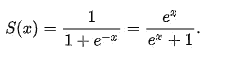

**为什么 Sigmoid 函数有意义？**

把这个问题想成一个概率的观点，当一个查询点离超平面的距离为零时，该点分类的概率是多少？ **0.5** 。这是 sigmoid 函数的精确值，此时值(在本例中为距离)为零，请看下图中的 sigmoid 函数

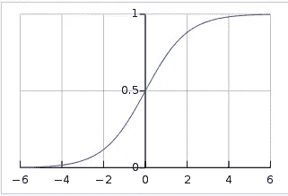

所以我们将用一个 sigmoid 函数来修改我们原来的问题方程

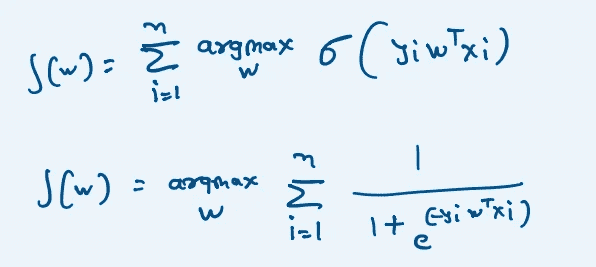

上述优化问题可以修改如下(跳过所有复杂的数学)

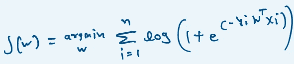

最优化问题逻辑回归

在上面的等式中，有 **log(1+something)** ，它总是正的，我们想要一个使完整等式最小化的 W 值(对我们来说，这个值是 W*)。为了使这个值最小(接近零)，我们需要 W 的值为无穷大。现在我们的 X 和 Yi 是来自数据的值，所以它们的值不能改变，所以我们需要我们的 W 是无穷大，使方程的值为零。

当这个权重 W 值太高时，我们的模型遭受过拟合的问题

**如何才能解决这个过拟合问题？**

**正规化。**当我们训练我们的模型进行预测时，它通常会过度拟合训练数据，并且无法对未来数据进行归纳。正则化是一种通过添加复杂性项来惩罚模型的技术，该复杂性项会给更复杂的模型带来更大的损失。在下面的等式中，正则化函数形式的惩罚被添加到损失函数中。

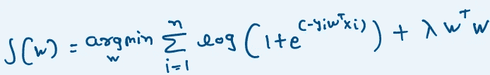

L2 正则化逻辑回归

**正则化如何帮助解决过度拟合问题？**正则化防止 **W** 变成+无穷大或-无穷大，这是损失项和惩罚项之间的折衷。

**如何帮助**λ**？**当 lambda 为零时，唯一的损失函数不存在会使模型过拟合的惩罚项。随着λ值的增加，正则化项的影响也增加，并且模型更好地泛化。

## L1 正则化

其中 L2 正则化是罚函数中权重的平方，而 L1 正则化是罚函数中的绝对权重值，因此使用 L1 正则化的损失函数的等式如下。

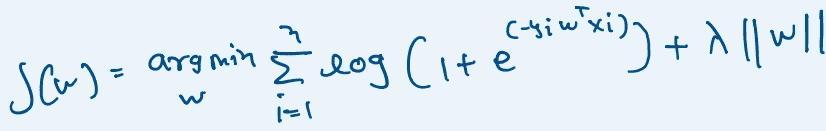

L1 正则化的 logistic 回归方程

注意，L1 正则化在权重矩阵中产生稀疏性，这意味着所有不太重要的特征变为零。当我们有非常高的数据维度时，这是非常有用的。

## 逻辑回归如何预测？

在对数据进行模型训练后，我们有了权重矩阵 **W** ，我们的查询点是我们想要预测的 **Xq** 。我们只需要 W 和 Xq 的简单乘法来预测我们的查询点的类别

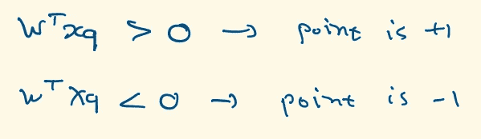

请注意，如果 W.TXq 的值较大，我们的模型在预测类别时会更有信心(如果该值更接近 0，则模型的信心会较低)

逻辑回归是高度**可解释的**。在训练模型之后，我们有权重 W。如果我们找到每个特征的绝对值，并将它们降序排列，那么最重要的特征将位于顶部。

## 逻辑回归的假设

只有当我们作出以下假设时，上述一切才有可能。

1.  数据应该是线性可分的
2.  数据不应是多重共线的

## 逻辑回归的时空复杂性

在训练时，我们必须遍历每个数据点，因此训练时间复杂度为 **O(nd)**

该模型的时空复杂度将是 O(d) ,因为我们只需要存储用于预测的权重矩阵

该模型的运行时复杂度将为 **O(d)，**因此这对于低延迟应用非常有用。

仅此而已！

如果你想联系我，请在我的 LinkedIn、 [Twitter](https://twitter.com/isapansoni) 上联系我

感谢阅读帖子，继续鼓掌