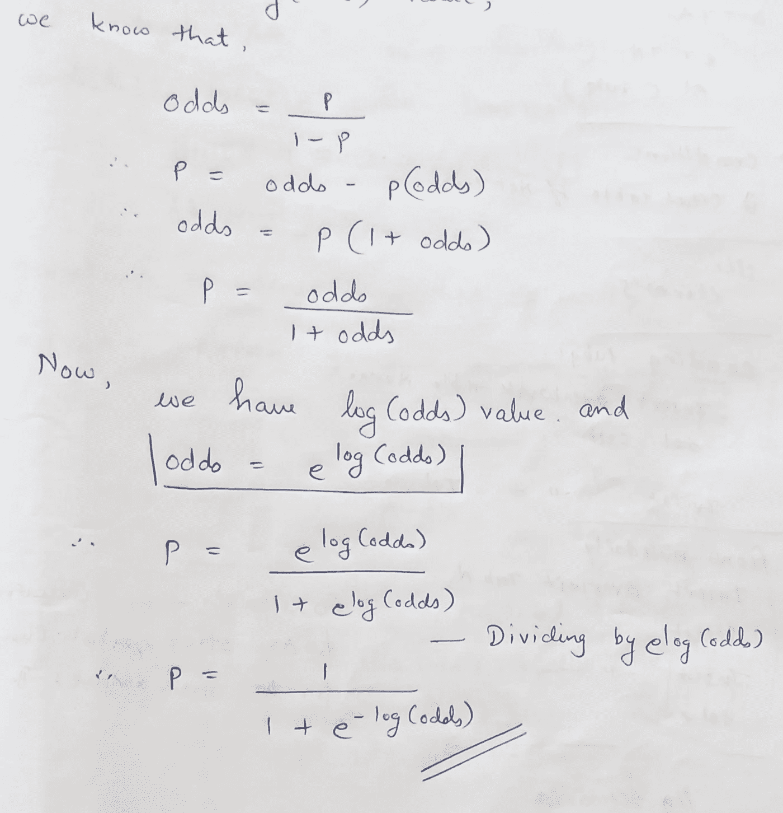

# 逻辑回归——从赔率到对数(赔率)到最大似然估计再到悲哀的旅程……让我们看看它的终点在哪里！

> 原文：<https://medium.com/analytics-vidhya/logistic-regression-the-journey-from-odds-to-log-odds-to-mle-to-woe-to-lets-see-where-it-2982d1584979?source=collection_archive---------4----------------------->

好的，在我开始之前，我想向你们简要介绍一下背后的原因。现在许多图书馆都提供了直接使用 ML 算法的方法，而不需要知道背后的细节。从长远来看，接受黑箱结果对任何人都没有帮助，

应该对事情如何发展有一定程度的了解，因为知识永远是一生的资产，有助于更好地掌握任何实现。

我们走吧！！！

逻辑回归是一种在银行(信贷和风险)行业广泛使用的技术，用于检查违约问题的概率。这是一个广义线性模型(GLM)——我们将在本博客中进一步讨论我们到底指的是什么。

# **最大似然估计:**

逻辑回归的工作原理是最大似然法，这是一种在给定观测值的情况下，通过找到最大化观测值可能性的参数值来估计模型参数的方法。这意味着找到使事件 1 的概率 ***p*** *和非事件 0 的概率****(1-p)****最大化的参数，如你所知:*

> ***概率(事件+非事件)= 1***

如果你有任何不明白的地方，不要担心，因为我们会分解每一个术语和每一个步骤。

我将讨论逻辑回归中的一些重要术语

在将因变量转换为与自变量相关的 logit 变量(因变量发生或不发生的概率的自然对数)后，逻辑回归应用最大似然估计。这样，逻辑回归估计了某一事件发生的概率。在下面的等式中，概率对数作为解释变量的函数线性变化:

图 1

所以现在，人们可以简单地问，为什么是 odds，log(odds)而不是 probability？

原因如下:

图 2

通过将概率转换为 log(odds)，我们将范围从[0，1]扩大到[- ∞，+∞ ]。通过拟合概率模型，我们将会遇到范围受限的问题，并且通过应用对数变换，我们掩盖了所涉及的非线性，并且我们可以仅拟合变量的线性组合。

## 寻找逻辑回归的最佳正弦曲线以对观察值进行分类的步骤:

1.  现在，在将概率转换为对数(赔率)后，我们在 y 轴上得到范围从-∞到+∞的值。参考下图。

图 3

2.像线性回归一样画一条候选线，并将趋向+-无穷大的数据点投影到这条线上。

图 4

这样，您将获得每个观察的 logit 值。

logit 值= log(p/1–p)

- ∞ < logit 值

3.从这些 logit 值中，您可以获得候选线获得的每个观察的预测概率值。

通过对这些值应用 Sigmoid 或逻辑函数，您可以获得范围在 0 到 1 之间的值(即我们训练数据中每个观察的预测概率)。下面我将推导这个方程(你可以跳过，只看最终的 sigmoid 公式)。

图 5

4.现在我们有了训练数据观测值的预测概率，我们将绘制它们，其中 y 轴的范围从 0 到 1(目标变量)，x 轴表示独立变量(预测值)，以获得对数据进行分类的正弦曲线。

图 6

我们可以保持阈值概率值(例如 0.5)其中 1 类的任何东西< 0.5 will be of class 0 and > 0.5。

5.现在是时候检查我们的正弦(S 形)曲线在训练数据上的表现了。(它的分类有多正确)。为此，我们将使用“最大似然估计”。

要得到最大似然，将所有预测的概率相乘，如下所示:

图 7

6.多次执行上述步骤，并通过旋转获得最佳拟合的候选线(参考步骤 2 ),就像线性回归一样。通过选择最大似然值最高的曲线，获得对数据进行最佳分类的正弦曲线。

## 为什么不能用普通最小二乘法[OLS]得到最佳候选线:

1.  对类标签 0/1 值的转换将原始数据推到+ve 和-ve 无穷大。(参见图 1)。
2.  因此，残差，即数据点(∞)和候选线之间的距离也是∞。
3.  不可能找到最小二乘。
4.  因此，MLE 是首选。

## 另一个问题是，如果有人对 0-1 问题进行线性回归，而不是逻辑回归，会发生什么？别担心，每个问题都有答案！

1.  误差项往往在 X(独立变量)的中间值处较大，在极值处较小，这违反了线性回归假设，即误差应具有零均值且应呈正态分布
2.  在 X 的结束值处生成大于 1 小于 0 的无意义预测
3.  普通的最小二乘(OLS)估计是低效的，标准误差是有偏差的
4.  X 中间值的高误差方差和末端的低方差

所有这些问题都可以通过逻辑回归来解决。参考下图。

— — — — — — — — — — — — — — — — — — — — — — — — — — — — — — —

# 逻辑回归中涉及的术语:

**信息价值(四):**

在将变量包含在模型中之前，这对于变量的初步过滤非常有用。工业上主要使用 IV 来在拟合模型之前的第一步中消除主要变量，因为最终模型中存在的变量数量约为 10 个。因此，需要进行初步处理来减少 400+左右的变量。

图 8

< 0.02 : useless for prediction
0.0.2 到 0.1:弱预测器
0.1 到 0.3:中预测器
0.3 到 0.5:强预测器
> 0.5:可疑预测器

**赤池信息标准(AIC):**

这衡量了给定数据集的统计模型的相对质量。这是偏差和方差之间的权衡。在两个模型之间的比较中，具有较小 AIC 的模型优于具有较高值的模型。
— —如果我们仔细观察下面的等式，k 参数(模型中包含的变量的数量)是对模型的过拟合现象的惩罚。这意味着我们可以通过在模型中加入更多不那么重要的变量来人为地证明模型的训练准确性；通过这样做，我们可以在训练数据上获得更好的准确性，但是在测试数据上，准确性会降低。这种现象可能是逻辑回归中的某种正则化:

AIC = -2*ln(L) + 2*k
L =最大似然值(为数学方便应用对数变换)
k =模型中变量的数量

**受试者工作特性(ROC)曲线:**

这是一个图示，说明了二元分类器在其判别阈值变化时的性能。该曲线是通过在各种阈值下绘制真阳性率(TPR)对假阳性率(FPR)来创建的。
理解 ROC 曲线效用的一个简单方法是，如果我们把阈值(threshold 是一个介于 0 和 1 之间的实值，用来把预测的产出概率转换成类，就像 logistic 回归预测概率一样)保持得很低，我们会把大部分预测的观测值放在正的类别下，即使其中一些应该放在负的类别下。另一方面，将门槛保持在非常高的水平会惩罚积极类别，但消极类别会有所改善。理想情况下，阈值的设置方式应该是在两个类别之间权衡价值，并产生更高的总体准确性:

*最佳阈值=可能达到最大值(灵敏度+特异性)的阈值*

如果你不知道术语 TPR 和 FPR，请点击以下链接查看混淆矩阵是什么

希望我已经尽力把这个分类算法说的简单明了了。希望你喜欢的内容和评论，如果你有任何疑问或建议。谢谢大家！